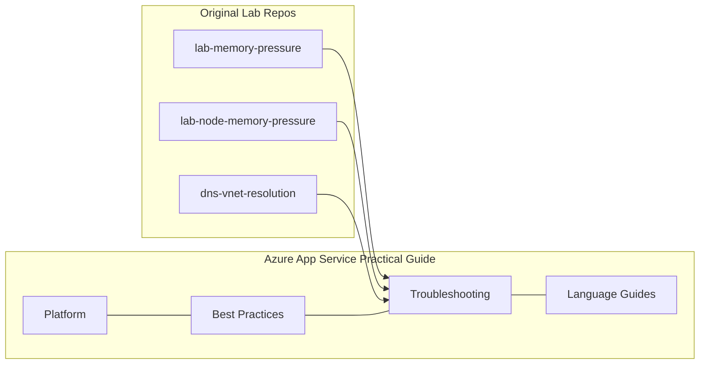

# About

The Azure App Service Practical Guide is a unified hub for platform architecture, best practices, and troubleshooting methodology.

## History of Consolidation

This project started as a series of individual troubleshooting labs, each focused on a specific symptom or service. While these labs were valuable, they were difficult to maintain and search collectively.

In 2024, we began consolidating these individual repositories into this unified guide. This transition allowed us to:

- Standardize the troubleshooting methodology across all labs.
- Provide a consistent documentation experience using MkDocs Material.
- Cross-reference architectural concepts with real-world failure patterns.
- Simplify maintenance through a single CI/CD pipeline.

## Rationale for the Unified Approach

We believe that troubleshooting is most effective when grounded in a deep understanding of the platform. By bringing together architecture ("Platform"), operational patterns ("Best Practices"), and diagnostic procedures ("Troubleshooting"), we provide a holistic resource for engineers at every stage of the application lifecycle.

### Key Benefits

1. **Shared Evidence Model**: Every lab now uses a consistent "Before / During / After" evidence chain, making it easier to learn how to read Azure logs.
2. **Integrated Reference**: KQL queries and CLI commands are linked directly from the playbooks where they are needed.
3. **Discoverability**: A single search bar now covers both platform concepts and specific error messages from the labs.

## Acknowledgment of Original Labs

We want to acknowledge the original lab repositories that formed the foundation of this guide:

- **lab-memory-pressure**: The first experiment focusing on Linux OOM killer behavior.
- **lab-node-memory-pressure**: Expanded the memory pressure tests to include Node.js specific heap limits.
- **dns-vnet-resolution**: Prototype for VNet integration troubleshooting.

While these legacy repositories are now archived, their technical content lives on here, updated for the latest Azure App Service features.

## See Also

- [Start Here](./start-here/overview.md)
- [Repository Map](./start-here/repository-map.md)
