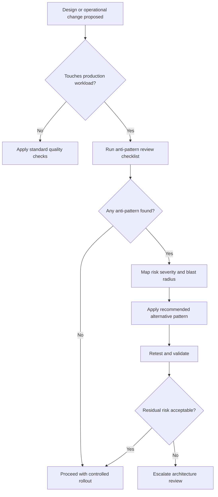

---
hide:
  - toc
---

# Common Anti-Patterns

This document catalogs high-impact App Service anti-patterns that frequently cause outages, security incidents, cost spikes, and difficult troubleshooting cycles. Use it as a review checklist during design, architecture review, and release readiness gates.

## How to Use This Guide

Apply this guide in three moments:

1. During architecture and platform design reviews
2. Before production go-live
3. During post-incident corrective action planning

!!! info "Anti-patterns are preventable"
    Most recurring App Service incidents are caused by a small set of known anti-patterns that can be eliminated early.

## Anti-Pattern Detection Flow



## Anti-Pattern Catalog

Use the following table as a policy baseline.

| Category | Pattern | Why It's Bad | What To Do Instead |
|---|---|---|---|
| Configuration | Storing secrets in app settings without Key Vault integration | Secrets become harder to rotate, higher accidental exposure risk, and weak auditability | Use Key Vault references with managed identity and secret rotation runbook |
| Configuration | Ignoring slot sticky settings | Swap can move environment-specific config into production and break dependencies | Mark app settings and connection strings as slot settings where required |
| Configuration | Keeping debug mode enabled in production | Increases attack surface, leaks internals, and adds unnecessary overhead | Use production-safe configuration profile with debug disabled |
| Configuration | Relying on mutable local file writes for state | App restarts, scale-out, or rehydration can lose local state | Externalize state to durable services (Storage, database, cache) |
| Deployment | Using FTP deployment for production | Manual and non-repeatable deployments, weak traceability, and increased human error | Use CI/CD with versioned artifacts and deployment slots |
| Deployment | Deploying directly to production slot | No safe validation stage and higher downtime risk during release | Deploy to staging slot, warm-up, validate, then swap |
| Deployment | Enabling server-side builds inconsistently across releases | Non-deterministic outputs and rollback complexity | Build once in CI, publish immutable artifacts, keep deployment deterministic |
| Deployment | No rollback plan or tested runbook | Recovery is slow and error-prone under pressure | Document and test swap-back and previous-artifact restore procedures |
| Networking | Binding app process to 127.0.0.1 instead of 0.0.0.0 | App container/process may be unreachable from App Service front-end | Bind to 0.0.0.0 and expected platform port |
| Networking | Connection-per-request outbound pattern | Causes excessive socket churn and SNAT exhaustion under load | Use connection pooling, keep-alive, and dependency SDK reuse |
| Networking | Assuming DNS/egress always stable without retry policy | Transient failures become user-facing errors | Add timeout, retry with jitter, and circuit breaker behavior |
| Networking | Not planning VNet integration and outbound dependency paths | Leads to late-stage connectivity failures and hard troubleshooting | Design egress paths early and validate dependency reachability pre-go-live |
| Security | Running production on B1 for critical workloads | Limited scale, weaker isolation characteristics, and insufficient resilience margin | Use production-appropriate Standard/Premium SKU based on SLO and load profile |
| Security | Using broad-scoped service principals without least privilege | Compromise impact is amplified and audit posture weakens | Use managed identities and granular RBAC at minimum required scope |
| Security | Not enforcing HTTPS and secure transport defaults | Increases risk of data exposure and mixed-mode security gaps | Enforce HTTPS-only, modern TLS policy, and secure cookie headers |
| Performance | Single instance in production | Any recycle or failure causes downtime and user-visible errors | Run minimum two instances for high availability |
| Performance | Disabling Always On for production web apps | Cold starts and delayed readiness impact latency and reliability | Enable Always On for continuously serving production apps |
| Performance | Overusing ARR affinity for stateful sessions | Uneven load and hot instances reduce effective scaling | Externalize session state and disable affinity for stateless services |
| Monitoring | Not configuring health checks | Platform cannot reliably remove unhealthy instances from rotation | Configure health check path and verify dependency-aware readiness |
| Monitoring | Not enabling diagnostic logging and App Insights | Limited observability increases mean time to detect and repair | Enable logs, traces, and metric alerts with retention policy |
| Monitoring | Alerting only on CPU and ignoring latency/error rate | Misses user-impact incidents where CPU appears normal | Add SLO-aligned alerts for p95 latency, error rate, and dependency failures |
| Monitoring | No deployment annotation in telemetry | Hard to correlate incidents with release events | Emit deployment markers and release metadata into monitoring system |

## High-Risk Anti-Patterns to Eliminate First

If you cannot fix everything immediately, prioritize these first:

1. Single instance in production
2. No health check configuration
3. Secrets outside Key Vault references
4. Direct-to-production deployments without slot validation
5. Connection-per-request outbound calls causing SNAT pressure

!!! warning "Top-five anti-patterns drive disproportionate incidents"
    Eliminating these five patterns usually produces the biggest reliability and security gains in the shortest time.

## Category Deep Dive

### Configuration Anti-Patterns

Common symptoms:

- Unexpected behavior after slot swap
- Environment mismatch between staging and production
- Leaked credentials in logs or scripts

Remediation baseline:

- Configuration inventory with ownership
- Slot setting review in each release checklist
- Secret source policy (Key Vault by default)

### Deployment Anti-Patterns

Common symptoms:

- Deployments succeed but app fails after startup
- Rollback takes too long due to missing artifact provenance
- Frequent hotfixes with unclear change history

Remediation baseline:

- Immutable artifact promotion model
- Slot-based validation and controlled swap
- Rollback rehearsal before high-risk changes

### Networking Anti-Patterns

Common symptoms:

- Intermittent 5xx under moderate load
- Dependency connection timeouts at scale
- Inconsistent behavior across instances

Remediation baseline:

- Reuse outbound connections
- Add explicit timeout and retry budgets
- Validate network design with load tests

### Security Anti-Patterns

Common symptoms:

- Secrets copied into multiple systems
- Over-permissioned identities
- Drift between intended and actual TLS/security config

Remediation baseline:

- Managed identity everywhere possible
- Key Vault reference policy
- Security baseline validation in CI/CD

### Performance Anti-Patterns

Common symptoms:

- Tail latency spikes during routine operations
- Scale-out fails to improve user experience
- High variability between instances

Remediation baseline:

- Minimum two instances in production
- Autoscale tied to meaningful metrics
- Session/state design aligned to horizontal scaling

### Monitoring Anti-Patterns

Common symptoms:

- Incidents discovered by users first
- Unclear root cause due to missing telemetry
- Slow post-incident analysis

Remediation baseline:

- Health, error, and latency dashboards
- Actionable alert thresholds with ownership
- Deployment and incident timeline correlation

## Governance Pattern

Use an anti-pattern review gate in architecture and change workflows:

- Design review checklist must include this document
- Production change approval requires anti-pattern attestation
- Exceptions require documented risk acceptance and expiry date

## Operational Review Checklist

Before production release, validate:

- No critical anti-pattern remains unresolved
- All high-risk exceptions have mitigation owners
- Deployment, monitoring, and rollback controls are tested
- Runbooks match current architecture

```bash
# Example: verify key settings surface for review
az webapp config appsettings list \
    --resource-group $RG \
    --name $APP_NAME
```

## See Also

- [Platform - How App Service Works](../platform/how-app-service-works.md)
- [Platform - Networking](../platform/networking.md)
- [Operations - Security](../operations/security.md)
- [Operations - Deployment Slots](../operations/deployment-slots.md)
- [Best Practices - Deployment](./deployment.md)
- [Best Practices - Scaling](./scaling.md)
- [Best Practices - Reliability](./reliability.md)

## Sources

- [Best practices for Azure App Service (Microsoft Learn)](https://learn.microsoft.com/azure/app-service/overview-best-practices)
- [Secure Azure App Service apps (Microsoft Learn)](https://learn.microsoft.com/azure/app-service/overview-security)
- [Troubleshoot outbound connection failures in Azure App Service (Microsoft Learn)](https://learn.microsoft.com/azure/app-service/troubleshoot-intermittent-outbound-connection-errors)
- [Monitor instances in Azure App Service with Health check (Microsoft Learn)](https://learn.microsoft.com/azure/app-service/monitor-instances-health-check)
