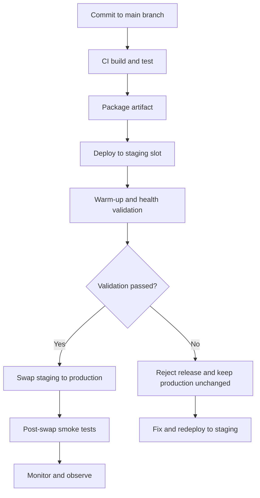

---
content_validation:
  status: verified
  last_reviewed: "2026-04-12"
  reviewer: ai-agent
  core_claims:
    - claim: "Deployment slots are the core mechanism for safe App Service releases."
      source: "https://learn.microsoft.com/azure/app-service/deploy-best-practices"
      verified: true
    - claim: "Slot settings (sticky settings): Remain in the same slot during swap"
      source: "https://learn.microsoft.com/azure/app-service/deploy-staging-slots"
      verified: true
    - claim: "`SCM_DO_BUILD_DURING_DEPLOYMENT=true` uses App Service build automation (Oryx/Kudu) during deployment."
      source: "https://learn.microsoft.com/azure/app-service/deploy-best-practices"
      verified: true
content_sources:
  diagrams:
    - id: deployment-flow-with-slots
      type: flowchart
      source: mslearn-adapted
      mslearn_url: https://learn.microsoft.com/en-us/azure/app-service/deploy-staging-slots
      based_on:
        - https://learn.microsoft.com/en-us/azure/app-service/deploy-best-practices
---

# Deployment Best Practices

This guide provides design-level deployment guidance for Azure App Service workloads. Use it after platform fundamentals and before language-specific implementation so you can choose a deployment approach that minimizes risk and downtime.

## Why Deployment Design Matters

A deployment that "works" is not automatically production-ready. In App Service, reliable deployment design is mostly about controlling blast radius, validating safely, and making rollback predictable.

Good deployment design should optimize for:

- Fast and safe promotion from build to production
- Zero-downtime behavior during normal releases
- Fast rollback when validation fails
- Clear separation between build-time and run-time concerns
- Repeatable automation across teams

!!! info "Best practice mindset"
    Treat deployment as a controlled change-management process, not as a file copy operation.

## Prerequisites

Before applying these practices, ensure you already have:

- A production App Service plan (avoid free/basic SKUs for critical workloads)
- At least one non-production environment for integration testing
- Source control and protected default branch policies
- CI pipeline that runs tests and security checks
- Deployment slot support available in your App Service tier

## Deployment Slots for Zero-Downtime Releases

Deployment slots are the core mechanism for safe App Service releases. The common baseline is:

1. Deploy to a staging slot
2. Warm and validate staging
3. Swap staging into production
4. Monitor after swap

### Slot Roles and Configuration Boundaries

- **Production slot**: Serves user traffic
- **Staging slot**: Receives new build first
- **Slot settings (sticky settings)**: Remain in the same slot during swap
- **Non-sticky settings**: Move with the app during swap

!!! warning "Configuration drift risk"
    If you do not explicitly mark sticky settings, swap operations can move the wrong configuration into production.

### Baseline CLI Workflow

```bash
# Deploy package to staging slot
az webapp deploy \
    --resource-group $RG \
    --name $APP_NAME \
    --slot staging \
    --src-path ./artifacts/webapp.zip \
    --type zip

# Optional: run slot-specific validation checks here

# Swap staging into production
az webapp deployment slot swap \
    --resource-group $RG \
    --name $APP_NAME \
    --slot staging \
    --target-slot production
```

### Deployment Flow with Slots

<!-- diagram-id: deployment-flow-with-slots -->


## Slot Warm-Up and Auto-Swap

Warm-up reduces cold-start risk during swap. Instead of swapping immediately after deploy, warm the slot with readiness checks.

### Warm-Up Strategy

- Use health endpoint checks against staging slot URL
- Verify startup tasks completed (migrations, cache priming, dependency connectivity)
- Confirm app responds under expected latency threshold

```bash
# Example: configure health check endpoint for the app
az webapp config set \
    --resource-group $RG \
    --name $APP_NAME \
    --generic-configurations '{"healthCheckPath":"/healthz"}'
```

### Auto-Swap Guidance

Auto-swap can reduce manual steps for simpler workloads, but it should be used carefully.

- Prefer auto-swap only when startup behavior is deterministic
- Avoid auto-swap for releases requiring manual approval gates
- Keep rollback runbook ready even if auto-swap is enabled

!!! tip "Use explicit gates for critical systems"
    For mission-critical workloads, explicit manual approval after staging validation is usually safer than unconditional auto-swap.

## CI/CD Pipeline Patterns

Both GitHub Actions and Azure DevOps are valid. The best pipeline is the one your team can enforce consistently with quality gates.

### Pattern A: GitHub Actions (Recommended for GitHub-hosted code)

Key stages:

1. Build and unit test
2. Security and dependency scanning
3. Package immutable artifact
4. Deploy to staging slot
5. Smoke tests against staging
6. Approval gate
7. Slot swap

### Pattern B: Azure DevOps Multi-Stage Pipeline

Key stages:

1. CI stage produces versioned artifact
2. CD stage deploys artifact to staging slot
3. Environment checks and approvals
4. Swap stage promotes to production

!!! note "Keep build and deploy decoupled"
    Build once, deploy many. Rebuilding in each environment creates non-deterministic releases.

## SCM_DO_BUILD_DURING_DEPLOYMENT vs Pre-Built Artifacts

`SCM_DO_BUILD_DURING_DEPLOYMENT=true` uses App Service build automation (Oryx/Kudu) during deployment. This is convenient but can introduce variability.

### When SCM Build Can Be Acceptable

- Early-stage projects with low compliance requirements
- Prototypes where speed matters more than reproducibility
- Teams without mature CI pipelines yet

### Why Pre-Built Artifacts Are Better for Production

- Deterministic build environment
- Repeatable outputs with pinned toolchains
- Faster and more predictable deployment times
- Easier provenance tracking and rollback

```bash
# Prefer disabling server-side build for production artifact deploys
az webapp config appsettings set \
    --resource-group $RG \
    --name $APP_NAME \
    --settings SCM_DO_BUILD_DURING_DEPLOYMENT=false
```

!!! warning "Avoid mixed models"
    Do not alternate between server-side build and pre-built artifacts for the same app unless you clearly document and control the transition.

## Run From Package Deployment

Run From Package mounts a ZIP package as read-only `wwwroot`. This improves consistency and avoids partial file-copy states.

### Benefits

- Atomic package mounting behavior
- Better startup consistency
- Reduced file lock contention
- Easier rollback to previous package

### Trade-Offs

- Runtime file writes to app directory are not supported
- Application must externalize mutable state (Storage, database, cache)

```bash
# Enable run-from-package mode
az webapp config appsettings set \
    --resource-group $RG \
    --name $APP_NAME \
    --settings WEBSITE_RUN_FROM_PACKAGE=1
```

## Rollback Strategies

Rollback should be designed before you need it.

### Primary Rollback Options

1. **Swap back** (fastest with slots)
2. **Redeploy previous artifact** (if swap is not applicable)
3. **Restore app backup** (for broader recovery scenarios)

### Rollback Decision Criteria

- If failure appears immediately after swap, swap back first
- If issue is data/schema-related, execute coordinated app+data rollback plan
- If incident scope is unclear, freeze further releases and triage first

!!! danger "Do not improvise rollback"
    Keep a tested rollback runbook with ownership, commands, and validation checkpoints.

### Example Swap-Back Command

```bash
az webapp deployment slot swap \
    --resource-group $RG \
    --name $APP_NAME \
    --slot production \
    --target-slot staging
```

## Production Deployment Checklist

Use this checklist before every production promotion:

- Artifact built once and signed/versioned
- Staging slot deployment succeeded
- Health endpoint returns success repeatedly
- Key synthetic transaction tests passed
- Sticky settings reviewed and confirmed
- Observability dashboards ready for release window
- Rollback owner and command path confirmed

## Design Recommendations by Maturity Stage

### Team Maturity: Early

- Use staging slot + manual swap
- Start with simple smoke tests
- Document rollback basics

### Team Maturity: Intermediate

- Build once/deploy many artifacts
- Introduce approval gates and policy checks
- Standardize sticky-setting templates

### Team Maturity: Advanced

- Progressive exposure strategies
- Release health scoring with automated rollback triggers
- Centralized deployment governance across app portfolio

## See Also

- [Platform - How App Service Works](../platform/how-app-service-works.md)
- [Operations - Deployment Slots](../operations/deployment-slots.md)
- [Operations - Health and Recovery](../operations/health-recovery.md)
- [Best Practices - Reliability](./reliability.md)
- [Best Practices - Common Anti-Patterns](./common-anti-patterns.md)

## Sources

- [Deploy your app to Azure App Service - Best Practices (Microsoft Learn)](https://learn.microsoft.com/azure/app-service/deploy-best-practices)
- [Deploy to staging slots in Azure App Service (Microsoft Learn)](https://learn.microsoft.com/azure/app-service/deploy-staging-slots)
- [Continuous deployment to Azure App Service (Microsoft Learn)](https://learn.microsoft.com/azure/app-service/deploy-continuous-deployment)
- [Run your app in Azure App Service directly from a ZIP package (Microsoft Learn)](https://learn.microsoft.com/azure/app-service/deploy-run-package)
