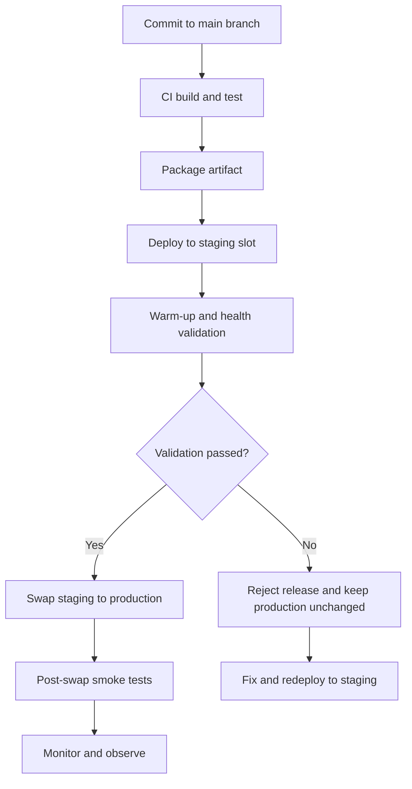

---
content_validation:
  status: verified
  last_reviewed: "2026-04-12"
  reviewer: agent
  core_claims:
    - claim: "Deployment slots are the core mechanism for safe App Service releases."
      source: "https://learn.microsoft.com/en-us/azure/app-service/deploy-best-practices"
      verified: true
    - claim: "Slot settings (sticky settings): Remain in the same slot during swap"
      source: "https://learn.microsoft.com/en-us/azure/app-service/deploy-staging-slots"
      verified: true
    - claim: "`SCM_DO_BUILD_DURING_DEPLOYMENT=true` uses App Service build automation (Oryx/Kudu) during deployment."
      source: "https://learn.microsoft.com/en-us/azure/app-service/deploy-best-practices"
      verified: true
content_sources:
  diagrams:
    - id: deployment-flow-with-slots
      type: flowchart
      source: mslearn-adapted
      mslearn_url: https://learn.microsoft.com/en-us/azure/app-service/deploy-staging-slots
      based_on:
        - https://learn.microsoft.com/en-us/azure/app-service/deploy-best-practices
---

# Deployment Best Practices

This guide provides design-level deployment guidance for Azure App Service workloads. Use it after platform fundamentals and before language-specific implementation so you can choose a deployment approach that minimizes risk and downtime.

## Why This Matters

A deployment that "works" is not automatically production-ready. In App Service, reliable deployment design is mostly about controlling blast radius, validating safely, and making rollback predictable.

Good deployment design should optimize for:

- Fast and safe promotion from build to production
- Zero-downtime behavior during normal releases
- Fast rollback when validation fails
- Clear separation between build-time and run-time concerns
- Repeatable automation across teams

!!! info "Best practice mindset"
    Treat deployment as a controlled change-management process, not as a file copy operation.

## Recommended Practices

### Prerequisites

Before applying these practices, ensure you already have:

- A production App Service plan (avoid free/basic SKUs for critical workloads)
- At least one non-production environment for integration testing
- Source control and protected default branch policies
- CI pipeline that runs tests and security checks
- Deployment slot support available in your App Service tier

### Deployment Slots for Zero-Downtime Releases

Deployment slots are the core mechanism for safe App Service releases. The common baseline is:

1. Deploy to a staging slot
2. Warm and validate staging
3. Swap staging into production
4. Monitor after swap

#### Slot Roles and Configuration Boundaries

- **Production slot**: Serves user traffic
- **Staging slot**: Receives new build first
- **Slot settings (sticky settings)**: Remain in the same slot during swap
- **Non-sticky settings**: Move with the app during swap

!!! warning "Configuration drift risk"
    If you do not explicitly mark sticky settings, swap operations can move the wrong configuration into production.

#### Baseline CLI Workflow

```bash
# Deploy package to staging slot
az webapp deploy \
    --resource-group $RG \
    --name $APP_NAME \
    --slot staging \
    --src-path ./artifacts/webapp.zip \
    --type zip

# Optional: run slot-specific validation checks here

# Swap staging into production
az webapp deployment slot swap \
    --resource-group $RG \
    --name $APP_NAME \
    --slot staging \
    --target-slot production
```

| Command | Purpose | Key flags |
|---|---|---|
| `az webapp deploy --slot staging --src-path ... --type zip` | Deploy a ZIP package to the staging slot | `--slot staging` targets the non-production slot; `--type zip` selects ZIP package deployment |
| `az webapp deployment slot swap --slot staging --target-slot production` | Swap the staging slot into production | Zero-downtime swap; the previous production content is retained in the staging slot for immediate swap-back |

##### Portal view: Deployment Center

![Deployment Center blade for a Web App with four tabs — Settings (active), Containers (new), Logs, and FTPS Credentials. The command bar shows Save, Discard, Refresh, Browse, Sync, and Send us your feedback actions. A prominent blue info banner reads "You are now in the production slot, which is not recommended for setting up CI/CD" with a "Learn more" link. The body explains "Deploy and build code from your preferred source and build provider" with another Learn more link, followed by a required Source field whose dropdown shows the placeholder text "Select a code source" and is currently empty. The left navigation shows the Deployment group expanded with Deployment slots and Deployment Center (active) entries.](../assets/best-practices/deployment/01-deployment-center.png)

The Deployment Center blade is the policy surface for the slot-first deployment model this section recommends. The prominent "You are now in the production slot, which is not recommended for setting up CI/CD" banner is App Service's own enforcement of the same rule listed in this guide's anti-patterns table: CI/CD wired into the production slot bypasses staging validation and the swap-back rollback option. The empty `Source` dropdown shows the four tabs that gate the choice between deterministic pre-built artifacts and platform-driven builds — `Settings` covers GitHub Actions and Azure DevOps source-driven CI/CD, `Containers` covers registry-driven container image pulls, `Logs` shows deployment history for rollback evidence, and `FTPS Credentials` is the legacy publishing path this guide labels an anti-pattern for production. Always configure deployment from the staging slot blade, not this production-slot view.

#### Deployment Flow with Slots

<!-- diagram-id: deployment-flow-with-slots -->

```mermaid
flowchart TD
    A[Commit to main branch] --> B[CI build and test]
    B --> C[Package artifact]
    C --> D[Deploy to staging slot]
    D --> E[Warm-up and health validation]
    E --> F{Validation passed?}
    F -- Yes --> G[Swap staging to production]
    G --> H[Post-swap smoke tests]
    H --> I[Monitor and observe]
    F -- No --> J[Reject release and keep production unchanged]
    J --> K[Fix and redeploy to staging]
```

### Slot Warm-Up and Auto-Swap

Warm-up reduces cold-start risk during swap. Instead of swapping immediately after deploy, warm the slot with readiness checks.

#### Warm-Up Strategy

- Use health endpoint checks against staging slot URL
- Verify startup tasks completed (migrations, cache priming, dependency connectivity)
- Confirm app responds under expected latency threshold

```bash
# Example: configure health check endpoint for the app
az webapp config set \
    --resource-group $RG \
    --name $APP_NAME \
    --generic-configurations '{"healthCheckPath":"/healthz"}'
```

| Command | Purpose | Key flags |
|---|---|---|
| `az webapp config set --generic-configurations '{"healthCheckPath":"/healthz"}'` | Configure the App Service health check probe endpoint | `--generic-configurations` accepts a JSON string; `healthCheckPath` is used by both platform health probes and slot warm-up validation |

#### Auto-Swap Guidance

Auto-swap can reduce manual steps for simpler workloads, but it should be used carefully.

- Prefer auto-swap only when startup behavior is deterministic
- Avoid auto-swap for releases requiring manual approval gates
- Keep rollback runbook ready even if auto-swap is enabled

!!! tip "Use explicit gates for critical systems"
    For mission-critical workloads, explicit manual approval after staging validation is usually safer than unconditional auto-swap.

### CI/CD Pipeline Patterns

Both GitHub Actions and Azure DevOps are valid. The best pipeline is the one your team can enforce consistently with quality gates.

#### Pattern A: GitHub Actions (Recommended for GitHub-hosted code)

Key stages:

1. Build and unit test
2. Security and dependency scanning
3. Package immutable artifact
4. Deploy to staging slot
5. Smoke tests against staging
6. Approval gate
7. Slot swap

#### Pattern B: Azure DevOps Multi-Stage Pipeline

Key stages:

1. CI stage produces versioned artifact
2. CD stage deploys artifact to staging slot
3. Environment checks and approvals
4. Swap stage promotes to production

!!! note "Keep build and deploy decoupled"
    Build once, deploy many. Rebuilding in each environment creates non-deterministic releases.

### SCM_DO_BUILD_DURING_DEPLOYMENT vs Pre-Built Artifacts

`SCM_DO_BUILD_DURING_DEPLOYMENT=true` uses App Service build automation (Oryx/Kudu) during deployment. This is convenient but can introduce variability.

#### When SCM Build Can Be Acceptable

- Early-stage projects with low compliance requirements
- Prototypes where speed matters more than reproducibility
- Teams without mature CI pipelines yet

#### Why Pre-Built Artifacts Are Better for Production

- Deterministic build environment
- Repeatable outputs with pinned toolchains
- Faster and more predictable deployment times
- Easier provenance tracking and rollback

```bash
# Prefer disabling server-side build for production artifact deploys
az webapp config appsettings set \
    --resource-group $RG \
    --name $APP_NAME \
    --settings SCM_DO_BUILD_DURING_DEPLOYMENT=false
```

| Command | Purpose | Key flags |
|---|---|---|
| `az webapp config appsettings set --settings SCM_DO_BUILD_DURING_DEPLOYMENT=false` | Disable App Service server-side build so pre-built artifacts deploy deterministically | Setting to `false` skips Oryx/Kudu build; artifact must already contain compiled output (e.g., built wheel, npm install output, published dotnet binaries) |

!!! warning "Avoid mixed models"
    Do not alternate between server-side build and pre-built artifacts for the same app unless you clearly document and control the transition.

### Run From Package Deployment

Run From Package mounts a ZIP package as read-only `wwwroot`. This improves consistency and avoids partial file-copy states.

#### Benefits

- Atomic package mounting behavior
- Better startup consistency
- Reduced file lock contention
- Easier rollback to previous package

#### Trade-Offs

- Runtime file writes to app directory are not supported
- Application must externalize mutable state (Storage, database, cache)

```bash
# Enable run-from-package mode
az webapp config appsettings set \
    --resource-group $RG \
    --name $APP_NAME \
    --settings WEBSITE_RUN_FROM_PACKAGE=1
```

| Command | Purpose | Key flags |
|---|---|---|
| `az webapp config appsettings set --settings WEBSITE_RUN_FROM_PACKAGE=1` | Enable Run From Package mode so wwwroot is mounted read-only from the ZIP artifact | Value `1` mounts the most recent deployment ZIP; runtime writes to wwwroot will fail — externalize state to Storage or database |

### Rollback Strategies

Rollback should be designed before you need it.

#### Primary Rollback Options

1. **Swap back** (fastest with slots)
2. **Redeploy previous artifact** (if swap is not applicable)
3. **Restore app backup** (for broader recovery scenarios)

#### Rollback Decision Criteria

- If failure appears immediately after swap, swap back first
- If issue is data/schema-related, execute coordinated app+data rollback plan
- If incident scope is unclear, freeze further releases and triage first

!!! danger "Do not improvise rollback"
    Keep a tested rollback runbook with ownership, commands, and validation checkpoints.

#### Example Swap-Back Command

```bash
az webapp deployment slot swap \
    --resource-group $RG \
    --name $APP_NAME \
    --slot production \
    --target-slot staging
```

| Command | Purpose | Key flags |
|---|---|---|
| `az webapp deployment slot swap --slot production --target-slot staging` | Swap production back to staging as a rollback (reverses the promotion direction) | Same command as forward swap but with `--slot` and `--target-slot` reversed; only works if the previous production content is still in the staging slot |

### Design Recommendations by Maturity Stage

#### Team Maturity: Early

- Use staging slot + manual swap
- Start with simple smoke tests
- Document rollback basics

#### Team Maturity: Intermediate

- Build once/deploy many artifacts
- Introduce approval gates and policy checks
- Standardize sticky-setting templates

#### Team Maturity: Advanced

- Progressive exposure strategies
- Release health scoring with automated rollback triggers
- Centralized deployment governance across app portfolio

## Common Mistakes / Anti-Patterns

### Deploying directly to production slot

Wiring CI/CD to the production slot bypasses staging validation and eliminates swap-back as a rollback option. Deploy to staging, validate, then swap. The Deployment Center blade actively warns against this pattern with its "You are now in the production slot" banner.

### Mixing server-side build and pre-built artifacts

Alternating between `SCM_DO_BUILD_DURING_DEPLOYMENT=true` and pre-built artifacts for the same app produces non-deterministic release outputs. Pick one model per app and document any transition explicitly, including the exact release where the switch occurred.

### Skipping warm-up and slot validation before swap

Swapping without warm-up preserves cold-start latency in production, exposing the first cohort of users to slower responses. Warm the staging slot with health probes and readiness checks before swap. For mission-critical workloads, add an explicit manual approval gate rather than relying on auto-swap.

### Improvised rollback without a tested runbook

Rollback executed under incident pressure without prior rehearsal is slow and error-prone. Maintain and rehearse a runbook with owners, commands, and validation checkpoints. Swap-back is the fastest rollback path when slots are in use — confirm this is the primary option before the incident.

### Writing to slot filesystem when using Run From Package

Run From Package mounts wwwroot read-only. Runtime writes to the app directory will fail silently or raise permission errors. Externalize mutable state to Azure Storage, database, or cache before enabling `WEBSITE_RUN_FROM_PACKAGE=1`.

## Validation Checklist

Use this checklist before every production promotion:

- [ ] Artifact built once and signed/versioned
- [ ] Staging slot deployment succeeded
- [ ] Health endpoint returns success repeatedly
- [ ] Key synthetic transaction tests passed
- [ ] Sticky settings reviewed and confirmed
- [ ] Observability dashboards ready for release window
- [ ] Rollback owner and command path confirmed

## See Also

- [Platform - How App Service Works](../platform/architecture/index.md)
- [Operations - Deployment Slots](../operations/deployment-slots.md)
- [Operations - Health and Recovery](../operations/health-recovery.md)
- [Best Practices - Reliability](./reliability.md)
- [Best Practices - Common Anti-Patterns](./common-anti-patterns.md)

## Sources

- [Deploy your app to Azure App Service - Best Practices (Microsoft Learn)](https://learn.microsoft.com/en-us/azure/app-service/deploy-best-practices)
- [Deploy to staging slots in Azure App Service (Microsoft Learn)](https://learn.microsoft.com/en-us/azure/app-service/deploy-staging-slots)
- [Continuous deployment to Azure App Service (Microsoft Learn)](https://learn.microsoft.com/en-us/azure/app-service/deploy-continuous-deployment)
- [Run your app in Azure App Service directly from a ZIP package (Microsoft Learn)](https://learn.microsoft.com/en-us/azure/app-service/deploy-run-package)
