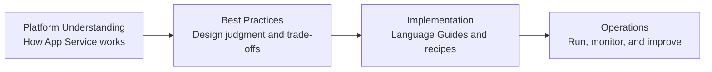

---
hide:
  - toc
content_sources:
  diagrams:
    - id: best-practices-learning-path
      type: flowchart
      source: mslearn-adapted
      mslearn_url: https://learn.microsoft.com/en-us/azure/app-service/app-service-best-practices
---

# Best Practices

This section is the design judgment layer of the Azure App Service guide. Read it after understanding platform behavior and before implementing language-specific code so your architecture and operational choices are intentional from day one.

## Main Content

### Why this section exists

The full learning path in this repository is intentional:

1. **Platform** explains how App Service behaves.
2. **Best Practices** helps you decide what to do with that behavior.
3. **Language Guides** show how to implement those decisions.

Without this middle layer, teams often jump from conceptual understanding directly to code and accidentally carry poor defaults into production.

<!-- diagram-id: best-practices-learning-path -->

### Document map

Use this table as your decision map for the Best Practices section.

| Topic | Purpose | Primary Outcome |
|---|---|---|
| [Production Baseline](./production-baseline.md) | Establish minimum production controls for every web app. | Consistent baseline across environments and teams. |
| [Networking](./networking.md) | Design secure and predictable inbound/outbound connectivity. | Controlled traffic paths and reliable DNS behavior. |
| [Security](./security.md) | Apply layered security controls from identity to edge. | Reduced attack surface and stronger secret hygiene. |
| [Deployment](./deployment.md) | Choose safe release patterns and rollback strategy. | Lower deployment risk and faster recovery. |
| [Scaling](./scaling.md) | Match scale settings to workload characteristics. | Better performance stability and cost efficiency. |
| [Reliability](./reliability.md) | Build resilience for transient failures and outages. | Improved availability and clearer failure handling. |
| [Anti-Patterns](./common-anti-patterns.md) | Identify common App Service design mistakes early. | Fewer avoidable incidents and refactoring cycles. |

### How to use this section

Follow this sequence for each workload:

1. **Read Platform concepts first**
    - Understand hosting model, request flow, scaling, and networking constraints.
    - Confirm whether your workload assumptions match platform reality.
2. **Define your baseline decisions**
    - Pick plan tier, identity model, TLS policy, and logging targets.
    - Write these down as explicit team standards.
3. **Review domain-specific best practices**
    - Networking for connectivity and DNS.
    - Security for identity, secret handling, and perimeter controls.
    - Deployment/scaling/reliability patterns based on risk tolerance.
4. **Implement in language guides**
    - Translate decisions into app settings, code, and CI/CD.
    - Avoid inventing standards during implementation.
5. **Operationalize and re-validate**
    - Monitor drift from baseline.
    - Revisit decisions when workload profile changes.

!!! info "Design judgment over checklist thinking"
    This section is not only a static checklist. Use it to reason about trade-offs in your context: traffic shape, compliance, team maturity, dependency profile, and cost envelope.

### Recommended reading paths

#### Path A: New production rollout

1. Production Baseline
2. Security
3. Networking
4. Deployment
5. Scaling
6. Reliability
7. Anti-Patterns

#### Path B: Existing app hardening

1. Anti-Patterns
2. Production Baseline
3. Security
4. Networking
5. Reliability
6. Scaling
7. Deployment

#### Path C: Performance and cost tuning

1. Production Baseline
2. Scaling
3. Networking
4. Reliability
5. Anti-Patterns

### Decision areas covered

This section helps you make explicit decisions in these areas:

- **Compute baseline**: plan tier, Always On, runtime guarantees.
- **Transport and edge**: HTTPS-only, TLS floor, WAF placement.
- **Identity and secrets**: managed identity, Key Vault references, least privilege.
- **Connectivity**: private inbound, private outbound, DNS ownership.
- **Release safety**: deployment slots, validation gates, rollback strategy.
- **Scale behavior**: scale-up vs scale-out, warmup, limits, and guardrails.
- **Reliability mechanics**: health checks, retries, fail-fast, dependency isolation.

### Who should read this

- Application architects defining landing-zone standards.
- Platform engineers maintaining shared App Service guardrails.
- Tech leads preparing implementation standards for multiple teams.
- Operators reviewing production incidents and recurring failure patterns.

### What this section is not

- It is **not** a replacement for platform docs.
- It is **not** language-specific implementation detail.
- It is **not** a one-time task; revisit after major workload changes.

!!! warning "Avoid copy-paste architecture"
    A reference architecture is a starting point, not a universal answer. Validate each decision against your own latency, throughput, compliance, and operational constraints.

### Practical usage model for teams

Use this lightweight process in design reviews:

1. Bring one candidate architecture.
2. Walk through each Best Practices page.
3. Record accepted decisions and intentional exceptions.
4. Map each decision to implementation tasks in your language guide.
5. Add operational checks for each critical decision.

### Decision record template

Use a compact ADR format when applying guidance:

| Field | Example |
|---|---|
| Decision | Use P1v3 for internet-facing API workload |
| Context | Sustained traffic + low latency SLO |
| Alternatives considered | S1, P0v3 |
| Trade-off | Higher baseline cost for stable performance headroom |
| Validation | Load test at peak + health check behavior |
| Review date | 90 days after go-live |

### Common outcomes when this layer is skipped

- Production apps deployed on development plan tiers.
- Secrets stored directly in app settings without rotation model.
- Private endpoint added without DNS ownership plan.
- Slot strategy missing, resulting in risky direct production deploys.
- Scaling policy chosen only after incident pressure.

### Quality gate before implementation

Confirm these items before writing feature code:

- [ ] Plan tier and instance strategy are documented.
- [ ] HTTPS and TLS policy are defined.
- [ ] Identity and secret strategy is approved.
- [ ] Inbound and outbound network patterns are selected.
- [ ] Logging and baseline telemetry destinations are known.
- [ ] Deployment and rollback patterns are agreed.

### Suggested workshop agenda (60 minutes)

Use this structure when onboarding a team to the Best Practices layer:

| Time | Topic | Output |
|---|---|---|
| 0-10 min | Platform assumptions review | Shared understanding of constraints and capabilities |
| 10-25 min | Production baseline decisions | Agreed defaults for plan, TLS, logging, and health |
| 25-40 min | Security and networking decisions | Confirmed trust boundaries and identity model |
| 40-50 min | Delivery and reliability approach | Initial slot, rollback, and scale strategy |
| 50-60 min | Exception and risk register | Documented waivers and follow-up actions |

!!! info "Good architecture reviews produce artifacts"
    A productive review ends with explicit outputs: decisions, owners, validation steps, and review dates. If no artifacts exist, repeatability and accountability are weak.

### Keeping guidance current

Treat this section as a living operational standard:

- Revisit after major traffic profile changes.
- Revisit after security incidents or repeated outage themes.
- Revisit after platform capability updates on Microsoft Learn.
- Revisit when cost targets force hosting or topology changes.

## Advanced Topics

- Build environment-specific baseline profiles (dev, test, prod) while preserving security minimums.
- Add policy-as-code and IaC checks to enforce best-practice defaults.
- Create periodic architecture drift reviews tied to incident postmortems.
- Track decision exceptions and set explicit expiration dates for waivers.

## See Also

- [Concepts](../platform/index.md)
- [Operations](../operations/index.md)
- [Language Guides](../language-guides/index.md)
- [Troubleshooting](../troubleshooting/index.md)

## Sources

- [Azure App Service documentation (Microsoft Learn)](https://learn.microsoft.com/azure/app-service/)
- [Overview of App Service best practices](https://learn.microsoft.com/azure/app-service/overview-best-practices)
- [Security in Azure App Service](https://learn.microsoft.com/azure/app-service/overview-security)
- [App Service networking features](https://learn.microsoft.com/azure/app-service/networking-features)
- [Use deployment slots in Azure App Service](https://learn.microsoft.com/azure/app-service/deploy-staging-slots)
- [Scale an app in Azure App Service](https://learn.microsoft.com/azure/app-service/manage-scale-up)
