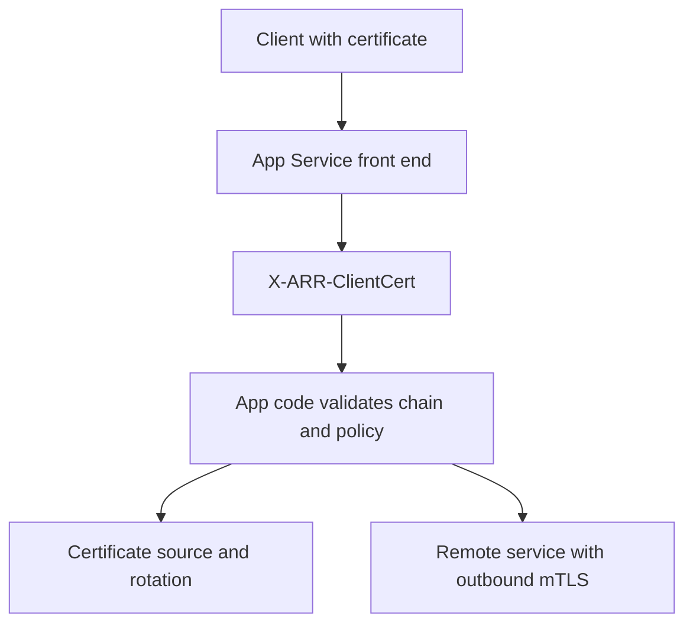

---
content_sources:
  diagrams:
    - id: app-service-mtls-best-practice-pattern
      type: flowchart
      source: mslearn-adapted
      mslearn_url: https://learn.microsoft.com/en-us/azure/app-service/app-service-web-configure-tls-mutual-auth
      based_on:
        - https://learn.microsoft.com/en-us/azure/app-service/configure-ssl-certificate-in-code
        - https://learn.microsoft.com/en-us/azure/app-service/app-service-key-vault-references
content_validation:
  status: pending_review
  last_reviewed: "2026-04-25"
  reviewer: ai-agent
  core_claims:
    - claim: "App Service forwards the inbound client certificate to app code in the X-ARR-ClientCert header."
      source: "https://learn.microsoft.com/en-us/azure/app-service/app-service-web-configure-tls-mutual-auth"
      verified: true
    - claim: "App Service does not validate the inbound client certificate and app code must validate it."
      source: "https://learn.microsoft.com/en-us/azure/app-service/app-service-web-configure-tls-mutual-auth"
      verified: true
    - claim: "Certificates can be made available to app code through WEBSITE_LOAD_CERTIFICATES."
      source: "https://learn.microsoft.com/en-us/azure/app-service/configure-ssl-certificate-in-code"
      verified: false
    - claim: "App Service supports Key Vault references for configuration and secret indirection."
      source: "https://learn.microsoft.com/en-us/azure/app-service/app-service-key-vault-references"
      verified: true
---

# mTLS Best Practices

Use mutual TLS on Azure App Service as a deliberate trust-boundary control, not as a single feature toggle. Inbound client certificate authentication, outbound certificate presentation, and certificate lifecycle management each need separate validation, ownership, and rollback plans.

## Why This Matters

mTLS helps App Service workloads answer two different questions:

- **Who is calling my app?**
- **What certificate does my app present when it calls something else?**

<!-- diagram-id: app-service-mtls-best-practice-pattern -->

If you blur those concerns together, teams often assume the platform validated trust when it only forwarded a certificate, or they assume an uploaded certificate is automatically used for outbound calls when the application never loaded it.

## Recommended Practices

### Terminate inbound client certificates at the platform

Use App Service client certificate handling instead of trying to terminate inbound TLS inside framework code.

Why:

- App Service already terminates TLS at the front end.
- Your app receives a stable `X-ARR-ClientCert` header contract.
- Operational controls stay in site configuration rather than custom reverse-proxy code.

### Validate the forwarded certificate in app code

Microsoft Learn is explicit: App Service forwards the client certificate but does not validate it.

Validate at least:

- thumbprint or public key pinning policy where appropriate
- issuer or issuing CA
- subject or SAN
- validity window
- chain trust and revocation policy if required by your security model

### Keep excluded routes narrow and intentional

Use `clientCertExclusionPaths` only for routes that truly cannot participate in mTLS, such as:

- `/health`
- platform or synthetic probe endpoints
- third-party webhook receivers with no client-certificate support

Document every exclusion with the business reason and compensating control.

!!! warning "Exclusions can introduce protocol-level side effects"
    Microsoft Learn documents that `clientCertExclusionPaths` and `OptionalInteractiveUser` depend on TLS renegotiation. Because TLS 1.3 and HTTP/2 do not support renegotiation, and large request bodies can fail in renegotiated paths, use exclusions only when you understand those transport limits.

### Separate inbound and outbound mTLS ownership

Treat these as separate controls:

- **Inbound mTLS**: caller authentication and route policy
- **Outbound mTLS**: application credential material, store access, TLS client configuration, and certificate rotation

This separation makes incident response clearer and avoids mixing partner-caller trust issues with downstream service-auth failures.

### Store outbound certificate material outside source code

Use App Service certificate-loading patterns and configuration indirection instead of embedding certificate files in the repository.

Recommended direction:

- keep certificate material in managed certificate storage or Key Vault-backed workflows
- use App Service configuration to expose only what the runtime needs
- rotate by reference and thumbprint-driven rollout, not by editing application code

!!! note
    Key Vault references are a strong pattern for configuration indirection in App Service, but confirm your exact certificate-loading workflow for private certificates and outbound mTLS before standardizing rotation steps.

## Common Mistakes / Anti-Patterns

### Assuming `clientCertMode=Required` validates the chain

It does not. `Required` means the front end expects a client certificate. Your application still owns trust validation.

### Trusting `X-ARR-ClientCert` from untrusted paths

Only trust the header when traffic is known to have passed through App Service front ends and HTTPS-only is enforced.

### Using `Optional` mode and assuming authentication happened

`Optional` allows requests without a client certificate. If your app needs certificate-based auth, enforce presence in code or use `Required` for that route surface.

### Forgetting outbound certificate loading configuration

Uploading a certificate is not enough. The application must be configured to load it and attach it to outbound TLS clients.

### Treating `/health` as a reason to weaken the whole app

Use targeted exclusions instead of downgrading the entire site to `Optional` just to satisfy health probes.

## Validation Checklist

- `httpsOnly` is enabled for the web app.
- `clientCertEnabled` is explicitly configured.
- `clientCertMode` matches the intended trust model.
- `clientCertExclusionPaths` contains only justified routes.
- Application code parses `X-ARR-ClientCert` and validates the certificate.
- Outbound certificate loading is documented separately from inbound auth.
- Rotation and expiration checks exist for outbound certificates.

## See Also

- [Mutual TLS Architecture](../platform/mtls.md)
- [Incoming Client Certificates](../operations/incoming-client-certificates.md)
- [Outbound Client Certificates](../operations/outbound-client-certificates.md)
- [Security Best Practices](./security.md)

## Sources

- [Set up TLS mutual authentication for Azure App Service (Microsoft Learn)](https://learn.microsoft.com/en-us/azure/app-service/app-service-web-configure-tls-mutual-auth)
- [Use TLS/SSL certificates in your application code in Azure App Service (Microsoft Learn)](https://learn.microsoft.com/en-us/azure/app-service/configure-ssl-certificate-in-code)
- [Use Key Vault references as app settings in Azure App Service (Microsoft Learn)](https://learn.microsoft.com/en-us/azure/app-service/app-service-key-vault-references)
