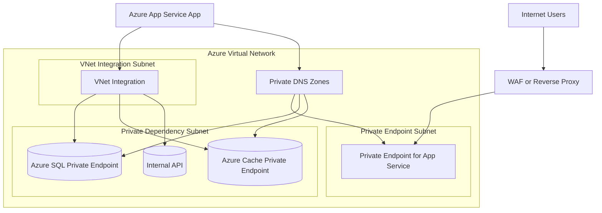
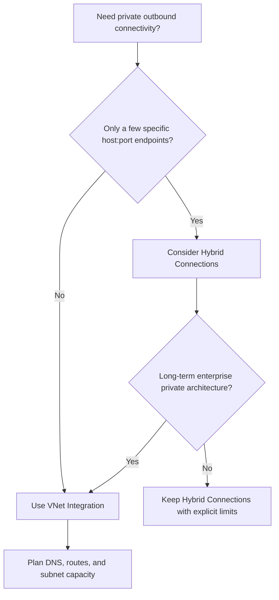

# Networking Best Practices

Networking design in Azure App Service is primarily about controlling direction and trust boundaries: private inbound paths, predictable outbound paths, and reliable DNS behavior across those paths.

## Prerequisites

- Existing Web App and App Service Plan
- Existing virtual network and required subnets
- Permissions to manage App Service, networking, and private DNS resources
- Variables set:
  - `RG`
  - `APP_NAME`
  - `VNET_NAME`
  - `INTEGRATION_SUBNET_NAME`
  - `PRIVATE_ENDPOINT_SUBNET_NAME`

## Main Content

### Networking goals for production

Use App Service networking to achieve four outcomes:

1. Inbound exposure is intentionally restricted.
2. Outbound traffic to private dependencies is deterministic.
3. SNAT behavior is managed under concurrency.
4. DNS resolution aligns with your private topology.



### 1) Use VNet Integration for outbound traffic

VNet Integration is the primary App Service feature for private outbound connectivity.

Use it when your app must reach:

- Private endpoints for PaaS dependencies
- Internal services reachable through peering/express routes
- Internal DNS zones and split-horizon naming schemes

Configure integration:

```bash
az webapp vnet-integration add \
  --resource-group $RG \
  --name $APP_NAME \
  --vnet $VNET_NAME \
  --subnet $INTEGRATION_SUBNET_NAME \
  --output json
```

Route all app outbound through VNet path where required:

```bash
az webapp config appsettings set \
  --resource-group $RG \
  --name $APP_NAME \
  --settings WEBSITE_VNET_ROUTE_ALL=1 \
  --output json
```

Validate integration state:

```bash
az webapp vnet-integration list \
  --resource-group $RG \
  --name $APP_NAME \
  --output table
```

!!! info "Outbound only"
    VNet Integration controls outbound connectivity. It does not make inbound access private by itself.

### 2) Use Private Endpoint for inbound privacy

Private Endpoint is the standard pattern for private inbound access to an App Service app.

Use it when:

- App must not be publicly reachable
- Access should originate only from approved VNets
- You need private IP resolution for app endpoints

Create private endpoint:

```bash
APP_RESOURCE_ID=$(az webapp show \
  --resource-group $RG \
  --name $APP_NAME \
  --query id \
  --output tsv)

az network private-endpoint create \
  --resource-group $RG \
  --name "pe-$APP_NAME" \
  --vnet-name $VNET_NAME \
  --subnet $PRIVATE_ENDPOINT_SUBNET_NAME \
  --private-connection-resource-id $APP_RESOURCE_ID \
  --group-id sites \
  --connection-name "pec-$APP_NAME" \
  --output json
```

Check connection status:

```bash
az network private-endpoint show \
  --resource-group $RG \
  --name "pe-$APP_NAME" \
  --query "{state:provisioningState,connection:privateLinkServiceConnections[0].privateLinkServiceConnectionState.status}" \
  --output json
```

### 3) Design for SNAT port efficiency

SNAT exhaustion is a frequent cause of intermittent outbound failures under concurrency.

Use these patterns to reduce SNAT pressure:

- **Connection pooling** for database and HTTP clients
- **Async I/O patterns** to avoid thread starvation and long-held sockets
- **Reuse HTTP clients** instead of creating per-request clients
- **Bounded retries** with jitter to avoid retry storms
- **Short dependency timeouts** to free sockets faster

Practical implementation guidance:

| Dependency type | SNAT-friendly pattern | Anti-pattern |
|---|---|---|
| HTTP APIs | Shared client instance with keep-alive | New client object per request |
| SQL/DB | Runtime-level connection pool | Open/close connection on every small operation |
| Cache | Reused multiplexer/client | Frequent reconnect loops |
| Messaging | Persistent channels where supported | Burst connect/disconnect cycles |

!!! warning "SNAT symptoms are often misleading"
    SNAT exhaustion can look like random timeouts, dependency flakiness, or transient DNS failures. Always inspect connection lifecycle and concurrency patterns before blaming downstream services.

### 4) Own DNS behavior in private topologies

Private networking fails most often at DNS, not at routing.

For App Service private endpoint scenarios:

1. Configure `privatelink.azurewebsites.net` private DNS zone.
2. Link the zone to the correct VNets.
3. Ensure clients resolve app hostname to private IP.
4. Validate dependency hostnames resolve to private addresses where expected.

Create and link private DNS zone:

```bash
az network private-dns zone create \
  --resource-group $RG \
  --name privatelink.azurewebsites.net \
  --output json

az network private-dns link vnet create \
  --resource-group $RG \
  --zone-name privatelink.azurewebsites.net \
  --name "link-$VNET_NAME" \
  --virtual-network $VNET_NAME \
  --registration-enabled false \
  --output json
```

Validate DNS from private network context:

```bash
nslookup "$APP_NAME.azurewebsites.net"
```

Expected: private IP address in your VNet range.

!!! warning "Do not mix unresolved DNS ownership"
    If platform, network, and app teams each assume another team owns DNS, incidents become long and repetitive. Assign explicit DNS ownership and validation steps.

### 5) Hybrid Connections vs VNet Integration

Both features provide outbound reachability, but they solve different problems.

| Decision area | Hybrid Connections | VNet Integration |
|---|---|---|
| Connectivity model | App-level relay to specific host:port endpoints | Network-level integration to a delegated subnet |
| Scope | Targeted dependency access | Broad private network access |
| Operational complexity | Simpler for limited cases | Better for comprehensive private dependency strategy |
| Protocol flexibility | Host/port specific constraints | Works with broader private routing patterns |
| Typical use case | Few legacy endpoints without full VNet adoption | Standard enterprise private architecture |

Decision guideline:

- Choose **Hybrid Connections** for a narrow, transitional requirement.
- Choose **VNet Integration** for strategic private networking.



### 6) Inbound control layering

Even with private endpoints, define layered inbound control:

- Edge control (WAF/reverse proxy)
- App access restrictions for explicit allow/deny where applicable
- Private endpoint approval workflow
- Monitoring for unauthorized or unexpected requests

Example access restriction rule:

```bash
az webapp config access-restriction add \
  --resource-group $RG \
  --name $APP_NAME \
  --rule-name AllowCorp \
  --action Allow \
  --ip-address 203.0.113.0/24 \
  --priority 100 \
  --output json
```

### 7) Outbound dependency validation checklist

Before production cutover:

- [ ] App can resolve private dependency FQDNs correctly.
- [ ] App can connect to dependency private endpoints.
- [ ] Connection pooling is enabled and tuned.
- [ ] Dependency timeouts are explicit and bounded.
- [ ] Retry policy prevents connection storms.
- [ ] NAT/SNAT behavior is observed under peak load tests.

### 8) Troubleshooting patterns to pre-plan

Include these commands in runbooks:

```bash
az webapp show \
  --resource-group $RG \
  --name $APP_NAME \
  --query "{defaultHostName:defaultHostName,outboundIpAddresses:outboundIpAddresses}" \
  --output json

az network private-endpoint list \
  --resource-group $RG \
  --output table

az network private-dns record-set a list \
  --resource-group $RG \
  --zone-name privatelink.azurewebsites.net \
  --output table
```

### Common networking anti-patterns

- Enabling VNet Integration but forgetting DNS design.
- Creating private endpoints without private DNS zone links.
- Assuming private endpoint also controls outbound traffic.
- Treating intermittent timeouts as dependency faults without SNAT analysis.
- Using Hybrid Connections as a permanent architecture without review.

## Advanced Topics

- Use Azure Front Door or Application Gateway with WAF for edge security plus private origin reachability.
- Add synthetic connectivity probes from inside trusted networks.
- Build dependency maps with expected DNS resolution source and fallback behavior.
- Track connection reuse metrics and tune pooling values with load tests.

## See Also

- [Best Practices](./index.md)
- [Production Baseline](./production-baseline.md)
- [Security Best Practices](./security.md)
- [Operations - Networking](../operations/networking.md)

## References

- [App Service networking features](https://learn.microsoft.com/azure/app-service/networking-features)
- [Integrate App Service with virtual networks](https://learn.microsoft.com/azure/app-service/configure-vnet-integration-enable)
- [Use private endpoints for App Service apps](https://learn.microsoft.com/azure/app-service/networking/private-endpoint)
- [Hybrid Connections in App Service](https://learn.microsoft.com/azure/app-service/app-service-hybrid-connections)
- [Azure DNS private zones](https://learn.microsoft.com/azure/dns/private-dns-overview)
