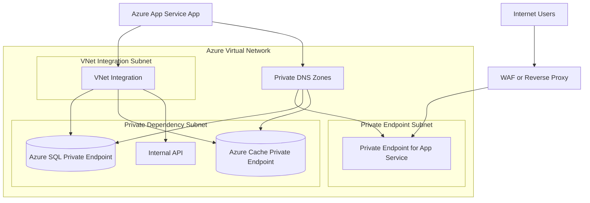
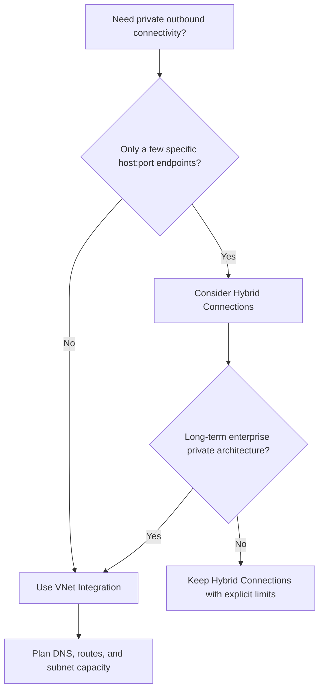

---
content_validation:
  status: verified
  last_reviewed: "2026-04-12"
  reviewer: agent
  core_claims:
    - claim: "VNet Integration is the primary App Service feature for private outbound connectivity."
      source: "https://learn.microsoft.com/en-us/azure/app-service/networking-features"
      verified: true
    - claim: "VNet Integration controls outbound connectivity. It does not make inbound access private by itself."
      source: "https://learn.microsoft.com/en-us/azure/app-service/networking-features"
      verified: true
    - claim: "Private Endpoint is the standard pattern for private inbound access to an App Service app."
      source: "https://learn.microsoft.com/en-us/azure/app-service/networking-features"
      verified: true
    - claim: "VNet Integration provides outbound private connectivity. Private Endpoint provides inbound private access. They solve different directions of traffic flow."
      source: "https://learn.microsoft.com/en-us/azure/app-service/overview-vnet-integration"
      verified: true
    - claim: "possibleOutboundIpAddresses must be used for firewall allowlists as the active outbound IP set can change."
      source: "https://learn.microsoft.com/en-us/azure/app-service/overview-inbound-outbound-ips"
      verified: true
    - claim: "Enabling VNet Integration with route-all routes all outbound traffic through the VNet. The source IP remains one of the app's standard outbound IPs unless the integration subnet uses a NAT Gateway or routes traffic through a firewall or NVA."
      source: "https://learn.microsoft.com/en-us/azure/app-service/overview-vnet-integration"
      verified: true
    - claim: "Creating a Private Endpoint does not automatically block the public endpoint. To achieve private-only inbound access, disable public network access on the app or configure access restrictions as appropriate."
      source: "https://learn.microsoft.com/en-us/azure/app-service/networking/private-endpoint"
      verified: true
content_sources:
  diagrams:
    - id: app-service-networking-topology
      type: graph
      source: mslearn-adapted
      mslearn_url: https://learn.microsoft.com/en-us/azure/app-service/networking-features
    - id: hybrid-connections-vs-vnet-integration
      type: flowchart
      source: mslearn-adapted
      mslearn_url: https://learn.microsoft.com/en-us/azure/app-service/networking-features
---

# Networking Best Practices

Networking design in Azure App Service is primarily about controlling direction and trust boundaries: private inbound paths, predictable outbound paths, and reliable DNS behavior across those paths.

## Why This Matters

Networking is the first control plane an App Service workload exposes to the outside world, and it is also the layer that most often fails silently in production. Getting these decisions right up front is materially cheaper than retrofitting them:

- Outbound IPs can change under scale operations, region moves, or SKU changes — hard-coded allowlists break with no explicit warning.
- Private Endpoint and VNet Integration solve different problems (inbound privacy vs outbound reachability); confusing them leads to either data-plane exposure or broken egress.
- SNAT port exhaustion presents as intermittent connectivity issues that are indistinguishable from remote-service faults without the right diagnostic signals in place.
- DNS resolution paths differ across shared-plan, VNet-integrated, and Private Endpoint topologies; a stale mental model causes reproducible-but-unexplained lookup failures.

This document consolidates the concrete design and validation practices that keep those failure modes from becoming incidents.

## Prerequisites

- Existing Web App and App Service Plan
- Existing virtual network and required subnets
- Permissions to manage App Service, networking, and private DNS resources
- Variables set:
    - `RG`
    - `APP_NAME`
    - `VNET_NAME`
    - `INTEGRATION_SUBNET_NAME`
    - `PRIVATE_ENDPOINT_SUBNET_NAME`

## Recommended Practices

### Networking goals for production

Use App Service networking to achieve four outcomes:

1. Inbound exposure is intentionally restricted.
2. Outbound traffic to private dependencies is deterministic.
3. SNAT behavior is managed under concurrency.
4. DNS resolution aligns with your private topology.

<!-- diagram-id: app-service-networking-topology -->

```mermaid
graph TD
    Internet[Internet Users] --> WAF[WAF or Reverse Proxy]
    WAF --> PE[Private Endpoint for App Service]

    subgraph VNet[Azure Virtual Network]
        subgraph PE_SUBNET[Private Endpoint Subnet]
            PE
        end
        subgraph APP_SUBNET[VNet Integration Subnet]
            VNETINT[VNet Integration]
        end
        subgraph DEP_SUBNET[Private Dependency Subnet]
            SQL[(Azure SQL Private Endpoint)]
            REDIS[(Azure Cache Private Endpoint)]
            API[Internal API]
        end
        DNS[Private DNS Zones]
    end

    App[Azure App Service App] --> VNETINT
    VNETINT --> SQL
    VNETINT --> REDIS
    VNETINT --> API
    App --> DNS
    DNS --> PE
    DNS --> SQL
    DNS --> REDIS
```

### 1) Use VNet Integration for outbound traffic

VNet Integration is the primary App Service feature for private outbound connectivity.

Use it when your app must reach:

- Private endpoints for PaaS dependencies
- Internal services reachable through peering/express routes
- Internal DNS zones and split-horizon naming schemes

Configure integration:

```bash
az webapp vnet-integration add \
  --resource-group $RG \
  --name $APP_NAME \
  --vnet $VNET_NAME \
  --subnet $INTEGRATION_SUBNET_NAME \
  --output json
```

Route all app outbound through VNet path where required:

```bash
az webapp config appsettings set \
  --resource-group $RG \
  --name $APP_NAME \
  --settings WEBSITE_VNET_ROUTE_ALL=1 \
  --output json
```

Validate integration state:

```bash
az webapp vnet-integration list \
  --resource-group $RG \
  --name $APP_NAME \
  --output table
```

!!! info "Outbound only"
    VNet Integration controls outbound connectivity. It does not make inbound access private by itself.

### 2) Use Private Endpoint for inbound privacy

Private Endpoint is the standard pattern for private inbound access to an App Service app.

Use it when:

- App must not be publicly reachable
- Access should originate only from approved VNets
- You need private IP resolution for app endpoints

Create private endpoint:

```bash
APP_RESOURCE_ID=$(az webapp show \
  --resource-group $RG \
  --name $APP_NAME \
  --query id \
  --output tsv)

az network private-endpoint create \
  --resource-group $RG \
  --name "pe-$APP_NAME" \
  --vnet-name $VNET_NAME \
  --subnet $PRIVATE_ENDPOINT_SUBNET_NAME \
  --private-connection-resource-id $APP_RESOURCE_ID \
  --group-id sites \
  --connection-name "pec-$APP_NAME" \
  --output json
```

Check connection status:

```bash
az network private-endpoint show \
  --resource-group $RG \
  --name "pe-$APP_NAME" \
  --query "{state:provisioningState,connection:privateLinkServiceConnections[0].privateLinkServiceConnectionState.status}" \
  --output json
```

### 3) Design for SNAT port efficiency

SNAT exhaustion is a frequent cause of intermittent outbound failures under concurrency.

Use these patterns to reduce SNAT pressure:

- **Connection pooling** for database and HTTP clients
- **Async I/O patterns** to avoid thread starvation and long-held sockets
- **Reuse HTTP clients** instead of creating per-request clients
- **Bounded retries** with jitter to avoid retry storms
- **Short dependency timeouts** to free sockets faster

Practical implementation guidance:

| Dependency type | SNAT-friendly pattern | Anti-pattern |
|---|---|---|
| HTTP APIs | Shared client instance with keep-alive | New client object per request |
| SQL/DB | Runtime-level connection pool | Open/close connection on every small operation |
| Cache | Reused multiplexer/client | Frequent reconnect loops |
| Messaging | Persistent channels where supported | Burst connect/disconnect cycles |

!!! warning "SNAT symptoms are often misleading"
    SNAT exhaustion can look like random timeouts, dependency flakiness, or transient DNS failures. Always inspect connection lifecycle and concurrency patterns before blaming downstream services.

### 4) Own DNS behavior in private topologies

Private networking fails most often at DNS, not at routing.

For App Service private endpoint scenarios:

1. Configure `privatelink.azurewebsites.net` private DNS zone.
2. Link the zone to the correct VNets.
3. Ensure clients resolve app hostname to private IP.
4. Validate dependency hostnames resolve to private addresses where expected.

Create and link private DNS zone:

```bash
az network private-dns zone create \
  --resource-group $RG \
  --name privatelink.azurewebsites.net \
  --output json

az network private-dns link vnet create \
  --resource-group $RG \
  --zone-name privatelink.azurewebsites.net \
  --name "link-$VNET_NAME" \
  --virtual-network $VNET_NAME \
  --registration-enabled false \
  --output json
```

Validate DNS from private network context:

```bash
nslookup "$APP_NAME.azurewebsites.net"
```

Expected: private IP address in your VNet range.

!!! warning "Do not mix unresolved DNS ownership"
    If platform, network, and app teams each assume another team owns DNS, incidents become long and repetitive. Assign explicit DNS ownership and validation steps.

### 5) Hybrid Connections vs VNet Integration

VNet Integration provides outbound private connectivity. Private Endpoint provides inbound private access. They solve different directions of traffic flow.

| Decision area | Hybrid Connections | VNet Integration |
|---|---|---|
| Connectivity model | App-level relay to specific host:port endpoints | Network-level integration to a delegated subnet |
| Scope | Targeted dependency access | Broad private network access |
| Operational complexity | Simpler for limited cases | Better for comprehensive private dependency strategy |
| Protocol flexibility | Host/port specific constraints | Works with broader private routing patterns |
| Typical use case | Few legacy endpoints without full VNet adoption | Standard enterprise private architecture |

Decision guideline:

- Choose **Hybrid Connections** for a narrow, transitional requirement.
- Choose **VNet Integration** for strategic private networking.

<!-- diagram-id: hybrid-connections-vs-vnet-integration -->

```mermaid
flowchart TD
    A[Need private outbound connectivity?] --> B{Only a few specific host:port endpoints?}
    B -->|Yes| C[Consider Hybrid Connections]
    B -->|No| D[Use VNet Integration]
    C --> E{Long-term enterprise private architecture?}
    E -->|Yes| D
    E -->|No| F[Keep Hybrid Connections with explicit limits]
    D --> G[Plan DNS, routes, and subnet capacity]
```

### 6) Inbound control layering

Even with private endpoints, define layered inbound control:

- Edge control (WAF/reverse proxy)
- App access restrictions for explicit allow/deny where applicable
- Private endpoint approval workflow
- Monitoring for unauthorized or unexpected requests

Example access restriction rule:

```bash
az webapp config access-restriction add \
  --resource-group $RG \
  --name $APP_NAME \
  --rule-name AllowCorp \
  --action Allow \
  --ip-address 203.0.113.0/24 \
  --priority 100 \
  --output json
```

#### Portal view: Access Restrictions blade

![Access Restrictions blade reached from the Networking page with Save and Refresh actions. The App access section explains that public access applies to both the main site and the advanced (SCM) tool site, and that "Deny public network access will block all incoming traffic except that comes from private endpoints"; the Public network access control offers three radio buttons — Enabled from all networks (with a note that selecting it will clear all current access restrictions), Enabled from select virtual networks and IP addresses, and Disabled — and shows an info banner reading "Enabled (using default behavior)". The Site access and rules section has Main site (active) and Advanced tool site tabs and describes rules being evaluated in priority order with the "Unmatched rule action" controlling un-rule-matched traffic. The Unmatched rule action selector has Allow (selected) and Deny radio buttons. Add and Delete buttons appear above a Filter rules search box and an Action : All filter chip with a removable X, followed by a rules table with columns Priority, Name, Source, Action, and HTTP headers. The table contains a single rule with Priority 2147483647, Name "Allow all", Source "Any", Action "Allow" (green checkmark), and HTTP headers "Not configured".](../assets/best-practices/networking/01-access-restrictions.png)

The Access Restrictions blade is where the layered inbound model described above is enforced. The visible default state shows the two most important behaviors this guide warns against assuming away: `Public network access` is `Enabled (using default behavior)` meaning the app is publicly reachable, and the implicit `Allow all` rule at priority `2147483647` with `Unmatched rule action: Allow` means that without any explicit rules, every source is permitted. The `Main site` and `Advanced tool site` tabs separate runtime traffic from SCM/Kudu management traffic — both must be hardened. After running the `az webapp config access-restriction add` command above with priority 100, the new `AllowCorp` rule should appear above the default `Allow all` row, and the `Unmatched rule action` should be flipped to `Deny` to convert the implicit allow-by-default posture into an explicit deny-by-default posture.

### 7) Troubleshooting patterns to pre-plan

Include these commands in runbooks:

```bash
az webapp show \
  --resource-group $RG \
  --name $APP_NAME \
  --query "{defaultHostName:defaultHostName,outboundIpAddresses:outboundIpAddresses}" \
  --output json

az network private-endpoint list \
  --resource-group $RG \
  --output table

az network private-dns record-set a list \
  --resource-group $RG \
  --zone-name privatelink.azurewebsites.net \
  --output table
```

### 8) Manage IP address changes proactively

App Service IP addresses are not static. Treating them as fixed causes allowlist drift, broken firewall rules, and silent connectivity failures after scale events.

#### Outbound IP allowlist strategy

Two CLI fields exist for outbound IPs — use the right one:

| Field | What it represents | When to use |
|---|---|---|
| `outboundIpAddresses` | IPs currently active | Read-only diagnostics |
| `possibleOutboundIpAddresses` | All IPs the app may ever use on this plan | **Firewall allowlists — always use this** |

Query both to understand current vs. potential exposure:

```bash
az webapp show \
    --resource-group "$RG" \
    --name "$APP_NAME" \
    --query "{active:outboundIpAddresses,possible:possibleOutboundIpAddresses}" \
    --output json
```

Example output (PII masked):

| Output field | Meaning | Operational use |
|---|---|---|
| `active` | Currently in-use outbound IPs on this plan | Diagnostic snapshot only — do **not** allowlist |
| `possible` | Full candidate set the plan could rotate through | Union of active+possible is the correct allowlist |

<!-- Verified: real az CLI output from koreacentral, 2026-05-01; IP values redacted 2026-07-04 -->
```json
{
  "active": "<13 outbound IPv4 addresses; run the command above to retrieve current values>",
  "possible": "<31 additional outbound IPv4 addresses; the union of active + possible is the full allowlist candidate set>"
}
```

!!! warning "Events that change outbound IPs"
    - Scaling the App Service Plan up or down (SKU change)
    - Moving the app to a different region or scale unit
    - Enabling or disabling VNet Integration
    - Platform-side infrastructure updates

    After any of these events, re-query `possibleOutboundIpAddresses` and update downstream allowlists before traffic is restored.

#### Outbound IP behavior under VNet Integration

With route-all enabled (formerly `WEBSITE_VNET_ROUTE_ALL=1`, now exposed as a platform setting through the portal or CLI), all outbound traffic is routed through the VNet. The source IP remains one of the app's standard outbound IPs unless the integration subnet uses a NAT Gateway or forces traffic through a firewall or NVA, in which case the egress IP becomes that device's IP.

Verify after enabling:

```bash
# Confirm VNet integration is active
az webapp vnet-integration list \
    --resource-group "$RG" \
    --name "$APP_NAME" \
    --output table

# Confirm route-all setting
az webapp config appsettings list \
    --resource-group "$RG" \
    --name "$APP_NAME" \
    --query "[?name=='WEBSITE_VNET_ROUTE_ALL']" \
    --output table
```

<!-- Verified: real az CLI output from koreacentral, 2026-05-01 -->
```
Location       Name              ResourceGroup     VnetResourceId
-------------  ----------------  ----------------  -------------------------------------------------
Korea Central  snet-integration  rg-<masked>       .../virtualNetworks/vnet-<masked>/subnets/snet-integration
```

```
Name                    Value    SlotSetting
----------------------  -------  -------------
WEBSITE_VNET_ROUTE_ALL  1        False
```

!!! warning "Update downstream allowlists after enabling VNet Integration"
    Route-all changes the path of outbound traffic, but not necessarily the observed source IP. Downstream services will continue to see one of the app's standard outbound IPs unless the integration subnet uses a NAT Gateway or routes traffic through a firewall or NVA. Update allowlists to reflect the actual egress design before enabling route-all in production.

#### Inbound IP and Private Endpoint behavior

Creating a Private Endpoint assigns a private IP from the endpoint subnet. The public inbound endpoint is not automatically disabled. For private-only inbound access, disable public network access on the app or apply access restrictions that enforce the intended exposure model.

Query the current inbound IP:

```bash
az webapp show \
    --resource-group "$RG" \
    --name "$APP_NAME" \
    --query "inboundIpAddress" \
    --output tsv
```

Query the Private Endpoint's assigned private IP:

```bash
az network private-endpoint show \
    --resource-group "$RG" \
    --name "pe-$APP_NAME" \
    --query "customDnsConfigs[0].ipAddresses" \
    --output json
```

Example output:

<!-- Verified: real az CLI output from koreacentral, 2026-05-01 -->
```json
[
  "192.0.2.4"
]
```

Validate that DNS resolves to the private IP from within the VNet:

```bash
nslookup "$APP_NAME.azurewebsites.net"
```

When run from a VM inside the VNet with the private DNS zone configured, the response resolves to the Private Endpoint IP (for example, `192.0.2.4`) instead of the public IP. The Private Endpoint IP was confirmed via `az network private-endpoint show` (koreacentral, 2026-05-01) and sanitized for publication.

!!! warning "Private Endpoint does not automatically block public access"
    After creating a Private Endpoint, the public endpoint remains reachable until you disable public network access on the app or apply access restrictions that enforce private-only inbound access. Complete the sequence:

    1. Create the Private Endpoint.
    2. Verify DNS resolves to the private IP from the target VNet.
    3. Disable public network access on the app or add access restrictions that block unintended public inbound traffic.
    4. Validate from public internet that access is denied according to the control you applied.

    ```bash
    az webapp config access-restriction add \
        --resource-group "$RG" \
        --name "$APP_NAME" \
        --rule-name "DenyPublic" \
        --action Deny \
        --ip-address 0.0.0.0/0 \
        --priority 65000 \
        --output json
    ```

## Common Mistakes / Anti-Patterns

- Enabling VNet Integration but forgetting DNS design.
- Creating private endpoints without private DNS zone links.
- Assuming private endpoint also controls outbound traffic.
- Treating intermittent timeouts as dependency faults without SNAT analysis.
- Using Hybrid Connections as a permanent architecture without review.

## Validation Checklist

Before production cutover:

- [ ] App can resolve private dependency FQDNs correctly.
- [ ] App can connect to dependency private endpoints.
- [ ] Connection pooling is enabled and tuned.
- [ ] Dependency timeouts are explicit and bounded.
- [ ] Retry policy prevents connection storms.
- [ ] NAT/SNAT behavior is observed under peak load tests.

## Advanced Topics

- Use Azure Front Door or Application Gateway with WAF for edge security plus private origin reachability.
- Add synthetic connectivity probes from inside trusted networks.
- Build dependency maps with expected DNS resolution source and fallback behavior.
- Track connection reuse metrics and tune pooling values with load tests.

## See Also

- [Best Practices](./index.md)
- [Production Baseline](./production-baseline.md)
- [Security Best Practices](./security.md)
- [Operations - Networking](../operations/networking.md)

## Sources

- [App Service networking features](https://learn.microsoft.com/en-us/azure/app-service/networking-features)
- [Integrate App Service with virtual networks](https://learn.microsoft.com/en-us/azure/app-service/configure-vnet-integration-enable)
- [Use private endpoints for App Service apps](https://learn.microsoft.com/en-us/azure/app-service/networking/private-endpoint)
- [Hybrid Connections in App Service](https://learn.microsoft.com/en-us/azure/app-service/app-service-hybrid-connections)
- [Azure DNS private zones](https://learn.microsoft.com/en-us/azure/dns/private-dns-overview)
