# Production Baseline

This guide defines a minimum production baseline for Azure App Service workloads. Use it to establish consistent defaults before language-specific implementation and before environment-specific optimization.

## Prerequisites

- Azure subscription with permission to configure App Service resources
- Existing resource group, App Service Plan, and Web App
- Shared ownership between application and platform teams for baseline standards
- Variables set:
    - `RG`
    - `APP_NAME`
    - `PLAN_NAME`

## Main Content

### Baseline intent

The goal of a production baseline is to reduce accidental risk. Teams should not negotiate core controls app-by-app. Instead, establish defaults once and apply them consistently.

```mermaid
flowchart TD
    A[Production Readiness Checklist] --> B[Plan Tier]
    A --> C[Runtime Safety]
    A --> D[Health]
    A --> E[Observability]
    A --> F[Configuration Discipline]
    A --> G[Identity and Secrets]
    B --> B1[B1 for development and low-risk testing]
    B --> B2[S1 or higher for production baseline]
    B --> B3[P1v3 or higher for high performance profiles]
    C --> C1[Always On enabled]
    C --> C2[HTTPS Only enabled]
    C --> C3[Minimum TLS 1.2]
    D --> D1[Health check endpoint configured]
    D --> D2[Failure criteria validated]
    E --> E1[HTTP logs enabled]
    E --> E2[Console and app logs enabled]
    E --> E3[Platform diagnostics available]
    F --> F1[App settings separated from slot settings]
    G --> G1[Managed identity enabled]
    G --> G2[Connection strings avoided where possible]
```



### 1) App Service Plan selection

Plan tier selection is a design decision, not only a cost decision.

| Workload stage | Recommended plan | Why |
|---|---|---|
| Development and exploratory testing | **B1** | Low cost for non-critical workloads, basic validation, and early iteration. |
| Production baseline | **S1 or higher** | Better reliability envelope and production-suitable operational posture. |
| High-performance or latency-sensitive workloads | **P1v3 or higher** | Improved CPU/memory characteristics and stronger performance headroom. |

!!! warning "Do not run production on Basic tier by default"
    Basic tiers can be useful for development, but most production workloads require at least Standard for reliable operational behavior and growth headroom.

Assess tier choice with these criteria:

- Peak throughput and concurrency profile
- Response-time SLO/SLA expectations
- Number of deployment slots required
- Memory pressure and GC behavior of runtime
- Dependency latency and retry amplification risk

Check current plan tier:

```bash
az appservice plan show \
  --resource-group $RG \
  --name $PLAN_NAME \
  --query "{sku:sku.name,tier:sku.tier,workers:numberOfWorkers}" \
  --output json
```

Sample output (PII-masked):

```json
{
  "sku": "S1",
  "tier": "Standard",
  "workers": 2
}
```

### 2) Runtime safety defaults

Every production app should enforce these settings:

- **Always On**: enabled
- **HTTPS Only**: enabled
- **Minimum TLS**: 1.2 or above

Apply baseline runtime settings:

```bash
az webapp config set \
  --resource-group $RG \
  --name $APP_NAME \
  --always-on true \
  --min-tls-version 1.2 \
  --output json

az webapp update \
  --resource-group $RG \
  --name $APP_NAME \
  --https-only true \
  --output json
```

Verify effective configuration:

```bash
az webapp show \
  --resource-group $RG \
  --name $APP_NAME \
  --query "{httpsOnly:httpsOnly,state:state,hostNames:hostNames}" \
  --output json

az webapp config show \
  --resource-group $RG \
  --name $APP_NAME \
  --query "{alwaysOn:alwaysOn,minTlsVersion:minTlsVersion,http20Enabled:http20Enabled}" \
  --output json
```

!!! info "Always On matters for non-request workloads"
    Apps with scheduled background jobs, cache warm-up, or token refresh logic can fail unpredictably if Always On is disabled.

### 3) Health check configuration

Health checks are required for stable traffic handling and reliable restart behavior.

Recommended health endpoint design:

- Path: `/health` or `/healthz`
- Response: `200` only when app is ready to serve real traffic
- Checks: critical dependencies with bounded timeout
- No secrets or detailed internals in response body

Configure health check path:

```bash
az webapp config set \
  --resource-group $RG \
  --name $APP_NAME \
  --generic-configurations '{"healthCheckPath":"/health"}' \
  --output json
```

Validate endpoint behavior:

```bash
curl --silent --show-error --fail "https://$APP_NAME.azurewebsites.net/health"
```

!!! warning "Do not make health checks too deep"
    Health checks should detect readiness, not run expensive full-system diagnostics. Deep checks can create cascading failures under load.

### 4) Diagnostic logging baseline

At minimum, production workloads should have:

- `AppServiceHTTPLogs` for request-level traceability
- `AppServiceConsoleLogs` for application runtime diagnostics
- `AppServicePlatformLogs` for infrastructure-level events

Enable web server and application logging where relevant:

```bash
az webapp log config \
  --resource-group $RG \
  --name $APP_NAME \
  --web-server-logging filesystem \
  --detailed-error-messages true \
  --failed-request-tracing true \
  --application-logging filesystem \
  --level information \
  --output json
```

For centralized retention and analytics, route diagnostics to Log Analytics / Azure Monitor.

Example diagnostic settings creation:

```bash
az monitor diagnostic-settings create \
  --name "diag-$APP_NAME" \
  --resource $(az webapp show --resource-group $RG --name $APP_NAME --query id --output tsv) \
  --workspace "<log-analytics-workspace-resource-id>" \
  --logs '[{"category":"AppServiceHTTPLogs","enabled":true},{"category":"AppServiceConsoleLogs","enabled":true},{"category":"AppServicePlatformLogs","enabled":true}]' \
  --metrics '[{"category":"AllMetrics","enabled":true}]' \
  --output json
```

!!! info "Category names can vary by API version"
    Validate available diagnostic categories in your environment and API version before automation. Keep your IaC and CLI commands aligned.

Check active diagnostic settings:

```bash
az monitor diagnostic-settings list \
  --resource $(az webapp show --resource-group $RG --name $APP_NAME --query id --output tsv) \
  --output json
```

### 5) App settings vs slot settings

Separate configuration by lifecycle behavior:

- **App settings**: values that should move with deployment
- **Slot settings (sticky)**: values that must stay with a slot during swap

Typical slot-sticky settings:

- Production-only endpoints
- Production-only credentials
- Monitoring destination overrides per environment

Set a normal app setting:

```bash
az webapp config appsettings set \
  --resource-group $RG \
  --name $APP_NAME \
  --settings "FEATURE_FLAG_X=true" \
  --output json
```

Mark selected settings as slot-specific:

```bash
az webapp config appsettings set \
  --resource-group $RG \
  --name $APP_NAME \
  --slot-settings "API_ENDPOINT=https://api.contoso.internal" "CACHE_TTL_SECONDS=60" \
  --output json
```

!!! warning "Misclassified settings break swaps"
    If environment-specific values are not sticky, slot swap can promote invalid endpoints or credentials into production.

### 6) Managed identity over connection strings

Prefer managed identity for Azure service access to remove static credential handling from applications.

Why managed identity is the default:

- Reduces secret sprawl
- Supports least-privilege RBAC
- Simplifies rotation and operational burden
- Improves auditability of access patterns

Enable system-assigned managed identity:

```bash
az webapp identity assign \
  --resource-group $RG \
  --name $APP_NAME \
  --output json
```

Inspect identity state:

```bash
az webapp identity show \
  --resource-group $RG \
  --name $APP_NAME \
  --query "{type:type,principalId:principalId,tenantId:tenantId}" \
  --output json
```

Sample output (PII-masked):

```json
{
  "type": "SystemAssigned",
  "principalId": "xxxxxxxx-xxxx-xxxx-xxxx-xxxxxxxxxxxx",
  "tenantId": "<tenant-id>"
}
```

When migration from connection strings is not immediate:

1. Keep secrets in Key Vault references.
2. Assign minimum required privileges.
3. Track retirement date for each remaining secret.

### Baseline verification checklist

Run this checklist before calling an app production-ready:

- [ ] Plan tier selected with documented rationale.
- [ ] Always On enabled.
- [ ] HTTPS-only enabled.
- [ ] Minimum TLS set to 1.2 or higher.
- [ ] Health check endpoint configured and validated.
- [ ] Diagnostic logging categories enabled and retained centrally.
- [ ] Slot settings defined for environment-specific values.
- [ ] Managed identity enabled and permissions scoped.

### Common baseline anti-patterns

- Treating B1 as permanent production infrastructure.
- Enabling logs without retention or query ownership.
- Using health checks that always return success.
- Keeping production credentials as plain app settings.
- Performing slot swaps without sticky setting review.

## Advanced Topics

- Create separate baselines for internet-facing APIs, internal apps, and batch-triggered web workloads.
- Automate baseline enforcement with Azure Policy and IaC validation gates.
- Add synthetic probes that confirm full request path behavior, not only process liveness.
- Correlate baseline deviations with incident metrics to prioritize hardening work.

## See Also

- [Best Practices](./index.md)
- [Networking Best Practices](./networking.md)
- [Security Best Practices](./security.md)
- [Operations - Health and Recovery](../operations/health-recovery.md)

## Sources

- [Overview of App Service best practices](https://learn.microsoft.com/azure/app-service/overview-best-practices)
- [Configure common App Service settings](https://learn.microsoft.com/azure/app-service/configure-common)
- [Enable diagnostics in App Service](https://learn.microsoft.com/azure/app-service/troubleshoot-diagnostic-logs)
- [Health check in App Service](https://learn.microsoft.com/azure/app-service/monitor-instances-health-check)
- [Managed identities for Azure resources](https://learn.microsoft.com/entra/identity/managed-identities-azure-resources/overview)
