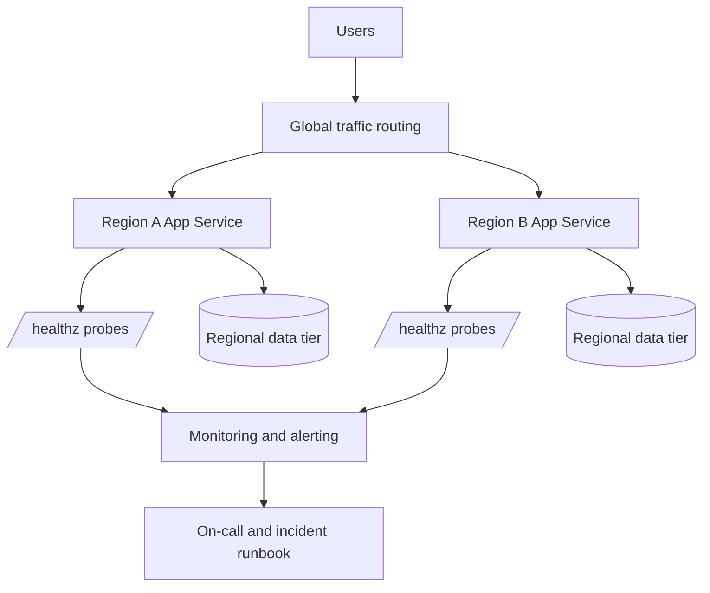

---
content_validation:
  status: verified
  last_reviewed: "2026-04-12"
  reviewer: ai-agent
  core_claims:
    - claim: "Health checks are the first reliability control in App Service."
      source: "https://learn.microsoft.com/azure/app-service/monitor-instances-health-check"
      verified: true
    - claim: "They allow unhealthy instances to be detected and removed from rotation."
      source: "https://learn.microsoft.com/azure/app-service/monitor-instances-health-check"
      verified: true
    - claim: "Single-region design is often acceptable for low-criticality apps, but production-critical systems should plan for regional disruption."
      source: "https://learn.microsoft.com/azure/app-service/tutorial-multi-region-app"
      verified: true
    - claim: "Backups are a reliability control for data/configuration recovery, not a substitute for high availability."
      source: "https://learn.microsoft.com/azure/app-service/manage-backup"
      verified: true
content_sources:
  diagrams:
    - id: reliability-architecture-with-health-checks
      type: flowchart
      source: mslearn-adapted
      mslearn_url: https://learn.microsoft.com/en-us/azure/app-service/app-service-best-practices
      based_on:
        - https://learn.microsoft.com/en-us/azure/app-service/monitor-instances-health-check
---

# Reliability Best Practices

Reliability in Azure App Service comes from deliberate architecture and operational discipline. This guide focuses on practical design decisions that reduce outage frequency, shorten recovery time, and improve user trust.

## Reliability Goals

For production systems, reliability should be expressed through measurable targets:

- Availability target (for example, 99.9% or higher)
- Recovery Time Objective (RTO)
- Recovery Point Objective (RPO)
- Error budget and incident response thresholds

!!! info "Reliability is multi-layered"
    Platform health, application behavior, and dependency resilience all contribute to end-to-end uptime.

## Prerequisites

Before implementing advanced reliability patterns, ensure:

- Structured logging and distributed tracing are enabled
- Health endpoint exists and validates critical dependencies
- Backups are configured and periodically tested
- Incident runbooks have clear ownership and escalation

## Health Check Probe Configuration

Health checks are the first reliability control in App Service. They allow unhealthy instances to be detected and removed from rotation.

### Design Principles for Health Endpoints

- Keep response lightweight and deterministic
- Validate required dependencies (database, cache, key services)
- Separate readiness from deep diagnostics where possible
- Return clear status codes and minimal payload

### Example Health Check Configuration

```bash
az webapp config set \
    --resource-group $RG \
    --name $APP_NAME \
    --generic-configurations '{"healthCheckPath":"/healthz"}'
```

### What a Good `/healthz` Should Validate

- Process liveness and request handling loop
- Dependency connectivity with timeout guard
- Critical configuration presence
- Version metadata for rollout debugging

!!! warning "Do not fake healthy status"
    If key dependencies are unavailable, return unhealthy. Hiding failures delays detection and increases incident impact.

## Multi-Region Deployment Patterns

Single-region design is often acceptable for low-criticality apps, but production-critical systems should plan for regional disruption.

### Pattern 1: Active-Passive

- Primary region serves all traffic
- Secondary region stays warm for failover
- DNS or traffic manager performs failover routing

Pros:

- Simpler operational model
- Lower write consistency complexity

Cons:

- Secondary capacity may be underutilized
- Failover testing is mandatory to avoid surprise failures

### Pattern 2: Active-Active

- Multiple regions serve traffic concurrently
- Global routing distributes traffic by priority, latency, or geography
- Requires stronger data and session architecture

Pros:

- Better regional resilience
- Potentially lower user latency by geography

Cons:

- Higher architecture and operations complexity
- Harder consistency and incident isolation

### Reliability Architecture with Health Checks

<!-- diagram-id: reliability-architecture-with-health-checks -->


## Graceful Shutdown and SIGTERM Handling

App Service can recycle instances during scale, patching, and deployment events. Applications must handle termination signals gracefully.

### Why SIGTERM Handling Matters

- Prevents abrupt termination of in-flight requests
- Reduces partial writes and data corruption risk
- Enables cleaner release transitions and scale-in events

### Graceful Shutdown Checklist

- Trap termination signals in application runtime
- Stop accepting new requests quickly
- Finish in-flight requests within timeout budget
- Flush logs/telemetry and close outbound connections cleanly

!!! note "Language-specific implementation"
    Use this document for design guidance, then implement signal handlers in your language guide runtime section.

## Retry and Circuit Breaker Patterns

Most production outages are dependency-driven, not web-tier-driven. Reliability requires controlled failure handling for downstream calls.

### Retry Best Practices

- Retry only transient failure types
- Use exponential backoff with jitter
- Set upper bounds on attempts and timeout budget
- Avoid infinite retries

### Circuit Breaker Best Practices

- Open circuit when error threshold exceeded
- Fail fast while circuit is open
- Probe with limited half-open requests
- Emit breaker state metrics for visibility

!!! warning "Retries can amplify outages"
    Without backoff and limits, retries create thundering herds against already-failing dependencies.

## Backup and Restore Strategy

Backups are a reliability control for data/configuration recovery, not a substitute for high availability.

### Strategy Components

- Scheduled app backups with defined retention
- Database-native backup alignment with app backup schedule
- Storage account durability review
- Documented restore sequence and ownership

### Validation Requirements

- Perform periodic restore drills in non-production
- Measure real restore time against RTO target
- Verify restored app boots and passes health checks

```bash
# Example: list current backup configuration
az webapp config backup show \
    --resource-group $RG \
    --webapp-name $APP_NAME
```

## Minimum Instance Count for High Availability

For production workloads, run at least two instances.

Why minimum two instances matters:

- Reduces single-instance failure impact
- Supports rolling maintenance without complete service loss
- Improves resilience during transient host issues

!!! danger "Single instance is a single failure domain"
    One instance in production means any restart, crash, or host issue can become user-visible downtime.

## Failure Scenario Planning

### Scenario A: One Instance Unhealthy

Expected behavior:

- Health checks detect and remove unhealthy instance from rotation
- Remaining instances continue serving traffic

### Scenario B: Dependency Latency Spike

Expected behavior:

- Timeout and retry policy engages
- Circuit breaker opens if sustained failures occur
- Alerting notifies operators before full outage

### Scenario C: Regional Outage

Expected behavior:

- Global routing removes affected region
- Secondary region serves traffic within RTO
- Post-failover validation runbook executes

## Reliability Operating Model

### Pre-Production

- Load and chaos-style failure testing
- Dependency failure simulations
- Runbook dry-runs for failover and restore

### Production

- SLO dashboards and error budget tracking
- Alert tuning to reduce noise and improve signal
- Weekly review of high-severity incident trends

### Post-Incident

- Root cause analysis with timeline accuracy
- Preventive action items with ownership and deadlines
- Documentation updates in operations and best-practices sections

## See Also

- [Platform - How App Service Works](../platform/how-app-service-works.md)
- [Operations - Health and Recovery](../operations/health-recovery.md)
- [Operations - Backup and Restore](../operations/backup-restore.md)
- [Best Practices - Deployment](./deployment.md)
- [Best Practices - Common Anti-Patterns](./common-anti-patterns.md)

## Sources

- [Best practices for Azure App Service (Microsoft Learn)](https://learn.microsoft.com/azure/app-service/overview-best-practices)
- [Monitor instances in Azure App Service with Health check (Microsoft Learn)](https://learn.microsoft.com/azure/app-service/monitor-instances-health-check)
- [Back up and restore your app in Azure App Service (Microsoft Learn)](https://learn.microsoft.com/azure/app-service/manage-backup)
- [Create and manage deployment slots in Azure App Service (Microsoft Learn)](https://learn.microsoft.com/azure/app-service/deploy-staging-slots)
