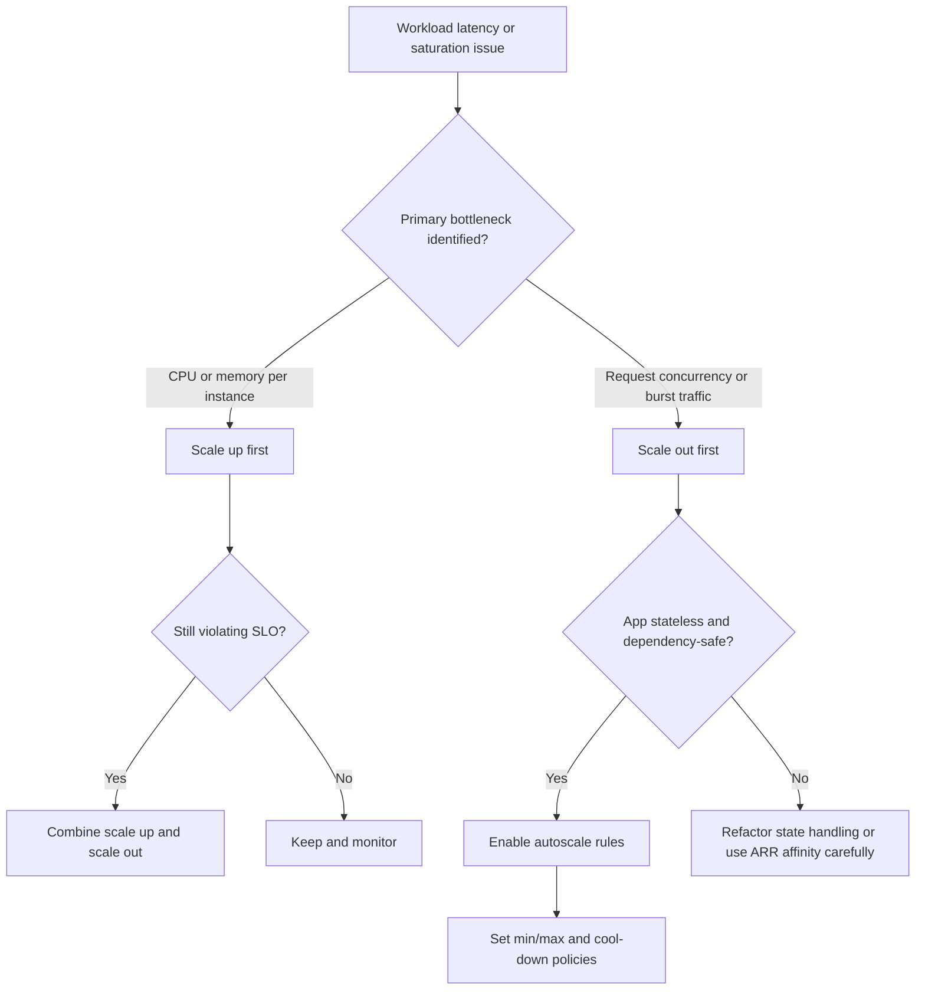

# Scaling Best Practices

Scaling guidance in App Service is a design decision, not only an operational toggle. This document helps you choose the right scaling model based on workload characteristics, architecture constraints, and cost boundaries.

## Scaling Objectives

A production scaling strategy should balance:

- Performance under variable traffic
- Availability during instance loss or maintenance
- Cost efficiency at steady state and peak
- Predictable behavior during sudden load changes

!!! info "Design judgment layer"
    Platform documentation explains what scaling options exist. This guide explains when and why to choose each option.

## Prerequisites

Before tuning scaling behavior:

- Establish baseline traffic and latency metrics
- Define SLOs (availability, p95 latency, error rate)
- Configure health checks and application telemetry
- Validate statelessness assumptions for horizontal scaling

## Vertical vs Horizontal Scaling Decision

Both scale-up and scale-out are valid. The right choice depends on bottlenecks and application architecture.

### Vertical Scaling (Scale Up)

Scale up increases CPU/RAM resources per instance by changing App Service plan SKU.

Use when:

- CPU or memory pressure is constant even at low instance counts
- Application has limited horizontal concurrency capability
- Dependencies impose per-instance connection or session constraints

Limitations:

- Bigger instances can still become single bottlenecks
- Some outages affect all workload on the plan
- Unit cost can rise quickly at higher tiers

### Horizontal Scaling (Scale Out)

Scale out increases instance count.

Use when:

- Workload is mostly stateless
- Throughput needs are bursty or seasonal
- You need fault tolerance across multiple instances

Limitations:

- Session state and cache locality can complicate behavior
- Downstream systems must tolerate increased parallel calls

### Scaling Decision Tree



## Auto-Scale Rules Design

Autoscale rules should be intentional and measurable. Avoid reactive chaos by using small, tested rule sets.

### CPU-Based Rules

CPU is useful as a broad saturation indicator.

Example baseline:

- Scale out when average CPU > 70% for 10 minutes
- Scale in when average CPU < 35% for 20 minutes

### HTTP Queue Length Rules

Queue length is a strong signal when request concurrency exceeds instance capacity.

Use when:

- CPU is not saturated but response times rise
- Workloads have blocking I/O and thread-pool pressure

### Custom Metrics Rules

Custom metrics are valuable for domain-specific bottlenecks.

Examples:

- Active background jobs
- Queue backlog size
- Domain transaction latency percentile

!!! warning "Avoid conflicting rules"
    Multiple aggressive rules on different metrics can cause oscillation (thrashing). Use cool-down windows and clear priority logic.

## Scale-Out Limits per SKU

App Service scaling limits vary by tier and region capability. Plan limits should be checked before setting autoscale ceilings.

Design recommendations:

- Set max instance count below hard platform limits
- Reserve headroom for emergency manual scaling
- Re-check limits before seasonal traffic periods

!!! note "Treat limits as design inputs"
    Do not discover scaling limits during an incident. Validate limits in advance and document expected capacity.

## Per-App Scaling

Multiple apps can share one App Service plan. Per-app scaling allows each app to scale independently within plan constraints.

Use per-app scaling when:

- Shared plan contains workloads with different traffic patterns
- One app should not over-consume instances needed by others
- Cost optimization requires plan sharing with controlled isolation

Trade-offs:

- Capacity planning becomes more complex
- Noisy-neighbor risk still exists at plan resource level

## Local Cache and ARR Affinity Considerations

Scaling strategy is tightly coupled to state behavior.

### ARR Affinity

ARR affinity (sticky sessions) pins clients to instances.

- Helpful for legacy session-in-memory patterns
- Can hurt even load distribution during scale-out
- Can cause uneven utilization and tail latency issues

Recommendation:

- Prefer external distributed session stores over ARR affinity
- Disable ARR affinity for truly stateless workloads

### Local Cache

Local cache can improve read performance for some workloads, but do not treat it as a shared persistence layer.

- Instance-local cache is not durable
- Cache warm-up behavior affects scale-out events
- Ensure cache miss paths are dependency-safe

!!! tip "Stateless first"
    If scale-out reliability is a goal, design for stateless request processing and externalize mutable state.

## Practical Autoscale Configuration Pattern

1. Set `minimum instance count` based on baseline traffic and HA needs
2. Set `maximum instance count` from cost and limit analysis
3. Add one primary scale-out metric and one scale-in metric
4. Test with controlled load profile
5. Tune thresholds after observing production behavior

```bash
# Example: set always-on for production workload
az webapp config set \
    --resource-group $RG \
    --name $APP_NAME \
    --always-on true

# Example: show current App Service plan tier and capacity context
az appservice plan show \
    --resource-group $RG \
    --name $PLAN_NAME
```

## Common Scaling Failure Modes

### Mode 1: Scaling Does Not Improve Latency

Likely cause: downstream dependency bottleneck (database, external API).

Action:

- Add dependency latency telemetry
- Add retry with backoff and circuit breaker controls
- Consider dependency-side scaling or caching strategy

### Mode 2: Instance Thrashing

Likely cause: overly sensitive thresholds and short cool-down periods.

Action:

- Increase evaluation period
- Add scale-in delay
- Remove duplicate or conflicting rules

### Mode 3: Uneven Load Across Instances

Likely cause: sticky sessions and cached state pinned to hot instances.

Action:

- Reduce ARR affinity usage
- Externalize session state
- Validate load-balancer behavior with synthetic traffic

## Capacity Planning Baseline

For each app, maintain a simple capacity sheet with:

- Requests per second at steady and peak windows
- Per-instance throughput estimate at acceptable latency
- Safety factor for unexpected demand spikes
- Maximum expected dependency concurrency

Capacity formula example:

`required_instances = (peak_rps / per_instance_rps) * safety_factor`

## Governance and Review Cadence

- Monthly review of autoscale metrics and incidents
- Pre-event scale rehearsal for known peak periods
- Post-incident scaling retrospective with updated runbook

## See Also

- [Platform - Scaling](../platform/scaling.md)
- [Operations - Scaling](../operations/scaling.md)
- [Operations - Cost Optimization](../operations/cost-optimization.md)
- [Best Practices - Reliability](./reliability.md)
- [Best Practices - Common Anti-Patterns](./common-anti-patterns.md)

## References

- [Scale up an app in Azure App Service (Microsoft Learn)](https://learn.microsoft.com/azure/app-service/manage-scale-up)
- [Scale instance count manually or automatically in Azure App Service (Microsoft Learn)](https://learn.microsoft.com/azure/app-service/manage-scale-up)
- [App Service limits (Microsoft Learn)](https://learn.microsoft.com/azure/azure-resource-manager/management/azure-subscription-service-limits#app-service-limits)
- [Best practices for Azure App Service (Microsoft Learn)](https://learn.microsoft.com/azure/app-service/overview-best-practices)
