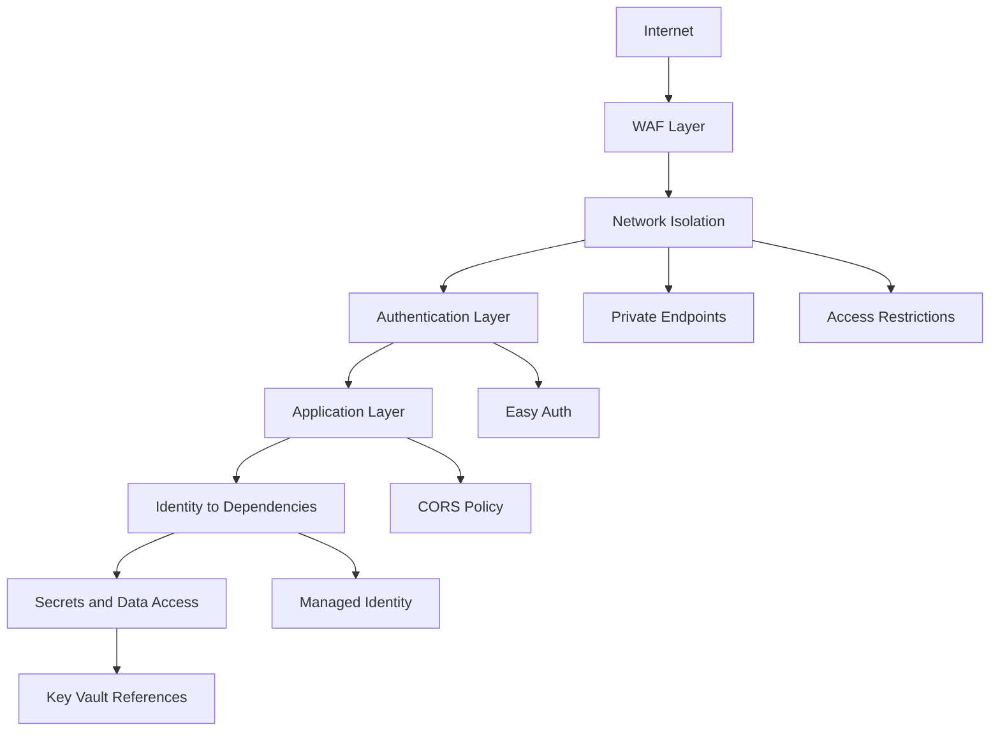

---
hide:
  - toc
content_validation:
  status: verified
  last_reviewed: "2026-04-12"
  reviewer: ai-agent
  core_claims:
    - claim: "App Service supports managed identities for secure access to Azure resources without storing credentials."
      source: "https://learn.microsoft.com/azure/app-service/overview-managed-identity"
      verified: true
    - claim: "App Service provides built-in authentication and authorization support (Easy Auth) that can protect apps without code changes."
      source: "https://learn.microsoft.com/azure/app-service/overview-authentication-authorization"
      verified: true
    - claim: "Private endpoints allow apps to be accessed through a private IP address within a virtual network."
      source: "https://learn.microsoft.com/azure/app-service/networking-features"
      verified: true
    - claim: "App Service supports Key Vault references to securely access secrets without storing them in application settings."
      source: "https://learn.microsoft.com/azure/app-service/app-service-key-vault-references"
      verified: true
content_sources:
  diagrams:
    - id: defense-in-depth-security-layers
      type: flowchart
      source: mslearn-adapted
      mslearn_url: https://learn.microsoft.com/en-us/azure/app-service/overview-security
      based_on:
        - https://learn.microsoft.com/en-us/azure/app-service/networking-features
---

# Security Best Practices

Security in Azure App Service is strongest when controls are layered: identity, secret management, authentication, network isolation, edge protection, and strict application policy. This guide defines practical defaults for production architecture decisions.

## Prerequisites

- Existing Web App and App Service Plan
- Azure Entra tenant and required permissions
- Security ownership defined across application, platform, and network teams
- Variables set:
    - `RG`
    - `APP_NAME`
    - `KV_NAME`

## Main Content

### Security objective

Adopt a defense-in-depth model so a single control failure does not immediately expose the workload.

<!-- diagram-id: defense-in-depth-security-layers -->


### 1) Managed identity first (system vs user-assigned)

Managed identity should be the default credential model for App Service apps accessing Azure dependencies.

Identity type guidance:

| Identity type | Use when | Trade-off |
|---|---|---|
| System-assigned | App has independent lifecycle and permissions | Simple lifecycle, identity deleted with app |
| User-assigned | Multiple apps share one identity or lifecycle must be decoupled | More governance overhead, better reuse control |

Enable system-assigned identity:

```bash
az webapp identity assign \
  --resource-group $RG \
  --name $APP_NAME \
  --output json
```

Attach user-assigned identity:

```bash
az webapp identity assign \
  --resource-group $RG \
  --name $APP_NAME \
  --identities "/subscriptions/<subscription-id>/resourceGroups/$RG/providers/Microsoft.ManagedIdentity/userAssignedIdentities/id-shared-app" \
  --output json
```

Verify identity configuration:

```bash
az webapp identity show \
  --resource-group $RG \
  --name $APP_NAME \
  --query "{type:type,principalId:principalId,userAssigned:userAssignedIdentities}" \
  --output json
```

!!! info "Start with least privilege"
    Grant only the minimum required roles at the narrowest possible scope. Review and trim permissions regularly.

### 2) Use Key Vault references for secret material

Do not place raw secrets in source code, pipeline variables without governance, or ad hoc app settings.

Preferred pattern:

1. Store secret in Azure Key Vault.
2. Grant app identity access to secret.
3. Reference secret from app setting using Key Vault reference syntax.

Set Key Vault reference app setting:

```bash
az webapp config appsettings set \
  --resource-group $RG \
  --name $APP_NAME \
  --settings "DB_PASSWORD=@Microsoft.KeyVault(SecretUri=https://$KV_NAME.vault.azure.net/secrets/db-password/)" \
  --output json
```

Inspect setting metadata safely:

```bash
az webapp config appsettings list \
  --resource-group $RG \
  --name $APP_NAME \
  --query "[?name=='DB_PASSWORD'].{name:name,value:value}" \
  --output json
```

!!! warning "Reference syntax does not replace authorization"
    Key Vault references work only when network access and identity permissions are correctly configured. Confirm both during deployment validation.

### 3) Use Easy Auth for platform authentication

App Service Authentication/Authorization (Easy Auth) is a strong default for many web and API workloads.

When Easy Auth is beneficial:

- You want centralized identity provider integration.
- You need consistent auth behavior across multiple apps.
- You want to reduce custom auth boilerplate in code.

Enable Easy Auth (baseline):

```bash
az webapp auth update \
  --resource-group $RG \
  --name $APP_NAME \
  --enabled true \
  --action LoginWithAzureActiveDirectory \
  --output json
```

Review auth configuration:

```bash
az webapp auth show \
  --resource-group $RG \
  --name $APP_NAME \
  --output json
```

!!! info "Platform auth and app auth must be intentional"
    If you combine Easy Auth with custom in-app authorization logic, clearly define responsibility boundaries to avoid conflicting behavior.

### 4) Apply network isolation by default

Security posture improves significantly when internet exposure is reduced and explicitly controlled.

Recommended inbound model:

- Private endpoint for private inbound access
- Access restrictions for explicit allow/deny controls
- Optional edge gateway/WAF for internet-facing patterns

Example access restriction rules:

```bash
az webapp config access-restriction add \
  --resource-group $RG \
  --name $APP_NAME \
  --rule-name AllowCorp \
  --action Allow \
  --ip-address 203.0.113.0/24 \
  --priority 100 \
  --output json

az webapp config access-restriction add \
  --resource-group $RG \
  --name $APP_NAME \
  --rule-name DenyAll \
  --action Deny \
  --ip-address 0.0.0.0/0 \
  --priority 2147483647 \
  --output json
```

### 5) Integrate WAF for edge protection

For internet-facing applications, place a Web Application Firewall layer in front of App Service.

Common options:

- Azure Front Door with WAF policy
- Application Gateway with WAF policy

WAF value areas:

- Managed rule sets for common attack classes
- Centralized policy and logging
- Rate limiting and edge inspection controls

!!! warning "WAF is not a substitute for app security"
    WAF reduces risk but does not replace secure coding, input validation, patch management, and least-privilege identity.

### 6) CORS configuration with explicit origins

CORS should be explicit, minimal, and environment-specific.

Add allowed origins:

```bash
az webapp cors add \
  --resource-group $RG \
  --name $APP_NAME \
  --allowed-origins "https://portal.contoso.com" "https://admin.contoso.com" \
  --output json
```

Show configured origins:

```bash
az webapp cors show \
  --resource-group $RG \
  --name $APP_NAME \
  --output json
```

Remove obsolete origin:

```bash
az webapp cors remove \
  --resource-group $RG \
  --name $APP_NAME \
  --allowed-origins "https://legacy.contoso.com" \
  --output json
```

!!! warning "Avoid wildcard origins in production"
    `*` origins increase exposure and can undermine frontend trust boundaries. Prefer exact origin lists with regular review.

### 7) Enforce transport security baseline

Even with other controls, transport settings are non-negotiable:

- HTTPS-only enabled
- Minimum TLS 1.2 or higher
- Insecure FTP modes disabled where policy requires

Apply transport baseline:

```bash
az webapp update \
  --resource-group $RG \
  --name $APP_NAME \
  --https-only true \
  --output json

az webapp config set \
  --resource-group $RG \
  --name $APP_NAME \
  --min-tls-version 1.2 \
  --ftps-state Disabled \
  --output json
```

### 8) Security review checklist

Validate these controls before go-live:

- [ ] Managed identity enabled and role assignments reviewed.
- [ ] Key Vault references used for all sensitive configuration.
- [ ] Easy Auth configured or equivalent app-level model documented.
- [ ] Private endpoint and access restrictions implemented as designed.
- [ ] WAF policy deployed for internet-facing workloads.
- [ ] CORS origins explicitly listed and environment-specific.
- [ ] HTTPS/TLS baseline enforced.
- [ ] Security logs routed to centralized monitoring.

### 9) Common security anti-patterns

- Long-lived secrets hardcoded in app settings.
- Shared broad-privilege identity across unrelated workloads.
- Easy Auth enabled without clear route-level authorization model.
- Public exposure left open during or after private endpoint rollout.
- Wildcard CORS used permanently because of early integration convenience.

## Advanced Topics

- Use conditional access and identity protection policies for operator access paths.
- Add workload identity governance with periodic role attestation.
- Correlate WAF events, App Service logs, and identity logs for incident investigations.
- Apply policy-as-code to block insecure transport and missing identity configurations.

## See Also

- [Best Practices](./index.md)
- [Production Baseline](./production-baseline.md)
- [Networking Best Practices](./networking.md)
- [Operations - Security](../operations/security.md)

## Sources

- [Security in Azure App Service](https://learn.microsoft.com/azure/app-service/overview-security)
- [Authentication and authorization in App Service](https://learn.microsoft.com/azure/app-service/overview-authentication-authorization)
- [Managed identities for Azure resources](https://learn.microsoft.com/entra/identity/managed-identities-azure-resources/overview)
- [Use Key Vault references for App Service](https://learn.microsoft.com/azure/app-service/app-service-key-vault-references)
- [App Service networking features](https://learn.microsoft.com/azure/app-service/networking-features)
