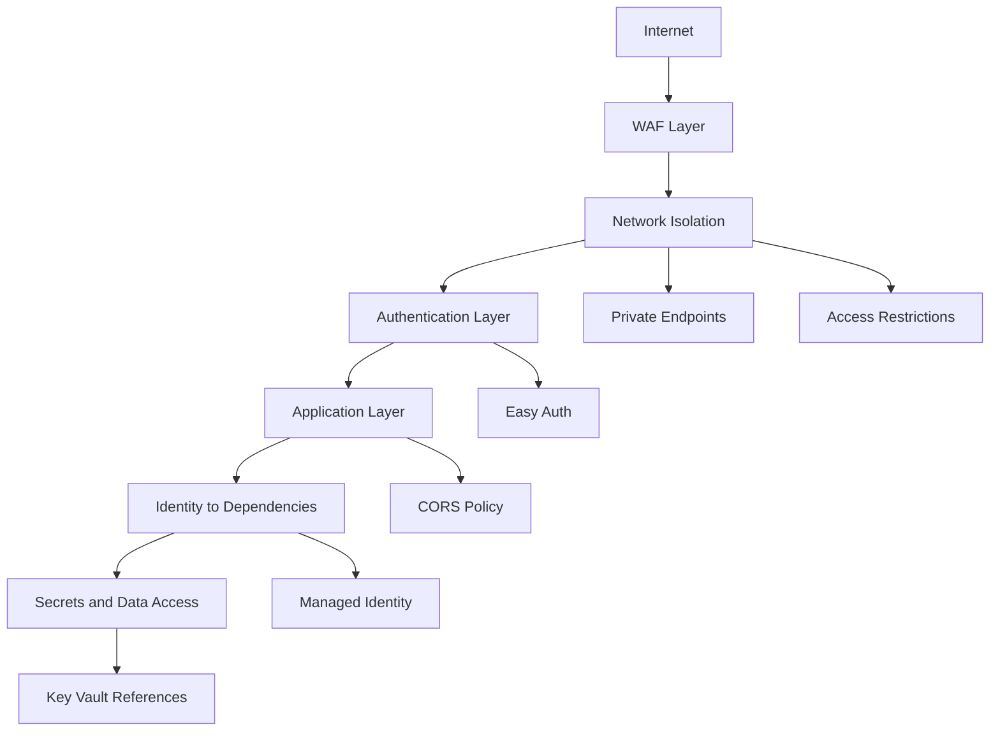

---
content_validation:
  status: verified
  last_reviewed: "2026-04-12"
  reviewer: agent
  core_claims:
    - claim: "App Service supports managed identities for secure access to Azure resources without storing credentials."
      source: "https://learn.microsoft.com/en-us/azure/app-service/overview-managed-identity"
      verified: true
    - claim: "App Service provides built-in authentication and authorization support (Easy Auth) that can protect apps without code changes."
      source: "https://learn.microsoft.com/en-us/azure/app-service/overview-authentication-authorization"
      verified: true
    - claim: "Private endpoints allow apps to be accessed through a private IP address within a virtual network."
      source: "https://learn.microsoft.com/en-us/azure/app-service/networking-features"
      verified: true
    - claim: "App Service supports Key Vault references to securely access secrets without storing them in application settings."
      source: "https://learn.microsoft.com/en-us/azure/app-service/app-service-key-vault-references"
      verified: true
content_sources:
  diagrams:
    - id: defense-in-depth-security-layers
      type: flowchart
      source: mslearn-adapted
      mslearn_url: https://learn.microsoft.com/en-us/azure/app-service/overview-security
      based_on:
        - https://learn.microsoft.com/en-us/azure/app-service/networking-features
---

# Security Best Practices

Security in Azure App Service is strongest when controls are layered: identity, secret management, authentication, network isolation, edge protection, and strict application policy. This guide defines practical defaults for production architecture decisions.

## Why This Matters

Adopt a defense-in-depth model so a single control failure does not immediately expose the workload.

<!-- diagram-id: defense-in-depth-security-layers -->

```mermaid
flowchart TD
    A[Internet] --> B[WAF Layer]
    B --> C[Network Isolation]
    C --> D[Authentication Layer]
    D --> E[Application Layer]
    E --> F[Identity to Dependencies]
    F --> G[Secrets and Data Access]

    C --> C1[Private Endpoints]
    C --> C2[Access Restrictions]
    D --> D1[Easy Auth]
    E --> E1[CORS Policy]
    F --> F1[Managed Identity]
    G --> G1[Key Vault References]
```

## Recommended Practices

### Prerequisites

- Existing Web App and App Service Plan
- Azure Entra tenant and required permissions
- Security ownership defined across application, platform, and network teams
- Variables set:
    - `RG`
    - `APP_NAME`
    - `KV_NAME`

### Managed identity first (system vs user-assigned)

Managed identity should be the default credential model for App Service apps accessing Azure dependencies.

Identity type guidance:

| Identity type | Use when | Trade-off |
|---|---|---|
| System-assigned | App has independent lifecycle and permissions | Simple lifecycle, identity deleted with app |
| User-assigned | Multiple apps share one identity or lifecycle must be decoupled | More governance overhead, better reuse control |

Enable system-assigned identity:

```bash
az webapp identity assign \
  --resource-group $RG \
  --name $APP_NAME \
  --output json
```

| Command | Purpose | Key flags |
|---|---|---|
| `az webapp identity assign` | Enable system-assigned managed identity on the web app | `--resource-group`, `--name` scope the target; no identity ID needed for system-assigned |

Attach user-assigned identity:

```bash
az webapp identity assign \
  --resource-group $RG \
  --name $APP_NAME \
  --identities "/subscriptions/<subscription-id>/resourceGroups/$RG/providers/Microsoft.ManagedIdentity/userAssignedIdentities/id-shared-app" \
  --output json
```

| Command | Purpose | Key flags |
|---|---|---|
| `az webapp identity assign --identities` | Attach an existing user-assigned managed identity to the web app | `--identities` takes the full resource ID of the userAssignedIdentity |

Verify identity configuration:

```bash
az webapp identity show \
  --resource-group $RG \
  --name $APP_NAME \
  --query "{type:type,principalId:principalId,userAssigned:userAssignedIdentities}" \
  --output json
```

| Command | Purpose | Key flags |
|---|---|---|
| `az webapp identity show` | Read the current identity configuration for verification | `--query` extracts `type`, `principalId`, and `userAssignedIdentities` for RBAC follow-up |

#### Portal view: Identity blade

![Identity blade for a Web App with two tabs — System assigned (active) and User assigned. A descriptive header explains that a system-assigned managed identity is restricted to one per resource, tied to the lifecycle of the resource, allows RBAC permissions to be granted in Azure, and is authenticated with Microsoft Entra ID so no credentials need to be stored in code. The command bar shows Save, Discard, Refresh, Troubleshoot, and Got feedback? actions. The Status control is a two-state toggle currently set to Off, with On as the alternative position. No Object (principal) ID, Permissions, or Azure role assignments are shown because the identity is not yet enabled.](../assets/best-practices/security/01-identity-blade.png)

The Identity blade is the surface where the "managed identity first" principle is either enforced or quietly skipped. The visible `Status: Off` state is the App Service default for a newly created Web App and is also the most common source of secret-leakage incidents — until this toggle is flipped to `On`, every Azure-resource access from the app must use a static credential. The `System assigned` and `User assigned` tabs map directly to the identity-type decision table above: use `System assigned` when the app's lifecycle owns its identity, and switch to `User assigned` when one identity must be shared across multiple apps. After `az webapp identity assign`, this blade should show `Status: On` together with a `principalId` value, which is the input required for the RBAC role assignments that follow.

!!! info "Start with least privilege"
    Grant only the minimum required roles at the narrowest possible scope. Review and trim permissions regularly.

### Use Key Vault references for secret material

Do not place raw secrets in source code, pipeline variables without governance, or ad hoc app settings.

Preferred pattern:

1. Store secret in Azure Key Vault.
2. Grant app identity access to secret.
3. Reference secret from app setting using Key Vault reference syntax.

Set Key Vault reference app setting:

```bash
az webapp config appsettings set \
  --resource-group $RG \
  --name $APP_NAME \
  --settings "DB_PASSWORD=@Microsoft.KeyVault(SecretUri=https://$KV_NAME.vault.azure.net/secrets/db-password/)" \
  --output json
```

| Command | Purpose | Key flags |
|---|---|---|
| `az webapp config appsettings set` | Set an app setting whose value is a Key Vault reference | `--settings NAME=@Microsoft.KeyVault(SecretUri=...)` uses reference syntax that resolves at runtime |

Inspect setting metadata safely:

```bash
az webapp config appsettings list \
  --resource-group $RG \
  --name $APP_NAME \
  --query "[?name=='DB_PASSWORD'].{name:name,value:value}" \
  --output json
```

| Command | Purpose | Key flags |
|---|---|---|
| `az webapp config appsettings list` | Inspect a Key Vault reference setting without exposing secret contents | `--query "[?name=='X']"` filters to the one setting; the `value` field shows the reference expression, not the resolved secret |

!!! warning "Reference syntax does not replace authorization"
    Key Vault references work only when network access and identity permissions are correctly configured. Confirm both during deployment validation.

### Use Easy Auth for platform authentication

App Service Authentication/Authorization (Easy Auth) is a strong default for many web and API workloads.

When Easy Auth is beneficial:

- You want centralized identity provider integration.
- You need consistent auth behavior across multiple apps.
- You want to reduce custom auth boilerplate in code.

Enable Easy Auth (baseline):

```bash
az webapp auth update \
  --resource-group $RG \
  --name $APP_NAME \
  --enabled true \
  --action LoginWithAzureActiveDirectory \
  --output json
```

| Command | Purpose | Key flags |
|---|---|---|
| `az webapp auth update` | Enable Easy Auth (App Service Authentication) with Entra ID as the provider | `--enabled true` activates Easy Auth; `--action LoginWithAzureActiveDirectory` sets the unauthenticated-request policy |

Review auth configuration:

```bash
az webapp auth show \
  --resource-group $RG \
  --name $APP_NAME \
  --output json
```

| Command | Purpose | Key flags |
|---|---|---|
| `az webapp auth show` | Review the current Easy Auth configuration | Returns provider settings, enabled state, and unauthenticated action for audit |

!!! info "Platform auth and app auth must be intentional"
    If you combine Easy Auth with custom in-app authorization logic, clearly define responsibility boundaries to avoid conflicting behavior.

### Apply network isolation by default

Security posture improves significantly when internet exposure is reduced and explicitly controlled.

Recommended inbound model:

- Private endpoint for private inbound access
- Access restrictions for explicit allow/deny controls
- Optional edge gateway/WAF for internet-facing patterns

Example access restriction rules:

```bash
az webapp config access-restriction add \
  --resource-group $RG \
  --name $APP_NAME \
  --rule-name AllowCorp \
  --action Allow \
  --ip-address 203.0.113.0/24 \
  --priority 100 \
  --output json

az webapp config access-restriction add \
  --resource-group $RG \
  --name $APP_NAME \
  --rule-name DenyAll \
  --action Deny \
  --ip-address 0.0.0.0/0 \
  --priority 2147483647 \
  --output json
```

| Command | Purpose | Key flags |
|---|---|---|
| `az webapp config access-restriction add --action Allow` | Add an explicit allow rule for a trusted CIDR range | `--priority` controls evaluation order (lower first); `--ip-address` accepts CIDR notation |
| `az webapp config access-restriction add --action Deny` | Add a catch-all deny rule as the final priority | `--priority 2147483647` places the rule last; `--ip-address 0.0.0.0/0` matches all remaining traffic |

### Integrate WAF for edge protection

For internet-facing applications, place a Web Application Firewall layer in front of App Service.

Common options:

- Azure Front Door with WAF policy
- Application Gateway with WAF policy

WAF value areas:

- Managed rule sets for common attack classes
- Centralized policy and logging
- Rate limiting and edge inspection controls

!!! warning "WAF is not a substitute for app security"
    WAF reduces risk but does not replace secure coding, input validation, patch management, and least-privilege identity.

### CORS configuration with explicit origins

CORS should be explicit, minimal, and environment-specific.

Add allowed origins:

```bash
az webapp cors add \
  --resource-group $RG \
  --name $APP_NAME \
  --allowed-origins "https://portal.contoso.com" "https://admin.contoso.com" \
  --output json
```

| Command | Purpose | Key flags |
|---|---|---|
| `az webapp cors add` | Add explicit CORS origins to the app | `--allowed-origins` takes a space-separated list of exact origin URLs; wildcards are discouraged in production |

Show configured origins:

```bash
az webapp cors show \
  --resource-group $RG \
  --name $APP_NAME \
  --output json
```

| Command | Purpose | Key flags |
|---|---|---|
| `az webapp cors show` | Show the currently configured CORS origins | Output lists all `allowedOrigins` currently on the app for audit |

Remove obsolete origin:

```bash
az webapp cors remove \
  --resource-group $RG \
  --name $APP_NAME \
  --allowed-origins "https://legacy.contoso.com" \
  --output json
```

| Command | Purpose | Key flags |
|---|---|---|
| `az webapp cors remove` | Remove obsolete CORS origins from the app | `--allowed-origins` takes the exact origin URL to delete; must match a currently configured origin |

!!! warning "Avoid wildcard origins in production"
    `*` origins increase exposure and can undermine frontend trust boundaries. Prefer exact origin lists with regular review.

### Enforce transport security baseline

Even with other controls, transport settings are non-negotiable:

- HTTPS-only enabled
- Minimum TLS 1.2 or higher
- Insecure FTP modes disabled where policy requires

Apply transport baseline:

```bash
az webapp update \
  --resource-group $RG \
  --name $APP_NAME \
  --https-only true \
  --output json

az webapp config set \
  --resource-group $RG \
  --name $APP_NAME \
  --min-tls-version 1.2 \
  --ftps-state Disabled \
  --output json
```

| Command | Purpose | Key flags |
|---|---|---|
| `az webapp update --https-only true` | Enforce HTTPS-only for all inbound traffic | Redirects HTTP requests to HTTPS at the platform edge |
| `az webapp config set --min-tls-version 1.2 --ftps-state Disabled` | Set the minimum inbound TLS version and disable insecure FTP modes | `--min-tls-version` accepts `1.0`, `1.1`, `1.2`, or `1.3`; `--ftps-state Disabled` blocks FTP and FTPS deployment protocols |

### Advanced Topics

- Use conditional access and identity protection policies for operator access paths.
- Add workload identity governance with periodic role attestation.
- Correlate WAF events, App Service logs, and identity logs for incident investigations.
- Apply policy-as-code to block insecure transport and missing identity configurations.

## Common Mistakes / Anti-Patterns

- Long-lived secrets hardcoded in app settings.
- Shared broad-privilege identity across unrelated workloads.
- Easy Auth enabled without clear route-level authorization model.
- Public exposure left open during or after private endpoint rollout.
- Wildcard CORS used permanently because of early integration convenience.

## Validation Checklist

Validate these controls before go-live:

- [ ] Managed identity enabled and role assignments reviewed.
- [ ] Key Vault references used for all sensitive configuration.
- [ ] Easy Auth configured or equivalent app-level model documented.
- [ ] Private endpoint and access restrictions implemented as designed.
- [ ] WAF policy deployed for internet-facing workloads.
- [ ] CORS origins explicitly listed and environment-specific.
- [ ] HTTPS/TLS baseline enforced.
- [ ] Security logs routed to centralized monitoring.

## See Also

- [Best Practices](./index.md)
- [Production Baseline](./production-baseline.md)
- [Networking Best Practices](./networking.md)
- [Operations - Security](../operations/security.md)

## Sources

- [Security in Azure App Service](https://learn.microsoft.com/en-us/azure/app-service/overview-security)
- [Authentication and authorization in App Service](https://learn.microsoft.com/en-us/azure/app-service/overview-authentication-authorization)
- [Managed identities for Azure resources](https://learn.microsoft.com/en-us/entra/identity/managed-identities-azure-resources/overview)
- [Use Key Vault references for App Service](https://learn.microsoft.com/en-us/azure/app-service/app-service-key-vault-references)
- [App Service networking features](https://learn.microsoft.com/en-us/azure/app-service/networking-features)
