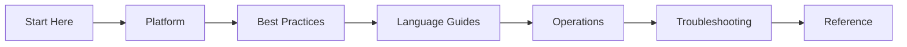

# Azure App Service Practical Guide

Comprehensive, practical documentation for building, deploying, operating, and troubleshooting web applications on Azure App Service.

This site is organized as a learning and operations guide so you can move from fundamentals to production troubleshooting with clear, repeatable workflows.

## Navigate the guide

| Section | Purpose |
|---|---|
| [Start Here](start-here/overview.md) | Orientation, learning paths, and repository map. |
| [Platform](platform/index.md) | Understand core App Service architecture, lifecycle, scaling, and networking. |
| [Best Practices](best-practices/index.md) | Apply production patterns for security, networking, deployment, scaling, and reliability. |
| [Language Guides](language-guides/index.md) | Follow end-to-end implementation tracks for Python, Node.js, Java, and .NET. |
| [Operations](operations/index.md) | Run production workloads with scaling, security, health, and cost practices. |
| [Troubleshooting](troubleshooting/index.md) | Diagnose startup, performance, outbound network, and reliability issues quickly. |
| [Reference](reference/index.md) | Use quick lookups for CLI, limits, KQL, and diagnostic utilities. |

For orientation and study order, start with [Start Here](start-here/overview.md).

## Learning flow

## Scope and disclaimer

This is an independent community project. Not affiliated with or endorsed by Microsoft.

Primary product reference: [Azure App Service overview](https://learn.microsoft.com/azure/app-service/overview)
