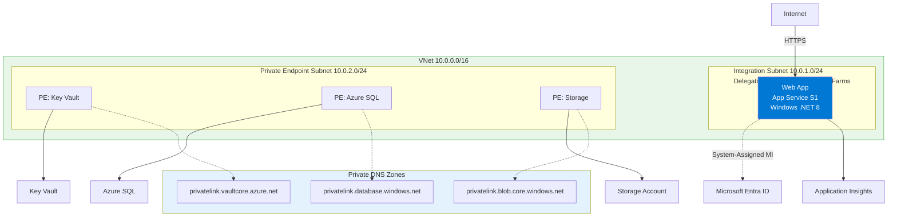
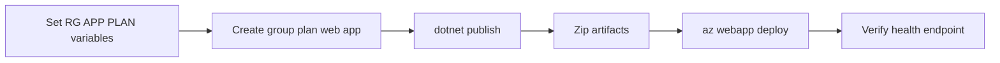

---
hide:
  - toc
content_sources:
  diagrams:
    - id: 02-first-deploy
      type: flowchart
      source: mslearn-adapted
      mslearn_url: https://learn.microsoft.com/en-us/azure/app-service/quickstart-python
    - id: diagram-2
      type: flowchart
      source: mslearn-adapted
      mslearn_url: https://learn.microsoft.com/en-us/azure/app-service/quickstart-python
---

# 02. First Deploy

Deploy the ASP.NET Core 8 app to Azure App Service (Windows) using Bicep infrastructure and zip-based code deployment.

!!! info "Infrastructure Context"
    **Service**: App Service (Windows, Standard S1) | **Network**: VNet integrated | **VNet**: ✅

    This tutorial assumes a production-ready App Service deployment with VNet integration, private endpoints for backend services, and managed identity for authentication.

<!-- diagram-id: 02-first-deploy -->


<!-- diagram-id: diagram-2 -->


## Prerequisites

- Tutorial [01. Local Run](./01-local-run.md) completed
- Azure CLI logged in (`az login`)
- Permission to create resource groups and App Service resources

## What you'll learn

- Create a resource group with Azure CLI
- Provision Windows App Service infrastructure with Azure CLI
- Publish the app with `dotnet publish`
- Deploy zip package with `az webapp deploy`

## Main Content

### Step 1: Prepare deployment variables

```bash
SUBSCRIPTION_ID="<subscription-id>"
RG="rg-dotnet-tutorial"
LOCATION="koreacentral"
PLAN_NAME="plan-dotnet-tutorial-s1"
APP_NAME="app-dotnet-tutorial-abc123"
VNET_NAME="vnet-dotnet-tutorial"
INTEGRATION_SUBNET_NAME="snet-appsvc-integration"
PE_SUBNET_NAME="snet-private-endpoints"
STORAGE_NAME="stdotnettutorialabc123"
```

| Command/Code | Purpose |
|--------------|---------|
| `SUBSCRIPTION_ID="<subscription-id>"` | Stores the Azure subscription that will receive the deployment. |
| `RG`, `LOCATION`, `PLAN_NAME`, `APP_NAME` | Define the core resource group, region, App Service plan, and web app names. |
| `VNET_NAME`, `INTEGRATION_SUBNET_NAME`, `PE_SUBNET_NAME` | Define the virtual network and subnet names used for integration and private endpoints. |
| `STORAGE_NAME="stdotnettutorialabc123"` | Sets the storage account name used in the optional private endpoint step. |

???+ example "Expected output"
    ```text
    Variables are set for deployment:
    RG=rg-dotnet-tutorial
    PLAN_NAME=plan-dotnet-tutorial-s1
    APP_NAME=app-dotnet-tutorial-abc123
    ```

### Step 2: Select the target subscription

```bash
az account set --subscription $SUBSCRIPTION_ID
az account show --query "{subscriptionId:id, tenantId:tenantId, user:user.name}" --output json
```

| Command/Code | Purpose |
|--------------|---------|
| `az account set --subscription $SUBSCRIPTION_ID` | Switches the Azure CLI context to the target subscription. |
| `az account show --query "{subscriptionId:id, tenantId:tenantId, user:user.name}" --output json` | Displays the active subscription, tenant, and signed-in user for verification. |

???+ example "Expected output"
    ```json
    {
      "subscriptionId": "<subscription-id>",
      "tenantId": "<tenant-id>",
      "user": "user@example.com"
    }
    ```

### Step 3: Create resource group, App Service plan, and web app

```bash
az group create --name $RG --location $LOCATION
az appservice plan create --resource-group $RG --name $PLAN_NAME --sku S1
az webapp create --resource-group $RG --plan $PLAN_NAME --name $APP_NAME --runtime "DOTNETCORE|8.0"
```

| Command/Code | Purpose |
|--------------|---------|
| `az group create --name $RG --location $LOCATION` | Creates the resource group that will contain the deployment resources. |
| `az appservice plan create --resource-group $RG --name $PLAN_NAME --sku S1` | Creates the Windows App Service plan that hosts the web app. |
| `az webapp create --resource-group $RG --plan $PLAN_NAME --name $APP_NAME --runtime "DOTNETCORE\|8.0"` | Creates the App Service web app configured for .NET 8. |

???+ example "Expected output"
    ```json
    {
      "defaultHostName": "app-dotnet-tutorial-abc123.azurewebsites.net",
      "enabledHostNames": [
        "app-dotnet-tutorial-abc123.azurewebsites.net",
        "app-dotnet-tutorial-abc123.scm.azurewebsites.net"
      ],
      "state": "Running"
    }
    ```

### Step 4: Create VNet and delegated integration subnet

```bash
az network vnet create --resource-group $RG --name $VNET_NAME --location $LOCATION --address-prefixes 10.0.0.0/16
az network vnet subnet create --resource-group $RG --vnet-name $VNET_NAME --name $INTEGRATION_SUBNET_NAME --address-prefixes 10.0.1.0/24 --delegations Microsoft.Web/serverFarms
```

| Command/Code | Purpose |
|--------------|---------|
| `az network vnet create --resource-group $RG --name $VNET_NAME --location $LOCATION --address-prefixes 10.0.0.0/16` | Creates the virtual network used by the App Service environment. |
| `az network vnet subnet create --resource-group $RG --vnet-name $VNET_NAME --name $INTEGRATION_SUBNET_NAME --address-prefixes 10.0.1.0/24 --delegations Microsoft.Web/serverFarms` | Creates the delegated subnet required for App Service VNet integration. |

???+ example "Expected output"
    ```json
    {
      "addressPrefix": "10.0.1.0/24",
      "delegations": [
        {
          "serviceName": "Microsoft.Web/serverFarms"
        }
      ],
      "name": "snet-appsvc-integration"
    }
    ```

### Step 5: Create private endpoint subnet

```bash
az network vnet subnet create --resource-group $RG --vnet-name $VNET_NAME --name $PE_SUBNET_NAME --address-prefixes 10.0.2.0/24 --disable-private-endpoint-network-policies true
```

| Command/Code | Purpose |
|--------------|---------|
| `az network vnet subnet create --resource-group $RG --vnet-name $VNET_NAME --name $PE_SUBNET_NAME --address-prefixes 10.0.2.0/24 --disable-private-endpoint-network-policies true` | Creates the subnet that can host private endpoints. |

???+ example "Expected output"
    ```json
    {
      "addressPrefix": "10.0.2.0/24",
      "name": "snet-private-endpoints",
      "privateEndpointNetworkPolicies": "Disabled"
    }
    ```

### Step 6: Integrate the web app with the VNet

```bash
az webapp vnet-integration add --resource-group $RG --name $APP_NAME --vnet $VNET_NAME --subnet $INTEGRATION_SUBNET_NAME
```

| Command/Code | Purpose |
|--------------|---------|
| `az webapp vnet-integration add --resource-group $RG --name $APP_NAME --vnet $VNET_NAME --subnet $INTEGRATION_SUBNET_NAME` | Connects the web app to the delegated VNet integration subnet. |

???+ example "Expected output"
    ```json
    {
      "isSwift": true,
      "subnetResourceId": "/subscriptions/<subscription-id>/resourceGroups/rg-dotnet-tutorial/providers/Microsoft.Network/virtualNetworks/vnet-dotnet-tutorial/subnets/snet-appsvc-integration"
    }
    ```

### Step 7: Assign managed identity to the web app

```bash
az webapp identity assign --resource-group $RG --name $APP_NAME
```

| Command/Code | Purpose |
|--------------|---------|
| `az webapp identity assign --resource-group $RG --name $APP_NAME` | Enables a system-assigned managed identity for the web app. |

???+ example "Expected output"
    ```json
    {
      "principalId": "<object-id>",
      "tenantId": "<tenant-id>",
      "type": "SystemAssigned"
    }
    ```

### Step 8: Build and publish the application

```bash
dotnet publish app/GuideApi/GuideApi.csproj --configuration Release --output ./publish
```

| Command/Code | Purpose |
|--------------|---------|
| `dotnet publish app/GuideApi/GuideApi.csproj --configuration Release --output ./publish` | Builds the app and writes deployable publish artifacts to the `publish` folder. |

???+ example "Expected output"
    ```text
    Determining projects to restore...
    All projects are up-to-date for restore.
    GuideApi -> /.../publish/GuideApi.dll
    ```

### Step 9: Deploy to App Service

```bash
zip --recurse-paths publish.zip ./publish
az webapp deploy --resource-group $RG --name $APP_NAME --src-path publish.zip --type zip
```

| Command/Code | Purpose |
|--------------|---------|
| `zip --recurse-paths publish.zip ./publish` | Packages the published app files into a zip archive for deployment. |
| `az webapp deploy --resource-group $RG --name $APP_NAME --src-path publish.zip --type zip` | Uploads and deploys the zip package to Azure App Service. |

???+ example "Expected output"
    ```json
    {
      "active": true,
      "complete": true,
      "status": "Build successful"
    }
    ```

### Step 10: Verify URL, health, and deployment history

```bash
WEB_APP_URL="https://$(az webapp show --resource-group $RG --name $APP_NAME --query defaultHostName --output tsv)"
curl $WEB_APP_URL/health
az webapp log deployment list --resource-group $RG --name $APP_NAME --output table
```

| Command/Code | Purpose |
|--------------|---------|
| `WEB_APP_URL="https://$(az webapp show --resource-group $RG --name $APP_NAME --query defaultHostName --output tsv)"` | Captures the deployed app's default HTTPS URL in a variable. |
| `curl $WEB_APP_URL/health` | Calls the deployed health endpoint to verify the app is responding. |
| `az webapp log deployment list --resource-group $RG --name $APP_NAME --output table` | Shows recent App Service deployment history entries. |

???+ example "Expected output"
    ```text
    {"status":"ok"}

    Id    Status   Author     Message
    ----  -------  ---------  ----------------------
    1234  Success  N/A        deployment successful
    ```

### Step 11 (Optional): Create a private endpoint for Storage

```bash
az storage account create --resource-group $RG --name $STORAGE_NAME --location $LOCATION --sku Standard_LRS --kind StorageV2
STORAGE_ID="$(az storage account show --resource-group $RG --name $STORAGE_NAME --query id --output tsv)"
az network private-endpoint create --resource-group $RG --name pe-storage-blob --vnet-name $VNET_NAME --subnet $PE_SUBNET_NAME --private-connection-resource-id $STORAGE_ID --group-id blob --connection-name pe-storage-blob-connection
```

| Command/Code | Purpose |
|--------------|---------|
| `az storage account create --resource-group $RG --name $STORAGE_NAME --location $LOCATION --sku Standard_LRS --kind StorageV2` | Creates the storage account used for the private endpoint example. |
| `STORAGE_ID="$(az storage account show --resource-group $RG --name $STORAGE_NAME --query id --output tsv)"` | Retrieves and stores the storage account resource ID. |
| `az network private-endpoint create --resource-group $RG --name pe-storage-blob --vnet-name $VNET_NAME --subnet $PE_SUBNET_NAME --private-connection-resource-id $STORAGE_ID --group-id blob --connection-name pe-storage-blob-connection` | Creates a private endpoint that connects the VNet to the storage blob service. |

???+ example "Expected output"
    ```json
    {
      "name": "pe-storage-blob",
      "privateLinkServiceConnections": [
        {
          "groupIds": [
            "blob"
          ],
          "privateLinkServiceId": "/subscriptions/<subscription-id>/resourceGroups/rg-dotnet-tutorial/providers/Microsoft.Storage/storageAccounts/stdotnettutorialabc123"
        }
      ]
    }
    ```

### Step 12: Stream live logs

```bash
az webapp log config --resource-group $RG --name $APP_NAME --application-logging filesystem --level information
az webapp log tail --resource-group $RG --name $APP_NAME
```

| Command/Code | Purpose |
|--------------|---------|
| `az webapp log config --resource-group $RG --name $APP_NAME --application-logging filesystem --level information` | Enables filesystem-based application logging for the web app. |
| `az webapp log tail --resource-group $RG --name $APP_NAME` | Streams live application logs from App Service. |

???+ example "Expected output"
    ```text
    2026-04-09T03:11:22  Connected to log-streaming service.
    2026-04-09T03:11:23  Request: GET /health 200 12ms
    ```

### Step 13: Inspect files in Kudu (SCM)

```bash
SCM_URL="https://$(az webapp show --resource-group $RG --name $APP_NAME --query name --output tsv).scm.azurewebsites.net"
printf "SCM URL: %s\n" "$SCM_URL"
az webapp deployment list-publishing-profiles --resource-group $RG --name $APP_NAME --output table
```

| Command/Code | Purpose |
|--------------|---------|
| `SCM_URL="https://$(az webapp show --resource-group $RG --name $APP_NAME --query name --output tsv).scm.azurewebsites.net"` | Builds the Kudu/SCM site URL for the deployed app. |
| `printf "SCM URL: %s\n" "$SCM_URL"` | Prints the SCM URL so you can open or copy it easily. |
| `az webapp deployment list-publishing-profiles --resource-group $RG --name $APP_NAME --output table` | Lists publishing profiles and deployment endpoints for the web app. |

???+ example "Expected output"
    ```text
    SCM URL: https://app-dotnet-tutorial-abc123.scm.azurewebsites.net

    Name    PublishMethod    PublishUrl
    ------  ---------------  ---------------------------------------------------
    app-dotnet-tutorial-abc123  MSDeploy  app-dotnet-tutorial-abc123.scm.azurewebsites.net:443
    ```

## Advanced Topics

Use slot-based deployments for zero-downtime swaps, prebuild deterministic release artifacts in CI, and combine VNet integration with private endpoints to keep outbound traffic on private network paths.

## Verification

```bash
WEB_APP_URL="https://$(az webapp show --resource-group $RG --name $APP_NAME --query defaultHostName --output tsv)"
curl --include $WEB_APP_URL/health
```

| Command/Code | Purpose |
|--------------|---------|
| `WEB_APP_URL="https://$(az webapp show --resource-group $RG --name $APP_NAME --query defaultHostName --output tsv)"` | Resolves the deployed app URL for the verification check. |
| `curl --include $WEB_APP_URL/health` | Verifies the health endpoint and returns response headers plus status. |

???+ example "Expected output"
    ```text
    HTTP/1.1 200 OK
    Content-Type: application/json; charset=utf-8

    {"status":"ok"}
    ```

## Troubleshooting

### Deployment succeeded but app returns 500

- Confirm zip contains published output (`.dll`, `.deps.json`, `web.config`)
- Check App Service Log Stream and Event Log messages
- Re-run publish and deploy from clean output directory

### Resource naming conflict

Use a globally unique base name, for example:

```bash
APP_NAME="app-dotnet-tutorial-$RANDOM"
```

| Command/Code | Purpose |
|--------------|---------|
| `APP_NAME="app-dotnet-tutorial-$RANDOM"` | Generates a more unique web app name to avoid global naming collisions. |

### Incorrect runtime stack

Validate App Service configuration after deployment:

```bash
az webapp config show --resource-group $RG --name $APP_NAME --output json
```

| Command/Code | Purpose |
|--------------|---------|
| `az webapp config show --resource-group $RG --name $APP_NAME --output json` | Displays the effective runtime and site configuration for troubleshooting. |

## See Also

- [03. Configuration](./03-configuration.md)
- [05. Infrastructure as Code](./05-infrastructure-as-code.md)
- For platform details, see [Azure App Service Guide](https://yeongseon.github.io/azure-app-service-practical-guide/)

## Sources

- [Deploy a ZIP file to Azure App Service](https://learn.microsoft.com/en-us/azure/app-service/deploy-zip)
- [Quickstart: Deploy an ASP.NET web app](https://learn.microsoft.com/en-us/azure/app-service/quickstart-dotnetcore)
- [Azure App Service deployment overview](https://learn.microsoft.com/en-us/azure/app-service/deploy-best-practices)
