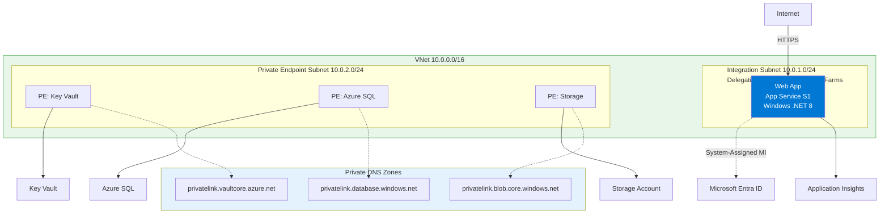
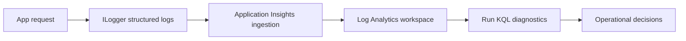

---
hide:
  - toc
content_sources:
  diagrams:
    - id: 04-logging-monitoring
      type: flowchart
      source: mslearn-adapted
      mslearn_url: https://learn.microsoft.com/en-us/azure/app-service/troubleshoot-diagnostic-logs
    - id: diagram-2
      type: flowchart
      source: mslearn-adapted
      mslearn_url: https://learn.microsoft.com/en-us/azure/app-service/troubleshoot-diagnostic-logs
---

# 04. Logging & Monitoring

Instrument ASP.NET Core 8 on Azure App Service with `ILogger` and Application Insights, then query operational signals using KQL.

!!! info "Infrastructure Context"
    **Service**: App Service (Windows, Standard S1) | **Network**: VNet integrated | **VNet**: ✅

    This tutorial assumes a production-ready App Service deployment with VNet integration, private endpoints for backend services, and managed identity for authentication.

<!-- diagram-id: 04-logging-monitoring -->


<!-- diagram-id: diagram-2 -->


## Prerequisites

- Tutorial [03. Configuration](./03-configuration.md) completed
- Application Insights resource connected to your web app
- Log Analytics workspace configured (recommended)

## What you'll learn

- Structured logging with `ILogger<T>`
- Application Insights SDK behavior in ASP.NET Core
- Request/dependency auto-collection and custom telemetry
- KQL queries for production diagnostics

## Main content

### 1) Confirm SDK registration

The reference app already includes telemetry wiring:

```csharp
builder.Services.AddApplicationInsightsTelemetry();
builder.Services.AddControllers();
```

| Command/Code | Purpose |
|--------------|---------|
| `builder.Services.AddApplicationInsightsTelemetry();` | Registers Application Insights telemetry collection for the ASP.NET Core app. |
| `builder.Services.AddControllers();` | Adds controller support to the dependency injection container. |

Package reference in project:

```xml
<PackageReference Include="Microsoft.ApplicationInsights.AspNetCore" Version="2.22.0" />
```

| Command/Code | Purpose |
|--------------|---------|
| `<PackageReference Include="Microsoft.ApplicationInsights.AspNetCore" Version="2.22.0" />` | Adds the ASP.NET Core Application Insights SDK package to the project. |

### 2) Add structured request logging

```csharp
[ApiController]
[Route("api/requests")]
public sealed class RequestLogController : ControllerBase
{
    private readonly ILogger<RequestLogController> _logger;
    public RequestLogController(ILogger<RequestLogController> logger) => _logger = logger;

    [HttpGet("sample")]
    public IActionResult Sample([FromQuery] string userId = "anonymous")
    {
        _logger.LogInformation("Sample request received for {UserId}", userId);
        return Ok(new { status = "ok", userId, timestamp = DateTime.UtcNow });
    }
}
```

| Command/Code | Purpose |
|--------------|---------|
| `[Route("api/requests")]` | Maps the controller under the `/api/requests` route prefix. |
| `private readonly ILogger<RequestLogController> _logger;` | Injects a typed logger for structured application logs. |
| `_logger.LogInformation("Sample request received for {UserId}", userId);` | Writes a structured informational log entry that includes the user ID. |
| `return Ok(new { status = "ok", userId, timestamp = DateTime.UtcNow });` | Returns a response that confirms the sample request was handled. |

### 3) Enable/verify App Service diagnostics logs

```bash
az webapp log config \
  --resource-group "$RESOURCE_GROUP_NAME" \
  --name "$WEB_APP_NAME" \
  --application-logging filesystem \
  --level information \
  --web-server-logging filesystem \
  --output json
```

| Command/Code | Purpose |
|--------------|---------|
| `az webapp log config --resource-group "$RESOURCE_GROUP_NAME" --name "$WEB_APP_NAME" --application-logging filesystem --level information --web-server-logging filesystem --output json` | Enables application and web server filesystem logging for the web app. |

Stream logs live:

```bash
az webapp log tail --resource-group "$RESOURCE_GROUP_NAME" --name "$WEB_APP_NAME"
```

| Command/Code | Purpose |
|--------------|---------|
| `az webapp log tail --resource-group "$RESOURCE_GROUP_NAME" --name "$WEB_APP_NAME"` | Streams live App Service logs to the terminal. |

### 4) Understand automatic collection

With Application Insights SDK in ASP.NET Core, these are collected automatically:

- Incoming HTTP requests
- Outgoing dependencies (`HttpClient`, SQL calls in supported providers)
- Exceptions (unhandled + tracked)
- Performance counters and basic host telemetry

!!! tip "When to add custom telemetry"
    Use `TelemetryClient` for business events or domain-specific metrics.
    Keep event cardinality low to avoid noisy, expensive telemetry.

!!! warning "Query location matters"
    Table names differ by where you run the query. See [KQL Queries Reference — Table Naming](../../reference/kql-queries.md#table-naming) for details.
    
    - **Application Insights → Logs**: `traces`, `requests`, `dependencies`
    - **Log Analytics Workspace → Logs**: `AppTraces`, `AppRequests`, `AppDependencies`

### 5) Add custom event and metric

```csharp
using Microsoft.ApplicationInsights;

public sealed class BusinessTelemetryService
{
    private readonly TelemetryClient _telemetryClient;
    public BusinessTelemetryService(TelemetryClient telemetryClient) => _telemetryClient = telemetryClient;

    public void TrackCheckout(string region, decimal amount)
    {
        _telemetryClient.TrackEvent("CheckoutCompleted", new() { ["region"] = region });
        _telemetryClient.TrackMetric("CheckoutAmount", (double)amount);
    }
}
```

| Command/Code | Purpose |
|--------------|---------|
| `using Microsoft.ApplicationInsights;` | Imports the `TelemetryClient` API used for custom telemetry. |
| `private readonly TelemetryClient _telemetryClient;` | Stores the Application Insights client for reuse in the service. |
| `_telemetryClient.TrackEvent("CheckoutCompleted", new() { ["region"] = region });` | Sends a custom business event with region metadata. |
| `_telemetryClient.TrackMetric("CheckoutAmount", (double)amount);` | Records a numeric metric for checkout amount. |

### 6) KQL for .NET app operations

Recent failed requests:

```kusto
requests
| where timestamp > ago(30m)
| where success == false
| project timestamp, name, resultCode, operation_Id, cloud_RoleName
| order by timestamp desc
```

Dependency latency hot spots:

```kusto
dependencies
| where timestamp > ago(1h)
| summarize p95=percentile(duration, 95ms), avg=avg(duration), count() by target, type
| order by p95 desc
```

Correlate exception with request operation:

```kusto
exceptions
| where timestamp > ago(1h)
| join kind=leftouter requests on operation_Id
| project timestamp, outerMessage, requestName=name, resultCode, operation_Id
| order by timestamp desc
```

### 7) Azure DevOps release quality gate example

```yaml
- task: AzureCLI@2
  displayName: Query recent failed requests
  inputs:
    azureSubscription: $(azureSubscription)
    scriptType: bash
    scriptLocation: inlineScript
    inlineScript: |
      az monitor app-insights query \
        --app $(appInsightsName) \
        --resource-group $(resourceGroupName) \
        --analytics-query "requests | where timestamp > ago(10m) | where success == false | count" \
        --output table
```

## Verification

```bash
curl --silent "https://$WEB_APP_NAME.azurewebsites.net/api/requests/sample?userId=ops-check"
```

| Command/Code | Purpose |
|--------------|---------|
| `curl --silent "https://$WEB_APP_NAME.azurewebsites.net/api/requests/sample?userId=ops-check"` | Triggers a request that should generate request telemetry and log entries. |

Then confirm:

1. Request appears in Application Insights `requests` table.
2. Log message appears in App Service log stream.
3. Operation correlation is present across request/dependency/exception telemetry.

## Troubleshooting

### No telemetry arriving

- Check `APPLICATIONINSIGHTS_CONNECTION_STRING` in App Settings
- Ensure outbound access to Azure Monitor endpoints is not blocked
- Restart app after changing telemetry connection settings

### Logs too noisy

Adjust log levels:

```bash
az webapp config appsettings set \
  --resource-group "$RESOURCE_GROUP_NAME" \
  --name "$WEB_APP_NAME" \
  --settings Logging__LogLevel__Default=Warning Logging__LogLevel__Microsoft.AspNetCore=Warning
```

| Command/Code | Purpose |
|--------------|---------|
| `az webapp config appsettings set --resource-group "$RESOURCE_GROUP_NAME" --name "$WEB_APP_NAME" --settings Logging__LogLevel__Default=Warning Logging__LogLevel__Microsoft.AspNetCore=Warning` | Raises log level thresholds to reduce noisy application logging. |

### Missing dependency telemetry

Confirm you are using instrumented libraries and avoid suppressing `DiagnosticSource` activity in custom middleware.

## See Also

- [05. Infrastructure as Code](./05-infrastructure-as-code.md)
- [Reference: KQL Queries](../../reference/kql-queries.md)
- For platform details, see [Azure App Service Guide](https://yeongseon.github.io/azure-app-service-practical-guide/)

## Sources

- [Enable diagnostics logging for apps in Azure App Service](https://learn.microsoft.com/en-us/azure/app-service/troubleshoot-diagnostic-logs)
- [Monitor Azure App Service](https://learn.microsoft.com/en-us/azure/app-service/monitor-app-service)
