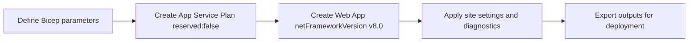

# 05. Infrastructure as Code

Use Bicep to provision reproducible Windows App Service infrastructure for ASP.NET Core 8, including diagnostics and deployment-ready outputs.



## Prerequisites

- Tutorial [04. Logging & Monitoring](./04-logging-monitoring.md) completed
- Basic understanding of Azure Resource Manager and Bicep modules

## What you'll learn

- How the guide's Bicep template models Windows App Service
- Why `reserved: false` is required for Windows plans
- How runtime metadata (`netFrameworkVersion`, `CURRENT_STACK`) is set
- How outputs support manual deploy and Azure DevOps stages

## Main content

### 1) Core deployment command

```bash
az deployment group create \
  --resource-group "$RESOURCE_GROUP_NAME" \
  --template-file "infra/main.bicep" \
  --parameters baseName="$BASE_NAME" location="$LOCATION" appServicePlanSku="B1" \
  --output table
```

### 2) Windows App Service plan essentials

In Bicep, Windows App Service must **not** be marked as Linux reserved.

```bicep
resource appServicePlan 'Microsoft.Web/serverfarms@2023-01-01' = {
  name: appServicePlanName
  location: location
  sku: {
    name: appServicePlanSku
    tier: 'Basic'
  }
  kind: 'app'
  properties: {
    reserved: false
  }
}
```

### 3) Web app runtime settings for .NET 8

```bicep
resource webApp 'Microsoft.Web/sites@2023-01-01' = {
  name: webAppName
  location: location
  kind: 'app'
  properties: {
    serverFarmId: appServicePlan.id
    siteConfig: {
      netFrameworkVersion: 'v8.0'
      metadata: [
        {
          name: 'CURRENT_STACK'
          value: 'dotnet'
        }
      ]
    }
  }
}
```

These fields keep the portal/runtime aligned with the intended stack for Windows-hosted .NET apps.

### 4) App settings defined as code

```bicep
resource appSettings 'Microsoft.Web/sites/config@2023-01-01' = {
  name: '${webApp.name}/appsettings'
  properties: {
    ASPNETCORE_ENVIRONMENT: 'Production'
    WEBSITE_RUN_FROM_PACKAGE: '1'
    APPLICATIONINSIGHTS_CONNECTION_STRING: appInsights.properties.ConnectionString
  }
}
```

### 5) Outputs for downstream automation

```bicep
output webAppName string = webApp.name
output webAppUrl string = 'https://${webApp.properties.defaultHostName}'
output appInsightsName string = appInsights.name
```

Outputs are consumed by deployment scripts and pipeline variable mapping.

### 6) Tie IaC choices to application code

```csharp
var port = Environment.GetEnvironmentVariable("HTTP_PLATFORM_PORT")
    ?? Environment.GetEnvironmentVariable("PORT")
    ?? "5000";

builder.WebHost.UseUrls($"http://+:{port}");
builder.Services.AddApplicationInsightsTelemetry();
```

Infrastructure and code should agree on runtime assumptions: port injection, telemetry connection string, and production environment.

### 7) Azure DevOps IaC stage example

```yaml
- stage: Infra
  displayName: Provision Infrastructure
  jobs:
    - job: DeployBicep
      steps:
        - task: AzureCLI@2
          inputs:
            azureSubscription: $(azureSubscription)
            scriptType: bash
            scriptLocation: inlineScript
            inlineScript: |
              az deployment group create \
                --resource-group $(resourceGroupName) \
                --template-file infra/main.bicep \
                --parameters baseName=$(baseName) location=$(location) \
                --output table
```

!!! note "Separate infra and app deploy in production"
    Keep infrastructure deployment idempotent and infrequent.
    Deploy app code frequently against stable infrastructure.

## Verification

```bash
az webapp show --resource-group "$RESOURCE_GROUP_NAME" --name "$WEB_APP_NAME" --output json
```

Check:

- App Service Plan kind is `app` (Windows)
- `reserved` is `false`
- Site runtime metadata reflects .NET stack
- App Insights connection string exists in App Settings

## Troubleshooting

### Runtime mismatch in portal

Confirm `siteConfig.netFrameworkVersion` and metadata were applied in the deployed template.

### Bicep deployment drift

Run a what-if before applying changes:

```bash
az deployment group what-if \
  --resource-group "$RESOURCE_GROUP_NAME" \
  --template-file "infra/main.bicep" \
  --parameters baseName="$BASE_NAME" location="$LOCATION"
```

### Hidden dependency ordering issue

Split resources into modules and expose explicit outputs/inputs to avoid implicit timing assumptions.

## See Also

- [06. CI/CD](./06-ci-cd.md)
- [02. First Deploy](./02-first-deploy.md)
- For platform details, see [Azure App Service Guide](https://yeongseon.github.io/azure-app-service-practical-guide/)

## Sources

- [Deploy Bicep files by using Azure CLI](https://learn.microsoft.com/en-us/azure/azure-resource-manager/bicep/deploy-cli)
- [Microsoft.Web/sites Bicep resource](https://learn.microsoft.com/en-us/azure/templates/microsoft.web/sites)
