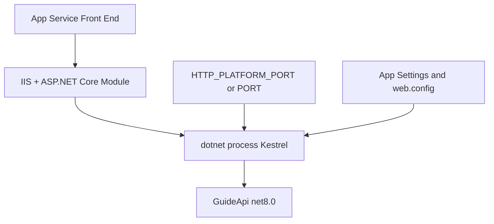

---
content_sources:
  diagrams:
    - id: net-runtime-on-windows-app-service-net-8
      type: flowchart
      source: mslearn-adapted
      mslearn_url: https://learn.microsoft.com/en-us/azure/app-service/
---

# .NET Runtime on Windows App Service (.NET 8)

Runtime alignment is critical for startup reliability. This reference summarizes .NET 8 runtime settings, environment variables, `web.config` behavior, and startup conventions for this guide.

<!-- diagram-id: net-runtime-on-windows-app-service-net-8 -->


!!! tip "Common Guide Reference"
    For platform-level runtime behavior, see [Reference](https://yeongseon.github.io/azure-app-service-practical-guide/reference/) in the Azure App Service Guide.

## Runtime baseline in this repository

- Project SDK: `Microsoft.NET.Sdk.Web`
- Target framework: `net8.0`
- Core package: `Microsoft.ApplicationInsights.AspNetCore`
- Hosting path: Windows App Service with IIS + handler + Kestrel

`GuideApi.csproj` excerpt:

```xml
<Project Sdk="Microsoft.NET.Sdk.Web">
  <PropertyGroup>
    <TargetFramework>net8.0</TargetFramework>
    <Nullable>enable</Nullable>
    <ImplicitUsings>enable</ImplicitUsings>
  </PropertyGroup>
</Project>
```

| Command/Code | Purpose |
|--------------|---------|
| `<Project Sdk="Microsoft.NET.Sdk.Web">` | Declares the project as an ASP.NET Core web application. |
| `<TargetFramework>net8.0</TargetFramework>` | Targets the .NET 8 runtime for build and deployment. |
| `<Nullable>enable</Nullable>` | Enables nullable reference type analysis in the project. |
| `<ImplicitUsings>enable</ImplicitUsings>` | Automatically includes common .NET namespaces. |

## Port and startup binding contract

Windows App Service commonly provides `HTTP_PLATFORM_PORT` to child process hosts.

`Program.cs` excerpt:

```csharp
var port = Environment.GetEnvironmentVariable("HTTP_PLATFORM_PORT")
    ?? Environment.GetEnvironmentVariable("PORT")
    ?? "5000";

builder.WebHost.UseUrls($"http://+:{port}");
```

| Command/Code | Purpose |
|--------------|---------|
| `Environment.GetEnvironmentVariable("HTTP_PLATFORM_PORT")` | Reads the port assigned by Windows App Service hosting. |
| `Environment.GetEnvironmentVariable("PORT")` | Falls back to another common hosting port variable. |
| `?? "5000"` | Uses `5000` as the local default when no hosting variable is present. |
| `builder.WebHost.UseUrls($"http://+:{port}")` | Binds the app to the resolved port for Kestrel startup. |

This pattern is safe for both App Service Windows and local fallback.

## `ASPNETCORE_ENVIRONMENT` guidance

- Production slot: `ASPNETCORE_ENVIRONMENT=Production`
- Staging slot: `ASPNETCORE_ENVIRONMENT=Staging` (slot-sticky)
- Avoid `Development` in any internet-facing environment.

Set via CLI:

```bash
az webapp config appsettings set --resource-group $RESOURCE_GROUP_NAME --name $WEB_APP_NAME --settings ASPNETCORE_ENVIRONMENT=Production --output json
```

| Command/Code | Purpose |
|--------------|---------|
| `az webapp config appsettings set --resource-group $RESOURCE_GROUP_NAME --name $WEB_APP_NAME --settings ASPNETCORE_ENVIRONMENT=Production --output json` | Sets the production ASP.NET Core environment in App Service settings. |

## `web.config` on Windows App Service

For code deployment, `dotnet publish` may provide a `web.config` (generated or explicit) controlling process startup.

Typical concerns:

- `processPath` should be `dotnet`.
- `arguments` should reference the correct application DLL.
- Handler/module configuration must match expected runtime model.

Startup failures often come from mismatched `arguments` or missing published DLL.

## Kestrel runtime settings

Kestrel stays your HTTP server runtime even behind IIS reverse proxy. Common tune points:

- Request limits (`MaxRequestBodySize`) when needed.
- Keep-alive and header timeouts for abuse resilience.
- HTTPS redirection policies (while TLS terminates upstream).

```csharp
builder.WebHost.ConfigureKestrel(options =>
{
    options.AddServerHeader = false;
});
```

| Command/Code | Purpose |
|--------------|---------|
| `builder.WebHost.ConfigureKestrel(options => { ... })` | Customizes Kestrel server behavior during startup. |
| `options.AddServerHeader = false;` | Removes the default server header from HTTP responses. |

## Startup command notes

For standard .NET code deployments, App Service starts from site configuration and artifact metadata; custom startup commands are less common than container scenarios.

If custom startup is used, validate it does not conflict with handler/module startup path.

## Runtime verification commands

```bash
az webapp config show --resource-group $RESOURCE_GROUP_NAME --name $WEB_APP_NAME --output json
az webapp list-runtimes --os windows --output table
az webapp show --resource-group $RESOURCE_GROUP_NAME --name $WEB_APP_NAME --output json
```

| Command/Code | Purpose |
|--------------|---------|
| `az webapp config show --resource-group $RESOURCE_GROUP_NAME --name $WEB_APP_NAME --output json` | Shows the effective runtime configuration for the web app. |
| `az webapp list-runtimes --os windows --output table` | Lists the Windows runtimes supported by App Service. |
| `az webapp show --resource-group $RESOURCE_GROUP_NAME --name $WEB_APP_NAME --output json` | Retrieves the web app resource metadata for inspection. |

## Production runtime checklist

- Target framework and platform runtime align.
- `HTTP_PLATFORM_PORT` binding logic present.
- `ASPNETCORE_ENVIRONMENT` explicitly set per slot.
- Health endpoint configured and responsive.
- Startup logs clean after restart and slot swap.

## Common runtime failure signatures

| Signature | Interpretation | Action |
|---|---|---|
| `HTTP Error 500.30` | App failed during startup | Check runtime, config, startup exceptions |
| Missing framework version | Runtime mismatch | Update stack or retarget build |
| Port binding failure | Wrong URL binding assumptions | Ensure `HTTP_PLATFORM_PORT` flow used |

## See Also

- [01. Local Run](./tutorial/01-local-run.md)
- [02. First Deploy](./tutorial/02-first-deploy.md)
- [Troubleshooting](../../reference/troubleshooting.md)
- [CLI Cheatsheet](../../reference/cli-cheatsheet.md)
- [Concepts: How App Service Works](../../platform/how-app-service-works.md)
