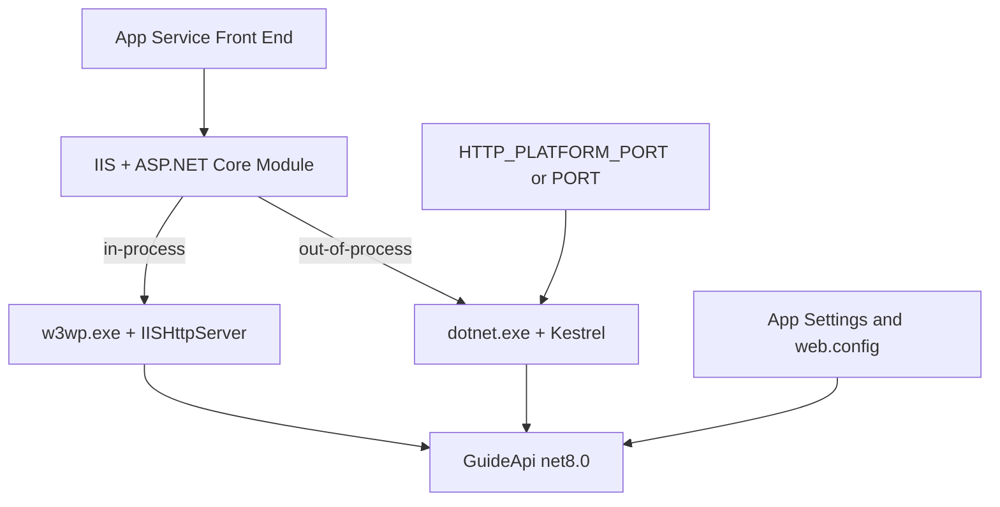

---
content_sources:
  diagrams:
  - id: net-runtime-on-windows-app-service-net-8
    type: flowchart
    source: mslearn-adapted
    mslearn_url: https://learn.microsoft.com/en-us/azure/app-service/
---
# .NET Runtime on Windows App Service (.NET 8)

Runtime alignment is critical for startup reliability. This reference summarizes .NET 8 runtime settings, environment variables, `web.config` behavior, and startup conventions for this guide.

<!-- diagram-id: net-runtime-on-windows-app-service-net-8 -->

```mermaid
graph TD
    A[App Service Front End] --> B[IIS + ASP.NET Core Module]
    B -->|in-process| C1[w3wp.exe + IISHttpServer]
    B -->|out-of-process| C2[dotnet.exe + Kestrel]
    C1 --> D[GuideApi net8.0]
    C2 --> D
    E[HTTP_PLATFORM_PORT or PORT] --> C2
    F[App Settings and web.config] --> D
```

!!! tip "Common Guide Reference"
    For platform-level runtime behavior, see [Reference](https://yeongseon.github.io/azure-app-service-practical-guide/reference/) in the Azure App Service Guide.

## Runtime baseline in this repository

- Project SDK: `Microsoft.NET.Sdk.Web`
- Target framework: `net8.0`
- Core package: `Microsoft.ApplicationInsights.AspNetCore`
- Hosting path: Windows App Service with IIS + ASP.NET Core Module (in-process via `IISHttpServer` inside `w3wp.exe`, or out-of-process via Kestrel in a separate `dotnet.exe`; see [Hosting Model](#hosting-model-in-process-vs-out-of-process))

`GuideApi.csproj` excerpt:

```xml
<Project Sdk="Microsoft.NET.Sdk.Web">
  <PropertyGroup>
    <TargetFramework>net8.0</TargetFramework>
    <Nullable>enable</Nullable>
    <ImplicitUsings>enable</ImplicitUsings>
  </PropertyGroup>
</Project>
```

| Command/Code | Purpose |
|--------------|---------|
| `<Project Sdk="Microsoft.NET.Sdk.Web">` | Declares the project as an ASP.NET Core web application. |
| `<TargetFramework>net8.0</TargetFramework>` | Targets the .NET 8 runtime for build and deployment. |
| `<Nullable>enable</Nullable>` | Enables nullable reference type analysis in the project. |
| `<ImplicitUsings>enable</ImplicitUsings>` | Automatically includes common .NET namespaces. |

## Port and startup binding contract

Windows App Service commonly provides `HTTP_PLATFORM_PORT` to child process hosts.

`Program.cs` excerpt:

```csharp
var port = Environment.GetEnvironmentVariable("HTTP_PLATFORM_PORT")
    ?? Environment.GetEnvironmentVariable("PORT")
    ?? "5000";

builder.WebHost.UseUrls($"http://+:{port}");
```

| Command/Code | Purpose |
|--------------|---------|
| `Environment.GetEnvironmentVariable("HTTP_PLATFORM_PORT")` | Reads the port assigned by Windows App Service hosting. |
| `Environment.GetEnvironmentVariable("PORT")` | Falls back to another common hosting port variable. |
| `?? "5000"` | Uses `5000` as the local default when no hosting variable is present. |
| `builder.WebHost.UseUrls($"http://+:{port}")` | Binds the app to the resolved port (used by Kestrel in out-of-process hosting; ignored in in-process where IIS controls binding). |

This pattern is safe for both App Service Windows and local fallback.

## `ASPNETCORE_ENVIRONMENT` guidance

- Production slot: `ASPNETCORE_ENVIRONMENT=Production`
- Staging slot: `ASPNETCORE_ENVIRONMENT=Staging` (slot-sticky)
- Avoid `Development` in any internet-facing environment.

Set via CLI:

```bash
az webapp config appsettings set --resource-group $RESOURCE_GROUP_NAME --name $WEB_APP_NAME --settings ASPNETCORE_ENVIRONMENT=Production --output json
```

| Command/Code | Purpose |
|--------------|---------|
| `az webapp config appsettings set --resource-group $RESOURCE_GROUP_NAME --name $WEB_APP_NAME --settings ASPNETCORE_ENVIRONMENT=Production --output json` | Sets the production ASP.NET Core environment in App Service settings. |

## `web.config` on Windows App Service

For code deployment, `dotnet publish` may provide a `web.config` (generated or explicit) controlling process startup.

Typical concerns:

- `processPath` should be `dotnet`.
- `arguments` should reference the correct application DLL.
- Handler/module configuration must match expected runtime model.

Startup failures often come from mismatched `arguments` or missing published DLL.

## Hosting Model: In-Process vs Out-of-Process

On Windows App Service, the ASP.NET Core Module (ANCM) can host your app in one of two models. The choice affects request latency, process topology, and which HTTP server is in front of your code.

**In-process (default since .NET Core 3.0)**

The ASP.NET Core Module loads the .NET runtime and your app directly inside the IIS worker process (`w3wp.exe`). HTTP requests are handed off to your app via `IISHttpServer` — Kestrel is not used in this mode. There is one process and one HTTP listener (HTTP.sys via IIS).

- Lower request latency — no inter-process hop between IIS and a separate .NET process.
- Higher per-worker throughput.
- `dotnet.exe` is not spawned; the app runs inside `w3wp.exe`.

**Out-of-process**

The ASP.NET Core Module spawns a separate `dotnet.exe` process that runs Kestrel, then reverse-proxies requests from IIS to Kestrel over `localhost`.

- Useful when you specifically need Kestrel features that cannot run inside `w3wp.exe`.
- Required for some scenarios that depend on a separate Kestrel process being addressable.
- Adds one IIS-to-Kestrel reverse-proxy hop per request.

**Set the model via `web.config`**

The hosting model is selected by the `hostingModel` attribute on the `<aspNetCore>` element. Setting it explicitly avoids relying on SDK defaults:

```xml
<configuration>
  <system.webServer>
    <handlers>
      <add name="aspNetCore" path="*" verb="*" modules="AspNetCoreModuleV2" resourceType="Unspecified" />
    </handlers>
    <aspNetCore processPath="dotnet"
                arguments=".\GuideApi.dll"
                stdoutLogEnabled="false"
                stdoutLogFile=".\logs\stdout"
                hostingModel="inprocess" />
  </system.webServer>
</configuration>
```

Valid `hostingModel` values: `inprocess` or `outofprocess`.

You can also pin the hosting model in the project file so `dotnet publish` emits the right `web.config`:

```xml
<PropertyGroup>
  <AspNetCoreHostingModel>InProcess</AspNetCoreHostingModel>
</PropertyGroup>
```

| Model | HTTP server in front of your app | Process | When to choose |
|---|---|---|---|
| In-process | `IISHttpServer` (inside `w3wp.exe`) | runs inside `w3wp.exe` | default — use unless you have a specific reason not to |
| Out-of-process | Kestrel (in a separate `dotnet.exe`) | separate `dotnet.exe`, IIS reverse-proxies | required for custom Kestrel scenarios or legacy diagnostics |

!!! warning "In-process startup failures and `HTTP Error 500.30`"
    In-process startup failures surface as `HTTP Error 500.30 - ANCM In-Process Start Failure`. The error indicates the ASP.NET Core Module failed to load your app inside `w3wp.exe`. Capture stdout logs (set `stdoutLogEnabled="true"` in `web.config`) to see the actual startup exception. Out-of-process startup failures usually surface as `HTTP Error 502.5` with the underlying error in the spawned process's stdout.

## Kestrel runtime settings

Kestrel is your HTTP server runtime in **out-of-process** hosting (where IIS reverse-proxies to a separate `dotnet.exe` running Kestrel). In **in-process** hosting, the HTTP server is `IISHttpServer` instead of Kestrel — `ConfigureKestrel(...)` calls have no effect in that mode. Use `ConfigureIISServerOptions(...)` to tune the in-process server instead.

Common Kestrel tune points (out-of-process only):

- Request limits (`MaxRequestBodySize`) when needed.
- Keep-alive and header timeouts for abuse resilience.
- HTTPS redirection policies (while TLS terminates upstream).

```csharp
builder.WebHost.ConfigureKestrel(options =>
{
    options.AddServerHeader = false;
});
```

| Command/Code | Purpose |
|--------------|---------|
| `builder.WebHost.ConfigureKestrel(options => { ... })` | Customizes Kestrel server behavior during startup. |
| `options.AddServerHeader = false;` | Removes the default server header from HTTP responses. |

## Startup command notes

For standard .NET code deployments, App Service starts from site configuration and artifact metadata; custom startup commands are less common than container scenarios.

If custom startup is used, validate it does not conflict with handler/module startup path.

## Runtime verification commands

```bash
az webapp config show --resource-group $RESOURCE_GROUP_NAME --name $WEB_APP_NAME --output json
az webapp list-runtimes --os windows --output table
az webapp show --resource-group $RESOURCE_GROUP_NAME --name $WEB_APP_NAME --output json
```

| Command/Code | Purpose |
|--------------|---------|
| `az webapp config show --resource-group $RESOURCE_GROUP_NAME --name $WEB_APP_NAME --output json` | Shows the effective runtime configuration for the web app. |
| `az webapp list-runtimes --os windows --output table` | Lists the Windows runtimes supported by App Service. |
| `az webapp show --resource-group $RESOURCE_GROUP_NAME --name $WEB_APP_NAME --output json` | Retrieves the web app resource metadata for inspection. |

## Production runtime checklist

- Target framework and platform runtime align.
- `HTTP_PLATFORM_PORT` binding logic present.
- `ASPNETCORE_ENVIRONMENT` explicitly set per slot.
- Health endpoint configured and responsive.
- Startup logs clean after restart and slot swap.

## Common runtime failure signatures

| Signature | Interpretation | Action |
|---|---|---|
| `HTTP Error 500.30` | App failed during startup | Check runtime, config, startup exceptions |
| Missing framework version | Runtime mismatch | Update stack or retarget build |
| Port binding failure | Wrong URL binding assumptions | Ensure `HTTP_PLATFORM_PORT` flow used |

## .NET on Linux App Service: Key Differences

This document focuses on Windows App Service, where IIS hosts ASP.NET Core apps via the ASP.NET Core Module — the HTTP server depends on the chosen hosting model (`IISHttpServer` in-process inside `w3wp.exe`, or Kestrel in a separate `dotnet.exe` for out-of-process). .NET also runs on Linux App Service, but the hosting model is different: there is no IIS, no ASP.NET Core Module, and `web.config` is not consulted. Use this section to understand the differences if you deploy to Linux.

| Concern | Windows App Service | Linux App Service |
|---|---|---|
| Process model | IIS via the ASP.NET Core Module (`AspNetCoreModuleV2`); HTTP server depends on hosting model (`IISHttpServer` in-process, Kestrel out-of-process) | Kestrel runs directly as the entrypoint process inside the container |
| Reverse proxy | In-process: IIS (`w3wp.exe`) hosts the app directly via `IISHttpServer` (no proxy hop). Out-of-process: IIS reverse-proxies to Kestrel running in a separate `dotnet.exe` | platform front end forwards to Kestrel; no IIS layer |
| Port variable | `HTTP_PLATFORM_PORT` (preferred), with `PORT` as fallback | `PORT` (typically `8080`) |
| Startup config | `web.config` with `<aspNetCore>` element | startup command on the App Service app; `web.config` is ignored |
| Hosting models | in-process or out-of-process (see [Hosting Model](#hosting-model-in-process-vs-out-of-process)) | not applicable — Kestrel is the only process |

Linux runtime stack identifier:

```bash
az webapp config set \
  --resource-group $RESOURCE_GROUP_NAME \
  --name $WEB_APP_NAME \
  --linux-fx-version "DOTNETCORE|8.0" \
  --output json
```

Linux port binding pattern (no `HTTP_PLATFORM_PORT` involvement):

```csharp
var port = Environment.GetEnvironmentVariable("PORT") ?? "8080";
builder.WebHost.UseUrls($"http://+:{port}");
```

The `HTTP_PLATFORM_PORT` fallback shown in [Port and startup binding contract](#port-and-startup-binding-contract) is harmless on Linux — `HTTP_PLATFORM_PORT` is simply not set, so the lookup falls through to `PORT`. The same `Program.cs` snippet works on both Windows and Linux.

!!! info "HTTP Error 500.30 is Windows-only"
    Startup errors on Linux do not surface as `HTTP Error 500.30` because there is no ASP.NET Core Module to emit that error page. On Linux, startup failures show up as container restart loops in `az webapp log tail` and Application Insights — look for stack traces in stdout instead.

## Run It in the Portal

#### Portal view: Environment variables blade (where `ASPNETCORE_ENVIRONMENT` is managed)

![Azure Portal Environment variables blade for app-test-20251107 Web App with the App settings tab selected (Connection strings tab adjacent). The toolbar shows a search box plus the actions plus Add, Refresh, Show values, Advanced edit, and Pull reference values. The settings table has columns Name, Value, Deployment slot setting, Source, and Delete and lists five App Service-sourced rows: APPLICATIONINSIGHTS_CONNECTION_STRING, APPLICATIONINSIGHTSAGENT_EXTENSION_ENABLED, ApplicationInsightsAgent_EXTENSION_VERSION, SCM_DO_BUILD_DURING_DEPLOYMENT, and WEBSITE_HTTPLOGGING_RETENTION_DAYS, each with a Show value link and Source App Service. The left navigation expands Settings with Environment variables highlighted, alongside Configuration, Instances, Authentication, Identity, Backups, Custom domains, Certificates, Networking, and WebJobs; Apply and Discard buttons are disabled at the bottom.](../../assets/operations/deployment/zip-deploy/01-app-settings-run-from-package.png)

The `Environment variables` blade with the `App settings` tab selected is the Portal surface where App Service app settings are managed. In this screenshot, the visible table columns are `Name`, `Value`, `Deployment slot setting`, `Source`, and `Delete`, and the toolbar exposes `Add`, `Refresh`, `Show values`, `Advanced edit`, and `Pull reference values`. Use the highlighted `Environment variables` entry in the left navigation to reach this blade when reviewing runtime configuration for the ASP.NET Core app.

## See Also

- [01. Local Run](./tutorial/01-local-run.md)
- [02. First Deploy](./tutorial/02-first-deploy.md)
- [Troubleshooting](../../reference/troubleshooting.md)
- [CLI Cheatsheet](../../reference/cli-cheatsheet.md)
- [Concepts: How App Service Works](../../platform/architecture/index.md)

## Sources

- [Microsoft Learn source 1](https://learn.microsoft.com/en-us/azure/app-service/)
