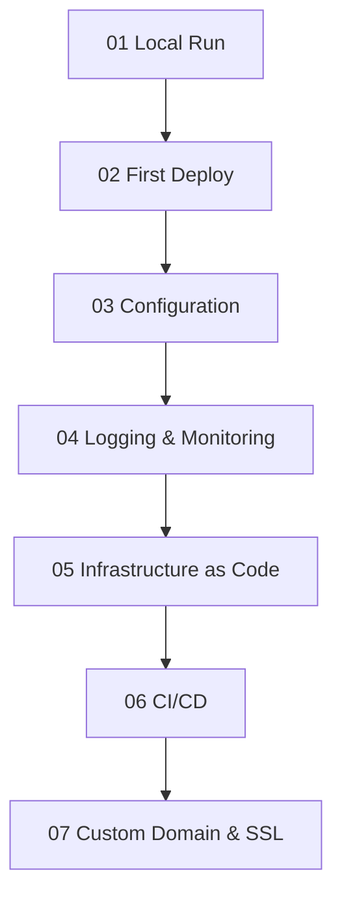

---
content_sources:
  diagrams:
    - id: main-content
      type: flowchart
      source: mslearn-adapted
      mslearn_url: https://learn.microsoft.com/en-us/azure/app-service/
---

# .NET Guide

This guide covers the end-to-end path for running ASP.NET Core applications on Azure App Service.

## Main Content

<!-- diagram-id: main-content -->

1. [01 - Local Run](./tutorial/01-local-run.md)
2. [02 - First Deploy](./tutorial/02-first-deploy.md)
3. [03 - Configuration](./tutorial/03-configuration.md)
4. [04 - Logging and Monitoring](./tutorial/04-logging-monitoring.md)
5. [05 - Infrastructure as Code](./tutorial/05-infrastructure-as-code.md)
6. [06 - CI/CD](./tutorial/06-ci-cd.md)
7. [07 - Custom Domain and SSL](./tutorial/07-custom-domain-ssl.md)

## Advanced Topics

Use .NET recipes to apply identity, data, networking, and deployment patterns.

- [.NET Recipes](./recipes/index.md)

## See Also

- [Language Guides](../index.md)
- [Platform](../../platform/index.md)
- [Operations](../../operations/index.md)
- [Reference](../../reference/index.md)

## Sources

- [Quickstart: Deploy an ASP.NET Core app](https://learn.microsoft.com/azure/app-service/quickstart-dotnetcore)
