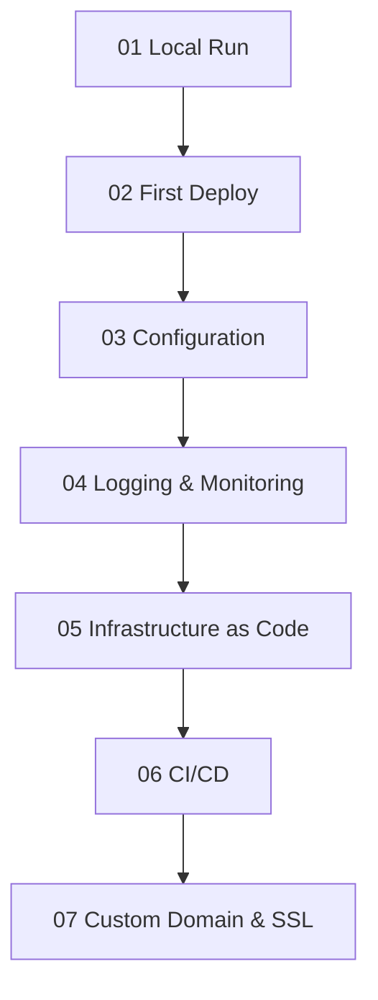

---
content_sources:
  diagrams:
  - id: main-content
    type: flowchart
    source: mslearn-adapted
    mslearn_url: https://learn.microsoft.com/en-us/azure/app-service/
---
# .NET Guide

This guide covers the end-to-end path for running ASP.NET Core applications on Azure App Service.

## Main Content

<!-- diagram-id: main-content -->

```mermaid
flowchart TD
    A[01 Local Run] --> B[02 First Deploy]
    B --> C[03 Configuration]
    C --> D[04 Logging & Monitoring]
    D --> E[05 Infrastructure as Code]
    E --> F[06 CI/CD]
    F --> G[07 Custom Domain & SSL]
```

1. [01 - Local Run](./tutorial/01-local-run.md)
2. [02 - First Deploy](./tutorial/02-first-deploy.md)
3. [03 - Configuration](./tutorial/03-configuration.md)
4. [04 - Logging and Monitoring](./tutorial/04-logging-monitoring.md)
5. [05 - Infrastructure as Code](./tutorial/05-infrastructure-as-code.md)
6. [06 - CI/CD](./tutorial/06-ci-cd.md)
7. [07 - Custom Domain and SSL](./tutorial/07-custom-domain-ssl.md)

## Advanced Topics

Use .NET recipes to apply identity, data, networking, and deployment patterns.

- [.NET Recipes](./recipes/index.md)

## Run It in the Portal

#### Portal view: App Service Plan overview (hosting tier for the .NET guide)

The `App Service Plan` overview blade is the Portal view of the hosting tier this .NET guide deploys onto. This particular screenshot was captured from a Python deployment, so the visible `App Service Plan kind: Linux` and `Operating system: Linux` reflect that deployment; for the ASP.NET Core 8 path in this guide the equivalent values read `Windows` because the .NET tutorial uses `--runtime "DOTNETCORE:8.0"` on a Windows App Service plan. The remaining plan-level fields — `Pricing tier: Premium0 V3`, `Status: Ready`, the instance count, and the right-side `CPU Percentage` / `Memory Percentage` charts — are the same surfaces you use to verify plan health regardless of OS, along with the hosted-apps list showing `app-test-20251107` and its staging slot attached to the same plan.

## See Also

- [Language Guides](../index.md)
- [Platform](../../platform/index.md)
- [Operations](../../operations/index.md)
- [Reference](../../reference/index.md)

## Sources

- [Quickstart: Deploy an ASP.NET Core app](https://learn.microsoft.com/en-us/azure/app-service/quickstart-dotnetcore)
