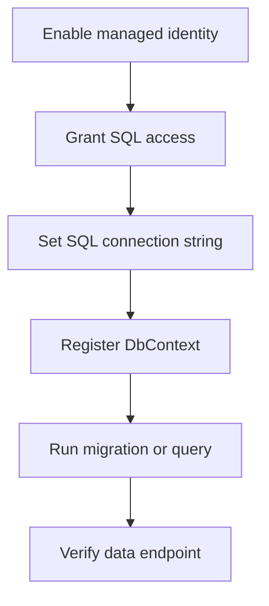

---
content_sources:
  diagrams:
    - id: azure-sql
      type: flowchart
      source: mslearn-adapted
      mslearn_url: https://learn.microsoft.com/en-us/azure/azure-sql/database/connect-query-python
---

# Azure SQL

Connect ASP.NET Core 8 to Azure SQL using Entity Framework Core and managed identity authentication for passwordless production access.

<!-- diagram-id: azure-sql -->


## Prerequisites

- Existing Azure SQL Server and Database
- App Service system-assigned managed identity enabled
- `Microsoft.EntityFrameworkCore.SqlServer` package available

## Main content

### 1) Add NuGet packages

```xml
<ItemGroup>
  <PackageReference Include="Microsoft.EntityFrameworkCore" Version="8.0.4" />
  <PackageReference Include="Microsoft.EntityFrameworkCore.SqlServer" Version="8.0.4" />
  <PackageReference Include="Azure.Identity" Version="1.12.0" />
</ItemGroup>
```

### 2) Configure connection string pattern

Use an App Setting or Connection String with managed identity authentication:

```text
Server=tcp:<sql-server>.database.windows.net,1433;Database=<database-name>;Authentication=Active Directory Managed Identity;Encrypt=True;TrustServerCertificate=False;
```

Set it in App Service:

```bash
az webapp config connection-string set \
  --resource-group "$RESOURCE_GROUP_NAME" \
  --name "$WEB_APP_NAME" \
  --connection-string-type SQLAzure \
  --settings MainDb="Server=tcp:<sql-server>.database.windows.net,1433;Database=<database-name>;Authentication=Active Directory Managed Identity;Encrypt=True;TrustServerCertificate=False;" \
  --output json
```

### 3) Register DbContext

```csharp
using Microsoft.EntityFrameworkCore;

builder.Services.AddDbContext<AppDbContext>((serviceProvider, options) =>
{
    var configuration = serviceProvider.GetRequiredService<IConfiguration>();
    var conn = configuration["SQLAZURECONNSTR_MainDb"]
        ?? throw new InvalidOperationException("MainDb connection string not configured.");

    options.UseSqlServer(conn, sql =>
    {
        sql.EnableRetryOnFailure(maxRetryCount: 5, maxRetryDelay: TimeSpan.FromSeconds(10), errorNumbersToAdd: null);
    });
});
```

### 4) Sample entity and controller

```csharp
public sealed class TodoItem
{
    public int Id { get; set; }
    public string Title { get; set; } = string.Empty;
    public bool Completed { get; set; }
}

public sealed class AppDbContext : DbContext
{
    public AppDbContext(DbContextOptions<AppDbContext> options) : base(options) { }
    public DbSet<TodoItem> TodoItems => Set<TodoItem>();
}
```

```csharp
[ApiController]
[Route("api/todos")]
public sealed class TodoController : ControllerBase
{
    private readonly AppDbContext _db;
    public TodoController(AppDbContext db) => _db = db;

    [HttpGet]
    public async Task<IActionResult> GetAll(CancellationToken cancellationToken)
        => Ok(await _db.TodoItems.AsNoTracking().ToListAsync(cancellationToken));
}
```

### 5) Grant database access to managed identity

Create user mapped to the web app identity inside Azure SQL (run as Entra admin):

```sql
CREATE USER [<web-app-name>] FROM EXTERNAL PROVIDER;
ALTER ROLE db_datareader ADD MEMBER [<web-app-name>];
ALTER ROLE db_datawriter ADD MEMBER [<web-app-name>];
```

### 6) Optional token-based SqlConnection pattern

```csharp
using Azure.Core;
using Azure.Identity;
using Microsoft.Data.SqlClient;

var credential = new DefaultAzureCredential();
var token = credential.GetToken(new TokenRequestContext(new[] { "https://database.windows.net/.default" }));
var connection = new SqlConnection("Server=tcp:<sql-server>.database.windows.net,1433;Database=<database-name>;Encrypt=True;")
{
    AccessToken = token.Token
};
await connection.OpenAsync();
```

### 7) Azure DevOps migration step example

```yaml
- task: DotNetCoreCLI@2
  displayName: Run EF Core migrations
  inputs:
    command: custom
    custom: ef
    arguments: database update --project app/GuideApi --configuration Release
```

!!! warning "Avoid SQL username/password in production"
    Prefer managed identity and Entra-based database users.
    If temporary SQL credentials are unavoidable, store them in Key Vault and rotate aggressively.

## Verification

```bash
curl --silent "https://$WEB_APP_NAME.azurewebsites.net/api/todos"
```

Also query SQL audit logs or App Insights dependencies to confirm successful SQL calls.

## Troubleshooting

### Login failed for token-identified principal

- Ensure system-assigned identity is enabled on App Service.
- Ensure SQL server has Entra admin configured.
- Ensure SQL user created from external provider matches identity principal.

### Transient connectivity errors

Enable EF Core retries and verify firewall/private endpoint rules.

### Slow queries

Capture query plans and add indexes; review `dependencies` telemetry for high-duration SQL operations.

## See Also

- [Managed Identity](managed-identity.md)
- [Key Vault References](key-vault-reference.md)
- For platform details, see [Azure App Service Guide](https://yeongseon.github.io/azure-app-service-practical-guide/)
