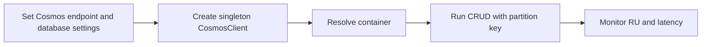

---
content_sources:
  diagrams:
    - id: cosmos-db
      type: flowchart
      source: mslearn-adapted
      mslearn_url: https://learn.microsoft.com/en-us/azure/cosmos-db/nosql/quickstart-python
---

# Cosmos DB

Integrate Azure Cosmos DB (NoSQL) with ASP.NET Core 8 using the `Microsoft.Azure.Cosmos` SDK and production-safe client lifecycle patterns.

<!-- diagram-id: cosmos-db -->


## Prerequisites

- Azure Cosmos DB account, database, and container created
- App Service app with access to Cosmos endpoint and credentials or RBAC
- Familiarity with partition keys and RU-based throughput

## Main content

### 1) Add NuGet package

```xml
<ItemGroup>
  <PackageReference Include="Microsoft.Azure.Cosmos" Version="3.47.0" />
</ItemGroup>
```

### 2) Configuration model

Set configuration values in App Settings:

```bash
az webapp config appsettings set \
  --resource-group "$RESOURCE_GROUP_NAME" \
  --name "$WEB_APP_NAME" \
  --settings Cosmos__Endpoint="https://<cosmos-account>.documents.azure.com:443/" Cosmos__Database="GuideDb" Cosmos__Container="Items" \
  --output json
```

Store keys in Key Vault or use managed identity with RBAC where available.

### 3) Register singleton CosmosClient

```csharp
using Microsoft.Azure.Cosmos;

builder.Services.AddSingleton(serviceProvider =>
{
    var configuration = serviceProvider.GetRequiredService<IConfiguration>();
    var endpoint = configuration["Cosmos:Endpoint"] ?? throw new InvalidOperationException("Cosmos endpoint missing.");
    var key = configuration["Cosmos:Key"] ?? throw new InvalidOperationException("Cosmos key missing.");

    var options = new CosmosClientOptions
    {
        ConnectionMode = ConnectionMode.Direct,
        SerializerOptions = new CosmosSerializationOptions { PropertyNamingPolicy = CosmosPropertyNamingPolicy.CamelCase }
    };

    return new CosmosClient(endpoint, key, options);
});
```

### 4) Define model and repository

```csharp
public sealed class CatalogItem
{
    public string Id { get; init; } = Guid.NewGuid().ToString("N");
    public string Category { get; init; } = "general"; // partition key
    public string Name { get; init; } = string.Empty;
    public decimal Price { get; init; }
}

public sealed class CatalogRepository
{
    private readonly Container _container;

    public CatalogRepository(CosmosClient client, IConfiguration configuration)
    {
        var databaseName = configuration["Cosmos:Database"]!;
        var containerName = configuration["Cosmos:Container"]!;
        _container = client.GetContainer(databaseName, containerName);
    }

    public Task<ItemResponse<CatalogItem>> CreateAsync(CatalogItem item, CancellationToken cancellationToken)
        => _container.CreateItemAsync(item, new PartitionKey(item.Category), cancellationToken: cancellationToken);
}
```

### 5) CRUD controller example

```csharp
[ApiController]
[Route("api/catalog")]
public sealed class CatalogController : ControllerBase
{
    private readonly CatalogRepository _repository;
    public CatalogController(CatalogRepository repository) => _repository = repository;

    [HttpPost]
    public async Task<IActionResult> Create([FromBody] CatalogItem item, CancellationToken cancellationToken)
    {
        var response = await _repository.CreateAsync(item, cancellationToken);
        return Created($"/api/catalog/{response.Resource.Id}", response.Resource);
    }
}
```

### 6) Monitor RU and latency

Inspect request charge in application logs:

```csharp
_logger.LogInformation("Cosmos request charge: {RequestCharge}", response.RequestCharge);
```

### 7) Azure DevOps config injection snippet

```yaml
- task: AzureAppServiceSettings@1
  inputs:
    azureSubscription: $(azureSubscription)
    appName: $(webAppName)
    resourceGroupName: $(resourceGroupName)
    appSettings: |
      [
        { "name": "Cosmos__Endpoint", "value": "https://<cosmos-account>.documents.azure.com:443/", "slotSetting": false },
        { "name": "Cosmos__Database", "value": "GuideDb", "slotSetting": true },
        { "name": "Cosmos__Container", "value": "Items", "slotSetting": true }
      ]
```

!!! tip "Keep CosmosClient singleton"
    Creating CosmosClient per request causes socket churn and latency.
    Register a single client instance for the app lifetime.

## Verification

```bash
curl --request POST "https://$WEB_APP_NAME.azurewebsites.net/api/catalog" \
  --header "Content-Type: application/json" \
  --data '{"category":"books","name":"Cloud Patterns","price":39.99}'
```

Validate item exists in Cosmos Data Explorer and check App Insights dependency telemetry for Cosmos calls.

## Troubleshooting

### 401 or 403 from Cosmos

- Validate key or RBAC permissions.
- Confirm endpoint and account name are correct.
- Ensure firewall/private network rules allow app connectivity.

### High RU consumption

- Revisit partition key choice.
- Use point reads over cross-partition queries when possible.
- Add selective indexing policy.

### Serialization mismatch

Align CLR naming and JSON policy; use explicit attributes when integrating with pre-existing document schema.

## See Also

- [Managed Identity](managed-identity.md)
- [Private Endpoints](private-endpoints.md)
- For platform details, see [Azure App Service Guide](https://yeongseon.github.io/azure-app-service-practical-guide/)
