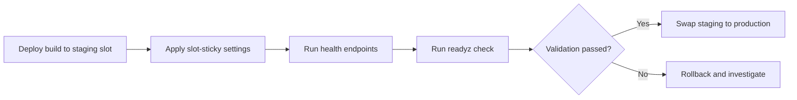

---
hide:
  - toc
---

# Deployment Slots Validation

Use staging slots to validate deployments before production swap, with health checks and automated safeguards in Azure DevOps.



## Prerequisites

- App Service plan supports deployment slots
- Production app already running
- CI/CD pipeline can deploy to specific slot

## Main content

### 1) Create staging slot

```bash
az webapp deployment slot create \
  --resource-group "$RESOURCE_GROUP_NAME" \
  --name "$WEB_APP_NAME" \
  --slot "staging" \
  --output json
```

### 2) Configure slot-sticky settings

Mark environment-specific values so they do not swap:

```bash
az webapp config appsettings set \
  --resource-group "$RESOURCE_GROUP_NAME" \
  --name "$WEB_APP_NAME" \
  --slot "staging" \
  --slot-settings ASPNETCORE_ENVIRONMENT=Staging FeatureFlags__UseBeta=true \
  --output json
```

### 3) Deploy artifact to staging slot

```bash
az webapp deploy \
  --resource-group "$RESOURCE_GROUP_NAME" \
  --name "$WEB_APP_NAME" \
  --slot "staging" \
  --src-path "/tmp/guideapi.zip" \
  --type zip \
  --output json
```

### 4) Add explicit health endpoint checks

```bash
curl --fail --silent "https://$WEB_APP_NAME-staging.azurewebsites.net/health"
curl --fail --silent "https://$WEB_APP_NAME-staging.azurewebsites.net/info"
```

### 5) Add version-aware validation endpoint

```csharp
app.MapGet("/readyz", (IHostEnvironment env) => Results.Ok(new
{
    status = "ready",
    environment = env.EnvironmentName,
    buildVersion = Environment.GetEnvironmentVariable("BUILD_VERSION") ?? "unknown"
}));
```

### 6) Swap staging to production

```bash
az webapp deployment slot swap \
  --resource-group "$RESOURCE_GROUP_NAME" \
  --name "$WEB_APP_NAME" \
  --slot "staging" \
  --target-slot "production" \
  --output json
```

### 7) Optional auto-swap configuration

```bash
az webapp deployment slot auto-swap \
  --resource-group "$RESOURCE_GROUP_NAME" \
  --name "$WEB_APP_NAME" \
  --slot "staging" \
  --auto-swap-slot "production" \
  --output json
```

Use auto-swap only when health checks and deployment confidence are high.

### 8) Azure DevOps staged deployment example

```yaml
- stage: DeployStaging
  jobs:
    - deployment: DeployToStaging
      environment: 'staging'
      strategy:
        runOnce:
          deploy:
            steps:
              - task: AzureWebApp@1
                inputs:
                  azureSubscription: $(azureSubscription)
                  appType: webApp
                  appName: $(webAppName)
                  deployToSlotOrASE: true
                  resourceGroupName: $(resourceGroupName)
                  slotName: staging
                  package: '$(Pipeline.Workspace)/drop/**/*.zip'

- stage: ValidateAndSwap
  dependsOn: DeployStaging
  jobs:
    - job: Validate
      steps:
        - script: curl --fail --silent "https://$(webAppName)-staging.azurewebsites.net/health"
    - job: Swap
      dependsOn: Validate
      steps:
        - task: AzureCLI@2
          inputs:
            azureSubscription: $(azureSubscription)
            scriptType: bash
            scriptLocation: inlineScript
            inlineScript: |
              az webapp deployment slot swap \
                --resource-group $(resourceGroupName) \
                --name $(webAppName) \
                --slot staging \
                --target-slot production \
                --output none
```

!!! warning "Validate before swap, always"
    A successful deployment is not the same as a healthy runtime.
    Require endpoint validation and telemetry checks before production swap.

## Verification

- Staging serves expected build version.
- Production remains stable before swap.
- Swap completes without config leakage.
- Post-swap `/health` remains healthy.

```bash
curl --include "https://$WEB_APP_NAME.azurewebsites.net/health"
```

## Troubleshooting

### Staging healthy, production fails after swap

- Check slot-sticky config alignment.
- Verify hostnames/certs for slot-specific behavior.
- Confirm staging used production-like dependencies where required.

### Swap operation blocked

Validate no pending restart/operation exists and check App Service Activity Log for conflicts.

### Auto-swap caused unexpected release

Disable auto-swap and enforce manual approval stage in Azure DevOps for high-risk environments.

## See Also

- [Tutorial: 06. CI/CD](../06-ci-cd.md)
- [Tutorial: 03. Configuration](../03-configuration.md)
- For platform details, see [Azure App Service Guide](https://yeongseon.github.io/azure-app-service-practical-guide/)
