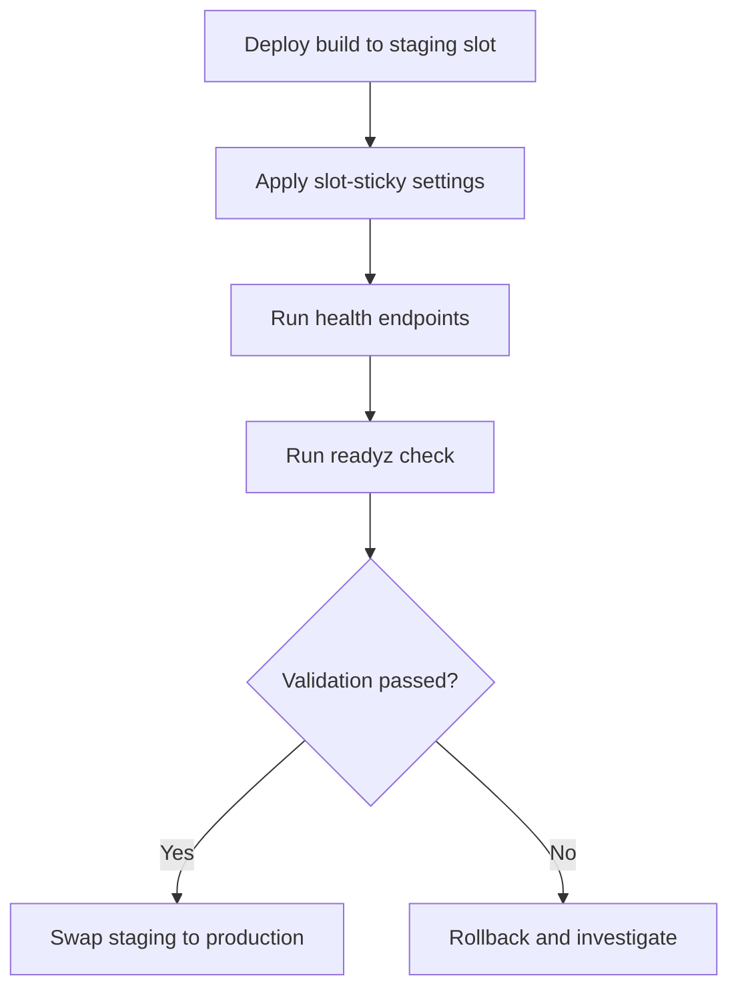

---
content_sources:
  diagrams:
  - id: deployment-slots-validation
    type: flowchart
    source: mslearn-adapted
    mslearn_url: https://learn.microsoft.com/en-us/azure/app-service/quickstart-python
content_validation:
  status: verified
  last_reviewed: '2026-05-23'
  reviewer: agent
  core_claims:
  - claim: This page uses Microsoft Learn as the primary source basis for its Azure-specific
      guidance.
    source: https://learn.microsoft.com/en-us/azure/app-service/quickstart-python
    verified: true
---
# Deployment Slots Validation

Use staging slots to validate deployments before production swap, with health checks and automated safeguards in Azure DevOps.

<!-- diagram-id: deployment-slots-validation -->

```mermaid
flowchart TD
    A[Deploy build to staging slot] --> B[Apply slot-sticky settings]
    B --> C[Run health endpoints]
    C --> D[Run readyz check]
    D --> E{Validation passed?}
    E -- Yes --> F[Swap staging to production]
    E -- No --> G[Rollback and investigate]
```

## Prerequisites

- App Service plan supports deployment slots
- Production app already running
- CI/CD pipeline can deploy to specific slot

## Main content

### 1) Create staging slot

```bash
az webapp deployment slot create \
  --resource-group "$RESOURCE_GROUP_NAME" \
  --name "$WEB_APP_NAME" \
  --slot "staging" \
  --output json
```

### 2) Configure slot-sticky settings

Mark environment-specific values so they do not swap:

```bash
az webapp config appsettings set \
  --resource-group "$RESOURCE_GROUP_NAME" \
  --name "$WEB_APP_NAME" \
  --slot "staging" \
  --slot-settings ASPNETCORE_ENVIRONMENT=Staging FeatureFlags__UseBeta=true \
  --output json
```

### 3) Deploy artifact to staging slot

```bash
az webapp deploy \
  --resource-group "$RESOURCE_GROUP_NAME" \
  --name "$WEB_APP_NAME" \
  --slot "staging" \
  --src-path "/tmp/guideapi.zip" \
  --type zip \
  --output json
```

### 4) Add explicit health endpoint checks

```bash
curl --fail --silent "https://$WEB_APP_NAME-staging.azurewebsites.net/health"
curl --fail --silent "https://$WEB_APP_NAME-staging.azurewebsites.net/info"
```

### 5) Add version-aware validation endpoint

```csharp
app.MapGet("/readyz", (IHostEnvironment env) => Results.Ok(new
{
    status = "ready",
    environment = env.EnvironmentName,
    buildVersion = Environment.GetEnvironmentVariable("BUILD_VERSION") ?? "unknown"
}));
```

### 6) Swap staging to production

```bash
az webapp deployment slot swap \
  --resource-group "$RESOURCE_GROUP_NAME" \
  --name "$WEB_APP_NAME" \
  --slot "staging" \
  --target-slot "production" \
  --output json
```

### 7) Optional auto-swap configuration

```bash
az webapp deployment slot auto-swap \
  --resource-group "$RESOURCE_GROUP_NAME" \
  --name "$WEB_APP_NAME" \
  --slot "staging" \
  --auto-swap-slot "production" \
  --output json
```

!!! warning "Linux Limitation"
    Auto-swap is not supported for web apps on Linux and Web App for Containers. Use manual swap or CI/CD-triggered swap instead. See [Deployment Slots](../../../operations/deployment/slots-and-swap.md) for details.

Use auto-swap only when health checks and deployment confidence are high.

### 8) Azure DevOps staged deployment example

```yaml
- stage: DeployStaging
  jobs:
    - deployment: DeployToStaging
      environment: 'staging'
      strategy:
        runOnce:
          deploy:
            steps:
              - task: AzureWebApp@1
                inputs:
                  azureSubscription: $(azureSubscription)
                  appType: webApp
                  appName: $(webAppName)
                  deployToSlotOrASE: true
                  resourceGroupName: $(resourceGroupName)
                  slotName: staging
                  package: '$(Pipeline.Workspace)/drop/**/*.zip'

- stage: ValidateAndSwap
  dependsOn: DeployStaging
  jobs:
    - job: Validate
      steps:
        - script: curl --fail --silent "https://$(webAppName)-staging.azurewebsites.net/health"
    - job: Swap
      dependsOn: Validate
      steps:
        - task: AzureCLI@2
          inputs:
            azureSubscription: $(azureSubscription)
            scriptType: bash
            scriptLocation: inlineScript
            inlineScript: |
              az webapp deployment slot swap \
                --resource-group $(resourceGroupName) \
                --name $(webAppName) \
                --slot staging \
                --target-slot production \
                --output none
```

!!! warning "Validate before swap, always"
    A successful deployment is not the same as a healthy runtime.
    Require endpoint validation and telemetry checks before production swap.

## Verification

- Staging serves expected build version.
- Production remains stable before swap.
- Swap completes without config leakage.
- Post-swap `/health` remains healthy.

```bash
curl --include "https://$WEB_APP_NAME.azurewebsites.net/health"
```

## Troubleshooting

### Staging healthy, production fails after swap

- Check slot-sticky config alignment.
- Verify hostnames/certs for slot-specific behavior.
- Confirm staging used production-like dependencies where required.

### Swap operation blocked

Validate no pending restart/operation exists and check App Service Activity Log for conflicts.

### Auto-swap caused unexpected release

Disable auto-swap and enforce manual approval stage in Azure DevOps for high-risk environments.

## Run It in the Portal

#### Portal view: Deployment slots with Swap dialog (validated promotion)

![Azure Portal Deployment slots blade for app-test-20251107 Web App with the Swap right panel open. The slot list shows app-test-20251107 with a PRODUCTION badge and app-test-20251107-staging; the toolbar exposes Save and Discard (disabled), Add, Swap (highlighted), Logs, Refresh (disabled), and Send us your feedback. The Swap panel has a Source dropdown set to app-test-20251107-staging and a Target dropdown showing app-test-20251107 with a PRODUCTION badge, followed by an info banner reading "Swap with preview can only be used with sites that have deployment slot settings enabled." and a disabled "Perform swap with preview" checkbox. A Config Changes section explains it is the final summary of configuration changes on source and target slots after the swap, with Source slot changes (selected) and Target slot changes tabs. The table columns Setting, Type, Old Value, New Value list SCM_DO_BUILD_DURING_DEPLOYMENT (AppSetting, Not set to true), APPLICATIONINSIGHTS_CONNECTION_STRING (AppSetting, Not set to a long zero-GUID instrumentation string), ApplicationInsightsAgent_EXTENSION_VERSION (AppSetting, Not set to ~3), and APPLICATIONINSIGHTSAGENT_EXTENSION_ENABLED (AppSetting, Not set to true). Bottom buttons are Start Swap (primary) and Close.](../../../assets/operations/deployment/slots-and-swap/01-swap-dialog.png)

The Deployment slots blade with the Swap panel open is the Portal counterpart to the `az webapp deployment slot swap` command this recipe drives from CI for the ASP.NET Core app. The `Source: app-test-20251107-staging` and `Target: app-test-20251107` selectors mirror the staging-to-production promotion direction the recipe validates against. The `Config Changes` table at the bottom previews how slot-sticky settings will move during the swap, including the `APPLICATIONINSIGHTS_CONNECTION_STRING` and `SCM_DO_BUILD_DURING_DEPLOYMENT` rows visible here — the same delta you should inspect before clicking `Start Swap`. Use this Portal view as the manual checkpoint complementing the automated pre-swap validation calls (health probe, smoke test) the recipe issues against the staging slot.

## See Also

- [Tutorial: 06. CI/CD](../tutorial/06-ci-cd.md)
- [Tutorial: 03. Configuration](../tutorial/03-configuration.md)
- For platform details, see [Azure App Service Guide](https://yeongseon.github.io/azure-app-service-practical-guide/)

## Sources

- [Microsoft Learn source 1](https://learn.microsoft.com/en-us/azure/app-service/quickstart-python)
