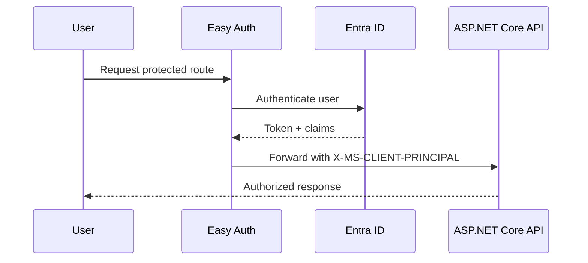

# Easy Auth

Protect your ASP.NET Core app with Azure App Service built-in authentication (Easy Auth), and consume identity claims from platform-injected headers.



## Prerequisites

- App Service app deployed
- Microsoft Entra app registration available
- Authentication/authorization permissions in Azure portal

## Main content

### 1) Enable App Service authentication

Configure Easy Auth with Entra ID as identity provider (portal or CLI).

```bash
az webapp auth update \
  --resource-group "$RESOURCE_GROUP_NAME" \
  --name "$WEB_APP_NAME" \
  --enabled true \
  --action LoginWithAzureActiveDirectory \
  --output json
```

### 2) Require authentication globally

Set unauthenticated requests to be challenged instead of anonymous access.

```bash
az webapp auth update \
  --resource-group "$RESOURCE_GROUP_NAME" \
  --name "$WEB_APP_NAME" \
  --action LoginWithAzureActiveDirectory \
  --output json
```

### 3) Read `X-MS-CLIENT-PRINCIPAL` header

Easy Auth injects user identity information in headers. Parse it safely:

```csharp
using System.Text;
using System.Text.Json;

public sealed record EasyAuthPrincipal(string UserId, string UserDetails, List<EasyAuthClaim> Claims);
public sealed record EasyAuthClaim(string Typ, string Val);

static EasyAuthPrincipal? ParsePrincipal(HttpRequest request)
{
    if (!request.Headers.TryGetValue("X-MS-CLIENT-PRINCIPAL", out var raw)) return null;
    var bytes = Convert.FromBase64String(raw!);
    var json = Encoding.UTF8.GetString(bytes);
    return JsonSerializer.Deserialize<EasyAuthPrincipal>(json);
}
```

### 4) Bridge to ClaimsPrincipal middleware

```csharp
app.Use(async (context, next) =>
{
    var principalHeader = context.Request.Headers["X-MS-CLIENT-PRINCIPAL"].ToString();
    if (!string.IsNullOrWhiteSpace(principalHeader))
    {
        // Parse and map claims if your app needs unified claims-based authorization.
        // Keep this logic centralized in middleware or a dedicated service.
    }

    await next();
});
```

### 5) Protect API endpoints

```csharp
[ApiController]
[Route("api/profile")]
public sealed class ProfileController : ControllerBase
{
    [HttpGet]
    public IActionResult Get()
    {
        var principal = ParsePrincipal(Request);
        if (principal is null)
        {
            return Unauthorized(new { error = "principal header missing" });
        }

        return Ok(new
        {
            principal.UserId,
            principal.UserDetails,
            claimCount = principal.Claims.Count
        });
    }
}
```

### 6) Token forwarding and validation notes

- Easy Auth can manage provider tokens and session cookies.
- For downstream APIs, request and validate tokens explicitly where required.
- Do not trust identity headers from public traffic unless they are injected by App Service front end.

### 7) Azure DevOps release check snippet

```yaml
- task: AzureCLI@2
  displayName: Validate Easy Auth configuration
  inputs:
    azureSubscription: $(azureSubscription)
    scriptType: bash
    scriptLocation: inlineScript
    inlineScript: |
      az webapp auth show \
        --resource-group $(resourceGroupName) \
        --name $(webAppName) \
        --output table
```

!!! warning "Header spoofing risk"
    Never expose your app directly behind a proxy that allows arbitrary inbound `X-MS-*` headers.
    Restrict trusted front ends and validate deployment architecture.

## Verification

1. Browse `https://<app>.azurewebsites.net/api/profile`.
2. Confirm redirect to sign-in when unauthenticated.
3. Confirm profile payload after successful login.

You can inspect header presence in app logs for debugging (without dumping sensitive values).

## Troubleshooting

### Redirect loop

- Verify redirect URI in Entra app registration.
- Check custom domain callback settings if using non-default hostnames.

### `X-MS-CLIENT-PRINCIPAL` missing

- Confirm Easy Auth is enabled and requests go through App Service front end.
- Ensure endpoint is not bypassing authentication configuration.

### Authorization logic mismatch

Normalize claim type mapping and case sensitivity in one place.

## See Also

- [Managed Identity](managed-identity.md)
- [Deployment Slots Validation](deployment-slots-validation.md)
- For platform details, see [Azure App Service Guide](https://yeongseon.github.io/azure-app-service-practical-guide/)
