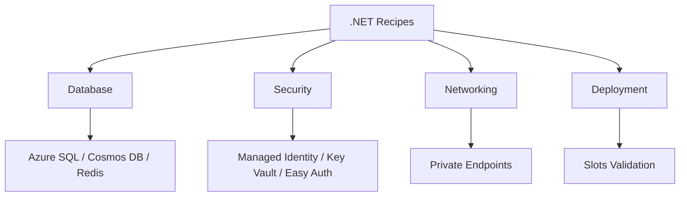

---
hide:
  - toc
---

# Recipes

Use these production-oriented recipes to integrate common Azure services with ASP.NET Core 8 on Windows App Service.



## Prerequisites

- Tutorials 01-03 completed for baseline deployment and configuration
- Existing App Service app with managed identity enabled (recommended)
- Access to required Azure services (SQL, Cosmos DB, Redis, Key Vault, networking)

## Main content

### Recipe map by category

| Category | Recipe | Primary focus | Typical usage |
|---|---|---|---|
| Database | [Azure SQL](azure-sql.md) | EF Core + managed identity auth | Transactional relational workload |
| Database | [Cosmos DB](cosmosdb.md) | `Microsoft.Azure.Cosmos` SDK | Globally distributed NoSQL |
| Database | [Redis Cache](redis.md) | `IDistributedCache` and session | Low-latency cache/session |
| Security | [Managed Identity](managed-identity.md) | `DefaultAzureCredential` pattern | Passwordless service auth |
| Security | [Key Vault References](key-vault-reference.md) | App Settings secret injection | Minimal code secret management |
| Security | [Easy Auth](easy-auth.md) | Built-in authentication | Protect app without custom auth stack |
| Networking | [Private Endpoints](private-endpoints.md) | VNet integration + private access | Isolated backend connectivity |
| Deployment | [Deployment Slots Validation](deployment-slots-validation.md) | Staging validation before swap | Safer zero-downtime releases |

### How to choose a recipe

1. Start with **Managed Identity** first if the target service supports Entra auth.
2. Use **Key Vault References** for secrets you cannot remove yet.
3. Add **Private Endpoints** when compliance or network isolation is required.
4. Gate rollout with **Deployment Slots Validation** for production reliability.

### Shared implementation baseline

Most recipes assume the following ASP.NET Core startup style:

```csharp
var builder = WebApplication.CreateBuilder(args);

builder.Services.AddApplicationInsightsTelemetry();
builder.Services.AddControllers();

var app = builder.Build();
app.MapControllers();
app.Run();
```

### Shared operational CLI checks

```bash
az webapp show --resource-group "$RESOURCE_GROUP_NAME" --name "$WEB_APP_NAME" --output table
az webapp identity show --resource-group "$RESOURCE_GROUP_NAME" --name "$WEB_APP_NAME" --output json
```

### Shared Azure DevOps rollout shape

```yaml
stages:
  - stage: Build
  - stage: DeployStaging
  - stage: Validate
  - stage: SwapToProduction
```

!!! tip "Apply recipes incrementally"
    Do not implement every recipe at once.
    Add one capability, verify behavior, and then move to the next recipe.

## Verification

For each recipe completion:

- Functional endpoint test passes
- Telemetry confirms healthy requests and dependencies
- Secrets are not hardcoded in source or pipeline logs
- Rollback path is defined and tested

## Troubleshooting

- If authentication fails, verify managed identity object ID and role assignments first.
- If private connectivity fails, validate DNS and route tables before app code changes.
- If slot swap causes incidents, mark config as slot-sticky and add explicit health validation.

## See Also

- [Tutorial index](../index.md)
- [Reference index](../../../reference/index.md)
- For platform details, see [Azure App Service Guide](https://yeongseon.github.io/azure-app-service-practical-guide/)
