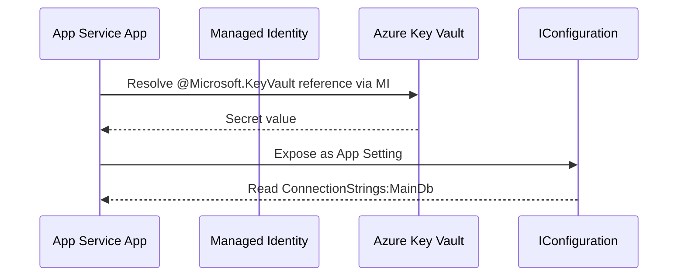

---
content_sources:
  diagrams:
    - id: key-vault-references
      type: flowchart
      source: mslearn-adapted
      mslearn_url: https://learn.microsoft.com/en-us/azure/app-service/app-service-key-vault-references
---
# Key Vault References

Use Azure App Service Key Vault References to inject secrets into configuration without embedding secret values in code or pipeline variables.

<!-- diagram-id: key-vault-references -->


## Prerequisites

- Azure Key Vault with at least one secret
- App Service managed identity enabled
- Managed identity granted `Key Vault Secrets User` on vault

## Main content

### 1) Create and verify secret

```bash
az keyvault secret set \
  --vault-name "$KEY_VAULT_NAME" \
  --name "sql-connection" \
  --value "Server=tcp:<sql-server>.database.windows.net,1433;Database=<db>;Authentication=Active Directory Managed Identity;Encrypt=True;" \
  --output json
```

### 2) Set Key Vault reference in App Settings

```bash
az webapp config appsettings set \
  --resource-group "$RESOURCE_GROUP_NAME" \
  --name "$WEB_APP_NAME" \
  --settings ConnectionStrings__MainDb="@Microsoft.KeyVault(SecretUri=https://$KEY_VAULT_NAME.vault.azure.net/secrets/sql-connection/)" \
  --output json
```

Reference format:

```text
@Microsoft.KeyVault(SecretUri=https://<vault-name>.vault.azure.net/secrets/<secret-name>/<optional-version>)
```

### 3) Read secret value through normal IConfiguration

```csharp
var mainDb = builder.Configuration["ConnectionStrings:MainDb"]
    ?? throw new InvalidOperationException("Connection string missing.");
```

No Key Vault SDK code is required for this pattern.

### 4) Optional SDK-based configuration provider alternative

If you need richer behavior (labels, filtering, explicit reload logic), use configuration provider:

```xml
<ItemGroup>
  <PackageReference Include="Azure.Extensions.AspNetCore.Configuration.Secrets" Version="1.4.0" />
  <PackageReference Include="Azure.Identity" Version="1.12.0" />
</ItemGroup>
```

```csharp
using Azure.Extensions.AspNetCore.Configuration.Secrets;
using Azure.Identity;

builder.Configuration.AddAzureKeyVault(
    new Uri("https://<vault-name>.vault.azure.net/"),
    new DefaultAzureCredential(),
    new KeyVaultSecretManager());
```

### 5) Secret rotation behavior

Key Vault references refresh automatically, but not instantly. For urgent secret rollovers, restart app after setting a new secret version.

```bash
az webapp restart --resource-group "$RESOURCE_GROUP_NAME" --name "$WEB_APP_NAME" --output none
```

### 6) Slot-safe secret references

Use slot settings to prevent staging secrets from swapping into production:

```bash
az webapp config appsettings set \
  --resource-group "$RESOURCE_GROUP_NAME" \
  --name "$WEB_APP_NAME" \
  --slot "staging" \
  --slot-settings PaymentApi__Key="@Microsoft.KeyVault(SecretUri=https://$KEY_VAULT_NAME.vault.azure.net/secrets/payment-api-key/)" \
  --output json
```

### 7) Azure DevOps snippet with reference values

```yaml
- task: AzureAppServiceSettings@1
  inputs:
    azureSubscription: $(azureSubscription)
    appName: $(webAppName)
    resourceGroupName: $(resourceGroupName)
    appSettings: |
      [
        {
          "name": "ConnectionStrings__MainDb",
          "value": "@Microsoft.KeyVault(SecretUri=https://<vault-name>.vault.azure.net/secrets/sql-connection/)",
          "slotSetting": true
        }
      ]
```

!!! warning "Do not log resolved secret values"
    Key Vault references reduce secret sprawl only if you avoid printing resolved values in logs, errors, and debugging output.

## Verification

1. Confirm App Setting value is reference expression (not plaintext).
2. Hit an endpoint that uses the secret-backed setting.
3. Validate successful dependency call.

```bash
az webapp config appsettings list --resource-group "$RESOURCE_GROUP_NAME" --name "$WEB_APP_NAME" --output table
```

## Troubleshooting

### Secret resolution fails

- Ensure managed identity has vault access role.
- Ensure secret URI is correct.
- Check vault firewall/network restrictions.

### Value remains stale after rotation

- Use versioned URI for deterministic rollout.
- Restart app after rotation if immediate effect is required.

### Works in production but not staging

Validate slot-specific identity and slot-specific app settings configuration.

## Run It in the Portal

#### Portal view: Environment variables blade (Key Vault references surface in App settings)

![Azure Portal Environment variables blade for app-test-20251107 Web App with the App settings tab selected (Connection strings tab adjacent). The toolbar shows a search box plus the actions plus Add, Refresh, Show values, Advanced edit, and Pull reference values. The settings table has columns Name, Value, Deployment slot setting, Source, and Delete and lists five App Service-sourced rows: APPLICATIONINSIGHTS_CONNECTION_STRING, APPLICATIONINSIGHTSAGENT_EXTENSION_ENABLED, ApplicationInsightsAgent_EXTENSION_VERSION, SCM_DO_BUILD_DURING_DEPLOYMENT, and WEBSITE_HTTPLOGGING_RETENTION_DAYS, each with a Show value link and Source App Service. The left navigation expands Settings with Environment variables highlighted, alongside Configuration, Instances, Authentication, Identity, Backups, Custom domains, Certificates, Networking, and WebJobs; Apply and Discard buttons are disabled at the bottom.](../../../assets/operations/deployment/zip-deploy/01-app-settings-run-from-package.png)

The `Environment variables` blade with the `App settings` tab selected is the Portal surface where Key Vault-backed app settings are reviewed. The visible screenshot shows the shared `Name` / `Value` / `Deployment slot setting` / `Source` / `Delete` table layout, plus the `Refresh`, `Show values`, `Advanced edit`, and `Pull reference values` actions in the toolbar. Use this blade to inspect reference-backed settings alongside the platform-managed entries for the ASP.NET Core app.

## See Also

- [Managed Identity](managed-identity.md)
- [Azure SQL](azure-sql.md)
- For platform details, see [Azure App Service Guide](https://yeongseon.github.io/azure-app-service-practical-guide/)

## Sources

- [Microsoft Learn source 1](https://learn.microsoft.com/en-us/azure/app-service/app-service-key-vault-references)
