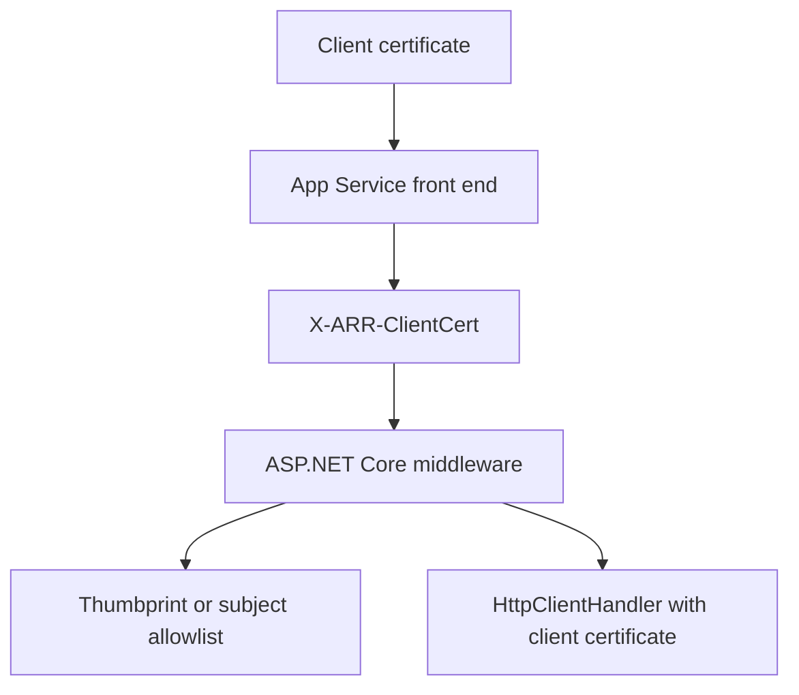

---
content_sources:
  diagrams:
    - id: dotnet-mtls-client-certificate-flow
      type: flowchart
      source: mslearn-adapted
      mslearn_url: https://learn.microsoft.com/en-us/azure/app-service/app-service-web-configure-tls-mutual-auth
      based_on:
        - https://learn.microsoft.com/en-us/azure/app-service/configure-ssl-certificate-in-code
---

# mTLS Client Certificates

Use ASP.NET Core middleware to parse `X-ARR-ClientCert`, validate the forwarded certificate with `X509Certificate2`, and attach a client certificate to outbound `HttpClient` requests.

<!-- diagram-id: dotnet-mtls-client-certificate-flow -->


## Prerequisites

- ASP.NET Core 8 app on Azure App Service
- Inbound client certificates enabled on the site
- Outbound client certificate available on the Windows certificate store for code-based apps, or the Linux filesystem / Windows container runtime paths for containerized hosting

`GuideApi.csproj` additions if needed:

```xml
<ItemGroup>
  <PackageReference Include="Microsoft.ApplicationInsights.AspNetCore" Version="2.22.0" />
</ItemGroup>
```

## What You'll Build

- Middleware that parses and validates `X-ARR-ClientCert`
- A certificate loader that supports Linux and Windows paths
- An `HttpClient` configured for outbound mTLS

## Steps

### 1. Add middleware and outbound client setup

```csharp
using System.Security.Cryptography.X509Certificates;
using Microsoft.AspNetCore.Mvc;

var builder = WebApplication.CreateBuilder(args);

builder.Services.AddControllers();
builder.Services.AddHttpClient("mtls")
    .ConfigurePrimaryHttpMessageHandler(() =>
    {
        var handler = new HttpClientHandler();
        handler.ClientCertificates.Add(LoadOutboundCertificate());
        return handler;
    });

var app = builder.Build();

var allowedCommonNames = (Environment.GetEnvironmentVariable("ALLOWED_CLIENT_CERT_COMMON_NAMES")
        ?? "api-client.contoso.com")
    .Split(',', StringSplitOptions.RemoveEmptyEntries | StringSplitOptions.TrimEntries)
    .ToHashSet(StringComparer.OrdinalIgnoreCase);

var allowedThumbprints = (Environment.GetEnvironmentVariable("ALLOWED_CLIENT_CERT_THUMBPRINTS")
        ?? string.Empty)
    .Split(',', StringSplitOptions.RemoveEmptyEntries | StringSplitOptions.TrimEntries)
    .Select(value => value.ToUpperInvariant())
    .ToHashSet(StringComparer.OrdinalIgnoreCase);

app.Use(async (context, next) =>
{
    if (context.Request.Path.Equals("/health", StringComparison.OrdinalIgnoreCase))
    {
        await next();
        return;
    }

    var headerValue = context.Request.Headers["X-ARR-ClientCert"].ToString();
    if (string.IsNullOrWhiteSpace(headerValue))
    {
        context.Response.StatusCode = StatusCodes.Status403Forbidden;
        await context.Response.WriteAsJsonAsync(new { error = "client certificate header missing" });
        return;
    }

    var pem = $"-----BEGIN CERTIFICATE-----\n{headerValue}\n-----END CERTIFICATE-----\n";
    using var certificate = X509Certificate2.CreateFromPem(pem);
    var thumbprint = certificate.Thumbprint?.ToUpperInvariant();
    var commonName = certificate.GetNameInfo(X509NameType.SimpleName, false);

    var thumbprintAllowed = !string.IsNullOrEmpty(thumbprint) && allowedThumbprints.Contains(thumbprint);
    var commonNameAllowed = !string.IsNullOrEmpty(commonName) && allowedCommonNames.Contains(commonName);

    if (!thumbprintAllowed && !commonNameAllowed)
    {
        context.Response.StatusCode = StatusCodes.Status403Forbidden;
        await context.Response.WriteAsJsonAsync(new { error = "client certificate is not allowlisted" });
        return;
    }

    context.Items["ClientCertificateThumbprint"] = thumbprint;
    context.Items["ClientCertificateCommonName"] = commonName;
    await next();
});

app.MapGet("/health", () => Results.Ok(new { status = "ok" }));

app.MapGet("/cert-info", (HttpContext context) => Results.Ok(new
{
    thumbprint = context.Items["ClientCertificateThumbprint"],
    commonName = context.Items["ClientCertificateCommonName"]
}));

app.MapGet("/outbound-mtls", async (IHttpClientFactory httpClientFactory) =>
{
    var client = httpClientFactory.CreateClient("mtls");
    var response = await client.GetAsync(Environment.GetEnvironmentVariable("REMOTE_API_URL") ?? "https://api.contoso.com/health");
    response.EnsureSuccessStatusCode();
    return Results.Ok(new { statusCode = (int)response.StatusCode });
});

app.Run();

static X509Certificate2 LoadOutboundCertificate()
{
    if (OperatingSystem.IsWindows())
    {
        var thumbprint = Environment.GetEnvironmentVariable("OUTBOUND_CLIENT_CERT_THUMBPRINT");
        if (string.IsNullOrWhiteSpace(thumbprint))
        {
            throw new InvalidOperationException("OUTBOUND_CLIENT_CERT_THUMBPRINT is required for Windows code-based apps.");
        }

        using var store = new X509Store(StoreName.My, StoreLocation.CurrentUser);
        store.Open(OpenFlags.ReadOnly);
        var matchingCertificates = store.Certificates.Find(
            X509FindType.FindByThumbprint,
            thumbprint,
            validOnly: false);

        if (matchingCertificates.Count == 0)
        {
            throw new InvalidOperationException("Outbound certificate not found in CurrentUser\\My for the Windows code-based hosting model.");
        }

        return matchingCertificates[0];
    }

    var pfxPath = Environment.GetEnvironmentVariable("OUTBOUND_CLIENT_CERT_PATH")
        ?? "/var/ssl/private/<thumbprint>.p12";
    var password = Environment.GetEnvironmentVariable("OUTBOUND_CLIENT_CERT_PASSWORD") ?? string.Empty;

    return new X509Certificate2(
        pfxPath,
        password,
        X509KeyStorageFlags.Exportable | X509KeyStorageFlags.EphemeralKeySet);
}
```

### 2. Configure environment variables

Linux example:

```bash
az webapp config appsettings set \
  --resource-group $RG \
  --name $APP_NAME \
  --settings \
    ALLOWED_CLIENT_CERT_COMMON_NAMES="api-client.contoso.com,partner-gateway.contoso.com" \
    ALLOWED_CLIENT_CERT_THUMBPRINTS="" \
    OUTBOUND_CLIENT_CERT_PATH="/var/ssl/private/<thumbprint>.p12" \
    OUTBOUND_CLIENT_CERT_PASSWORD="<certificate-password>" \
    REMOTE_API_URL="https://api.contoso.com/health" \
  --output json
```

Windows example:

```bash
az webapp config appsettings set \
  --resource-group $RG \
  --name $APP_NAME \
  --settings \
    ALLOWED_CLIENT_CERT_COMMON_NAMES="api-client.contoso.com,partner-gateway.contoso.com" \
    ALLOWED_CLIENT_CERT_THUMBPRINTS="" \
    OUTBOUND_CLIENT_CERT_THUMBPRINT="<thumbprint>" \
    REMOTE_API_URL="https://api.contoso.com/health" \
  --output json
```

!!! note "Windows hosting model matters"
    `CurrentUser\My` is the documented lookup location for Windows-hosted App Service code. Windows containers can use different filesystem paths or certificate stores, so validate the exact hosting model before copying the Windows lookup logic unchanged.

### 3. Test with curl

```bash
curl --include \
  --cert ./client.pem \
  --key ./client.key \
  "https://$APP_NAME.azurewebsites.net/cert-info"
```

## Verification

- `/cert-info` returns the parsed certificate details for an allowlisted caller
- Requests without a valid client certificate return `403`
- On Linux, outbound mTLS succeeds only when the `.p12` file exists under `/var/ssl/private/`
- On Windows code-based apps, outbound mTLS succeeds only when the certificate exists in `CurrentUser\My`
- On Windows containers, outbound mTLS succeeds only when the app uses the correct container-specific certificate path or store

## Next Steps / Clean Up

- Replace basic allowlist checks with issuer and chain validation
- Centralize certificate validation in a dedicated service for controller reuse
- Audit whether diagnostics endpoints should be removed after rollout

## See Also

- [Incoming Client Certificates](../../../operations/incoming-client-certificates.md)
- [Outbound Client Certificates](../../../operations/outbound-client-certificates.md)
- [Easy Auth](./easy-auth.md)

## Sources

- [Set up TLS mutual authentication for Azure App Service (Microsoft Learn)](https://learn.microsoft.com/en-us/azure/app-service/app-service-web-configure-tls-mutual-auth)
- [Use TLS/SSL certificates in your application code in Azure App Service (Microsoft Learn)](https://learn.microsoft.com/en-us/azure/app-service/configure-ssl-certificate-in-code)
