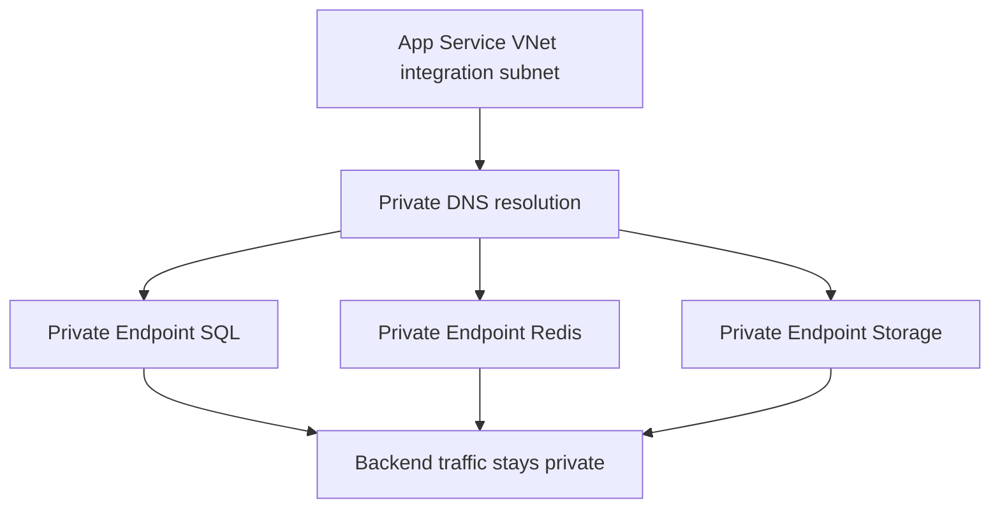

---
content_sources:
  diagrams:
    - id: private-endpoints
      type: flowchart
      source: mslearn-adapted
      mslearn_url: https://learn.microsoft.com/en-us/azure/app-service/networking/private-endpoint
---
# Private Endpoints

Connect App Service to backend services over private networking using VNet integration and private endpoints for SQL, Redis, and Storage.

<!-- diagram-id: private-endpoints -->


## Prerequisites

- App Service Plan tier that supports VNet integration
- Virtual network with dedicated integration subnet
- Backend services configured for private endpoint support

## Main content

### 1) Networking architecture

Recommended layout:

- `subnet-appservice-integration`: delegated for App Service VNet integration
- `subnet-private-endpoints`: hosts private endpoint NICs
- Private DNS zones linked to the VNet

### 2) Enable VNet integration (Windows App Service)

```bash
az webapp vnet-integration add \
  --resource-group "$RESOURCE_GROUP_NAME" \
  --name "$WEB_APP_NAME" \
  --vnet "$VNET_NAME" \
  --subnet "$APP_INTEGRATION_SUBNET_NAME" \
  --output json
```
| Flag | Description |
|---|---|
| `az webapp vnet-integration add` | Connects the web app to a delegated subnet for outbound VNet integration. |
| `--resource-group "$RESOURCE_GROUP_NAME"` | Targets the resource group that contains the web app. |
| `--name "$WEB_APP_NAME"` | Selects the web app that will join the VNet. |
| `--vnet "$VNET_NAME"` | Uses the specified virtual network for the integration. |
| `--subnet "$APP_INTEGRATION_SUBNET_NAME"` | Attaches the app to the delegated integration subnet. |
| `--output json` | Returns the VNet-integration configuration as JSON. |


### 3) Create private endpoint for Azure SQL

```bash
az network private-endpoint create \
  --resource-group "$RESOURCE_GROUP_NAME" \
  --name "pe-sql-guide" \
  --vnet-name "$VNET_NAME" \
  --subnet "$PRIVATE_ENDPOINT_SUBNET_NAME" \
  --private-connection-resource-id "/subscriptions/<subscription-id>/resourceGroups/<sql-rg>/providers/Microsoft.Sql/servers/<sql-server>" \
  --group-id sqlServer \
  --connection-name "pe-sql-guide-conn" \
  --output json
```
| Flag | Description |
|---|---|
| `az network private-endpoint create` | Creates a private endpoint NIC for the target Azure SQL server. |
| `--resource-group "$RESOURCE_GROUP_NAME"` | Targets the resource group where the private endpoint resource will be created. |
| `--name "pe-sql-guide"` | Names the private endpoint resource. |
| `--vnet-name "$VNET_NAME"` | Places the private endpoint inside the specified virtual network. |
| `--subnet "$PRIVATE_ENDPOINT_SUBNET_NAME"` | Uses the subnet reserved for private endpoint NICs. |
| `--private-connection-resource-id "/subscriptions/.../Microsoft.Sql/servers/<sql-server>"` | Points the private endpoint at the Azure SQL server resource. |
| `--group-id sqlServer` | Selects the SQL server private-link subresource. |
| `--connection-name "pe-sql-guide-conn"` | Names the private-link connection object. |
| `--output json` | Returns the created private endpoint resource as JSON. |


### 4) Create private endpoint for Redis

```bash
az network private-endpoint create \
  --resource-group "$RESOURCE_GROUP_NAME" \
  --name "pe-redis-guide" \
  --vnet-name "$VNET_NAME" \
  --subnet "$PRIVATE_ENDPOINT_SUBNET_NAME" \
  --private-connection-resource-id "/subscriptions/<subscription-id>/resourceGroups/<redis-rg>/providers/Microsoft.Cache/Redis/<redis-name>" \
  --group-id redisCache \
  --connection-name "pe-redis-guide-conn" \
  --output json
```
| Flag | Description |
|---|---|
| `az network private-endpoint create` | Creates a private endpoint NIC for the target Azure Cache for Redis instance. |
| `--resource-group "$RESOURCE_GROUP_NAME"` | Targets the resource group where the private endpoint resource will be created. |
| `--name "pe-redis-guide"` | Names the private endpoint resource. |
| `--vnet-name "$VNET_NAME"` | Places the private endpoint inside the specified virtual network. |
| `--subnet "$PRIVATE_ENDPOINT_SUBNET_NAME"` | Uses the subnet reserved for private endpoint NICs. |
| `--private-connection-resource-id "/subscriptions/.../Microsoft.Cache/Redis/<redis-name>"` | Points the private endpoint at the Redis cache resource. |
| `--group-id redisCache` | Selects the Redis private-link subresource. |
| `--connection-name "pe-redis-guide-conn"` | Names the private-link connection object. |
| `--output json` | Returns the created private endpoint resource as JSON. |


### 5) NSG and route guidance

Allow outbound from integration subnet to:

- SQL private endpoint IP on 1433
- Redis private endpoint IP on 6380
- Storage private endpoint IP on required service ports

Block broad internet egress only after dependencies are confirmed reachable.

### 6) Connection string and DNS assumptions

Keep service hostnames unchanged (for example, `<sql-server>.database.windows.net`).
Private DNS resolution should map these names to private endpoint IPs within the VNet.

### 7) App code stays unchanged

```csharp
builder.Services.AddDbContext<AppDbContext>(options =>
    options.UseSqlServer(builder.Configuration["ConnectionStrings:MainDb"]));

builder.Services.AddStackExchangeRedisCache(options =>
    options.Configuration = builder.Configuration["Redis:Connection"]);
```

The same code can run with public or private networking if configuration and DNS are consistent.

### 8) Azure DevOps networking validation step

```yaml
- task: AzureCLI@2
  displayName: Validate private endpoint state
  inputs:
    azureSubscription: $(azureSubscription)
    scriptType: bash
    scriptLocation: inlineScript
    inlineScript: |
      az network private-endpoint list \
        --resource-group $(resourceGroupName) \
        --output table
```

!!! warning "Private endpoint without DNS is incomplete"
    Most connectivity incidents are DNS-related, not code-related.
    Always validate private DNS zone links and effective name resolution from the app environment.

## Verification

1. Confirm VNet integration is connected.
2. Confirm private endpoints are in `Approved` state.
3. Confirm app can reach SQL/Redis with normal hostnames.

```bash
az webapp vnet-integration list --resource-group "$RESOURCE_GROUP_NAME" --name "$WEB_APP_NAME" --output table
```
| Flag | Description |
|---|---|
| `az webapp vnet-integration list` | Lists the current VNet integration attachments for the web app. |
| `--resource-group "$RESOURCE_GROUP_NAME"` | Targets the resource group that contains the web app. |
| `--name "$WEB_APP_NAME"` | Selects the web app whose VNet integration will be listed. |
| `--output table` | Formats the integration list as a readable table. |


Use dependency telemetry and synthetic API checks to verify end-to-end connectivity.

## Troubleshooting

### Name resolution still points to public IP

- Validate private DNS zone records.
- Ensure VNet links are correct.
- Confirm app is integrated with expected VNet/subnet.

### Connection timeout to backend

- Review NSG rules and UDRs.
- Confirm backend firewall permits private endpoint traffic.
- Check TLS settings for SQL/Redis client configuration.

### Intermittent connectivity during scale events

Use resilient retry settings (`EnableRetryOnFailure`, Redis reconnect behavior) and monitor transient errors.

## Run It in the Portal

#### Portal view: Networking blade (app-side precondition for backend private endpoints)

![Networking blade for the Web App with a minimal command bar offering Refresh, Troubleshoot, and Send us your feedback. An info banner reads "Check your network configuration. Select any of the features listed below to change your network setup. Learn more". The blade is split into Inbound traffic configuration and Outbound traffic configuration columns. Inbound shows Public network access "Enabled with no access restrictions (Using default behavior)" as a link, App assigned address "Not configured", Private endpoints "0 private endpoints", Inbound IPv4 addresses "<ip-redacted>", and Inbound IPv6 addresses "<ipv6-redacted>". Outbound shows Virtual network integration "Not configured", Hybrid connections "Not configured", Outbound DNS "Default (Azure-provided)", Outbound IPv4 addresses (a long comma-separated list of platform-assigned addresses), and Outbound IPv6 addresses (a similarly long comma-separated list of IPv6 prefixes). An Integration subnet configuration section at the bottom shows NAT gateway "N/A". The left navigation has Networking highlighted under the Favorites group, with the Settings group expanded below it.](../../../assets/operations/networking/01-networking-overview.png)

This web-app `Networking` blade is a supporting before-state for the recipe rather than the place where the SQL, Redis, and Key Vault private endpoints themselves are listed for the ASP.NET Core app. The visible `Virtual network integration: Not configured` row is the app-side prerequisite the recipe changes before private DNS for those backend services can work, while `Private endpoints: 0 private endpoints` also makes clear the screenshot is not showing downstream private endpoints attached to other resources. Use this capture as the pre-integration checkpoint before running the recipe's VNet and backend private-endpoint steps.

## See Also

- [Azure SQL](azure-sql.md)
- [Redis Cache](redis.md)
- For platform details, see [Azure App Service Guide](https://yeongseon.github.io/azure-app-service-practical-guide/)

## Sources

- [Microsoft Learn source 1](https://learn.microsoft.com/en-us/azure/app-service/networking/private-endpoint)
