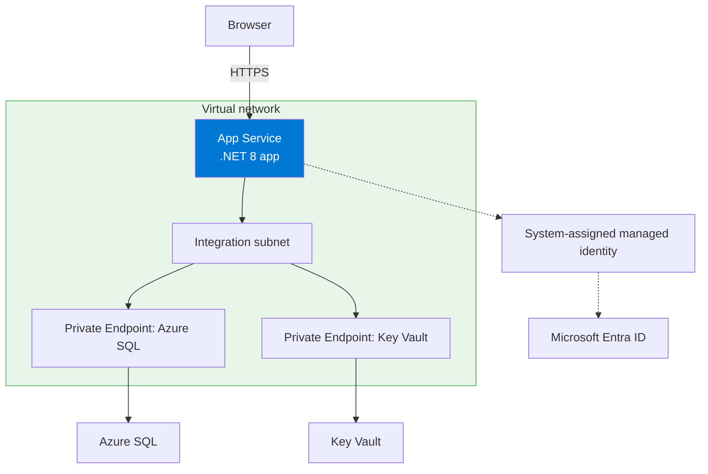
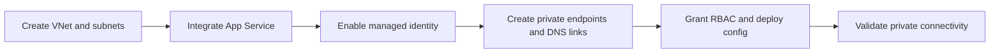

---
hide:
  - toc
content_sources:
  diagrams:
    - id: private-network-deploy
      type: flowchart
      source: self-generated
      justification: "Combines the .NET App Service quickstart with VNet integration, private endpoint, and managed identity guidance into one deployment scenario."
      based_on:
        - https://learn.microsoft.com/en-us/azure/app-service/quickstart-dotnetcore
        - https://learn.microsoft.com/en-us/azure/app-service/configure-vnet-integration-enable
        - https://learn.microsoft.com/en-us/azure/app-service/networking/private-endpoint
        - https://learn.microsoft.com/en-us/azure/app-service/tutorial-connect-msi-azure-database
    - id: private-network-deploy-flow
      type: flowchart
      source: self-generated
      justification: "Summarizes the end-to-end deployment flow for a private .NET App Service scenario."
      based_on:
        - https://learn.microsoft.com/en-us/azure/app-service/configure-vnet-integration-enable
        - https://learn.microsoft.com/en-us/azure/app-service/networking/private-endpoint
        - https://learn.microsoft.com/en-us/azure/app-service/tutorial-connect-msi-azure-database
---

# Private Network Deploy

Use this recipe after [02 - First Deploy](../tutorial/02-first-deploy.md) when you need outbound VNet integration, private endpoints for dependencies, and managed identity for passwordless access.

<!-- diagram-id: private-network-deploy -->


<!-- diagram-id: private-network-deploy-flow -->


## Prerequisites

- Completed [02 - First Deploy](../tutorial/02-first-deploy.md)
- App Service plan tier that supports VNet integration
- Existing Azure SQL server and Key Vault, or equivalent private-link capable services
- Permissions to configure networking, private DNS, RBAC, and managed identity

## Main Content

### Step 1: Set advanced deployment variables

```bash
RG="rg-dotnet-guide"
APP_NAME="app-dotnet-guide-abc123"
LOCATION="koreacentral"
VNET_NAME="vnet-dotnet-guide"
INTEGRATION_SUBNET_NAME="snet-appsvc-integration"
PRIVATE_ENDPOINT_SUBNET_NAME="snet-private-endpoints"
SQL_SERVER_NAME="sql-dotnet-guide"
KEY_VAULT_NAME="kv-dotnet-guide"
```

| Command/Parameter | Purpose |
|-------------------|---------|
| `RG="rg-dotnet-guide"` | Reuses the resource group from the earlier deployment. |
| `APP_NAME="app-dotnet-guide-abc123"` | Identifies the target App Service app. |
| `LOCATION="koreacentral"` | Sets the Azure region for the networking resources. |
| `VNET_NAME="vnet-dotnet-guide"` | Defines the virtual network for private connectivity. |
| `INTEGRATION_SUBNET_NAME="snet-appsvc-integration"` | Names the delegated subnet used by App Service VNet integration. |
| `PRIVATE_ENDPOINT_SUBNET_NAME="snet-private-endpoints"` | Names the subnet that hosts private endpoint NICs. |
| `SQL_SERVER_NAME="sql-dotnet-guide"` | Identifies the Azure SQL server used in the example. |
| `KEY_VAULT_NAME="kv-dotnet-guide"` | Identifies the Key Vault used with managed identity. |

### Step 2: Create the VNet and required subnets

```bash
az network vnet create --resource-group "$RG" --name "$VNET_NAME" --location "$LOCATION" --address-prefixes "10.0.0.0/16"
az network vnet subnet create --resource-group "$RG" --vnet-name "$VNET_NAME" --name "$INTEGRATION_SUBNET_NAME" --address-prefixes "10.0.1.0/24" --delegations "Microsoft.Web/serverFarms"
az network vnet subnet create --resource-group "$RG" --vnet-name "$VNET_NAME" --name "$PRIVATE_ENDPOINT_SUBNET_NAME" --address-prefixes "10.0.2.0/24" --disable-private-endpoint-network-policies true
```

| Command/Parameter | Purpose |
|-------------------|---------|
| `az network vnet create` | Creates the virtual network used by the private deployment pattern. |
| `--resource-group "$RG"` | Places the VNet in the selected resource group. |
| `--name "$VNET_NAME"` | Sets the VNet name. |
| `--location "$LOCATION"` | Creates the VNet in the selected Azure region. |
| `--address-prefixes "10.0.0.0/16"` | Defines the VNet CIDR block. |
| `az network vnet subnet create` | Creates a subnet inside the VNet. |
| `--vnet-name "$VNET_NAME"` | Targets the named VNet. |
| `--name "$INTEGRATION_SUBNET_NAME"` | Names the App Service integration subnet. |
| `--address-prefixes "10.0.1.0/24"` | Defines the CIDR range for the integration subnet. |
| `--delegations "Microsoft.Web/serverFarms"` | Delegates the subnet to App Service. |
| `--name "$PRIVATE_ENDPOINT_SUBNET_NAME"` | Names the private endpoint subnet. |
| `--address-prefixes "10.0.2.0/24"` | Defines the CIDR range for the private endpoint subnet. |
| `--disable-private-endpoint-network-policies true` | Disables policies that block private endpoint NICs. |

### Step 3: Integrate the web app and enable managed identity

```bash
az webapp vnet-integration add --resource-group "$RG" --name "$APP_NAME" --vnet "$VNET_NAME" --subnet "$INTEGRATION_SUBNET_NAME"
az webapp identity assign --resource-group "$RG" --name "$APP_NAME"
```

| Command/Parameter | Purpose |
|-------------------|---------|
| `az webapp vnet-integration add` | Connects outbound app traffic to the delegated VNet subnet. |
| `--resource-group "$RG"` | Selects the resource group containing the app. |
| `--name "$APP_NAME"` | Targets the web app to integrate. |
| `--vnet "$VNET_NAME"` | Chooses the virtual network used for integration. |
| `--subnet "$INTEGRATION_SUBNET_NAME"` | Chooses the delegated integration subnet. |
| `az webapp identity assign` | Enables a system-assigned managed identity for passwordless Azure access. |

### Step 4: Create private endpoints and private DNS links

```bash
SQL_SERVER_ID="$(az sql server show --resource-group "$RG" --name "$SQL_SERVER_NAME" --query id --output tsv)"
KEY_VAULT_ID="$(az keyvault show --resource-group "$RG" --name "$KEY_VAULT_NAME" --query id --output tsv)"

az network private-endpoint create --resource-group "$RG" --name "pe-sql-dotnet-guide" --vnet-name "$VNET_NAME" --subnet "$PRIVATE_ENDPOINT_SUBNET_NAME" --private-connection-resource-id "$SQL_SERVER_ID" --group-id sqlServer --connection-name "pe-sql-dotnet-guide-connection"
az network private-endpoint create --resource-group "$RG" --name "pe-kv-dotnet-guide" --vnet-name "$VNET_NAME" --subnet "$PRIVATE_ENDPOINT_SUBNET_NAME" --private-connection-resource-id "$KEY_VAULT_ID" --group-id vault --connection-name "pe-kv-dotnet-guide-connection"

az network private-dns zone create --resource-group "$RG" --name "privatelink.database.windows.net"
az network private-dns zone create --resource-group "$RG" --name "privatelink.vaultcore.azure.net"
az network private-dns link vnet create --resource-group "$RG" --zone-name "privatelink.database.windows.net" --name "sql-link" --virtual-network "$VNET_NAME" --registration-enabled false
az network private-dns link vnet create --resource-group "$RG" --zone-name "privatelink.vaultcore.azure.net" --name "kv-link" --virtual-network "$VNET_NAME" --registration-enabled false
```

| Command/Parameter | Purpose |
|-------------------|---------|
| `SQL_SERVER_ID="$(...)"` | Stores the Azure SQL server resource ID in a shell variable. |
| `az sql server show` | Reads the Azure SQL server metadata. |
| `--resource-group "$RG"` | Selects the resource group containing the backend resources. |
| `--name "$SQL_SERVER_NAME"` | Targets the Azure SQL server. |
| `--query id` | Returns only the Azure SQL resource ID. |
| `--output tsv` | Formats the ID as plain text for shell assignment. |
| `KEY_VAULT_ID="$(...)"` | Stores the Key Vault resource ID in a shell variable. |
| `az keyvault show` | Reads the Key Vault metadata. |
| `--name "$KEY_VAULT_NAME"` | Targets the Key Vault. |
| `az network private-endpoint create` | Creates a private endpoint in the private endpoint subnet. |
| `--name "pe-sql-dotnet-guide"` | Names the Azure SQL private endpoint. |
| `--vnet-name "$VNET_NAME"` | Places the endpoint in the selected VNet. |
| `--subnet "$PRIVATE_ENDPOINT_SUBNET_NAME"` | Uses the subnet reserved for private endpoints. |
| `--private-connection-resource-id "$SQL_SERVER_ID"` | Connects the endpoint to the Azure SQL server resource. |
| `--group-id sqlServer` | Targets the Azure SQL private link subresource. |
| `--connection-name "pe-sql-dotnet-guide-connection"` | Names the SQL private link connection object. |
| `--name "pe-kv-dotnet-guide"` | Names the Key Vault private endpoint. |
| `--private-connection-resource-id "$KEY_VAULT_ID"` | Connects the endpoint to the Key Vault resource. |
| `--group-id vault` | Targets the Key Vault private link subresource. |
| `--connection-name "pe-kv-dotnet-guide-connection"` | Names the Key Vault private link connection object. |
| `az network private-dns zone create` | Creates a private DNS zone for private endpoint name resolution. |
| `--name "privatelink.database.windows.net"` | Creates the Azure SQL private DNS zone. |
| `--name "privatelink.vaultcore.azure.net"` | Creates the Key Vault private DNS zone. |
| `az network private-dns link vnet create` | Links a private DNS zone to the VNet. |
| `--zone-name "privatelink.database.windows.net"` | Selects the Azure SQL private DNS zone. |
| `--name "sql-link"` | Names the Azure SQL VNet DNS link. |
| `--virtual-network "$VNET_NAME"` | Links the DNS zone to the App Service VNet. |
| `--registration-enabled false` | Disables auto-registration for service-managed records. |
| `--zone-name "privatelink.vaultcore.azure.net"` | Selects the Key Vault private DNS zone. |
| `--name "kv-link"` | Names the Key Vault VNet DNS link. |

!!! warning "DNS is part of the deployment"
    Private endpoints without private DNS links usually fail at runtime even when the endpoint itself shows as created.

### Step 5: Grant access and configure the app

```bash
WEB_APP_PRINCIPAL_ID="$(az webapp identity show --resource-group "$RG" --name "$APP_NAME" --query principalId --output tsv)"

az role assignment create --assignee-object-id "$WEB_APP_PRINCIPAL_ID" --assignee-principal-type ServicePrincipal --role "Key Vault Secrets User" --scope "$KEY_VAULT_ID"

az webapp config appsettings set --resource-group "$RG" --name "$APP_NAME" --settings \
  ConnectionStrings__SqlServer="Server=tcp:${SQL_SERVER_NAME}.database.windows.net,1433;Database=<database-name>;Encrypt=True;TrustServerCertificate=False;" \
  KeyVault__Uri="https://${KEY_VAULT_NAME}.vault.azure.net/"
```

| Command/Parameter | Purpose |
|-------------------|---------|
| `WEB_APP_PRINCIPAL_ID="$(...)"` | Stores the web app managed identity object ID in a shell variable. |
| `az webapp identity show` | Reads the managed identity details for the web app. |
| `--resource-group "$RG"` | Selects the resource group containing the app. |
| `--name "$APP_NAME"` | Targets the configured App Service app. |
| `--query principalId` | Returns only the managed identity principal ID. |
| `--output tsv` | Formats the principal ID as plain text for shell assignment. |
| `az role assignment create` | Creates an RBAC assignment for the managed identity. |
| `--assignee-object-id "$WEB_APP_PRINCIPAL_ID"` | Targets the web app's managed identity object ID. |
| `--assignee-principal-type ServicePrincipal` | Tells Azure RBAC that the assignee is a service principal. |
| `--role "Key Vault Secrets User"` | Grants secret read access in Key Vault. |
| `--scope "$KEY_VAULT_ID"` | Applies the role assignment at the Key Vault scope. |
| `az webapp config appsettings set` | Writes application settings into App Service configuration. |
| `--settings` | Passes the key/value settings to store. |
| `ConnectionStrings__SqlServer="Server=tcp:${SQL_SERVER_NAME}.database.windows.net,1433;Database=<database-name>;Encrypt=True;TrustServerCertificate=False;"` | Stores the SQL connection string shape while relying on token-based auth instead of a password. |
| `KeyVault__Uri="https://${KEY_VAULT_NAME}.vault.azure.net/"` | Stores the Key Vault URI used by the app. |

```csharp
using Azure.Identity;
using Azure.Security.KeyVault.Secrets;
using Microsoft.Data.SqlClient;

var credential = new DefaultAzureCredential();

builder.Services.AddSingleton(_ =>
    new SecretClient(new Uri(builder.Configuration["KeyVault:Uri"]!), credential));

var sqlToken = (await credential.GetTokenAsync(
    new Azure.Core.TokenRequestContext(new[] { "https://database.windows.net/.default" })
)).Token;

var sqlConnection = new SqlConnection(builder.Configuration.GetConnectionString("SqlServer"))
{
    AccessToken = sqlToken
};
```

| Command/Code | Purpose |
|--------------|---------|
| `new DefaultAzureCredential()` | Uses local developer identity locally and managed identity in App Service. |
| `new SecretClient(new Uri(builder.Configuration["KeyVault:Uri"]!), credential)` | Creates a Key Vault client that authenticates with the managed identity token source. |
| `credential.GetTokenAsync(new Azure.Core.TokenRequestContext(new[] { "https://database.windows.net/.default" }))` | Requests an Azure SQL access token for Microsoft Entra authentication. |
| `new SqlConnection(builder.Configuration.GetConnectionString("SqlServer"))` | Opens the SQL connection using the configured server and database settings. |
| `AccessToken = sqlToken` | Authenticates SQL connections without embedding passwords in configuration. |

### Step 6: Validate the private deployment

```bash
az webapp vnet-integration list --resource-group "$RG" --name "$APP_NAME" --output table
az network private-endpoint list --resource-group "$RG" --output table
az webapp log tail --resource-group "$RG" --name "$APP_NAME"
```

| Command/Parameter | Purpose |
|-------------------|---------|
| `az webapp vnet-integration list` | Confirms that the web app is attached to the expected integration subnet. |
| `--resource-group "$RG"` | Selects the app resource group. |
| `--name "$APP_NAME"` | Targets the web app being validated. |
| `--output table` | Formats the VNet integration output for quick inspection. |
| `az network private-endpoint list` | Lists private endpoints in the resource group. |
| `--resource-group "$RG"` | Limits the private endpoint list to the current resource group. |
| `--output table` | Formats the private endpoint list for quick review. |
| `az webapp log tail` | Streams runtime logs while testing SQL and Key Vault access. |
| `--resource-group "$RG"` | Selects the app resource group for log streaming. |
| `--name "$APP_NAME"` | Targets the web app whose runtime logs you want to follow. |

## Verification

- `az webapp vnet-integration list` shows the correct VNet and subnet
- Private endpoints show as created and approved
- The app can resolve SQL and Key Vault hostnames through private DNS
- `DefaultAzureCredential` succeeds in App Service without secrets

## Troubleshooting

### Private endpoint exists but app cannot connect

- Validate private DNS zone links first.
- Confirm the app is integrated with the expected VNet and subnet.
- Review NSG and route table rules on both subnets.

### Managed identity authentication fails

- Confirm the web app identity is enabled.
- Wait for RBAC propagation after role assignment.
- Verify the SQL or Key Vault permission model matches your target service.

### SQL hostname still resolves publicly

- Check the `privatelink.database.windows.net` zone link.
- Confirm no custom DNS server is overriding Azure private DNS behavior.

## See Also

- [02 - First Deploy](../tutorial/02-first-deploy.md)
- [VNet Integration](vnet-integration.md)
- [Private Endpoints](private-endpoints.md)
- [Managed Identity](managed-identity.md)

## Sources

- [Integrate your app with an Azure virtual network](https://learn.microsoft.com/en-us/azure/app-service/configure-vnet-integration-enable)
- [Use private endpoints for Azure App Service apps](https://learn.microsoft.com/en-us/azure/app-service/networking/private-endpoint)
- [Tutorial: Connect to Azure SQL Database from ASP.NET Core on App Service without secrets using a managed identity](https://learn.microsoft.com/en-us/azure/app-service/tutorial-connect-msi-azure-database)
