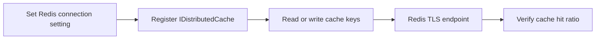

---
hide:
  - toc
---

# Redis Cache

Use Azure Cache for Redis with ASP.NET Core 8 for distributed caching and session state, including TLS-first configuration for production.



## Prerequisites

- Azure Cache for Redis instance provisioned
- App Service can reach Redis endpoint (public or private networking)
- `Microsoft.Extensions.Caching.StackExchangeRedis` package installed

## Main content

### 1) Add package

```xml
<ItemGroup>
  <PackageReference Include="Microsoft.Extensions.Caching.StackExchangeRedis" Version="8.0.4" />
</ItemGroup>
```

### 2) Configure Redis connection setting

```bash
az webapp config appsettings set \
  --resource-group "$RESOURCE_GROUP_NAME" \
  --name "$WEB_APP_NAME" \
  --settings Redis__Connection="<redis-name>.redis.cache.windows.net:6380,password=<masked>,ssl=True,abortConnect=False" \
  --output json
```

Prefer Key Vault references for the password value.

### 3) Register IDistributedCache

```csharp
using Microsoft.Extensions.Caching.StackExchangeRedis;

builder.Services.AddStackExchangeRedisCache(options =>
{
    options.Configuration = builder.Configuration["Redis:Connection"]
        ?? throw new InvalidOperationException("Redis connection not configured.");
    options.InstanceName = "GuideApi:";
});
```

### 4) Cache usage example

```csharp
[ApiController]
[Route("api/cache")]
public sealed class CacheController : ControllerBase
{
    private readonly IDistributedCache _cache;
    public CacheController(IDistributedCache cache) => _cache = cache;

    [HttpGet("{key}")]
    public async Task<IActionResult> Get(string key, CancellationToken cancellationToken)
    {
        var value = await _cache.GetStringAsync(key, cancellationToken);
        return Ok(new { key, value = value ?? "<null>" });
    }

    [HttpPost("{key}")]
    public async Task<IActionResult> Set(string key, [FromBody] string value, CancellationToken cancellationToken)
    {
        var options = new DistributedCacheEntryOptions
        {
            AbsoluteExpirationRelativeToNow = TimeSpan.FromMinutes(10)
        };

        await _cache.SetStringAsync(key, value, options, cancellationToken);
        return Accepted(new { key, value });
    }
}
```

### 5) Session store setup

```csharp
builder.Services.AddSession(options =>
{
    options.Cookie.Name = ".GuideApi.Session";
    options.IdleTimeout = TimeSpan.FromMinutes(20);
    options.Cookie.HttpOnly = true;
    options.Cookie.SecurePolicy = CookieSecurePolicy.Always;
});

app.UseSession();
```

### 6) TLS and reliability recommendations

- Use port `6380` with `ssl=True`
- Use `abortConnect=False` for resilient startup
- Keep Redis timeout and retry behavior aligned with workload

!!! warning "Do not disable TLS in production"
    Azure Redis should always use encrypted transport.
    Never expose plaintext Redis credentials in source files.

### 7) Azure DevOps setting update snippet

```yaml
- task: AzureAppServiceSettings@1
  inputs:
    azureSubscription: $(azureSubscription)
    appName: $(webAppName)
    resourceGroupName: $(resourceGroupName)
    appSettings: |
      [
        { "name": "Redis__Connection", "value": "@Microsoft.KeyVault(SecretUri=https://<vault>.vault.azure.net/secrets/redis-connection/<version>)", "slotSetting": true }
      ]
```

## Verification

```bash
curl --request POST "https://$WEB_APP_NAME.azurewebsites.net/api/cache/demo-key" \
  --header "Content-Type: application/json" \
  --data '"demo-value"'

curl --silent "https://$WEB_APP_NAME.azurewebsites.net/api/cache/demo-key"
```

Expect value to round-trip and persist across scaled-out instances.

## Troubleshooting

### Timeout connecting to Redis

- Confirm endpoint, port, and credential format.
- Validate NSG/firewall/private endpoint route.
- Test connectivity from Kudu console if needed.

### Cache misses unexpectedly high

- Check key naming consistency and expiration policy.
- Confirm app instances share same Redis connection.
- Validate no unintended `InstanceName` change between deployments.

### Session not persisting

- Ensure `UseSession()` is in middleware pipeline.
- Confirm distributed cache registration occurs before session setup.

## See Also

- [Private Endpoints](private-endpoints.md)
- [Key Vault References](key-vault-reference.md)
- For platform details, see [Azure App Service Guide](https://yeongseon.github.io/azure-app-service-practical-guide/)
