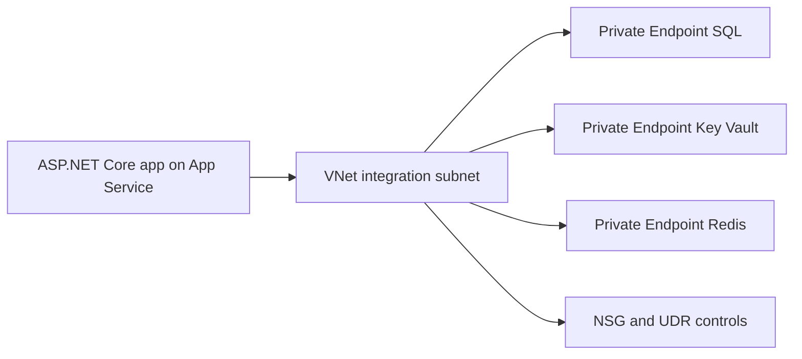

---
content_sources:
  diagrams:
    - id: vnet-integration
      type: flowchart
      source: mslearn-adapted
      mslearn_url: https://learn.microsoft.com/en-us/azure/app-service/overview-vnet-integration
---

# VNet Integration

Enable VNet integration for an ASP.NET Core 8 app so outbound calls to SQL, Redis, and Key Vault stay on private network paths.

<!-- diagram-id: vnet-integration -->


## Prerequisites

- App Service Plan tier that supports VNet integration
- Existing virtual network and delegated subnet for App Service
- Permissions to configure VNet, NSG, private endpoints, and DNS
- ASP.NET Core 8 app running on Windows App Service (do not use `--is-linux` for .NET setup)

## Main Content

### 1) Create delegated subnet for integration

```bash
az network vnet subnet create \
  --resource-group "$RG" \
  --vnet-name "vnet-appservice" \
  --name "snet-appservice-integration" \
  --address-prefixes "10.10.1.0/24" \
  --delegations "Microsoft.Web/serverFarms" \
  --output json
```

### 2) Attach App Service to subnet

```bash
az webapp vnet-integration add \
  --resource-group "$RG" \
  --name "$APP_NAME" \
  --vnet "vnet-appservice" \
  --subnet "snet-appservice-integration" \
  --output json
```

### 3) Enable route-all for controlled outbound (optional)

```bash
az webapp config appsettings set \
  --resource-group "$RG" \
  --name "$APP_NAME" \
  --settings WEBSITE_VNET_ROUTE_ALL=1 \
  --output json
```

### 4) Apply NSG policy baseline

Allow only required outbound traffic from integration subnet (for example ports 1433, 6380, 443), and monitor NSG flow logs.

### 5) Create private endpoints and link private DNS zones

Deploy private endpoints for SQL, Key Vault, and Redis in dedicated subnet(s), then link these zones to the app VNet:

- `privatelink.database.windows.net`
- `privatelink.vaultcore.azure.net`
- `privatelink.redis.cache.windows.net`

### 6) Configure dependency settings in `appsettings.json`

```json
{
  "ConnectionStrings": {
    "SqlServer": "Server=tcp:<sql-private-fqdn>,1433;Database=<db-name>;Encrypt=True;TrustServerCertificate=False;"
  },
  "Redis": {
    "Host": "<redis-private-fqdn>",
    "Port": 6380,
    "Ssl": true
  },
  "KeyVault": {
    "Uri": "https://<kv-name>.vault.azure.net/"
  }
}
```

### 7) Use `DefaultAzureCredential`, `Microsoft.Data.SqlClient`, and `StackExchange.Redis`

```csharp
using Azure.Identity;
using Microsoft.Data.SqlClient;
using StackExchange.Redis;

var credential = new DefaultAzureCredential();
var sqlToken = (await credential.GetTokenAsync(
    new Azure.Core.TokenRequestContext(new[] { "https://database.windows.net/.default" })
)).Token;

var connectionString = builder.Configuration.GetConnectionString("SqlServer");
using var sqlConnection = new SqlConnection(connectionString)
{
    AccessToken = sqlToken
};
await sqlConnection.OpenAsync();

var redisHost = builder.Configuration["Redis:Host"];
var redisPort = builder.Configuration["Redis:Port"];
var redis = await ConnectionMultiplexer.ConnectAsync($"{redisHost}:{redisPort},ssl=True,abortConnect=False");
```

### 8) Add CI validation checks for integration and endpoints

```yaml
- name: Validate VNet integration and private endpoints
  run: |
    az webapp vnet-integration list \
      --resource-group "$RG" \
      --name "$APP_NAME" \
      --output table
    az network private-endpoint list \
      --resource-group "$RG" \
      --output table
```

!!! note "Inbound versus outbound"
    VNet integration governs outbound connectivity from App Service.
    Inbound private access requires separate App Service private endpoint configuration.

## Verification

- `az webapp vnet-integration list` reports expected subnet integration.
- SQL, Redis, and Key Vault names resolve to private IPs in app diagnostics.
- ASP.NET Core app can connect without public network dependency.

## Troubleshooting

### SQL authentication or connection failure

- Confirm system-assigned managed identity is enabled.
- Verify Microsoft Entra SQL permissions for the app identity.
- Validate NSG/UDR path to SQL private endpoint.

### Redis connection timeout

- Confirm private DNS resolution for Redis hostname.
- Validate outbound allowance on TCP 6380.

### Connectivity regression after route-all

- Inspect route table and next hop configuration.
- Confirm required Azure control plane dependencies remain reachable.

## See Also

- [Azure SQL](azure-sql.md)
- [Redis Cache](redis.md)
- [Private Endpoints](private-endpoints.md)
- [Operations: Networking](../../../operations/networking.md)

## Sources

- [Integrate your app with an Azure virtual network](https://learn.microsoft.com/en-us/azure/app-service/configure-vnet-integration-enable)
- [Use private endpoints for Azure App Service apps](https://learn.microsoft.com/en-us/azure/app-service/networking/private-endpoint)
- [Tutorial: Connect to Azure SQL Database from ASP.NET Core on App Service without secrets using a managed identity](https://learn.microsoft.com/en-us/azure/app-service/tutorial-connect-msi-azure-database)
