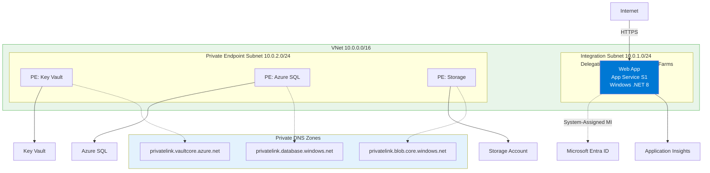
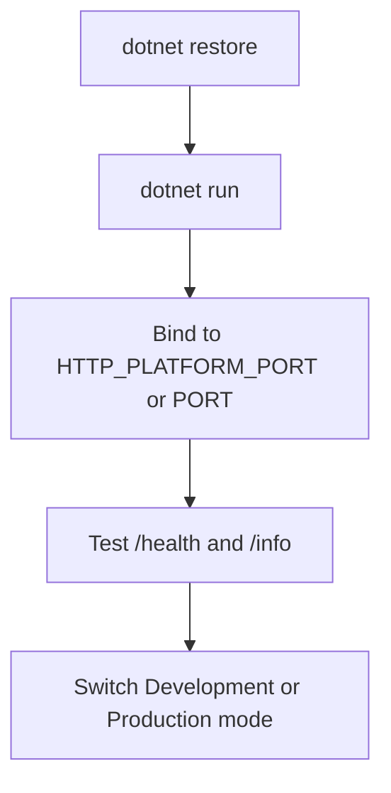

---
content_sources:
  diagrams:
    - id: 01-local-run
      type: flowchart
      source: mslearn-adapted
      mslearn_url: https://learn.microsoft.com/en-us/azure/app-service/
    - id: diagram-2
      type: flowchart
      source: mslearn-adapted
      mslearn_url: https://learn.microsoft.com/en-us/azure/app-service/
---
# 01. Local Run

Run the ASP.NET Core 8 reference API locally using the same port and environment conventions expected by Azure App Service on Windows.

!!! info "Infrastructure Context"
    **Service**: App Service (Windows, Standard S1) | **Network**: VNet integrated | **VNet**: ✅

    This tutorial assumes a production-ready App Service deployment with VNet integration, private endpoints for backend services, and managed identity for authentication.

<!-- diagram-id: 01-local-run -->


<!-- diagram-id: diagram-2 -->


## Prerequisites

- .NET 8 SDK installed (`dotnet --info`)
- Local clone of `azure-app-service-practical-guide`
- Terminal with access to `apps/dotnet-aspnetcore/GuideApi`

## What you'll learn

- How to start the API with `dotnet run`
- Why `HTTP_PLATFORM_PORT` matters on Windows App Service
- How to validate `/health` and `/info`
- How Development and Production modes differ

## Main content

### 1) Run the app

```bash
dotnet restore "apps/dotnet-aspnetcore/GuideApi/GuideApi.csproj"
dotnet run --project "apps/dotnet-aspnetcore/GuideApi/GuideApi.csproj"
```

| Command/Code | Purpose |
|--------------|---------|
| `dotnet restore "apps/dotnet-aspnetcore/GuideApi/GuideApi.csproj"` | Restores the NuGet packages required by the Guide API project. |
| `dotnet run --project "apps/dotnet-aspnetcore/GuideApi/GuideApi.csproj"` | Builds and starts the ASP.NET Core app locally. |

By default, the app listens on port `5000` if no environment variable is provided.

### 2) Understand port binding logic

`Program.cs` uses a Windows-first App Service binding sequence:

```csharp
var port = Environment.GetEnvironmentVariable("HTTP_PLATFORM_PORT")
    ?? Environment.GetEnvironmentVariable("PORT")
    ?? "5000";

builder.WebHost.UseUrls($"http://+:{port}");
```

| Command/Code | Purpose |
|--------------|---------|
| `Environment.GetEnvironmentVariable("HTTP_PLATFORM_PORT")` | Reads the Windows App Service port provided by IIS integration. |
| `Environment.GetEnvironmentVariable("PORT")` | Falls back to a generic hosting port variable when `HTTP_PLATFORM_PORT` is not set. |
| `?? "5000"` | Uses port `5000` as the local default when no platform variable exists. |
| `builder.WebHost.UseUrls($"http://+:{port}")` | Configures Kestrel to listen on the resolved port for local and hosted traffic. |

- `HTTP_PLATFORM_PORT`: provided by IIS integration on Windows App Service
- `PORT`: fallback used in some hosting environments
- `5000`: local fallback for developer machines

!!! warning "Do not hardcode localhost-only binding"
    `UseUrls("http://localhost:5000")` can fail in hosted environments.
    `http://+:{port}` ensures the worker accepts traffic from the platform front end.

### 3) Test core endpoints

```bash
curl --silent "http://localhost:5000/health"
curl --silent "http://localhost:5000/info"
```

| Command/Code | Purpose |
|--------------|---------|
| `curl --silent "http://localhost:5000/health"` | Calls the health endpoint to confirm the app is running. |
| `curl --silent "http://localhost:5000/info"` | Calls the info endpoint to inspect runtime metadata such as environment. |

Expected `/health` shape:

```json
{
  "status": "healthy",
  "timestamp": "2026-04-04T10:00:00.000Z"
}
```

### 4) Toggle environments locally

Run in Development:

```bash
ASPNETCORE_ENVIRONMENT=Development dotnet run --project "apps/dotnet-aspnetcore/GuideApi/GuideApi.csproj"
```

| Command/Code | Purpose |
|--------------|---------|
| `ASPNETCORE_ENVIRONMENT=Development dotnet run --project "apps/dotnet-aspnetcore/GuideApi/GuideApi.csproj"` | Starts the app with Development settings and middleware enabled. |

Run in Production:

```bash
ASPNETCORE_ENVIRONMENT=Production dotnet run --project "apps/dotnet-aspnetcore/GuideApi/GuideApi.csproj"
```

| Command/Code | Purpose |
|--------------|---------|
| `ASPNETCORE_ENVIRONMENT=Production dotnet run --project "apps/dotnet-aspnetcore/GuideApi/GuideApi.csproj"` | Starts the app with Production configuration for local parity checks. |

Typical differences:

- Developer exception pages are disabled in Production
- Logging filters may be stricter
- Production appsettings override behavior applies

### 5) Generate request logs

If your app includes sample logging routes, invoke them now to create telemetry baseline before cloud deployment.

```bash
curl --silent "http://localhost:5000/api/requests/log-levels?userId=local-user"
```

| Command/Code | Purpose |
|--------------|---------|
| `curl --silent "http://localhost:5000/api/requests/log-levels?userId=local-user"` | Sends a sample request that can generate log entries before deployment. |

### 6) Azure DevOps context (why this matters)

Local behavior should mirror pipeline-produced artifacts. A minimal pipeline step for local parity:

```yaml
- script: dotnet publish --configuration Release --output $(Build.ArtifactStagingDirectory)
  displayName: Publish app artifacts
  workingDirectory: apps/dotnet-aspnetcore/GuideApi
```

## Verification

- Terminal shows startup without port conflict
- `/health` returns HTTP 200 and JSON payload
- `/info` reports expected `environment` value
- No unhandled exception appears during test requests

```bash
curl --include --request GET "http://localhost:5000/health"
```

| Command/Code | Purpose |
|--------------|---------|
| `curl --include --request GET "http://localhost:5000/health"` | Verifies the health endpoint response including HTTP headers and status code. |

## Troubleshooting

### Port already in use

Stop the previous process and rerun, or test with platform-style port simulation:

```bash
HTTP_PLATFORM_PORT=5050 dotnet run --project "apps/dotnet-aspnetcore/GuideApi/GuideApi.csproj"
```

| Command/Code | Purpose |
|--------------|---------|
| `HTTP_PLATFORM_PORT=5050 dotnet run --project "apps/dotnet-aspnetcore/GuideApi/GuideApi.csproj"` | Simulates the port injection behavior used by Windows App Service. |

### Missing .NET SDK

```bash
dotnet --list-sdks
```

| Command/Code | Purpose |
|--------------|---------|
| `dotnet --list-sdks` | Lists installed .NET SDK versions on the local machine. |

Install .NET 8 SDK if not listed.

### Wrong environment behavior

Print current environment at startup:

```csharp
Console.WriteLine($"ASPNETCORE_ENVIRONMENT={builder.Environment.EnvironmentName}");
```

| Command/Code | Purpose |
|--------------|---------|
| `Console.WriteLine($"ASPNETCORE_ENVIRONMENT={builder.Environment.EnvironmentName}");` | Prints the effective ASP.NET Core environment during startup for debugging. |

## Run It in the Portal

#### Portal view: App Service plan - the deployment target this tutorial emulates locally


Your local ASP.NET Core run with `dotnet run` in this tutorial is meant to mirror the runtime shape of an App Service-hosted web app. This particular screenshot was captured from a Python deployment, so the visible `App Service Plan kind: Linux` and `Operating system: Linux` reflect that deployment; for the .NET 8 path in this guide the equivalent values read `Windows` because the deploy step uses `--runtime "DOTNETCORE:8.0"` on a Windows App Service plan. The `CPU Percentage` and `Memory Percentage` charts on the right are the Portal-side signals you compare against when local runs suggest the app is using too much CPU or memory under load, and the hosted-app list at the bottom confirms an App Service plan is the shared deployment target used by later tutorials.

## See Also

- [02. First Deploy](./02-first-deploy.md)
- [03. Configuration](./03-configuration.md)
- For platform details, see [Azure App Service Guide](https://yeongseon.github.io/azure-app-service-practical-guide/)

## Sources

- [Configure a .NET app for Azure App Service](https://learn.microsoft.com/en-us/azure/app-service/configure-language-dotnetcore)
- [Quickstart: Deploy an ASP.NET web app](https://learn.microsoft.com/en-us/azure/app-service/quickstart-dotnetcore)
