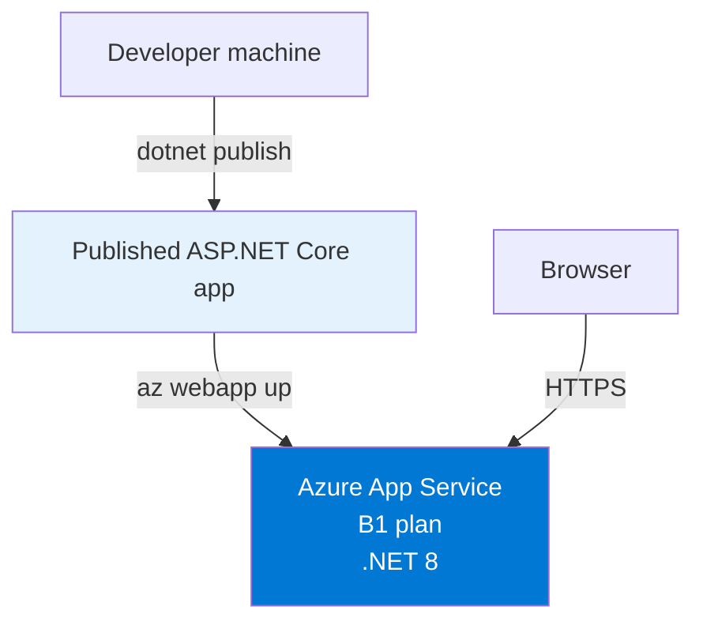
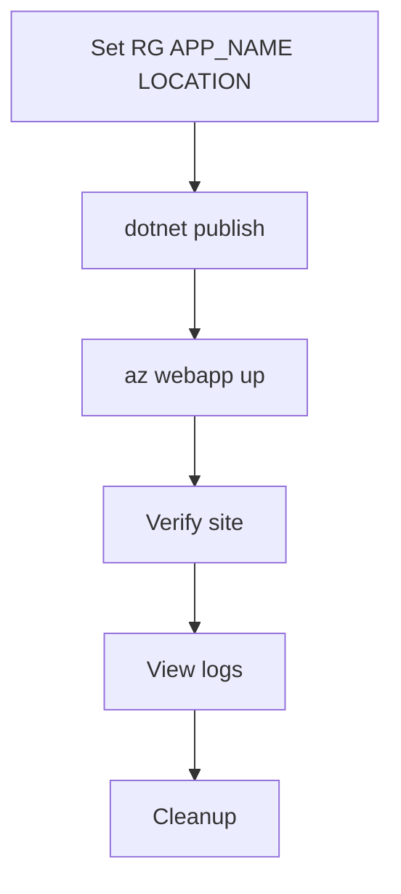

---
content_sources:
  diagrams:
    - id: 02-first-deploy
      type: flowchart
      source: mslearn-adapted
      mslearn_url: https://learn.microsoft.com/en-us/azure/app-service/quickstart-dotnetcore
    - id: 02-first-deploy-flow
      type: flowchart
      source: mslearn-adapted
      mslearn_url: https://learn.microsoft.com/en-us/azure/app-service/quickstart-dotnetcore
---

# 02 - First Deploy

Deploy the ASP.NET Core 8 sample to Azure App Service in a few minutes by publishing the app locally and using `az webapp up`.

<!-- diagram-id: 02-first-deploy -->


<!-- diagram-id: 02-first-deploy-flow -->


## Prerequisites

- Completed [01 - Local Run](./01-local-run.md)
- Azure CLI authenticated with `az login`
- .NET 8 SDK installed

!!! tip "Need private networking later?"
    For VNet integration, private endpoints, and managed identity, continue with [Private network deploy](../recipes/private-network-deploy.md).

## Main Content

### Step 1: Set deployment variables

```bash
RG="rg-dotnet-guide"
APP_NAME="app-dotnet-guide-abc123"
LOCATION="koreacentral"
```

| Command/Parameter | Purpose |
|-------------------|---------|
| `RG="rg-dotnet-guide"` | Defines the resource group name for the tutorial deployment. |
| `APP_NAME="app-dotnet-guide-abc123"` | Sets a globally unique App Service app name. |
| `LOCATION="koreacentral"` | Chooses the Azure region for the App Service resources. |

### Step 2: Build the app

Run `dotnet publish` from the repository root to create deployable output in `./publish`.

```bash
dotnet publish "apps/dotnet-aspnetcore/GuideApi/GuideApi.csproj" --configuration Release --output "./publish"
```

| Command/Parameter | Purpose |
|-------------------|---------|
| `dotnet publish "apps/dotnet-aspnetcore/GuideApi/GuideApi.csproj" --configuration Release --output "./publish"` | Restores, builds, and writes the App Service-ready files to the `publish` directory. |
| `dotnet publish` | Runs the .NET publish pipeline for the specified project. |
| `"apps/dotnet-aspnetcore/GuideApi/GuideApi.csproj"` | Points `dotnet publish` to the ASP.NET Core project file to build. |
| `--configuration Release` | Produces optimized release artifacts instead of development output. |
| `--output "./publish"` | Places the deployment files in a predictable folder for the next step. |

???+ example "Expected output"
    ```text
    Determining projects to restore...
    All projects are up-to-date for restore.
    GuideApi -> /.../publish/GuideApi.dll
    ```

### Step 3: Deploy with `az webapp up`

Run the deployment from the `publish` directory so App Service receives the published artifacts.

```bash
cd "./publish"
az webapp up --name "$APP_NAME" --resource-group "$RG" --location "$LOCATION" --runtime "DOTNETCORE:8.0" --sku B1
```

| Command/Parameter | Purpose |
|-------------------|---------|
| `cd "./publish"` | Moves into the folder that contains the published deployment payload. |
| `"./publish"` | Specifies the directory that contains the published ASP.NET Core files. |
| `az webapp up --name "$APP_NAME" --resource-group "$RG" --location "$LOCATION" --runtime "DOTNETCORE:8.0" --sku B1` | Creates the resource group, App Service plan, and web app if needed, then deploys the current directory. |
| `--name "$APP_NAME"` | Uses the globally unique web app name for the deployment target. |
| `--resource-group "$RG"` | Places all created resources in the selected resource group. |
| `--location "$LOCATION"` | Creates the App Service resources in the selected Azure region. |
| `--runtime "DOTNETCORE:8.0"` | Selects the .NET 8 App Service runtime. |
| `--sku B1` | Uses the Basic B1 App Service pricing tier. |

???+ example "Expected output"
    ```text
    Creating Resource group 'rg-dotnet-guide' ...
    Creating AppServicePlan 'appsvc_asp_Linux_koreacentral' ...
    Creating webapp 'app-dotnet-guide-abc123' ...
    Configuring default logging for the app...
    Deployment successful.
    You can launch the app at http://app-dotnet-guide-abc123.azurewebsites.net
    ```

### Step 4: Verify deployment

```bash
WEB_APP_URL="https://$(az webapp show --resource-group "$RG" --name "$APP_NAME" --query defaultHostName --output tsv)"
curl --include "$WEB_APP_URL/health"
```

| Command/Parameter | Purpose |
|-------------------|---------|
| `WEB_APP_URL="https://$(az webapp show --resource-group "$RG" --name "$APP_NAME" --query defaultHostName --output tsv)"` | Builds the app URL from the default hostname returned by App Service. |
| `az webapp show --resource-group "$RG" --name "$APP_NAME" --query defaultHostName --output tsv` | Returns only the default hostname for the deployed app. |
| `--resource-group "$RG"` | Queries the web app in the tutorial resource group. |
| `--name "$APP_NAME"` | Selects the deployed ASP.NET Core app to inspect. |
| `--query defaultHostName` | Extracts only the default hostname field from the response. |
| `--output tsv` | Formats the hostname as plain text for shell substitution. |
| `curl --include "$WEB_APP_URL/health"` | Calls the sample health endpoint to confirm the deployment is serving requests. |
| `--include` | Includes the HTTP response headers in the curl output. |

???+ example "Expected output"
    ```text
    HTTP/1.1 200 OK
    Content-Type: application/json; charset=utf-8

    {"status":"healthy"}
    ```

### Step 5: View logs

```bash
az webapp log config --resource-group "$RG" --name "$APP_NAME" --application-logging filesystem --level information
az webapp log tail --resource-group "$RG" --name "$APP_NAME"
```

| Command/Parameter | Purpose |
|-------------------|---------|
| `az webapp log config --resource-group "$RG" --name "$APP_NAME" --application-logging filesystem --level information` | Enables filesystem application logging so you can stream recent app events. |
| `--resource-group "$RG"` | Targets the resource group that contains the web app. |
| `--name "$APP_NAME"` | Selects the web app to configure for logging. |
| `--application-logging filesystem` | Stores application logs on the App Service filesystem. |
| `--level information` | Captures informational, warning, and error log events. |
| `az webapp log tail --resource-group "$RG" --name "$APP_NAME"` | Streams live application logs from the deployed web app. |
| `--resource-group "$RG"` | Reads logs from the tutorial resource group. |
| `--name "$APP_NAME"` | Streams logs for the deployed ASP.NET Core app. |

### Step 6: Cleanup

```bash
az group delete --name "$RG" --yes --no-wait
```

| Command/Parameter | Purpose |
|-------------------|---------|
| `az group delete --name "$RG" --yes --no-wait` | Deletes the resource group and all App Service resources created by this tutorial. |
| `--name "$RG"` | Targets the tutorial resource group for deletion. |
| `--yes` | Skips the interactive confirmation prompt. |
| `--no-wait` | Starts deletion asynchronously so the shell returns immediately. |

## Verification

- `az webapp up` completes successfully
- `/health` returns HTTP 200
- Log streaming connects without errors

## Troubleshooting

### App name already taken

App Service names are globally unique. Change the app name and rerun deployment.

```bash
APP_NAME="app-dotnet-guide-$(date +%s)"
```

| Command/Parameter | Purpose |
|-------------------|---------|
| `APP_NAME="app-dotnet-guide-$(date +%s)"` | Creates a more unique app name when the original name is unavailable. |
| `date +%s` | Generates a Unix timestamp to make the app name unique. |

### Health check fails after deployment

- Wait a minute for startup to finish and retry the request.
- Review `az webapp log tail` output for startup exceptions.
- Confirm the publish step completed successfully before deployment.

## See Also

- [01 - Local Run](./01-local-run.md)
- [03 - Configuration](./03-configuration.md)
- [Private network deploy](../recipes/private-network-deploy.md)

## Sources

- [Quickstart: Deploy an ASP.NET web app](https://learn.microsoft.com/en-us/azure/app-service/quickstart-dotnetcore)
- [az webapp up](https://learn.microsoft.com/en-us/cli/azure/webapp#az-webapp-up)
