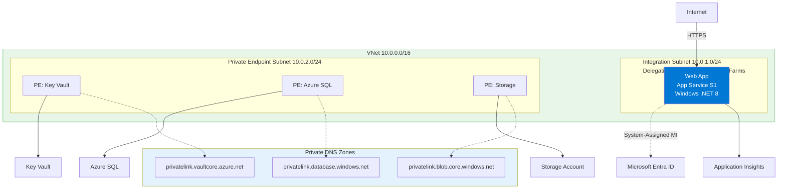
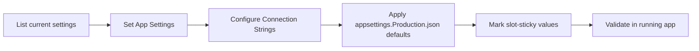

---
content_sources:
  diagrams:
    - id: 03-configuration
      type: flowchart
      source: mslearn-adapted
      mslearn_url: https://learn.microsoft.com/en-us/azure/app-service/configure-common
    - id: diagram-2
      type: flowchart
      source: mslearn-adapted
      mslearn_url: https://learn.microsoft.com/en-us/azure/app-service/configure-common
---

# 03. Configuration

Manage ASP.NET Core configuration safely in Azure App Service using App Settings, Connection Strings, environment-specific files, and slot-sticky values.

!!! info "Infrastructure Context"
    **Service**: App Service (Windows, Standard S1) | **Network**: VNet integrated | **VNet**: ✅

    This tutorial assumes a production-ready App Service deployment with VNet integration, private endpoints for backend services, and managed identity for authentication.

<!-- diagram-id: 03-configuration -->


<!-- diagram-id: diagram-2 -->


## Prerequisites

- Tutorial [02. First Deploy](./02-first-deploy.md) completed
- Existing Windows App Service app name and resource group

## What you'll learn

- App Settings and Connection Strings behavior in App Service
- `ASPNETCORE_ENVIRONMENT` and `appsettings.Production.json` patterns
- Slot-sticky settings for staging/production swap safety

## Main content

### 1) List current App Settings

```bash
az webapp config appsettings list \
  --resource-group "$RESOURCE_GROUP_NAME" \
  --name "$WEB_APP_NAME" \
  --output table
```

| Command/Code | Purpose |
|--------------|---------|
| `az webapp config appsettings list --resource-group "$RESOURCE_GROUP_NAME" --name "$WEB_APP_NAME" --output table` | Lists the current App Service application settings in table form. |

Use App Settings for non-secret and secret values, but prefer managed identity where possible.

### 2) Set environment and app-level options

```bash
az webapp config appsettings set \
  --resource-group "$RESOURCE_GROUP_NAME" \
  --name "$WEB_APP_NAME" \
  --settings ASPNETCORE_ENVIRONMENT=Production Logging__LogLevel__Default=Information FeatureFlags__UseBeta=false \
  --output json
```

| Command/Code | Purpose |
|--------------|---------|
| `az webapp config appsettings set --resource-group "$RESOURCE_GROUP_NAME" --name "$WEB_APP_NAME" --settings ASPNETCORE_ENVIRONMENT=Production Logging__LogLevel__Default=Information FeatureFlags__UseBeta=false --output json` | Sets environment and application configuration values for the web app. |

In ASP.NET Core, `__` maps to `:` in hierarchical keys.

### 3) Configure Connection Strings (typed)

```bash
az webapp config connection-string set \
  --resource-group "$RESOURCE_GROUP_NAME" \
  --name "$WEB_APP_NAME" \
  --connection-string-type SQLAzure \
  --settings MainDb="Server=tcp:<server>.database.windows.net,1433;Database=<db>;Authentication=Active Directory Managed Identity;Encrypt=True;TrustServerCertificate=False;"
```

| Command/Code | Purpose |
|--------------|---------|
| `az webapp config connection-string set --resource-group "$RESOURCE_GROUP_NAME" --name "$WEB_APP_NAME" --connection-string-type SQLAzure --settings MainDb="..."` | Adds a typed Azure SQL connection string to the web app configuration. |

App Service exposes this as `SQLAZURECONNSTR_MainDb` to the process.

### 4) Production appsettings pattern

Create `appsettings.Production.json` for environment-specific defaults that are safe to commit:

```json
{
  "Logging": {
    "LogLevel": {
      "Default": "Information",
      "Microsoft.AspNetCore": "Warning"
    }
  },
  "FeatureFlags": {
    "UseBeta": false
  }
}
```

Then use App Settings to override values per environment without rebuilding.

### 5) Read settings in controller/service code

```csharp
public sealed record FeatureFlags(bool UseBeta);

builder.Services.Configure<FeatureFlags>(
    builder.Configuration.GetSection("FeatureFlags"));
```

| Command/Code | Purpose |
|--------------|---------|
| `public sealed record FeatureFlags(bool UseBeta);` | Defines a strongly typed configuration model for feature flags. |
| `builder.Services.Configure<FeatureFlags>(builder.Configuration.GetSection("FeatureFlags"));` | Binds the `FeatureFlags` configuration section to the typed options model. |

```csharp
public sealed class InfoController : ControllerBase
{
    private readonly IConfiguration _configuration;
    public InfoController(IConfiguration configuration) => _configuration = configuration;

    [HttpGet("info")]
    public IActionResult Get()
        => Ok(new
        {
            environment = _configuration["ASPNETCORE_ENVIRONMENT"] ?? "Production",
            useBeta = _configuration["FeatureFlags:UseBeta"]
        });
}
```

| Command/Code | Purpose |
|--------------|---------|
| `_configuration["ASPNETCORE_ENVIRONMENT"] ?? "Production"` | Reads the effective environment name with a production fallback. |
| `_configuration["FeatureFlags:UseBeta"]` | Reads a nested feature flag value from configuration. |
| `Ok(new { ... })` | Returns the resolved configuration values in the API response. |

### 6) Slot-sticky settings

Use slot settings for values that must stay with a slot during swap (for example, staging database connection).

```bash
az webapp config appsettings set \
  --resource-group "$RESOURCE_GROUP_NAME" \
  --name "$WEB_APP_NAME" \
  --slot "staging" \
  --slot-settings ConnectionStrings__MainDb="Server=tcp:<staging-server>.database.windows.net,1433;Database=<staging-db>;Authentication=Active Directory Managed Identity;Encrypt=True;"
```

| Command/Code | Purpose |
|--------------|---------|
| `az webapp config appsettings set --resource-group "$RESOURCE_GROUP_NAME" --name "$WEB_APP_NAME" --slot "staging" --slot-settings ConnectionStrings__MainDb="..."` | Sets a staging-slot-only setting that stays with the slot during swaps. |

!!! warning "Never let staging data source swap into production"
    Mark environment-specific endpoints and credentials as slot-sticky.
    This prevents accidental production traffic against non-production dependencies.

### 7) Azure DevOps variable group mapping

```yaml
variables:
  - group: dotnet-guide-production
  - name: webAppName
    value: '<app-name>'

- task: AzureAppServiceSettings@1
  inputs:
    azureSubscription: $(azureSubscription)
    appName: $(webAppName)
    resourceGroupName: $(resourceGroupName)
    appSettings: |
      [
        { "name": "ASPNETCORE_ENVIRONMENT", "value": "Production", "slotSetting": false },
        { "name": "FeatureFlags__UseBeta", "value": "false", "slotSetting": true }
      ]
```

## Verification

```bash
az webapp config appsettings list --resource-group "$RESOURCE_GROUP_NAME" --name "$WEB_APP_NAME" --output table
curl --silent "https://$WEB_APP_NAME.azurewebsites.net/info"
```

| Command/Code | Purpose |
|--------------|---------|
| `az webapp config appsettings list --resource-group "$RESOURCE_GROUP_NAME" --name "$WEB_APP_NAME" --output table` | Verifies the configured App Settings on the deployed app. |
| `curl --silent "https://$WEB_APP_NAME.azurewebsites.net/info"` | Calls the app endpoint to confirm configuration values are being read at runtime. |

Check that:

- `ASPNETCORE_ENVIRONMENT` is `Production`
- App reads hierarchical configuration keys correctly
- Slot-specific values remain in their slot

## Troubleshooting

### App ignores changed settings

Restart app after major config updates:

```bash
az webapp restart --resource-group "$RESOURCE_GROUP_NAME" --name "$WEB_APP_NAME" --output none
```

| Command/Code | Purpose |
|--------------|---------|
| `az webapp restart --resource-group "$RESOURCE_GROUP_NAME" --name "$WEB_APP_NAME" --output none` | Restarts the web app so configuration changes are fully applied. |

### Connection string not found

Inspect effective environment variables through Kudu or startup logging and confirm expected prefix (`SQLAZURECONNSTR_`, `CUSTOMCONNSTR_`).

### JSON section not binding

Verify key names and nesting in `appsettings.*.json`, and ensure environment variable separators use double underscores.

## See Also

- [04. Logging & Monitoring](./04-logging-monitoring.md)
- [Recipes: Key Vault References](../recipes/key-vault-reference.md)
- For platform details, see [Azure App Service Guide](https://yeongseon.github.io/azure-app-service-practical-guide/)

## Sources

- [Configure an App Service app](https://learn.microsoft.com/en-us/azure/app-service/configure-common)
- [Configure a .NET app for Azure App Service](https://learn.microsoft.com/en-us/azure/app-service/configure-language-dotnetcore)
- [Use Key Vault references for App Service](https://learn.microsoft.com/en-us/azure/app-service/app-service-key-vault-references)
