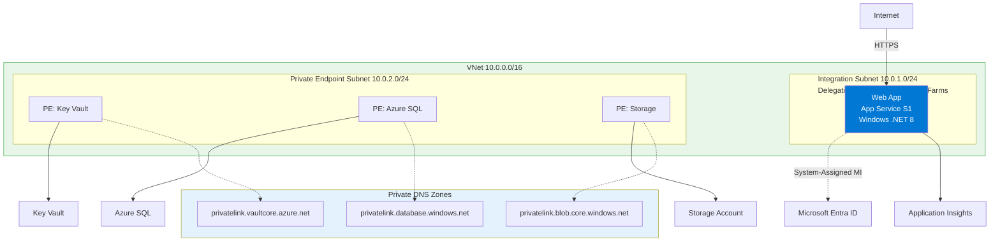
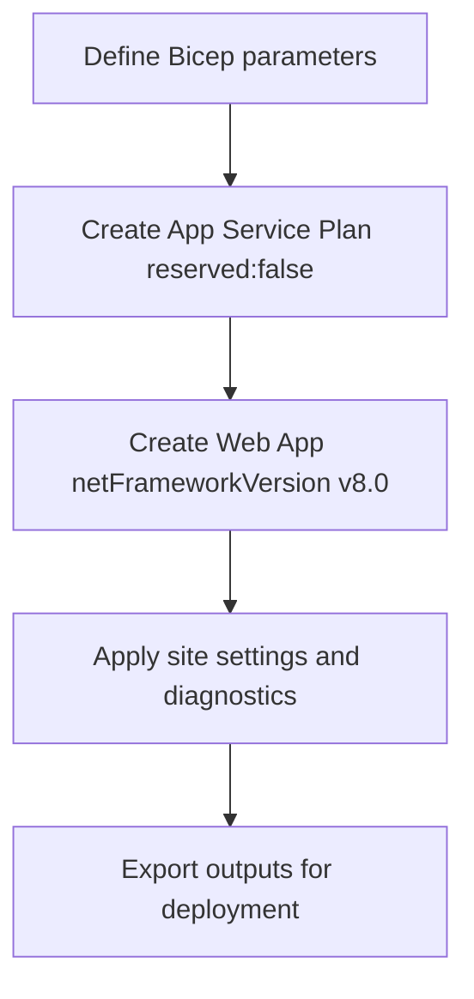

---
content_sources:
  diagrams:
    - id: 05-infrastructure-as-code
      type: flowchart
      source: mslearn-adapted
      mslearn_url: https://learn.microsoft.com/en-us/azure/app-service/
    - id: diagram-2
      type: flowchart
      source: mslearn-adapted
      mslearn_url: https://learn.microsoft.com/en-us/azure/app-service/
---

# 05. Infrastructure as Code

Use Bicep to provision reproducible Windows App Service infrastructure for ASP.NET Core 8, including diagnostics and deployment-ready outputs.

!!! info "Infrastructure Context"
    **Service**: App Service (Windows, Standard S1) | **Network**: VNet integrated | **VNet**: ✅

    This tutorial assumes a production-ready App Service deployment with VNet integration, private endpoints for backend services, and managed identity for authentication.

<!-- diagram-id: 05-infrastructure-as-code -->


<!-- diagram-id: diagram-2 -->


## Prerequisites

- Tutorial [04. Logging & Monitoring](./04-logging-monitoring.md) completed
- Basic understanding of Azure Resource Manager and Bicep modules

## What you'll learn

- How the guide's Bicep template models Windows App Service
- Why `reserved: false` is required for Windows plans
- How runtime metadata (`netFrameworkVersion`, `CURRENT_STACK`) is set
- How outputs support manual deploy and Azure DevOps stages

## Main content

### 1) Core deployment command

```bash
az deployment group create \
  --resource-group "$RESOURCE_GROUP_NAME" \
  --template-file "infra/main.bicep" \
  --parameters baseName="$BASE_NAME" location="$LOCATION" appServicePlanSku="B1" \
  --output table
```

| Command/Code | Purpose |
|--------------|---------|
| `az deployment group create --resource-group "$RESOURCE_GROUP_NAME" --template-file "infra/main.bicep" --parameters baseName="$BASE_NAME" location="$LOCATION" appServicePlanSku="B1" --output table` | Deploys the Bicep template to the target resource group with the supplied parameters. |

### 2) Windows App Service plan essentials

In Bicep, Windows App Service must **not** be marked as Linux reserved.

```bicep
resource appServicePlan 'Microsoft.Web/serverfarms@2023-01-01' = {
  name: appServicePlanName
  location: location
  sku: {
    name: appServicePlanSku
    tier: 'Basic'
  }
  kind: 'app'
  properties: {
    reserved: false
  }
}
```

| Command/Code | Purpose |
|--------------|---------|
| `resource appServicePlan 'Microsoft.Web/serverfarms@2023-01-01'` | Declares the App Service plan resource in Bicep. |
| `sku: { name: appServicePlanSku tier: 'Basic' }` | Sets the pricing SKU and tier for the hosting plan. |
| `kind: 'app'` | Marks the plan as an App Service plan for web apps. |
| `reserved: false` | Ensures the plan is created as Windows, not Linux. |

### 3) Web app runtime settings for .NET 8

```bicep
resource webApp 'Microsoft.Web/sites@2023-01-01' = {
  name: webAppName
  location: location
  kind: 'app'
  properties: {
    serverFarmId: appServicePlan.id
    siteConfig: {
      netFrameworkVersion: 'v8.0'
      metadata: [
        {
          name: 'CURRENT_STACK'
          value: 'dotnet'
        }
      ]
    }
  }
}
```

| Command/Code | Purpose |
|--------------|---------|
| `resource webApp 'Microsoft.Web/sites@2023-01-01'` | Declares the App Service site resource in Bicep. |
| `serverFarmId: appServicePlan.id` | Links the web app to the App Service plan created earlier. |
| `netFrameworkVersion: 'v8.0'` | Configures the Windows App Service runtime for .NET 8. |
| `metadata: [{ name: 'CURRENT_STACK' value: 'dotnet' }]` | Sets stack metadata so the portal reflects the intended runtime. |

These fields keep the portal/runtime aligned with the intended stack for Windows-hosted .NET apps.

### 4) App settings defined as code

```bicep
resource appSettings 'Microsoft.Web/sites/config@2023-01-01' = {
  name: '${webApp.name}/appsettings'
  properties: {
    ASPNETCORE_ENVIRONMENT: 'Production'
    WEBSITE_RUN_FROM_PACKAGE: '1'
    APPLICATIONINSIGHTS_CONNECTION_STRING: appInsights.properties.ConnectionString
  }
}
```

| Command/Code | Purpose |
|--------------|---------|
| `resource appSettings 'Microsoft.Web/sites/config@2023-01-01'` | Declares the App Settings configuration resource for the web app. |
| `ASPNETCORE_ENVIRONMENT: 'Production'` | Sets the app to run with production configuration by default. |
| `WEBSITE_RUN_FROM_PACKAGE: '1'` | Tells App Service to run the app from a deployed package. |
| `APPLICATIONINSIGHTS_CONNECTION_STRING: appInsights.properties.ConnectionString` | Injects the Application Insights connection string into app settings. |

### 5) Outputs for downstream automation

```bicep
output webAppName string = webApp.name
output webAppUrl string = 'https://${webApp.properties.defaultHostName}'
output appInsightsName string = appInsights.name
```

| Command/Code | Purpose |
|--------------|---------|
| `output webAppName string = webApp.name` | Exposes the deployed web app name for downstream scripts or pipelines. |
| `output webAppUrl string = 'https://${webApp.properties.defaultHostName}'` | Exposes the default HTTPS URL of the deployed web app. |
| `output appInsightsName string = appInsights.name` | Exposes the Application Insights resource name for later steps. |

Outputs are consumed by deployment scripts and pipeline variable mapping.

### 6) Tie IaC choices to application code

```csharp
var port = Environment.GetEnvironmentVariable("HTTP_PLATFORM_PORT")
    ?? Environment.GetEnvironmentVariable("PORT")
    ?? "5000";

builder.WebHost.UseUrls($"http://+:{port}");
builder.Services.AddApplicationInsightsTelemetry();
```

| Command/Code | Purpose |
|--------------|---------|
| `Environment.GetEnvironmentVariable("HTTP_PLATFORM_PORT")` | Reads the platform-provided port used by Windows App Service. |
| `Environment.GetEnvironmentVariable("PORT")` | Falls back to another common hosting port variable. |
| `builder.WebHost.UseUrls($"http://+:{port}")` | Binds the app to the resolved port so infrastructure and app agree. |
| `builder.Services.AddApplicationInsightsTelemetry();` | Enables telemetry collection that matches the provisioned monitoring resources. |

Infrastructure and code should agree on runtime assumptions: port injection, telemetry connection string, and production environment.

### 7) Azure DevOps IaC stage example

```yaml
- stage: Infra
  displayName: Provision Infrastructure
  jobs:
    - job: DeployBicep
      steps:
        - task: AzureCLI@2
          inputs:
            azureSubscription: $(azureSubscription)
            scriptType: bash
            scriptLocation: inlineScript
            inlineScript: |
              az deployment group create \
                --resource-group $(resourceGroupName) \
                --template-file infra/main.bicep \
                --parameters baseName=$(baseName) location=$(location) \
                --output table
```

!!! note "Separate infra and app deploy in production"
    Keep infrastructure deployment idempotent and infrequent.
    Deploy app code frequently against stable infrastructure.

## Verification

```bash
az webapp show --resource-group "$RESOURCE_GROUP_NAME" --name "$WEB_APP_NAME" --output json
```

| Command/Code | Purpose |
|--------------|---------|
| `az webapp show --resource-group "$RESOURCE_GROUP_NAME" --name "$WEB_APP_NAME" --output json` | Retrieves the deployed web app resource definition for verification. |

Check:

- App Service Plan kind is `app` (Windows)
- `reserved` is `false`
- Site runtime metadata reflects .NET stack
- App Insights connection string exists in App Settings

## Troubleshooting

### Runtime mismatch in portal

Confirm `siteConfig.netFrameworkVersion` and metadata were applied in the deployed template.

### Bicep deployment drift

Run a what-if before applying changes:

```bash
az deployment group what-if \
  --resource-group "$RESOURCE_GROUP_NAME" \
  --template-file "infra/main.bicep" \
  --parameters baseName="$BASE_NAME" location="$LOCATION"
```

| Command/Code | Purpose |
|--------------|---------|
| `az deployment group what-if --resource-group "$RESOURCE_GROUP_NAME" --template-file "infra/main.bicep" --parameters baseName="$BASE_NAME" location="$LOCATION"` | Previews infrastructure changes before applying the Bicep deployment. |

### Hidden dependency ordering issue

Split resources into modules and expose explicit outputs/inputs to avoid implicit timing assumptions.

## CLI Alternative (No Bicep)

Use this imperative path when you need quick provisioning without changing your Bicep workflow.

### Step 1: Set variables

```bash
SUBSCRIPTION_ID="<subscription-id>"
RG="rg-dotnet-tutorial"
LOCATION="koreacentral"
PLAN_NAME="plan-dotnet-tutorial-s1"
APP_NAME="app-dotnet-tutorial-abc123"
VNET_NAME="vnet-dotnet-tutorial"
INTEGRATION_SUBNET_NAME="snet-appsvc-integration"
```

| Command/Code | Purpose |
|--------------|---------|
| `SUBSCRIPTION_ID="<subscription-id>"` | Stores the Azure subscription used for imperative provisioning. |
| `RG`, `LOCATION`, `PLAN_NAME`, `APP_NAME` | Define the core resource group, region, plan, and web app names. |
| `VNET_NAME`, `INTEGRATION_SUBNET_NAME` | Define the networking resources used for VNet integration. |

???+ example "Expected output"
    ```text
    Variables are set for deployment:
    RG=rg-dotnet-tutorial
    PLAN_NAME=plan-dotnet-tutorial-s1
    APP_NAME=app-dotnet-tutorial-abc123
    ```

### Step 2: Create resource group, plan, and app

```bash
az account set --subscription $SUBSCRIPTION_ID
az group create --name $RG --location $LOCATION
az appservice plan create --resource-group $RG --name $PLAN_NAME --sku S1
az webapp create --resource-group $RG --plan $PLAN_NAME --name $APP_NAME --runtime "DOTNETCORE|8.0"
```

| Command/Code | Purpose |
|--------------|---------|
| `az account set --subscription $SUBSCRIPTION_ID` | Sets the active subscription for the CLI session. |
| `az group create --name $RG --location $LOCATION` | Creates the resource group for the manual deployment path. |
| `az appservice plan create --resource-group $RG --name $PLAN_NAME --sku S1` | Creates the App Service plan that will host the app. |
| `az webapp create --resource-group $RG --plan $PLAN_NAME --name $APP_NAME --runtime "DOTNETCORE\|8.0"` | Creates the .NET 8 App Service instance. |

???+ example "Expected output"
    ```json
    {
      "defaultHostName": "app-dotnet-tutorial-abc123.azurewebsites.net",
      "state": "Running"
    }
    ```

### Step 3: Configure app settings

```bash
az webapp config appsettings set --resource-group $RG --name $APP_NAME --settings ASPNETCORE_ENVIRONMENT=Production WEBSITE_RUN_FROM_PACKAGE=1
```

| Command/Code | Purpose |
|--------------|---------|
| `az webapp config appsettings set --resource-group $RG --name $APP_NAME --settings ASPNETCORE_ENVIRONMENT=Production WEBSITE_RUN_FROM_PACKAGE=1` | Applies production environment and package-based deployment settings to the app. |

???+ example "Expected output"
    ```json
    [
      {
        "name": "ASPNETCORE_ENVIRONMENT",
        "value": "Production"
      },
      {
        "name": "WEBSITE_RUN_FROM_PACKAGE",
        "value": "1"
      }
    ]
    ```

### Step 4 (Optional): Add VNet integration

```bash
az network vnet create --resource-group $RG --name $VNET_NAME --location $LOCATION --address-prefixes 10.0.0.0/16
az network vnet subnet create --resource-group $RG --vnet-name $VNET_NAME --name $INTEGRATION_SUBNET_NAME --address-prefixes 10.0.1.0/24 --delegations Microsoft.Web/serverFarms
az webapp vnet-integration add --resource-group $RG --name $APP_NAME --vnet $VNET_NAME --subnet $INTEGRATION_SUBNET_NAME
```

| Command/Code | Purpose |
|--------------|---------|
| `az network vnet create --resource-group $RG --name $VNET_NAME --location $LOCATION --address-prefixes 10.0.0.0/16` | Creates the virtual network for the manual provisioning path. |
| `az network vnet subnet create --resource-group $RG --vnet-name $VNET_NAME --name $INTEGRATION_SUBNET_NAME --address-prefixes 10.0.1.0/24 --delegations Microsoft.Web/serverFarms` | Creates the delegated subnet required by App Service VNet integration. |
| `az webapp vnet-integration add --resource-group $RG --name $APP_NAME --vnet $VNET_NAME --subnet $INTEGRATION_SUBNET_NAME` | Attaches the web app to the integration subnet. |

???+ example "Expected output"
    ```json
    {
      "isSwift": true,
      "subnetResourceId": "/subscriptions/<subscription-id>/resourceGroups/rg-dotnet-tutorial/providers/Microsoft.Network/virtualNetworks/vnet-dotnet-tutorial/subnets/snet-appsvc-integration"
    }
    ```

### Step 5: Validate effective configuration

```bash
az webapp config show --resource-group $RG --name $APP_NAME --query "{netFrameworkVersion:netFrameworkVersion, windowsFxVersion:windowsFxVersion}" --output json
az webapp config appsettings list --resource-group $RG --name $APP_NAME --query "[?name=='ASPNETCORE_ENVIRONMENT' || name=='WEBSITE_RUN_FROM_PACKAGE']" --output json
```

| Command/Code | Purpose |
|--------------|---------|
| `az webapp config show --resource-group $RG --name $APP_NAME --query "{netFrameworkVersion:netFrameworkVersion, windowsFxVersion:windowsFxVersion}" --output json` | Checks the effective runtime stack configuration on the deployed app. |
| `az webapp config appsettings list --resource-group $RG --name $APP_NAME --query "[?name=='ASPNETCORE_ENVIRONMENT' || name=='WEBSITE_RUN_FROM_PACKAGE']" --output json` | Verifies the key App Settings applied to the app. |

???+ example "Expected output"
    ```json
    {
      "netFrameworkVersion": "v8.0",
      "windowsFxVersion": null
    }
    ```

## See Also

- [06. CI/CD](./06-ci-cd.md)
- [02. First Deploy](./02-first-deploy.md)
- For platform details, see [Azure App Service Guide](https://yeongseon.github.io/azure-app-service-practical-guide/)

## Sources

- [Deploy Bicep files by using Azure CLI](https://learn.microsoft.com/en-us/azure/azure-resource-manager/bicep/deploy-cli)
- [Microsoft.Web/sites Bicep resource](https://learn.microsoft.com/en-us/azure/templates/microsoft.web/sites)
