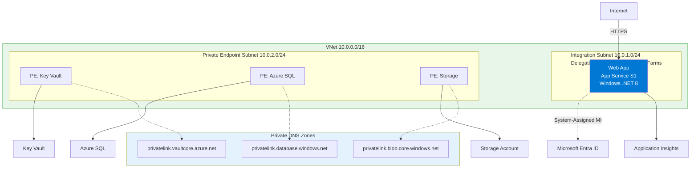
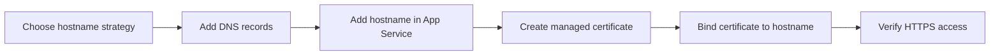

---
content_sources:
  diagrams:
    - id: 07-custom-domain-ssl
      type: flowchart
      source: mslearn-adapted
      mslearn_url: https://learn.microsoft.com/en-us/azure/app-service/app-service-web-tutorial-custom-domain
    - id: diagram-2
      type: flowchart
      source: mslearn-adapted
      mslearn_url: https://learn.microsoft.com/en-us/azure/app-service/app-service-web-tutorial-custom-domain
---

# 07. Custom Domain & SSL

Map a custom domain to your Windows App Service app, validate ownership, and secure traffic with a managed TLS certificate.

!!! info "Infrastructure Context"
    **Service**: App Service (Windows, Standard S1) | **Network**: VNet integrated | **VNet**: ✅

    This tutorial assumes a production-ready App Service deployment with VNet integration, private endpoints for backend services, and managed identity for authentication.

<!-- diagram-id: 07-custom-domain-ssl -->


<!-- diagram-id: diagram-2 -->


## Prerequisites

- Tutorial [06. CI/CD](./06-ci-cd.md) completed
- Existing public domain you can manage in DNS
- Production app already serving traffic on `*.azurewebsites.net`

## What you'll learn

- Add and verify a custom hostname
- Configure required DNS records safely
- Bind an App Service managed certificate
- Automate domain checks in Azure DevOps release flow

## Main content

### 1) Decide domain strategy

Common patterns:

- `api.contoso.com` (API only)
- `www.contoso.com` and `api.contoso.com` split by app
- Temporary cutover hostname such as `api-next.contoso.com`

### 2) Retrieve default app hostname

```bash
az webapp show \
  --resource-group "$RESOURCE_GROUP_NAME" \
  --name "$WEB_APP_NAME" \
  --query "defaultHostName" \
  --output tsv
```

| Command/Code | Purpose |
|--------------|---------|
| `az webapp show --resource-group "$RESOURCE_GROUP_NAME" --name "$WEB_APP_NAME" --query "defaultHostName" --output tsv` | Returns the default Azure-hosted hostname for the web app. |

### 3) Add DNS records

For subdomain (`api.contoso.com`), add CNAME:

- Name: `api`
- Value: `<web-app-name>.azurewebsites.net`

For apex/root domain, use A/ALIAS approach recommended by your DNS provider.

### 4) Add custom hostname in App Service

```bash
az webapp config hostname add \
  --resource-group "$RESOURCE_GROUP_NAME" \
  --webapp-name "$WEB_APP_NAME" \
  --hostname "api.contoso.com" \
  --output json
```

| Command/Code | Purpose |
|--------------|---------|
| `az webapp config hostname add --resource-group "$RESOURCE_GROUP_NAME" --webapp-name "$WEB_APP_NAME" --hostname "api.contoso.com" --output json` | Adds the custom hostname binding to the App Service app. |

If validation fails, wait for DNS propagation and retry.

### 5) Create managed certificate

```bash
az webapp config ssl create \
  --resource-group "$RESOURCE_GROUP_NAME" \
  --name "$WEB_APP_NAME" \
  --hostname "api.contoso.com" \
  --output json
```

| Command/Code | Purpose |
|--------------|---------|
| `az webapp config ssl create --resource-group "$RESOURCE_GROUP_NAME" --name "$WEB_APP_NAME" --hostname "api.contoso.com" --output json` | Requests an App Service managed certificate for the custom domain. |

### 6) Bind certificate to hostname

```bash
az webapp config ssl bind \
  --resource-group "$RESOURCE_GROUP_NAME" \
  --name "$WEB_APP_NAME" \
  --certificate-thumbprint "<thumbprint>" \
  --ssl-type SNI \
  --output json
```

| Command/Code | Purpose |
|--------------|---------|
| `az webapp config ssl bind --resource-group "$RESOURCE_GROUP_NAME" --name "$WEB_APP_NAME" --certificate-thumbprint "<thumbprint>" --ssl-type SNI --output json` | Binds the issued certificate to the hostname using SNI-based TLS. |

### 7) Enforce HTTPS-only

```bash
az webapp update \
  --resource-group "$RESOURCE_GROUP_NAME" \
  --name "$WEB_APP_NAME" \
  --https-only true \
  --output json
```

| Command/Code | Purpose |
|--------------|---------|
| `az webapp update --resource-group "$RESOURCE_GROUP_NAME" --name "$WEB_APP_NAME" --https-only true --output json` | Forces the app to accept only HTTPS traffic. |

### 8) Keep app behavior host-agnostic

```csharp
app.MapGet("/info", (HttpContext context) => Results.Ok(new
{
    host = context.Request.Host.Value,
    scheme = context.Request.Scheme,
    environment = app.Environment.EnvironmentName
}));
```

| Command/Code | Purpose |
|--------------|---------|
| `app.MapGet("/info", ...)` | Adds a lightweight endpoint for checking host and scheme values at runtime. |
| `context.Request.Host.Value` | Returns the hostname used by the incoming request. |
| `context.Request.Scheme` | Returns whether the request arrived over HTTP or HTTPS. |
| `app.Environment.EnvironmentName` | Returns the current ASP.NET Core environment name. |

This helps verify traffic is actually reaching the expected domain over HTTPS.

### 9) Azure DevOps validation snippet

```yaml
- task: AzureCLI@2
  displayName: Validate custom domain health
  inputs:
    azureSubscription: $(azureSubscription)
    scriptType: bash
    scriptLocation: inlineScript
    inlineScript: |
      curl --fail --silent "https://api.contoso.com/health"
```

!!! warning "Certificate issuance timing"
    Managed certificate provisioning is not instant.
    Do not schedule cutover until certificate state is ready and HTTPS probe succeeds.

## Verification

```bash
curl --include "https://api.contoso.com/health"
curl --silent "https://api.contoso.com/info"
```

| Command/Code | Purpose |
|--------------|---------|
| `curl --include "https://api.contoso.com/health"` | Verifies HTTPS connectivity and the health endpoint response. |
| `curl --silent "https://api.contoso.com/info"` | Checks that the app reports the expected custom host and scheme. |

Validate:

- TLS handshake succeeds with valid certificate chain
- HTTP redirects to HTTPS if enabled
- App responds from custom hostname with expected payload

## Troubleshooting

### Domain verification fails

- Confirm CNAME/A record points to correct App Service endpoint
- Verify no conflicting DNS records exist
- Allow propagation time before retrying

### SSL bind fails with thumbprint issue

List certificates and use exact thumbprint:

```bash
az webapp config ssl list --resource-group "$RESOURCE_GROUP_NAME" --output table
```

| Command/Code | Purpose |
|--------------|---------|
| `az webapp config ssl list --resource-group "$RESOURCE_GROUP_NAME" --output table` | Lists available certificates so you can confirm the correct thumbprint. |

### Intermittent 404 after domain cutover

Check hostname binding list and ensure the custom host is attached to the right app/slot.

## See Also

- [06. CI/CD](./06-ci-cd.md)
- [Recipes: Deployment Slots Validation](../recipes/deployment-slots-validation.md)
- For platform details, see [Azure App Service Guide](https://yeongseon.github.io/azure-app-service-practical-guide/)

## Sources

- [Map a custom DNS name to Azure App Service](https://learn.microsoft.com/en-us/azure/app-service/app-service-web-tutorial-custom-domain)
- [Secure a custom DNS name with a TLS/SSL binding](https://learn.microsoft.com/en-us/azure/app-service/configure-ssl-bindings)
