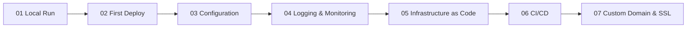

---
hide:
  - toc
content_sources:
  diagrams:
    - id: tutorial-flow
      type: flowchart
      source: mslearn-adapted
      mslearn_url: https://learn.microsoft.com/en-us/azure/app-service/
---

# .NET Tutorial

Follow this 7-step path to build, deploy, configure, observe, automate, and secure an ASP.NET Core app on Azure App Service.

## Prerequisites

- .NET 8 SDK
- Azure CLI
- Visual Studio Code or Visual Studio

## Tutorial flow

<!-- diagram-id: tutorial-flow -->

## Step map

| Step | Tutorial | Link | Outcome |
|---|---|---|---|
| 01 | Local run | [01-local-run.md](01-local-run.md) | Verify the app runs locally |
| 02 | First deploy | [02-first-deploy.md](02-first-deploy.md) | Publish to App Service |
| 03 | Configuration | [03-configuration.md](03-configuration.md) | Set app settings and runtime config |
| 04 | Logging & monitoring | [04-logging-monitoring.md](04-logging-monitoring.md) | Add diagnostics and telemetry |
| 05 | Infrastructure as Code | [05-infrastructure-as-code.md](05-infrastructure-as-code.md) | Provision with Bicep/Terraform |
| 06 | CI/CD | [06-ci-cd.md](06-ci-cd.md) | Automate builds and deployment |
| 07 | Custom domain & SSL | [07-custom-domain-ssl.md](07-custom-domain-ssl.md) | Secure the app with custom domain and TLS |

## See also

- [.NET Guide](../index.md)
- [.NET runtime guide](../dotnet-runtime.md)
- [.NET recipes](../recipes/index.md)

## Sources

- [Azure App Service documentation](https://learn.microsoft.com/en-us/azure/app-service/)
