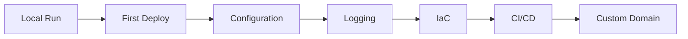

# Language Guides

This section covers deploying web applications to Azure App Service in four languages: Python, Node.js, Java, and .NET.

## Main Content

| Language | Framework | Runtime | Guide |
|----------|-----------|---------|-------|
| Python | Flask + Gunicorn | Python 3.11 | [Python Guide](python/index.md) |
| Node.js | Express | Node 20 LTS | [Node.js Guide](nodejs/index.md) |
| Java | Spring Boot | Java 17 | [Java Guide](java/index.md) |
| .NET | ASP.NET Core | .NET 8 | [.NET Guide](dotnet/index.md) |

All language tracks follow the same 7-chapter structure so teams can learn and operate with a consistent flow.

Each guide also includes language-specific recipes for common integration and production scenarios.

For shared platform concepts, see [Platform](../platform/).

## See Also

- [Python Guide](python/index.md)
- [Node.js Guide](nodejs/index.md)
- [Java Guide](java/index.md)
- [.NET Guide](dotnet/index.md)

## References

- [Quickstart: Deploy a Python web app](https://learn.microsoft.com/azure/app-service/quickstart-python)
- [Quickstart: Deploy a Node.js web app](https://learn.microsoft.com/azure/app-service/quickstart-nodejs)
- [Quickstart: Deploy a Java app](https://learn.microsoft.com/azure/app-service/quickstart-java)
- [Quickstart: Deploy an ASP.NET Core app](https://learn.microsoft.com/azure/app-service/quickstart-dotnetcore)
