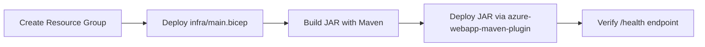

# 02. First Deploy

Deploy the Java guide application to Azure App Service using Bicep for infrastructure and Maven Plugin for code deployment.

## Prerequisites

- Completed [01. Local Run](01-local-run.md)
- Azure CLI logged in: `az login`
- Contributor access to your Azure subscription
- Unique base name ready for globally unique app naming

## What you'll learn

- How `infra/deploy.sh` orchestrates infrastructure + app deployment
- How to deploy Bicep templates manually with Azure CLI
- How to deploy Spring Boot JAR with `azure-webapp-maven-plugin`
- How to verify deployment health in Azure

## Main Content

### Deployment flow overview



### Option A: one-command deployment with script

From `infra/`:

```bash
cp .env.example .env
# edit .env values: RESOURCE_GROUP_NAME, LOCATION, BASE_NAME
./deploy.sh
```

`deploy.sh` performs:

1. Resource group creation (if missing)
2. Bicep deployment (`main.bicep`)
3. Build: `./mvnw clean package -DskipTests`
4. Deploy: `./mvnw azure-webapp:deploy`
5. Health probe against `<web-app-url>/health`

### Option B: explicit manual commands

Set variables:

```bash
export RG="rg-appservice-java-guide"
export LOCATION="eastus"
export BASE_NAME="java-guide-demo"
```

Create resource group:

```bash
az group create \
  --name "$RG" \
  --location "$LOCATION" \
  --output table
```

Deploy Bicep:

```bash
az deployment group create \
  --resource-group "$RG" \
  --template-file "infra/main.bicep" \
  --parameters baseName="$BASE_NAME" location="$LOCATION" \
  --output json
```

Capture app name from outputs (replace with your real value):

```bash
export APP_NAME="app-java-guide-demo-<unique-suffix>"
```

Build and deploy from `app/`:

```bash
cd app
RESOURCE_GROUP_NAME="$RG" APP_NAME="$APP_NAME" LOCATION="$LOCATION" ./mvnw clean package -DskipTests
RESOURCE_GROUP_NAME="$RG" APP_NAME="$APP_NAME" LOCATION="$LOCATION" ./mvnw azure-webapp:deploy
```

### Understand Maven plugin configuration

`app/pom.xml` configures deployment to Linux App Service with Java SE runtime:

```xml
<plugin>
  <groupId>com.microsoft.azure</groupId>
  <artifactId>azure-webapp-maven-plugin</artifactId>
  <version>2.13.0</version>
  <configuration>
    <resourceGroup>${env.RESOURCE_GROUP_NAME}</resourceGroup>
    <appName>${env.APP_NAME}</appName>
    <runtime>
      <os>Linux</os>
      <javaVersion>Java 17</javaVersion>
      <webContainer>Java SE</webContainer>
    </runtime>
  </configuration>
</plugin>
```

### Verify public endpoint

```bash
curl "https://$APP_NAME.azurewebsites.net/health"
curl "https://$APP_NAME.azurewebsites.net/info"
```

Expected status code for `/health`: `200`.

!!! note "Cold start"
    Initial startup can take 30-90 seconds on Basic plans. If you get `503` immediately after deploy, wait and retry.

!!! info "Platform architecture"
    For platform architecture details, see [Platform: How App Service Works](../../platform/how-app-service-works.md).

## Verification

- Bicep deployment returns `Succeeded`
- Maven build and `azure-webapp:deploy` complete successfully
- `https://$APP_NAME.azurewebsites.net/health` returns HTTP 200
- `/info` shows `environment` as `production` (from App Setting)

## Troubleshooting

### Maven deploy cannot find app

Confirm environment variables are set in the same shell:

```bash
echo "$RESOURCE_GROUP_NAME $APP_NAME $LOCATION"
```

### `az deployment group create` fails with naming conflict

Use a more unique `BASE_NAME`; App Service host names must be globally unique.

### Health check fails after deploy

Tail logs:

```bash
az webapp log tail \
  --resource-group "$RG" \
  --name "$APP_NAME"
```

## See Also

- [03. Configuration](03-configuration.md)
- [05. Infrastructure as Code](05-infrastructure-as-code.md)
- [Recipes: Managed Identity](./recipes/managed-identity.md)

## Sources

- [Deploy a ZIP file to Azure App Service](https://learn.microsoft.com/en-us/azure/app-service/deploy-zip)
- [Quickstart: Deploy a Java app to Azure App Service](https://learn.microsoft.com/en-us/azure/app-service/quickstart-java)
- [Azure App Service deployment overview](https://learn.microsoft.com/en-us/azure/app-service/deploy-best-practices)
