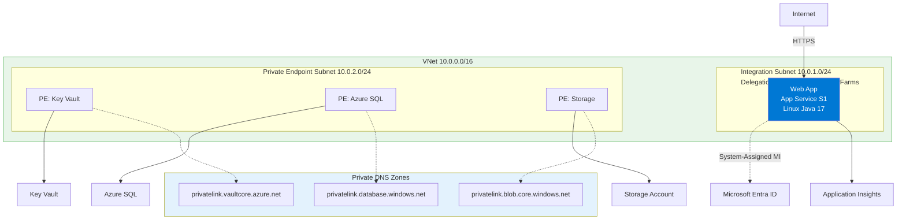
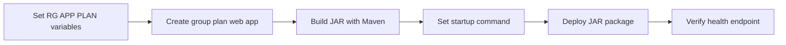

---
hide:
  - toc
content_sources:
  diagrams:
    - id: 02-first-deploy
      type: flowchart
      source: mslearn-adapted
      mslearn_url: https://learn.microsoft.com/en-us/azure/app-service/quickstart-python
    - id: main-content
      type: flowchart
      source: mslearn-adapted
      mslearn_url: https://learn.microsoft.com/en-us/azure/app-service/quickstart-python
---

# 02. First Deploy

Deploy the Java guide application to Azure App Service using Bicep for infrastructure and Maven Plugin for code deployment.

!!! info "Infrastructure Context"
    **Service**: App Service (Linux, Standard S1) | **Network**: VNet integrated | **VNet**: ✅

    This tutorial assumes a production-ready App Service deployment with VNet integration, private endpoints for backend services, and managed identity for authentication.

<!-- diagram-id: 02-first-deploy -->


## Prerequisites

- Completed [01. Local Run](01-local-run.md)
- Azure CLI logged in: `az login`
- Contributor access to your Azure subscription
- Unique base name ready for globally unique app naming

## What you'll learn

- How `infra/deploy.sh` orchestrates infrastructure + app deployment
- How to deploy Bicep templates manually with Azure CLI
- How to deploy Spring Boot JAR with `azure-webapp-maven-plugin`
- How to verify deployment health in Azure

## Main Content

<!-- diagram-id: main-content -->


### Step 1: Prepare deployment variables

```bash
SUBSCRIPTION_ID="<subscription-id>"
RG="rg-springboot-tutorial"
LOCATION="koreacentral"
PLAN_NAME="plan-springboot-tutorial-s1"
APP_NAME="app-springboot-tutorial-abc123"
VNET_NAME="vnet-springboot-tutorial"
INTEGRATION_SUBNET_NAME="snet-appsvc-integration"
PE_SUBNET_NAME="snet-private-endpoints"
STORAGE_NAME="stspringboottutorialabc123"
```

| Command/Code | Purpose |
|--------------|---------|
| `SUBSCRIPTION_ID="<subscription-id>"` | Stores the target Azure subscription ID for deployment commands. |
| `RG="rg-springboot-tutorial"` | Defines the resource group name used throughout the tutorial. |
| `LOCATION="koreacentral"` | Sets the Azure region for new resources. |
| `PLAN_NAME="plan-springboot-tutorial-s1"` | Names the App Service plan that hosts the web app. |
| `APP_NAME="app-springboot-tutorial-abc123"` | Sets the globally unique App Service app name. |
| `VNET_NAME="vnet-springboot-tutorial"` | Defines the virtual network name for integration and private endpoints. |
| `INTEGRATION_SUBNET_NAME="snet-appsvc-integration"` | Names the delegated subnet used for App Service VNet integration. |
| `PE_SUBNET_NAME="snet-private-endpoints"` | Names the subnet reserved for private endpoints. |
| `STORAGE_NAME="stspringboottutorialabc123"` | Sets the globally unique storage account name for the optional private endpoint step. |

???+ example "Expected output"
    ```text
    Variables prepared for resource group rg-springboot-tutorial and app app-springboot-tutorial-abc123.
    ```

### Step 2: Select the target subscription

```bash
az account set --subscription $SUBSCRIPTION_ID
az account show --query "{subscriptionId:id, tenantId:tenantId, user:user.name}" --output json
```

| Command/Code | Purpose |
|--------------|---------|
| `az account set --subscription $SUBSCRIPTION_ID` | Selects the Azure subscription that will receive the deployment. |
| `az account show --query "{subscriptionId:id, tenantId:tenantId, user:user.name}" --output json` | Verifies the active subscription, tenant, and signed-in user context. |

???+ example "Expected output"
    ```json
    {
      "subscriptionId": "<subscription-id>",
      "tenantId": "<tenant-id>",
      "user": "user@example.com"
    }
    ```

### Step 3: Create resource group, App Service plan, and web app

```bash
az group create --name $RG --location $LOCATION
az appservice plan create --resource-group $RG --name $PLAN_NAME --is-linux --sku S1
az webapp create --resource-group $RG --plan $PLAN_NAME --name $APP_NAME --runtime "JAVA|17-java17"
```

| Command/Code | Purpose |
|--------------|---------|
| `az group create --name $RG --location $LOCATION` | Creates the resource group that contains the tutorial resources. |
| `az appservice plan create --resource-group $RG --name $PLAN_NAME --is-linux --sku S1` | Creates a Linux App Service plan on the S1 pricing tier. |
| `az webapp create --resource-group $RG --plan $PLAN_NAME --name $APP_NAME --runtime "JAVA|17-java17"` | Creates the Java 17 web app in the App Service plan. |

???+ example "Expected output"
    ```json
    {
      "defaultHostName": "app-springboot-tutorial-abc123.azurewebsites.net",
      "enabledHostNames": [
        "app-springboot-tutorial-abc123.azurewebsites.net",
        "app-springboot-tutorial-abc123.scm.azurewebsites.net"
      ],
      "state": "Running"
    }
    ```

### Step 4: Create VNet and delegated integration subnet

```bash
az network vnet create --resource-group $RG --name $VNET_NAME --location $LOCATION --address-prefixes 10.10.0.0/16
az network vnet subnet create --resource-group $RG --vnet-name $VNET_NAME --name $INTEGRATION_SUBNET_NAME --address-prefixes 10.10.1.0/24 --delegations Microsoft.Web/serverFarms
```

| Command/Code | Purpose |
|--------------|---------|
| `az network vnet create --resource-group $RG --name $VNET_NAME --location $LOCATION --address-prefixes 10.10.0.0/16` | Creates the virtual network used by the app and related private resources. |
| `az network vnet subnet create --resource-group $RG --vnet-name $VNET_NAME --name $INTEGRATION_SUBNET_NAME --address-prefixes 10.10.1.0/24 --delegations Microsoft.Web/serverFarms` | Creates a delegated subnet for App Service VNet integration. |

???+ example "Expected output"
    ```json
    {
      "addressPrefix": "10.10.1.0/24",
      "delegations": [
        {
          "serviceName": "Microsoft.Web/serverFarms"
        }
      ],
      "name": "snet-appsvc-integration"
    }
    ```

### Step 5: Create private endpoint subnet

```bash
az network vnet subnet create --resource-group $RG --vnet-name $VNET_NAME --name $PE_SUBNET_NAME --address-prefixes 10.10.2.0/24 --disable-private-endpoint-network-policies true
```

| Command/Code | Purpose |
|--------------|---------|
| `az network vnet subnet create --resource-group $RG --vnet-name $VNET_NAME --name $PE_SUBNET_NAME --address-prefixes 10.10.2.0/24 --disable-private-endpoint-network-policies true` | Creates a subnet that allows private endpoint resources. |

???+ example "Expected output"
    ```json
    {
      "addressPrefix": "10.10.2.0/24",
      "name": "snet-private-endpoints",
      "privateEndpointNetworkPolicies": "Disabled"
    }
    ```

### Step 6: Integrate the web app with the VNet

```bash
az webapp vnet-integration add --resource-group $RG --name $APP_NAME --vnet $VNET_NAME --subnet $INTEGRATION_SUBNET_NAME
```

| Command/Code | Purpose |
|--------------|---------|
| `az webapp vnet-integration add --resource-group $RG --name $APP_NAME --vnet $VNET_NAME --subnet $INTEGRATION_SUBNET_NAME` | Connects the web app to the delegated VNet subnet for outbound private access. |

???+ example "Expected output"
    ```json
    {
      "isSwift": true,
      "subnetResourceId": "/subscriptions/<subscription-id>/resourceGroups/rg-springboot-tutorial/providers/Microsoft.Network/virtualNetworks/vnet-springboot-tutorial/subnets/snet-appsvc-integration"
    }
    ```

### Step 7: Assign managed identity to the web app

```bash
az webapp identity assign --resource-group $RG --name $APP_NAME
```

| Command/Code | Purpose |
|--------------|---------|
| `az webapp identity assign --resource-group $RG --name $APP_NAME` | Enables a system-assigned managed identity for the web app. |

???+ example "Expected output"
    ```json
    {
      "principalId": "<object-id>",
      "tenantId": "<tenant-id>",
      "type": "SystemAssigned"
    }
    ```

### Step 8: Build JAR and configure startup command

```bash
./mvnw clean package -DskipTests
az webapp config set --resource-group $RG --name $APP_NAME --startup-file "java -jar /home/site/wwwroot/app.jar --server.port=$PORT"
```

| Command/Code | Purpose |
|--------------|---------|
| `./mvnw clean package -DskipTests` | Builds the Spring Boot JAR with Maven Wrapper without running tests. |
| `clean` | Removes previous build artifacts so a fresh package is created. |
| `package` | Produces the deployable JAR artifact in the `target/` directory. |
| `-DskipTests` | Skips test execution to speed up this packaging step. |
| `az webapp config set --resource-group $RG --name $APP_NAME --startup-file "java -jar /home/site/wwwroot/app.jar --server.port=$PORT"` | Configures the startup command so App Service runs the JAR on the platform-assigned port. |

???+ example "Expected output"
    ```text
    [INFO] BUILD SUCCESS
    {
      "appCommandLine": "java -jar /home/site/wwwroot/app.jar --server.port=$PORT",
      "linuxFxVersion": "JAVA|17-java17"
    }
    ```

### Step 9: Deploy JAR to App Service

```bash
az webapp deploy --resource-group $RG --name $APP_NAME --src-path target/*.jar --type jar
```

| Command/Code | Purpose |
|--------------|---------|
| `az webapp deploy --resource-group $RG --name $APP_NAME --src-path target/*.jar --type jar` | Uploads the built JAR from `target/` and deploys it to the web app. |

???+ example "Expected output"
    ```json
    {
      "active": true,
      "author": "N/A",
      "complete": true,
      "status": 4
    }
    ```

### Step 10: Verify URL, health, and deployment history

```bash
WEB_APP_URL="https://$(az webapp show --resource-group $RG --name $APP_NAME --query defaultHostName --output tsv)"
curl $WEB_APP_URL/health
az webapp log deployment list --resource-group $RG --name $APP_NAME --output table
```

| Command/Code | Purpose |
|--------------|---------|
| `WEB_APP_URL="https://$(az webapp show --resource-group $RG --name $APP_NAME --query defaultHostName --output tsv)"` | Builds the app URL dynamically from the deployed web app hostname. |
| `curl $WEB_APP_URL/health` | Confirms the deployed app responds successfully on its health endpoint. |
| `az webapp log deployment list --resource-group $RG --name $APP_NAME --output table` | Shows recent deployment history for validation and troubleshooting. |

???+ example "Expected output"
    ```text
    {"status":"UP"}

    Id    Status   Author  Message
    ----  -------  ------  ----------------------
    1038  Success  N/A     Deployment successful
    ```

### Step 11 (Optional): Create a private endpoint for Storage

```bash
az storage account create --resource-group $RG --name $STORAGE_NAME --location $LOCATION --sku Standard_LRS --kind StorageV2
STORAGE_ID="$(az storage account show --resource-group $RG --name $STORAGE_NAME --query id --output tsv)"
az network private-endpoint create --resource-group $RG --name pe-storage-blob --vnet-name $VNET_NAME --subnet $PE_SUBNET_NAME --private-connection-resource-id $STORAGE_ID --group-id blob --connection-name pe-storage-blob-connection
```

| Command/Code | Purpose |
|--------------|---------|
| `az storage account create --resource-group $RG --name $STORAGE_NAME --location $LOCATION --sku Standard_LRS --kind StorageV2` | Creates a storage account to demonstrate private endpoint connectivity. |
| `STORAGE_ID="$(az storage account show --resource-group $RG --name $STORAGE_NAME --query id --output tsv)"` | Captures the storage account resource ID for the private endpoint command. |
| `az network private-endpoint create --resource-group $RG --name pe-storage-blob --vnet-name $VNET_NAME --subnet $PE_SUBNET_NAME --private-connection-resource-id $STORAGE_ID --group-id blob --connection-name pe-storage-blob-connection` | Creates a blob private endpoint inside the private endpoint subnet. |

???+ example "Expected output"
    ```json
    {
      "name": "pe-storage-blob",
      "privateLinkServiceConnections": [
        {
          "groupIds": [
            "blob"
          ],
          "privateLinkServiceId": "/subscriptions/<subscription-id>/resourceGroups/rg-springboot-tutorial/providers/Microsoft.Storage/storageAccounts/stspringboottutorialabc123"
        }
      ]
    }
    ```

### Step 12: Stream live logs

!!! note "Enable logging first"
    `az webapp log tail` only streams output if application logging is enabled.

    ```bash
    az webapp log config --resource-group $RG --name $APP_NAME --application-logging filesystem --level information
    ```

    | Command/Code | Purpose |
    |--------------|---------|
    | `az webapp log config --resource-group $RG --name $APP_NAME --application-logging filesystem --level information` | Enables filesystem application logging so live log streaming works. |

```bash
az webapp log tail --resource-group $RG --name $APP_NAME
```

| Command/Code | Purpose |
|--------------|---------|
| `az webapp log tail --resource-group $RG --name $APP_NAME` | Streams live application logs from the running web app. |

???+ example "Expected output"
    ```text
    2026-04-09T03:12:18.442Z INFO 1 --- [main] c.example.demo.HealthController : Health endpoint invoked
    2026-04-09T03:12:18.447Z INFO 1 --- [main] o.s.b.w.e.tomcat.GracefulShutdown       : Commencing graceful shutdown checks
    ```

### Step 13: Inspect files in Kudu (SCM)

```bash
az webapp show --resource-group $RG --name $APP_NAME --query "{defaultHostName:defaultHostName, scmHost:repositorySiteName}" --output json
```

| Command/Code | Purpose |
|--------------|---------|
| `az webapp show --resource-group $RG --name $APP_NAME --query "{defaultHostName:defaultHostName, scmHost:repositorySiteName}" --output json` | Retrieves the main site and SCM hostnames used for app access and Kudu inspection. |

???+ example "Expected output"
    ```json
    {
      "defaultHostName": "app-springboot-tutorial-abc123.azurewebsites.net",
      "scmHost": "app-springboot-tutorial-abc123.scm.azurewebsites.net"
    }
    ```

Use `https://app-springboot-tutorial-abc123.scm.azurewebsites.net` to inspect `/home/site/wwwroot`, review deployment logs, and open the SSH console.

## Advanced Topics

For deterministic rollouts, package a versioned JAR artifact in CI and deploy the exact same build across staging and production slots before swap.

## Verification

- Azure CLI commands complete without authorization or validation errors
- App Service reports Linux Java runtime as `JAVA|17-java17`
- Startup command is `java -jar /home/site/wwwroot/app.jar --server.port=$PORT`
- `https://$APP_NAME.azurewebsites.net/health` returns HTTP 200
- Deployment history shows the latest operation with `Success`

## Troubleshooting

### Maven deploy cannot find app

Confirm environment variables are set in the same shell:

```bash
echo "$RESOURCE_GROUP_NAME $APP_NAME $LOCATION"
```

| Command/Code | Purpose |
|--------------|---------|
| `echo "$RESOURCE_GROUP_NAME $APP_NAME $LOCATION"` | Prints the key deployment variables so you can verify they are set in the current shell. |

### `az deployment group create` fails with naming conflict

Use a more unique `BASE_NAME`; App Service host names must be globally unique.

### Health check fails after deploy

Tail logs:

```bash
az webapp log tail \
  --resource-group "$RG" \
  --name "$APP_NAME"
```

| Command/Code | Purpose |
|--------------|---------|
| `az webapp log tail` | Starts the live App Service log stream for troubleshooting. |
| `--resource-group "$RG"` | Targets the resource group that contains the app. |
| `--name "$APP_NAME"` | Selects the specific web app whose logs you want to inspect. |

## See Also

- [03. Configuration](03-configuration.md)
- [05. Infrastructure as Code](05-infrastructure-as-code.md)
- [Recipes: Managed Identity](./recipes/managed-identity.md)

## Sources

- [Deploy a ZIP file to Azure App Service](https://learn.microsoft.com/en-us/azure/app-service/deploy-zip)
- [Quickstart: Deploy a Java app to Azure App Service](https://learn.microsoft.com/en-us/azure/app-service/quickstart-java)
- [Azure App Service deployment overview](https://learn.microsoft.com/en-us/azure/app-service/deploy-best-practices)
