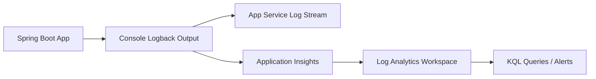

# 04. Logging & Monitoring

Instrument your Spring Boot app for production observability using Logback JSON logs, Azure Monitor, and Application Insights.

## Prerequisites

- Completed [02. First Deploy](02-first-deploy.md)
- Access to App Service and Application Insights resources
- Deployed app with `APPLICATIONINSIGHTS_CONNECTION_STRING` configured

## What you'll learn

- How `logback-spring.xml` switches between dev and production formats
- How to stream and query logs from App Service
- How to run practical KQL queries for Java workloads
- How to validate telemetry with sample endpoints

## Main Content

### Logging architecture for this guide



### Understand `logback-spring.xml`

The app uses profile-aware logging:

- `!production`: human-readable pattern logs for local development
- `production`: JSON logs via `net.logstash.logback.encoder.LoggingEventCompositeJsonEncoder`

Relevant production fields include:

- `timestamp`
- `level`
- `thread`
- `logger`
- `message`
- `exception`

This shape is ideal for parsing in Azure Monitor.

### Generate predictable test logs

Use the built-in endpoint:

```bash
curl "https://$APP_NAME.azurewebsites.net/api/requests/log-levels?userId=monitor-demo"
```

The endpoint emits one log per severity (DEBUG/INFO/WARN/ERROR).

### Stream logs in real time

```bash
az webapp log tail \
  --resource-group "$RG" \
  --name "$APP_NAME"
```

If log stream is empty, ensure application logging is enabled.

### Enable filesystem logging (short-term troubleshooting)

```bash
az webapp log config \
  --resource-group "$RG" \
  --name "$APP_NAME" \
  --application-logging filesystem \
  --level information \
  --output json
```

!!! note "Production guidance"
    Prefer central telemetry in Application Insights for long-term analytics. Filesystem logs are best for short-lived debugging.

### KQL query: recent application logs

```kusto
AppTraces
| where TimeGenerated > ago(30m)
| where AppRoleName contains "app-"
| project TimeGenerated, SeverityLevel, Message, AppRoleName
| order by TimeGenerated desc
```

### KQL query: error distribution

```kusto
AppTraces
| where TimeGenerated > ago(24h)
| where SeverityLevel >= 3
| summarize ErrorCount = count() by bin(TimeGenerated, 15m), AppRoleName
| order by TimeGenerated asc
```

### KQL query: request latency percentiles

```kusto
AppRequests
| where TimeGenerated > ago(24h)
| summarize
    RequestCount = count(),
    P50 = percentile(DurationMs, 50),
    P95 = percentile(DurationMs, 95),
    P99 = percentile(DurationMs, 99)
  by Name
| order by P95 desc
```

### KQL query: correlate failed requests with traces

```kusto
let failed = AppRequests
| where TimeGenerated > ago(6h)
| where Success == false
| project OperationId, Name, ResultCode, DurationMs, TimeGenerated;

failed
| join kind=leftouter (
    AppTraces
    | where TimeGenerated > ago(6h)
    | project OperationId, TraceMessage = Message, SeverityLevel
) on OperationId
| order by TimeGenerated desc
```

### Alerting baseline recommendation

- Alert on sustained `5xx` rate
- Alert on `P95` latency regression
- Alert on no heartbeat/traffic during business windows

!!! tip "Use synthetic probes"
    Add availability tests against `/health` and a lightweight business endpoint to catch platform and app regressions early.

!!! info "Platform architecture"
    For platform architecture details, see [Platform: How App Service Works](../../platform/how-app-service-works.md).

## Verification

- Trigger `/api/requests/log-levels`
- Confirm logs appear in `az webapp log tail`
- Run KQL queries and verify rows return for the current app
- Confirm production profile emits JSON-formatted logs

## Troubleshooting

### No telemetry in Application Insights

- Confirm `APPLICATIONINSIGHTS_CONNECTION_STRING` exists in App Settings
- Confirm app restarted after config change
- Wait a few minutes for ingestion delay

### Logs show only INFO and above

Adjust logger level temporarily:

```bash
az webapp config appsettings set \
  --resource-group "$RG" \
  --name "$APP_NAME" \
  --settings LOGGING_LEVEL_COM_EXAMPLE_GUIDE=DEBUG \
  --output json
```

### KQL table names differ in your workspace

Use `AppTraces`/`AppRequests` as primary tables; in some environments, schema naming may vary by ingestion mode.

## Next Steps / See Also

- [05. Infrastructure as Code](05-infrastructure-as-code.md)
- [Reference: KQL Queries](../../reference/kql-queries.md)
- [Recipes: Redis](./recipes/redis.md)

## References

- [Enable diagnostics logging for apps in Azure App Service](https://learn.microsoft.com/en-us/azure/app-service/troubleshoot-diagnostic-logs)
- [Monitor Azure App Service](https://learn.microsoft.com/en-us/azure/app-service/monitor-app-service)
