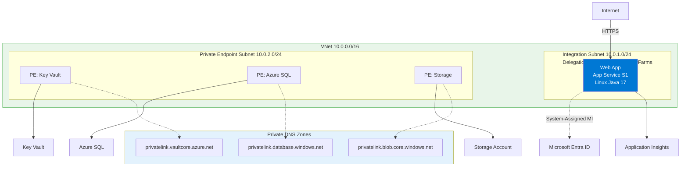
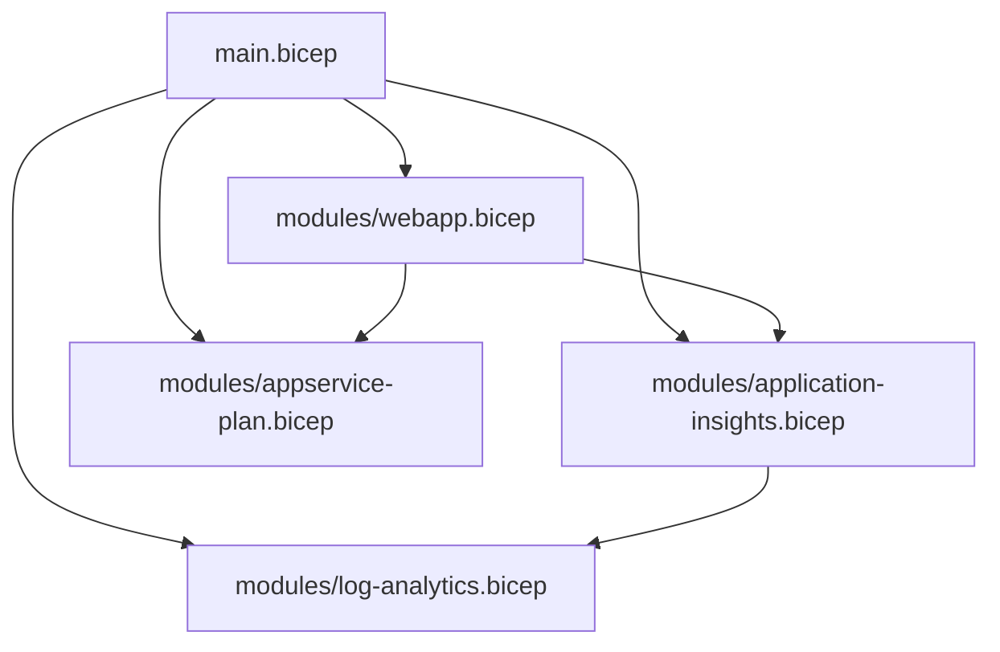

---
hide:
  - toc
content_sources:
  diagrams:
    - id: 05-infrastructure-as-code
      type: flowchart
      source: mslearn-adapted
      mslearn_url: https://learn.microsoft.com/en-us/azure/app-service/
    - id: bicep-architecture-in-this-repository
      type: flowchart
      source: mslearn-adapted
      mslearn_url: https://learn.microsoft.com/en-us/azure/app-service/
---

# 05. Infrastructure as Code

Use Bicep to deploy repeatable, reviewable Azure infrastructure for your Java App Service workload.

!!! info "Infrastructure Context"
    **Service**: App Service (Linux, Standard S1) | **Network**: VNet integrated | **VNet**: ✅

    This tutorial assumes a production-ready App Service deployment with VNet integration, private endpoints for backend services, and managed identity for authentication.

<!-- diagram-id: 05-infrastructure-as-code -->


## Prerequisites

- Completed [02. First Deploy](02-first-deploy.md)
- Azure CLI with Bicep support (`az bicep version`)
- Familiarity with resource groups and ARM deployments

## What you'll learn

- How `infra/main.bicep` composes reusable modules
- How naming, parameters, and outputs are structured
- How to customize SKU, retention, and sampling safely
- How to validate deployments before production rollout

## Main Content

### Bicep architecture in this repository

<!-- diagram-id: bicep-architecture-in-this-repository -->


### `main.bicep` structure and intent

`main.bicep` defines:

- Parameters: `baseName`, `location`, `appServicePlanSku`, `logAnalyticsRetentionDays`, `appInsightsSamplingPercentage`
- Deterministic names using `uniqueString(resourceGroup().id, baseName)`
- Module composition for each major Azure resource
- Outputs consumed by `deploy.sh` (`webAppName`, `webAppUrl`, etc.)

### Key parameter example

```bicep
@description('App Service plan SKU (e.g., B1, S1).')
param appServicePlanSku string = 'B1'

@description('Log Analytics retention in days.')
@minValue(30)
@maxValue(730)
param logAnalyticsRetentionDays int = 30
```

| Command/Code | Purpose |
|--------------|---------|
| `@description('App Service plan SKU (e.g., B1, S1).')` | Documents what the `appServicePlanSku` parameter controls. |
| `param appServicePlanSku string = 'B1'` | Declares the App Service plan SKU parameter with a default of `B1`. |
| `@description('Log Analytics retention in days.')` | Documents the retention parameter used by the deployment. |
| `@minValue(30)` | Prevents retention values below 30 days. |
| `@maxValue(730)` | Prevents retention values above 730 days. |
| `param logAnalyticsRetentionDays int = 30` | Declares the Log Analytics retention parameter with a 30-day default. |

These constraints prevent invalid retention values at deployment time.

### Web app module highlights

`modules/webapp.bicep` sets critical platform-safe defaults:

- Linux runtime: `JAVA|17-java17`
- Health check path: `/health`
- Startup command: `java -jar /home/site/wwwroot/*.jar --server.port=$PORT`
- System-assigned managed identity enabled
- App Settings for profile and JVM tuning (`SPRING_PROFILES_ACTIVE`, `JAVA_OPTS`)

### Deploy Bicep with explicit parameters

```bash
export RG="rg-appservice-java-guide"
export LOCATION="eastus"
export BASE_NAME="java-guide-iac"

az deployment group create \
  --resource-group "$RG" \
  --template-file "infra/main.bicep" \
  --parameters \
    baseName="$BASE_NAME" \
    location="$LOCATION" \
    appServicePlanSku="B1" \
    logAnalyticsRetentionDays=30 \
    appInsightsSamplingPercentage="100" \
  --output json
```

| Command/Code | Purpose |
|--------------|---------|
| `export RG="rg-appservice-java-guide"` | Sets the target resource group for the deployment. |
| `export LOCATION="eastus"` | Sets the Azure region parameter value. |
| `export BASE_NAME="java-guide-iac"` | Sets the naming prefix used by the Bicep template. |
| `az deployment group create` | Runs a resource group-scoped Bicep deployment. |
| `--template-file "infra/main.bicep"` | Points Azure CLI to the main Bicep template in the repository. |
| `baseName="$BASE_NAME"` | Supplies the base name consumed by deterministic resource naming. |
| `location="$LOCATION"` | Supplies the deployment region. |
| `appServicePlanSku="B1"` | Chooses the B1 App Service plan tier for this example. |
| `logAnalyticsRetentionDays=30` | Sets the Log Analytics data retention period. |
| `appInsightsSamplingPercentage="100"` | Keeps full Application Insights sampling in this example. |
| `--output json` | Returns full deployment results in JSON format. |

### Customize for production

Common production deltas:

- `appServicePlanSku`: `S1` or higher
- `logAnalyticsRetentionDays`: 90-365 (compliance dependent)
- `appInsightsSamplingPercentage`: reduce for high-volume apps (for example `25`)

Example:

```bash
az deployment group create \
  --resource-group "$RG" \
  --template-file "infra/main.bicep" \
  --parameters \
    baseName="$BASE_NAME" \
    location="$LOCATION" \
    appServicePlanSku="S1" \
    logAnalyticsRetentionDays=120 \
    appInsightsSamplingPercentage="50" \
  --output table
```

| Command/Code | Purpose |
|--------------|---------|
| `az deployment group create` | Deploys the same Bicep template with production-oriented settings. |
| `appServicePlanSku="S1"` | Upgrades the plan tier to S1 for production workloads. |
| `logAnalyticsRetentionDays=120` | Increases log retention for longer operational history. |
| `appInsightsSamplingPercentage="50"` | Reduces telemetry volume by sampling half of Application Insights events. |
| `--output table` | Displays a concise table view of the deployment result. |

### Validate and preview changes

Run template validation before actual deployment:

```bash
az deployment group validate \
  --resource-group "$RG" \
  --template-file "infra/main.bicep" \
  --parameters baseName="$BASE_NAME" location="$LOCATION" \
  --output json
```

| Command/Code | Purpose |
|--------------|---------|
| `az deployment group validate` | Validates the template and parameter values without creating resources. |
| `--template-file "infra/main.bicep"` | Uses the repository's main Bicep template for validation. |
| `--parameters baseName="$BASE_NAME" location="$LOCATION"` | Supplies the minimum required parameters for validation. |
| `--output json` | Returns validation results in JSON format. |

Use `what-if` for drift-safe planning:

```bash
az deployment group what-if \
  --resource-group "$RG" \
  --template-file "infra/main.bicep" \
  --parameters baseName="$BASE_NAME" location="$LOCATION" \
  --output json
```

| Command/Code | Purpose |
|--------------|---------|
| `az deployment group what-if` | Previews the resource changes that the Bicep deployment would make. |
| `--template-file "infra/main.bicep"` | Runs the preview against the main infrastructure template. |
| `--parameters baseName="$BASE_NAME" location="$LOCATION"` | Supplies the parameter values used for the comparison. |
| `--output json` | Returns the change preview in JSON format. |

!!! warning "Avoid portal-only drift"
    If you change App Service settings directly in the portal and never reflect them in Bicep, subsequent deployments may overwrite or conflict with manual edits.

!!! info "Platform architecture"
    For platform architecture details, see [Platform: How App Service Works](../../platform/how-app-service-works.md).

## Verification

- Deployment finishes with `provisioningState: Succeeded`
- Output includes a valid `webAppUrl`
- `https://<web-app-host>/health` returns HTTP 200
- App Service configuration reflects expected Bicep defaults

## Troubleshooting

### Bicep module path errors

Run deployment from repository root or ensure relative module paths in `main.bicep` remain unchanged.

### Runtime mismatch after deploy

Check App Service runtime in portal or CLI; confirm `linuxFxVersion` is `JAVA|17-java17`.

### Health check keeps failing

Confirm `/health` endpoint exists and startup command still forwards `--server.port=$PORT`.

## CLI Alternative (No Bicep)

Use these commands when you need an imperative deployment path without changing the existing Bicep workflow.

### Step 1: Set variables

```bash
RG="rg-springboot-tutorial"
LOCATION="koreacentral"
PLAN_NAME="plan-springboot-tutorial-s1"
APP_NAME="app-springboot-tutorial-abc123"
VNET_NAME="vnet-springboot-tutorial"
INTEGRATION_SUBNET_NAME="snet-appsvc-integration"
```

| Command/Code | Purpose |
|--------------|---------|
| `RG="rg-springboot-tutorial"` | Sets the resource group name for the CLI deployment path. |
| `LOCATION="koreacentral"` | Sets the Azure region for the CLI deployment path. |
| `PLAN_NAME="plan-springboot-tutorial-s1"` | Names the App Service plan to create. |
| `APP_NAME="app-springboot-tutorial-abc123"` | Sets the globally unique web app name. |
| `VNET_NAME="vnet-springboot-tutorial"` | Names the virtual network to create. |
| `INTEGRATION_SUBNET_NAME="snet-appsvc-integration"` | Names the subnet used for App Service VNet integration. |

???+ example "Expected output"
    ```text
    Variables prepared for rg-springboot-tutorial and app-springboot-tutorial-abc123.
    ```

### Step 2: Create RG, plan, app

```bash
az group create --name $RG --location $LOCATION
az appservice plan create --resource-group $RG --name $PLAN_NAME --is-linux --sku S1
az webapp create --resource-group $RG --plan $PLAN_NAME --name $APP_NAME --runtime "JAVA|17-java17"
```

| Command/Code | Purpose |
|--------------|---------|
| `az group create --name $RG --location $LOCATION` | Creates the resource group for the imperative deployment path. |
| `az appservice plan create --resource-group $RG --name $PLAN_NAME --is-linux --sku S1` | Creates a Linux App Service plan on the S1 tier. |
| `az webapp create --resource-group $RG --plan $PLAN_NAME --name $APP_NAME --runtime "JAVA|17-java17"` | Creates the Java 17 App Service app. |

???+ example "Expected output"
    ```json
    {
      "defaultHostName": "app-springboot-tutorial-abc123.azurewebsites.net",
      "state": "Running"
    }
    ```

### Step 3: Configure app settings and startup command

```bash
az webapp config appsettings set --resource-group $RG --name $APP_NAME --settings SCM_DO_BUILD_DURING_DEPLOYMENT=true SPRING_PROFILES_ACTIVE=production
az webapp config set --resource-group $RG --name $APP_NAME --startup-file "java -jar /home/site/wwwroot/app.jar --server.port=$PORT"
```

| Command/Code | Purpose |
|--------------|---------|
| `az webapp config appsettings set --resource-group $RG --name $APP_NAME --settings SCM_DO_BUILD_DURING_DEPLOYMENT=true SPRING_PROFILES_ACTIVE=production` | Sets build and Spring profile app settings for the web app. |
| `SCM_DO_BUILD_DURING_DEPLOYMENT=true` | Enables build automation during deployment in the SCM site. |
| `SPRING_PROFILES_ACTIVE=production` | Ensures the app runs with the production Spring profile. |
| `az webapp config set --resource-group $RG --name $APP_NAME --startup-file "java -jar /home/site/wwwroot/app.jar --server.port=$PORT"` | Configures the startup command used by App Service to launch the JAR. |

???+ example "Expected output"
    ```json
    [
      {
        "name": "SCM_DO_BUILD_DURING_DEPLOYMENT",
        "value": "true"
      },
      {
        "name": "SPRING_PROFILES_ACTIVE",
        "value": "production"
      }
    ]
    ```

### Step 4 (Optional): Add VNet integration

```bash
az network vnet create --resource-group $RG --name $VNET_NAME --location $LOCATION --address-prefixes 10.10.0.0/16
az network vnet subnet create --resource-group $RG --vnet-name $VNET_NAME --name $INTEGRATION_SUBNET_NAME --address-prefixes 10.10.1.0/24 --delegations Microsoft.Web/serverFarms
az webapp vnet-integration add --resource-group $RG --name $APP_NAME --vnet $VNET_NAME --subnet $INTEGRATION_SUBNET_NAME
```

| Command/Code | Purpose |
|--------------|---------|
| `az network vnet create --resource-group $RG --name $VNET_NAME --location $LOCATION --address-prefixes 10.10.0.0/16` | Creates the VNet used for app integration. |
| `az network vnet subnet create --resource-group $RG --vnet-name $VNET_NAME --name $INTEGRATION_SUBNET_NAME --address-prefixes 10.10.1.0/24 --delegations Microsoft.Web/serverFarms` | Creates a delegated subnet that App Service can join. |
| `az webapp vnet-integration add --resource-group $RG --name $APP_NAME --vnet $VNET_NAME --subnet $INTEGRATION_SUBNET_NAME` | Connects the app to the VNet integration subnet. |

???+ example "Expected output"
    ```json
    {
      "isSwift": true,
      "subnetResourceId": "/subscriptions/<subscription-id>/resourceGroups/rg-springboot-tutorial/providers/Microsoft.Network/virtualNetworks/vnet-springboot-tutorial/subnets/snet-appsvc-integration"
    }
    ```

### Step 5: Validate effective configuration

```bash
az webapp config show --resource-group $RG --name $APP_NAME --query "{linuxFxVersion:linuxFxVersion, appCommandLine:appCommandLine}" --output json
az webapp config appsettings list --resource-group $RG --name $APP_NAME --query "[?name=='SCM_DO_BUILD_DURING_DEPLOYMENT' || name=='SPRING_PROFILES_ACTIVE']" --output json
```

| Command/Code | Purpose |
|--------------|---------|
| `az webapp config show --resource-group $RG --name $APP_NAME --query "{linuxFxVersion:linuxFxVersion, appCommandLine:appCommandLine}" --output json` | Verifies the effective runtime and startup command applied to the app. |
| `az webapp config appsettings list --resource-group $RG --name $APP_NAME --query "[?name=='SCM_DO_BUILD_DURING_DEPLOYMENT' || name=='SPRING_PROFILES_ACTIVE']" --output json` | Confirms the key app settings were stored correctly. |

???+ example "Expected output"
    ```json
    {
      "linuxFxVersion": "JAVA|17-java17",
      "appCommandLine": "java -jar /home/site/wwwroot/app.jar --server.port=$PORT"
    }
    ```

## See Also

- [06. CI/CD](06-ci-cd.md)
- [07. Custom Domain & SSL](07-custom-domain-ssl.md)
- [Recipes: VNet Integration](./recipes/vnet-integration.md)

## Sources

- [Deploy Bicep files by using Azure CLI](https://learn.microsoft.com/en-us/azure/azure-resource-manager/bicep/deploy-cli)
- [Microsoft.Web/sites Bicep resource](https://learn.microsoft.com/en-us/azure/templates/microsoft.web/sites)
