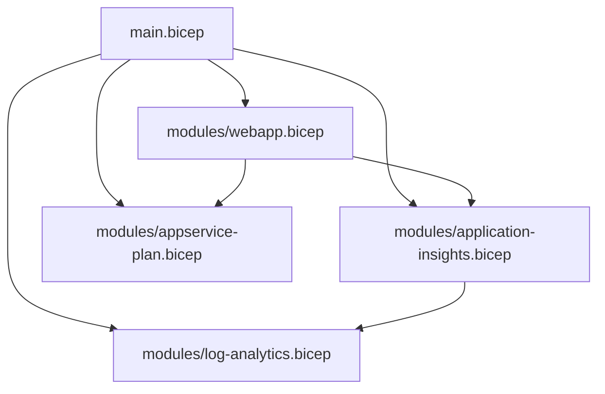

---
hide:
  - toc
---

# 05. Infrastructure as Code

Use Bicep to deploy repeatable, reviewable Azure infrastructure for your Java App Service workload.

!!! info "Infrastructure Context"
    **Service**: App Service (Linux, Standard S1) | **Network**: VNet integrated | **VNet**: ✅

    This tutorial assumes a production-ready App Service deployment with VNet integration, private endpoints for backend services, and managed identity for authentication.

    ```mermaid
    flowchart TD
        INET[Internet] -->|HTTPS| WA["Web App\nApp Service S1\nLinux Java 17"]

        subgraph VNET["VNet 10.0.0.0/16"]
            subgraph INT_SUB["Integration Subnet 10.0.1.0/24\nDelegation: Microsoft.Web/serverFarms"]
                WA
            end
            subgraph PE_SUB["Private Endpoint Subnet 10.0.2.0/24"]
                PE_KV[PE: Key Vault]
                PE_SQL[PE: Azure SQL]
                PE_ST[PE: Storage]
            end
        end

        PE_KV --> KV[Key Vault]
        PE_SQL --> SQL[Azure SQL]
        PE_ST --> ST[Storage Account]

        subgraph DNS[Private DNS Zones]
            DNS_KV[privatelink.vaultcore.azure.net]
            DNS_SQL[privatelink.database.windows.net]
            DNS_ST[privatelink.blob.core.windows.net]
        end

        PE_KV -.-> DNS_KV
        PE_SQL -.-> DNS_SQL
        PE_ST -.-> DNS_ST

        WA -.->|System-Assigned MI| ENTRA[Microsoft Entra ID]
        WA --> AI[Application Insights]

        style WA fill:#0078d4,color:#fff
        style VNET fill:#E8F5E9,stroke:#4CAF50
        style DNS fill:#E3F2FD
    ```

## Prerequisites

- Completed [02. First Deploy](02-first-deploy.md)
- Azure CLI with Bicep support (`az bicep version`)
- Familiarity with resource groups and ARM deployments

## What you'll learn

- How `infra/main.bicep` composes reusable modules
- How naming, parameters, and outputs are structured
- How to customize SKU, retention, and sampling safely
- How to validate deployments before production rollout

## Main Content

### Bicep architecture in this repository



### `main.bicep` structure and intent

`main.bicep` defines:

- Parameters: `baseName`, `location`, `appServicePlanSku`, `logAnalyticsRetentionDays`, `appInsightsSamplingPercentage`
- Deterministic names using `uniqueString(resourceGroup().id, baseName)`
- Module composition for each major Azure resource
- Outputs consumed by `deploy.sh` (`webAppName`, `webAppUrl`, etc.)

### Key parameter example

```bicep
@description('App Service plan SKU (e.g., B1, S1).')
param appServicePlanSku string = 'B1'

@description('Log Analytics retention in days.')
@minValue(30)
@maxValue(730)
param logAnalyticsRetentionDays int = 30
```

These constraints prevent invalid retention values at deployment time.

### Web app module highlights

`modules/webapp.bicep` sets critical platform-safe defaults:

- Linux runtime: `JAVA|17-java17`
- Health check path: `/health`
- Startup command: `java -jar /home/site/wwwroot/*.jar --server.port=$PORT`
- System-assigned managed identity enabled
- App Settings for profile and JVM tuning (`SPRING_PROFILES_ACTIVE`, `JAVA_OPTS`)

### Deploy Bicep with explicit parameters

```bash
export RG="rg-appservice-java-guide"
export LOCATION="eastus"
export BASE_NAME="java-guide-iac"

az deployment group create \
  --resource-group "$RG" \
  --template-file "infra/main.bicep" \
  --parameters \
    baseName="$BASE_NAME" \
    location="$LOCATION" \
    appServicePlanSku="B1" \
    logAnalyticsRetentionDays=30 \
    appInsightsSamplingPercentage="100" \
  --output json
```

### Customize for production

Common production deltas:

- `appServicePlanSku`: `S1` or higher
- `logAnalyticsRetentionDays`: 90-365 (compliance dependent)
- `appInsightsSamplingPercentage`: reduce for high-volume apps (for example `25`)

Example:

```bash
az deployment group create \
  --resource-group "$RG" \
  --template-file "infra/main.bicep" \
  --parameters \
    baseName="$BASE_NAME" \
    location="$LOCATION" \
    appServicePlanSku="S1" \
    logAnalyticsRetentionDays=120 \
    appInsightsSamplingPercentage="50" \
  --output table
```

### Validate and preview changes

Run template validation before actual deployment:

```bash
az deployment group validate \
  --resource-group "$RG" \
  --template-file "infra/main.bicep" \
  --parameters baseName="$BASE_NAME" location="$LOCATION" \
  --output json
```

Use `what-if` for drift-safe planning:

```bash
az deployment group what-if \
  --resource-group "$RG" \
  --template-file "infra/main.bicep" \
  --parameters baseName="$BASE_NAME" location="$LOCATION" \
  --output json
```

!!! warning "Avoid portal-only drift"
    If you change App Service settings directly in the portal and never reflect them in Bicep, subsequent deployments may overwrite or conflict with manual edits.

!!! info "Platform architecture"
    For platform architecture details, see [Platform: How App Service Works](../../platform/how-app-service-works.md).

## Verification

- Deployment finishes with `provisioningState: Succeeded`
- Output includes a valid `webAppUrl`
- `https://<web-app-host>/health` returns HTTP 200
- App Service configuration reflects expected Bicep defaults

## Troubleshooting

### Bicep module path errors

Run deployment from repository root or ensure relative module paths in `main.bicep` remain unchanged.

### Runtime mismatch after deploy

Check App Service runtime in portal or CLI; confirm `linuxFxVersion` is `JAVA|17-java17`.

### Health check keeps failing

Confirm `/health` endpoint exists and startup command still forwards `--server.port=$PORT`.

## See Also

- [06. CI/CD](06-ci-cd.md)
- [07. Custom Domain & SSL](07-custom-domain-ssl.md)
- [Recipes: VNet Integration](./recipes/vnet-integration.md)

## Sources

- [Deploy Bicep files by using Azure CLI](https://learn.microsoft.com/en-us/azure/azure-resource-manager/bicep/deploy-cli)
- [Microsoft.Web/sites Bicep resource](https://learn.microsoft.com/en-us/azure/templates/microsoft.web/sites)
