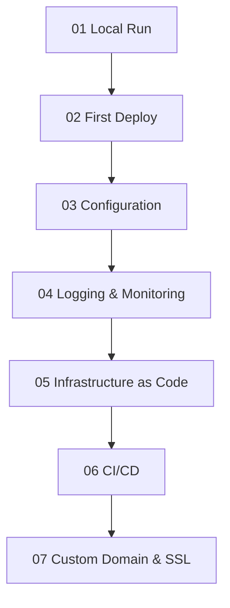

---
content_sources:
  diagrams:
  - id: main-content
    type: flowchart
    source: mslearn-adapted
    mslearn_url: https://learn.microsoft.com/en-us/azure/app-service/
content_validation:
  status: verified
  last_reviewed: '2026-05-23'
  reviewer: agent
  core_claims:
  - claim: This page uses Microsoft Learn as the primary source basis for its Azure-specific
      guidance.
    source: https://learn.microsoft.com/en-us/azure/app-service/
    verified: true
---
# Java Guide

This guide takes you from local Spring Boot development through production deployment and operations on Azure App Service.

## Main Content

<!-- diagram-id: main-content -->

1. [01 - Local Run](./tutorial/01-local-run.md)
2. [02 - First Deploy](./tutorial/02-first-deploy.md)
3. [03 - Configuration](./tutorial/03-configuration.md)
4. [04 - Logging and Monitoring](./tutorial/04-logging-monitoring.md)
5. [05 - Infrastructure as Code](./tutorial/05-infrastructure-as-code.md)
6. [06 - CI/CD](./tutorial/06-ci-cd.md)
7. [07 - Custom Domain and SSL](./tutorial/07-custom-domain-ssl.md)

## Advanced Topics

Use Java-specific recipes for identity, data, networking, and deployment patterns.

- [Java Recipes](./recipes/index.md)

## Run It in the Portal

#### Portal view: App Service Plan overview (Pricing tier surfaces here)

The `App Service Plan` overview blade makes the hosting tier concrete by showing the plan identity, `Pricing tier: Premium0 V3`, `Operating system: Linux`, and `Status: Ready` in one view. For this Java guide's tier architecture, the most relevant visible fields are the plan SKU and operating system because they tell you which Linux plan the Spring Boot app is running on. The hosted apps list at the bottom shows `app-test-20251107` and its staging slot attached to the same plan. The `CPU Percentage` and `Memory Percentage` charts on the right show that this blade is also the plan-level view for shared compute usage.

## See Also

- [Language Guides](../index.md)
- [Platform](../../platform/index.md)
- [Operations](../../operations/index.md)
- [Reference](../../reference/index.md)

## Sources

- [Quickstart: Deploy a Java app](https://learn.microsoft.com/en-us/azure/app-service/quickstart-java)
