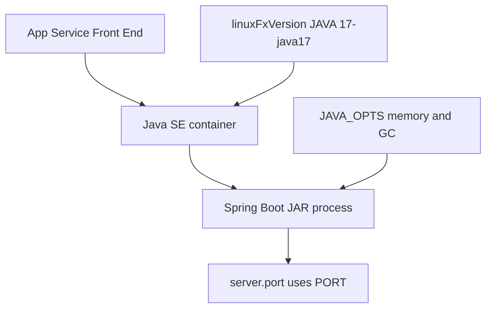

---
content_sources:
  diagrams:
    - id: java-runtime
      type: flowchart
      source: mslearn-adapted
      mslearn_url: https://learn.microsoft.com/en-us/azure/app-service/
---

# Java Runtime

Runtime reference for Java 17 on Azure App Service Linux with Spring Boot 3.2.x. Use this document as the Java equivalent of a runtime compatibility and tuning sheet.

<!-- diagram-id: java-runtime -->


## Supported baseline in this guide

- Runtime target: **Java 17**
- Packaging target: executable **JAR**
- Hosting model: **Java SE**
- Framework baseline: **Spring Boot 3.2.5**
- Deployment baseline: Maven plugin (`azure-webapp-maven-plugin`)

## Runtime configuration commands

Set Java runtime:

```bash
az webapp config set \
  --resource-group $RG \
  --name $APP_NAME \
  --linux-fx-version "JAVA|17-java17" \
  --output json
```

| Command/Code | Purpose |
|--------------|---------|
| `az webapp config set` | Updates the App Service runtime configuration. |
| `--resource-group $RG` | Targets the resource group that contains the web app. |
| `--name $APP_NAME` | Selects the web app whose runtime will be changed. |
| `--linux-fx-version "JAVA|17-java17"` | Sets the Linux runtime stack to Java 17. |
| `--output json` | Returns the runtime configuration change in JSON format. |

Inspect runtime settings:

```bash
az webapp config show \
  --resource-group $RG \
  --name $APP_NAME \
  --query "{linuxFxVersion:linuxFxVersion,alwaysOn:alwaysOn,healthCheckPath:healthCheckPath}" \
  --output json
```

| Command/Code | Purpose |
|--------------|---------|
| `az webapp config show` | Reads the effective runtime configuration for the app. |
| `--query "{linuxFxVersion:linuxFxVersion,alwaysOn:alwaysOn,healthCheckPath:healthCheckPath}"` | Limits the output to the most important runtime and health settings. |
| `--output json` | Returns the selected configuration fields as JSON. |

## `JAVA_OPTS` reference

Recommended baseline:

```text
-XX:InitialRAMPercentage=25.0 -XX:MaxRAMPercentage=70.0 -XX:+UseG1GC -XX:+ExitOnOutOfMemoryError
```

Apply via app settings:

```bash
az webapp config appsettings set \
  --resource-group $RG \
  --name $APP_NAME \
  --settings "JAVA_OPTS=-XX:InitialRAMPercentage=25.0 -XX:MaxRAMPercentage=70.0 -XX:+UseG1GC -XX:+ExitOnOutOfMemoryError" \
  --output json
```

| Command/Code | Purpose |
|--------------|---------|
| `az webapp config appsettings set` | Stores JVM tuning values as App Service application settings. |
| `--settings "JAVA_OPTS=-XX:InitialRAMPercentage=25.0 -XX:MaxRAMPercentage=70.0 -XX:+UseG1GC -XX:+ExitOnOutOfMemoryError"` | Applies the recommended heap sizing, GC, and OOM behavior flags. |
| `--output json` | Returns the updated app settings in JSON format. |

## Startup command patterns

Most Java SE deployments can use platform defaults. For explicit startup control:

```bash
az webapp config set \
  --resource-group $RG \
  --name $APP_NAME \
  --startup-file "java $JAVA_OPTS -jar /home/site/wwwroot/*.jar --server.port=\$PORT" \
  --output json
```

| Command/Code | Purpose |
|--------------|---------|
| `az webapp config set` | Sets an explicit startup command for the Java app. |
| `--startup-file "java $JAVA_OPTS -jar /home/site/wwwroot/*.jar --server.port=\$PORT"` | Launches the deployed JAR with `JAVA_OPTS` and binds it to the App Service port. |
| `--output json` | Returns the startup command update in JSON format. |

## Spring Boot runtime essentials

Required properties:

```properties
server.port=${PORT:8080}
server.shutdown=graceful
spring.lifecycle.timeout-per-shutdown-phase=20s
```

| Command/Code | Purpose |
|--------------|---------|
| `server.port=${PORT:8080}` | Uses the App Service-assigned port in Azure and falls back to `8080` locally. |
| `server.shutdown=graceful` | Enables graceful shutdown handling for in-flight requests. |
| `spring.lifecycle.timeout-per-shutdown-phase=20s` | Gives Spring components up to 20 seconds to stop cleanly. |

Optional production-oriented settings:

```properties
management.endpoints.web.exposure.include=health,info
spring.main.banner-mode=off
```

| Command/Code | Purpose |
|--------------|---------|
| `management.endpoints.web.exposure.include=health,info` | Exposes the health and info management endpoints over HTTP. |
| `spring.main.banner-mode=off` | Disables the Spring Boot startup banner in logs. |

## Memory defaults and tuning heuristics

| Workload type | Suggested max RAM percentage |
|---|---|
| Light API | 65-70% |
| Typical business API | 70-75% |
| Heavy in-memory processing | 75-80% (with testing) |

Leave remaining memory for non-heap allocations and platform overhead.

## Common JVM flags for App Service

| Flag | Purpose |
|---|---|
| `-XX:MaxRAMPercentage` | heap cap relative to container memory |
| `-XX:InitialRAMPercentage` | initial heap sizing |
| `-XX:+UseG1GC` | balanced GC for server workloads |
| `-XX:+ExitOnOutOfMemoryError` | fail fast for clean platform recovery |
| `-Djava.security.egd=file:/dev/urandom` | reduce entropy blocking on startup (if needed) |

## Validate effective runtime at deployment time

```bash
az webapp config appsettings list --resource-group $RG --name $APP_NAME --output table
az webapp log tail --resource-group $RG --name $APP_NAME
```

| Command/Code | Purpose |
|--------------|---------|
| `az webapp config appsettings list --resource-group $RG --name $APP_NAME --output table` | Reviews the applied App Service settings, including `JAVA_OPTS`. |
| `az webapp log tail --resource-group $RG --name $APP_NAME` | Streams startup logs so you can confirm Java version, profile, and port binding. |

Look for startup logs confirming Java version, active profiles, and listening port.

## Runtime anti-patterns

- fixed `-Xmx` copied across all SKUs
- production deployments without explicit OOM behavior
- long, unbounded startup hooks
- mixing conflicting runtime settings between startup command and app settings

## Java-Specific Considerations

- Keep runtime policy in version-controlled ops docs, not tribal memory.
- Re-evaluate `JAVA_OPTS` after every SKU or workload profile change.
- Standardize one startup pattern per environment to reduce drift.
- Verify runtime assumptions in staging slot before production swap.

## See Also

- [Reference: CLI Cheatsheet](../../reference/cli-cheatsheet.md)
- [Reference: Platform Limits](../../reference/platform-limits.md)
- [Operations: Scaling](../../operations/scaling.md)
- [Platform: How App Service Works](../../platform/architecture/index.md)

## Sources

- [Configure a Java app for Azure App Service](https://learn.microsoft.com/en-us/azure/app-service/configure-language-java)
- [Configure an App Service app](https://learn.microsoft.com/en-us/azure/app-service/configure-common)
