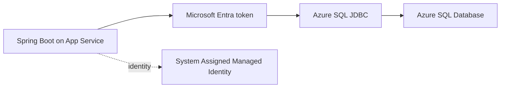

# Azure SQL with Managed Identity

Connect Spring Boot to Azure SQL Database using passwordless authentication through Managed Identity and Microsoft Entra tokens.

## Prerequisites

- App Service app with system-assigned managed identity enabled
- Azure SQL server + database already created
- Entra admin configured on SQL server
- Network access configured (public firewall or private endpoint)

## Main Content

### Architecture pattern



### Maven dependencies (`pom.xml`)

Add JDBC + Azure Identity components:

```xml
<dependencies>
  <dependency>
    <groupId>org.springframework.boot</groupId>
    <artifactId>spring-boot-starter-jdbc</artifactId>
  </dependency>
  <dependency>
    <groupId>com.microsoft.sqlserver</groupId>
    <artifactId>mssql-jdbc</artifactId>
    <version>12.6.1.jre11</version>
  </dependency>
  <dependency>
    <groupId>com.azure</groupId>
    <artifactId>azure-identity</artifactId>
    <version>1.12.2</version>
  </dependency>
</dependencies>
```

### Application configuration (`application.properties`)

Use SQL JDBC URL with Entra authentication mode:

```properties
spring.datasource.url=jdbc:sqlserver://<sql-server>.database.windows.net:1433;database=<db-name>;encrypt=true;hostNameInCertificate=*.database.windows.net;loginTimeout=30;authentication=ActiveDirectoryManagedIdentity
spring.datasource.driver-class-name=com.microsoft.sqlserver.jdbc.SQLServerDriver
spring.datasource.hikari.maximum-pool-size=5
spring.datasource.hikari.minimum-idle=1
```

!!! note "Managed Identity auth mode"
    `authentication=ActiveDirectoryManagedIdentity` lets the JDBC driver obtain tokens using the hosting identity. No DB password is required.

### Optional token acquisition with `DefaultAzureCredential`

For explicit token flow (advanced/custom datasource scenarios):

```java
import com.azure.core.credential.AccessToken;
import com.azure.core.credential.TokenRequestContext;
import com.azure.identity.DefaultAzureCredentialBuilder;

TokenRequestContext context = new TokenRequestContext()
    .addScopes("https://database.windows.net/.default");

AccessToken token = new DefaultAzureCredentialBuilder()
    .build()
    .getToken(context)
    .block();
```

### Grant SQL access to managed identity

1. Get principal ID:

```bash
az webapp identity show \
  --resource-group "$RG" \
  --name "$APP_NAME" \
  --query principalId \
  --output tsv
```

2. In SQL database (connected as Entra admin), create contained user:

```sql
CREATE USER [app-identity-name] FROM EXTERNAL PROVIDER;
ALTER ROLE db_datareader ADD MEMBER [app-identity-name];
ALTER ROLE db_datawriter ADD MEMBER [app-identity-name];
```

3. If least privilege is required, grant only needed schema/table permissions.

### Set app settings for environment-specific JDBC URL

```bash
az webapp config appsettings set \
  --resource-group "$RG" \
  --name "$APP_NAME" \
  --settings \
    SPRING_DATASOURCE_URL="jdbc:sqlserver://<sql-server>.database.windows.net:1433;database=<db-name>;encrypt=true;hostNameInCertificate=*.database.windows.net;loginTimeout=30;authentication=ActiveDirectoryManagedIdentity" \
  --output json
```

### Minimal health query endpoint pattern

```java
@GetMapping("/api/sql/ping")
public Map<String, Object> sqlPing(JdbcTemplate jdbcTemplate) {
    Integer one = jdbcTemplate.queryForObject("SELECT 1", Integer.class);
    return Map.of("status", "ok", "value", one);
}
```

!!! warning "Do not use SQL logins by default"
    Avoid embedding SQL usernames/passwords in App Settings unless required for legacy migration phases.

!!! info "Platform architecture"
    For platform architecture details, see [Platform: How App Service Works](../../../platform/how-app-service-works.md).

## Verification

- Deploy app with dependency and config updates
- Call SQL health endpoint (for example `/api/sql/ping`)
- Confirm successful query response
- Confirm no password exists in app configuration

## Troubleshooting

### Login failed for token-identified principal

Managed identity exists in Entra but not inside the database. Recreate user from external provider in the target DB.

### Connection timeout

Validate network path: SQL firewall, private endpoint DNS, VNet integration route, and NSG rules.

### Driver authentication error

Ensure `mssql-jdbc` version supports managed identity auth and `authentication=ActiveDirectoryManagedIdentity` is present.

## Next Steps / See Also

- [Managed Identity](managed-identity.md)
- [Key Vault References](key-vault-reference.md)
- [Tutorial: Configuration](../03-configuration.md)

## Sources

- [Tutorial: Connect to Azure SQL with managed identity](https://learn.microsoft.com/en-us/azure/azure-sql/database/azure-sql-passwordless-migration-java)
- [Managed identities for Azure resources](https://learn.microsoft.com/en-us/entra/identity/managed-identities-azure-resources/overview)
