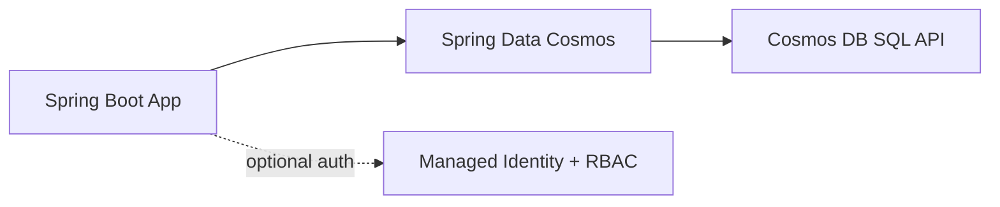

# Cosmos DB Integration

Integrate Spring Boot with Azure Cosmos DB for globally distributed, low-latency NoSQL workloads on App Service.

## Prerequisites

- Azure Cosmos DB account (SQL API) and database/container provisioned
- App Service app deployed and reachable
- Either key-based connection or managed identity/RBAC strategy defined

## Main Content

### Reference architecture



### Maven dependencies (`pom.xml`)

Add Spring Data Cosmos starter:

```xml
<dependencies>
  <dependency>
    <groupId>com.azure.spring</groupId>
    <artifactId>spring-cloud-azure-starter-data-cosmos</artifactId>
    <version>5.13.0</version>
  </dependency>
</dependencies>
```

If you already use the Spring Cloud Azure BOM, align versions via dependency management.

### Application configuration (`application.properties`)

```properties
spring.cloud.azure.cosmos.endpoint=https://<cosmos-account>.documents.azure.com:443/
spring.cloud.azure.cosmos.database=<database-name>
spring.cloud.azure.cosmos.key=${COSMOS_KEY:}
spring.cloud.azure.cosmos.populate-query-metrics=true
```

For production, prefer secret injection via Key Vault Reference or managed identity auth when supported in your stack version.

### Create a document model and repository

```java
import com.azure.spring.data.cosmos.core.mapping.Container;
import org.springframework.data.annotation.Id;

@Container(containerName = "orders")
public class OrderDocument {
    @Id
    private String id;
    private String partitionKey;
    private String status;
}
```

```java
import com.azure.spring.data.cosmos.repository.CosmosRepository;

public interface OrderRepository extends CosmosRepository<OrderDocument, String> {
}
```

### Partitioning guidance

Choose partition keys to balance:

- High cardinality
- Even request distribution
- Query locality for dominant access patterns

Bad partitioning is the most common cause of RU inefficiency.

### Configure app settings via Azure CLI

```bash
az webapp config appsettings set \
  --resource-group "$RG" \
  --name "$APP_NAME" \
  --settings \
    SPRING_CLOUD_AZURE_COSMOS_ENDPOINT="https://<cosmos-account>.documents.azure.com:443/" \
    SPRING_CLOUD_AZURE_COSMOS_DATABASE="<database-name>" \
    COSMOS_KEY="<redacted>" \
  --output json
```

!!! warning "Secret handling"
    Do not hardcode Cosmos keys in source. Store in Key Vault and reference from App Settings in production.

### Add a lightweight connectivity endpoint

```java
@GetMapping("/api/cosmos/ping")
public Map<String, Object> cosmosPing(OrderRepository repository) {
    long count = repository.count();
    return Map.of("status", "ok", "documentCount", count);
}
```

### Throughput and consistency choices

- **Throughput**: start with autoscale RU for variable traffic
- **Consistency**: Session is usually a strong balance for web apps
- **TTL**: use for ephemeral document classes when appropriate

!!! tip "Model for queries, not joins"
    Design Cosmos documents around read patterns to avoid cross-partition fan-out and expensive server-side filtering.

!!! info "Platform architecture"
    For platform architecture details, see [Platform: How App Service Works](../../../platform/how-app-service-works.md).

## Verification

- Deploy updated app with Cosmos dependencies
- Call `/api/cosmos/ping` and confirm successful count/query
- Check Cosmos metrics for request units and latency

## Troubleshooting

### `403 Forbidden` from Cosmos

Validate key correctness or RBAC assignment scope, and verify account endpoint matches the configured region/account.

### High RU consumption

Review partition key choice and query filters; avoid unbounded scans.

### Serialization issues

Ensure document model uses compatible types and includes an `id` field.

## Next Steps / See Also

- [Redis Cache](redis.md)
- [Managed Identity](managed-identity.md)
- [Tutorial: Logging & Monitoring](../04-logging-monitoring.md)

## Sources

- [Quickstart: Build a Java app by using Azure Cosmos DB SQL API account](https://learn.microsoft.com/en-us/azure/cosmos-db/nosql/quickstart-java)
- [Spring Data Azure Cosmos DB developer guide](https://learn.microsoft.com/en-us/azure/developer/java/spring-framework/configure-spring-data-azure-cosmos-db)
