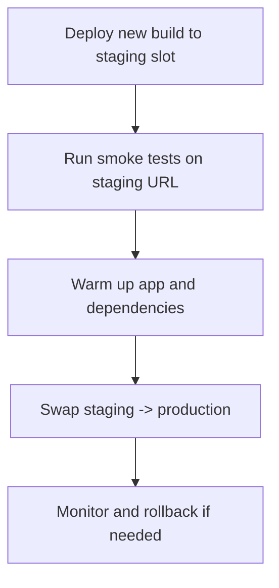

---
content_sources:
  diagrams:
    - id: slot-based-release-flow
      type: flowchart
      source: mslearn-adapted
      mslearn_url: https://learn.microsoft.com/en-us/azure/app-service/quickstart-python
---
# Deployment Slots for Zero-Downtime Releases

Use App Service deployment slots to validate Java releases in staging, then swap traffic to production with near-zero downtime.

## Prerequisites

- App Service Plan tier that supports deployment slots
- Production app deployed and healthy
- CI/CD pipeline capable of targeting a slot

## Main Content

### Slot-based release flow

<!-- diagram-id: slot-based-release-flow -->


### Step 1: create staging slot

```bash
export SLOT_NAME="staging"

az webapp deployment slot create \
  --resource-group "$RG" \
  --name "$APP_NAME" \
  --slot "$SLOT_NAME" \
  --configuration-source "$APP_NAME" \
  --output json
```
| Command | Description |
|---|---|
| `export SLOT_NAME="staging"` | Stores the slot name in a shell variable so later commands target the same slot consistently. |
| `az webapp deployment slot create --resource-group "$RG" --name "$APP_NAME" --slot "$SLOT_NAME" --configuration-source "$APP_NAME" --output json` | Creates the staging deployment slot and copies the production app configuration into it. |


### Step 2: mark slot-sticky settings

Keep environment-specific values pinned to each slot:

```bash
az webapp config appsettings set \
  --resource-group "$RG" \
  --name "$APP_NAME" \
  --slot "$SLOT_NAME" \
  --slot-settings \
    SPRING_PROFILES_ACTIVE=staging \
    API_BASE_URL=https://staging-api.example.internal \
  --output json
```
| Flag | Description |
|---|---|
| `az webapp config appsettings set` | Writes app settings into the selected slot configuration. |
| `--resource-group "$RG"` | Targets the resource group that contains the app. |
| `--name "$APP_NAME"` | Selects the web app whose slot settings will change. |
| `--slot "$SLOT_NAME"` | Applies the settings to the staging slot. |
| `--slot-settings SPRING_PROFILES_ACTIVE=staging API_BASE_URL=...` | Creates slot-sticky settings that stay with staging during swaps. |
| `--output json` | Returns the updated slot settings as JSON. |


Examples of often-sticky settings:

- third-party API endpoints
- diagnostic verbosity
- canary feature flags

### Step 3: deploy to slot with Maven plugin

Set plugin target slot before deploy (plugin config/profile or command parameter strategy), then deploy artifact to staging slot from CI.

If using Azure CLI zip deploy for slot-specific release verification:

```bash
az webapp deploy \
  --resource-group "$RG" \
  --name "$APP_NAME" \
  --slot "$SLOT_NAME" \
  --src-path "apps/java-springboot/target/<artifact-name>.jar" \
  --type jar \
  --output json
```
| Flag | Description |
|---|---|
| `az webapp deploy` | Deploys the built JAR artifact to the selected deployment slot. |
| `--resource-group "$RG"` | Targets the resource group that contains the app. |
| `--name "$APP_NAME"` | Selects the web app that will receive the deployment. |
| `--slot "$SLOT_NAME"` | Sends the deployment to the staging slot. |
| `--src-path "apps/java-springboot/target/<artifact-name>.jar"` | Uploads the JAR produced by the build pipeline. |
| `--type jar` | Treats the uploaded artifact as a Java JAR deployment package. |
| `--output json` | Returns deployment metadata as JSON. |


### Step 4: run staging smoke tests

```bash
curl "https://$APP_NAME-$SLOT_NAME.azurewebsites.net/health"
curl "https://$APP_NAME-$SLOT_NAME.azurewebsites.net/info"
curl "https://$APP_NAME-$SLOT_NAME.azurewebsites.net/api/requests/log-levels?userId=slot-test"
```

### Step 5: perform swap

```bash
az webapp deployment slot swap \
  --resource-group "$RG" \
  --name "$APP_NAME" \
  --slot "$SLOT_NAME" \
  --target-slot production \
  --output json
```
| Flag | Description |
|---|---|
| `az webapp deployment slot swap` | Swaps the selected source slot into the target slot. |
| `--resource-group "$RG"` | Targets the resource group that contains the app. |
| `--name "$APP_NAME"` | Selects the web app whose slots will be swapped. |
| `--slot "$SLOT_NAME"` | Uses the staging slot as the swap source. |
| `--target-slot production` | Promotes the staging slot into production. |
| `--output json` | Returns the swap operation details as JSON. |


After swap, former production becomes staging for quick rollback.

### Canary routing option

Split traffic before full swap:

```bash
az webapp traffic-routing set \
  --resource-group "$RG" \
  --name "$APP_NAME" \
  --distribution "$SLOT_NAME"=10 \
  --output json
```
| Flag | Description |
|---|---|
| `az webapp traffic-routing set` | Configures percentage-based traffic routing to a slot. |
| `--resource-group "$RG"` | Targets the resource group that contains the app. |
| `--name "$APP_NAME"` | Selects the web app whose routing weights will change. |
| `--distribution "$SLOT_NAME"=10` | Sends 10 percent of traffic to the staging slot for canary validation. |
| `--output json` | Returns the updated traffic-routing configuration as JSON. |


Gradually increase canary percentage as confidence grows.

### Rollback strategy

If production regression is detected, swap back immediately:

```bash
az webapp deployment slot swap \
  --resource-group "$RG" \
  --name "$APP_NAME" \
  --slot "$SLOT_NAME" \
  --target-slot production \
  --output json
```
| Flag | Description |
|---|---|
| `az webapp deployment slot swap` | Swaps the selected source slot into the target slot again for rollback. |
| `--resource-group "$RG"` | Targets the resource group that contains the app. |
| `--name "$APP_NAME"` | Selects the web app whose slots will be swapped back. |
| `--slot "$SLOT_NAME"` | Uses the current staging slot as the rollback source. |
| `--target-slot production` | Moves traffic back to the original production content. |
| `--output json` | Returns the rollback swap operation details as JSON. |


!!! warning "Sticky setting hygiene"
    Misclassified slot settings are a common source of swap incidents. Audit swap behavior before production cutover.

!!! tip "Pre-warm critical paths"
    Hit `/health` and one business endpoint repeatedly on staging before swap to reduce post-swap cold latency.

!!! info "Platform architecture"
    For platform architecture details, see [Platform: How App Service Works](../../../platform/architecture/index.md).

## Verification

- Staging slot is healthy before swap
- Production remains available during swap
- Post-swap health and log checks succeed
- Rollback path is tested and documented

## Troubleshooting

### Swap succeeds but app errors increase

Validate slot-sticky settings, backend dependency endpoints, and profile-specific config differences.

### Staging behaves differently than production

Ensure parity for non-sticky settings and dependent resource access policies.

### Canary routing not taking effect

Check slot name, distribution values, and caching/CDN layers that may mask split traffic behavior.

## Run It in the Portal

#### Portal view: Deployment slots with Swap dialog (zero-downtime promotion)

![Azure Portal Deployment slots blade for app-test-20251107 Web App with the Swap right panel open. The slot list shows app-test-20251107 with a PRODUCTION badge and app-test-20251107-staging; the toolbar exposes Save and Discard (disabled), Add, Swap (highlighted), Logs, Refresh (disabled), and Send us your feedback. The Swap panel has a Source dropdown set to app-test-20251107-staging and a Target dropdown showing app-test-20251107 with a PRODUCTION badge, followed by an info banner reading "Swap with preview can only be used with sites that have deployment slot settings enabled." and a disabled "Perform swap with preview" checkbox. A Config Changes section explains it is the final summary of configuration changes on source and target slots after the swap, with Source slot changes (selected) and Target slot changes tabs. The table columns Setting, Type, Old Value, New Value list SCM_DO_BUILD_DURING_DEPLOYMENT (AppSetting, Not set to true), APPLICATIONINSIGHTS_CONNECTION_STRING (AppSetting, Not set to a long zero-GUID instrumentation string), ApplicationInsightsAgent_EXTENSION_VERSION (AppSetting, Not set to ~3), and APPLICATIONINSIGHTSAGENT_EXTENSION_ENABLED (AppSetting, Not set to true). Bottom buttons are Start Swap (primary) and Close.](../../../assets/operations/deployment/slots-and-swap/01-swap-dialog.png)

The Deployment slots blade with the Swap panel open is the Portal counterpart to the `az webapp deployment slot swap` command this recipe drives from CI. The `Source: app-test-20251107-staging` and `Target: app-test-20251107` selectors mirror the staging-to-production promotion direction the recipe validates against. The `Config Changes` table at the bottom previews how slot-sticky settings will move during the swap, including the `APPLICATIONINSIGHTS_CONNECTION_STRING` and `SCM_DO_BUILD_DURING_DEPLOYMENT` rows visible here — the same delta you should inspect before clicking `Start Swap`. Use this Portal view as the manual checkpoint complementing the automated pre-swap warm-up and health probe steps the recipe issues against the staging slot.

## See Also

- [Tutorial: CI/CD](../tutorial/06-ci-cd.md)
- [Tutorial: Configuration](../tutorial/03-configuration.md)
- [Operations: Deployment Slots](../../../operations/deployment-slots.md)

## Sources

- [Set up staging environments in Azure App Service](https://learn.microsoft.com/en-us/azure/app-service/deploy-staging-slots)
- [Swap deployment slots in Azure App Service](https://learn.microsoft.com/en-us/azure/app-service/deploy-staging-slots#swap-deployment-slots)
